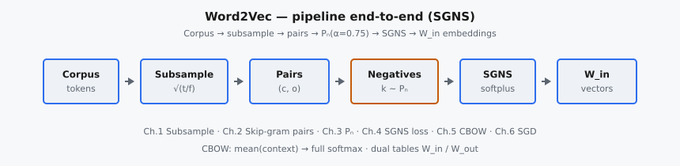

Word2Vec (Mikolov et al., 2013) học **embedding tĩnh** cho từng từ bằng cách biến đồng xuất hiện trong cửa sổ thành tín hiệu huấn luyện. Hai kiến trúc chính là **Skip-gram** (dự đoán context từ center) và **CBOW** (dự đoán center từ bag of context). Trên corpus lớn, full softmax trên vocabulary trở nên quá đắt; **negative sampling** (SGNS) đổi bài toán thành phân loại nhị phân giữa cặp thật và $k$ từ nhiễu — đủ nhanh để huấn luyện trên hàng tỷ token.

::: {#fig-word2vec-pipeline fig-cap="Pipeline Word2Vec: corpus → subsample từ thường → (center, context) pairs → noise $P_n \\propto \\mathrm{count}^{0.75}$ → SGNS / CBOW → $W_{\\mathrm{in}}$ (và $W_{\\mathrm{out}}$)." fig-alt="Chuỗi khối: Corpus, Subsample, Pairs, Negatives, SGNS/CBOW, Embeddings."}
{fig-align="center"}
:::

Embedding tĩnh sau này được thay bằng biểu diễn có ngữ cảnh (ELMo, BERT, Transformer LM), nhưng công thức cửa sổ, contrastive negatives, và dual table $W_{\mathrm{in}}/W_{\mathrm{out}}$ vẫn là nền tảng để hiểu GloVe, fastText, Node2vec và nhiều hệ contrastive sau.

## Phần này bao gồm những gì

Chuỗi chương này phân rã Word2Vec theo từng thành phần:

1. Frequent-word subsampling — xác suất giữ $P_{\mathrm{keep}}(w)=\min(1,\sqrt{t/f(w)})$.
2. Sinh cặp Skip-gram từ cửa sổ trượt.
3. Phân phối nhiễu negative sampling với $\alpha=0.75$.
4. Hàm mất mát SGNS (softplus / log-sigmoid).
5. Forward CBOW với full softmax.
6. Một bước SGD tay trên $W_{\mathrm{in}}$ và $W_{\mathrm{out}}$.

Mục tiêu là nối từ preprocessing corpus đến gradient cập nhật embedding, và thấy vì sao SGNS thay được full softmax mà vẫn học được hình học từ.

## Tại sao Word2Vec vẫn quan trọng

Word2Vec vẫn đáng học vì nó làm rõ các mẫu lặp lại ở representation learning:

* đồng xuất hiện cửa sổ → cặp dương,
* contrast với negatives từ phân phối nhiễu đã làm phẳng,
* hai bảng embedding (input / output) và xuất bảng input sau huấn luyện,
* và cầu nối tới PMI / GloVe / InfoNCE.

Đọc Word2Vec trước Transformer/BERT cung cấp baseline embedding tĩnh trước khi chuyển sang ngữ cảnh động.

## Kiến thức tiên quyết

* Softmax, cross-entropy và logistic sigmoid / softplus.
* Gradient descent trên vector / ma trận.
* Trực giác đồng xuất hiện và distributional hypothesis.
* Shape tensor và indexing hàng embedding (lookup).

## Ký hiệu được sử dụng trong phần này

$$
\begin{aligned}
w, c, o &:\ \text{từ / center / context (positive)}, \\
v_c, u_w &:\ \text{embedding input (center) và output (context)}, \\
W_{\mathrm{in}}, W_{\mathrm{out}} &:\ \text{hai bảng embedding } V \times D, \\
f(w), t &:\ \text{tần suất tương đối và ngưỡng subsample}, \\
P_n(w), \alpha &:\ \text{phân phối nhiễu và số mũ làm phẳng (thường } 0.75\text{)}, \\
k &:\ \text{số negative mỗi cặp dương}, \\
L &:\ \text{hàm mất mát SGNS hoặc CBOW}.
\end{aligned}
$$
