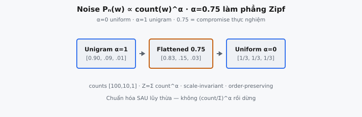

Phân phối negative sampling là luật xác suất từ đó Word2Vec rút từ “nhiễu” khi huấn luyện. Giới thiệu bởi Mikolov et al. (2013) trong bài skip-gram, nó nâng mỗi count corpus của từ lên lũy thừa $\alpha = 0.75$ rồi chuẩn hóa lại. Một lựa chọn thiết kế đơn — số mũ phân số áp lên tần suất unigram — chính là thứ cho phép skip-gram học embedding tốt mà không bao giờ đánh giá full softmax trên vocabulary.

## Vì sao cần negative sampling

Mô hình skip-gram dự đoán từ context từ từ center. Objective ngây thơ là softmax trên toàn bộ vocabulary:

$$
p(w_O \mid w_I) = \frac{\exp(v_{w_O}^{\prime \top} v_{w_I})}{\sum_{w=1}^{V} \exp(v_w^{\prime \top} v_{w_I})}
$$

Mẫu số cộng trên mọi $V$ từ. Với vocabulary thực tế ($V$ hàng trăm nghìn hoặc triệu), tính normalizer này và gradient của nó mỗi cặp huấn luyện quá đắt. Mỗi cập nhật sẽ đụng mọi vector đầu ra trong mô hình.

Negative sampling né softmax hoàn toàn. Thay vì hỏi “trong mọi $V$ từ, từ nào là context”, nó khung lại huấn luyện thành tập bài toán phân loại nhị phân độc lập: phân biệt từ context thật (ví dụ dương) khỏi một nắm $k$ **từ nhiễu** rút ngẫu nhiên (ví dụ âm). Mô hình chỉ cập nhật embedding cho từ dương và $k$ negative được lấy mẫu, biến cập nhật $O(V)$ thành $O(k)$ với $k$ thường giữa 5 và 20.

## Phân phối nhiễu làm gì

Negative sampling cần quy tắc rút từ nhiễu. Quy tắc đó là **phân phối nhiễu** $P_n(w)$. Với mỗi cặp huấn luyện dương, $k$ negative được lấy mẫu i.i.d. từ $P_n(w)$ trên vocabulary. Chất lượng embedding học được phụ thuộc mạnh vào phân phối này.

Hai lựa chọn hiển nhiên bao quanh không gian thiết kế:

* **Uniform** ($P_n(w) \propto 1$): mọi từ đều khả năng bằng nhau làm negative. Bỏ qua việc một số từ phổ biến hơn rất nhiều, nên mô hình lãng phí công sức phân biệt dương khỏi từ hiếm mà nó gần như không bao giờ nhầm.
* **Unigram** ($P_n(w) \propto \text{count}(w)$): lấy mẫu negative tỷ lệ tần suất thô. Over-sample từ cực phổ biến (“the”, “of”, “a”), nên mô hình dành gần hết ngân sách negative cho vài function word và hiếm khi thấy content word giàu thông tin như negative.

Câu trả lời của bài báo là thỏa hiệp giữa hai cực, điều khiển bởi số mũ $\alpha$.

::: {#fig-w2v-noise fig-cap="Noise $P_n \\propto \\mathrm{count}^{\\alpha}$: $\\alpha=0.75$ làm phẳng Zipf so với unigram ($\\alpha=1$) và uniform ($\\alpha=0$)." fig-alt="Ba thẻ Unigram, Flattened 0.75, Uniform."}
{fig-align="center"}
:::

## Phương trình

Cho corpus counts $\text{count}(w)$ mỗi từ $w$, phân phối nhiễu là phân phối unigram nâng lên lũy thừa $\alpha$ rồi chuẩn hóa để cộng thành một:

$$
P_n(w) = \frac{\text{count}(w)^{\alpha}}{\sum_{w'=1}^{V} \text{count}(w')^{\alpha}}
$$

trong đó:

* $\text{count}(w)$ là số lần từ $w$ xuất hiện trong corpus huấn luyện (tần suất unigram, tới một hằng số)
* $\alpha$ là số mũ làm phẳng, đặt $0.75$ trong bài báo
* mẫu số $Z = \sum_{w'} \text{count}(w')^{\alpha}$ là hàm phân hoạch làm kết quả thành phân phối xác suất hợp lệ

Bài báo viết điều này như $U(w)^{3/4} / Z$, với $U(w)$ là phân phối unigram và $Z$ là normalizer. Vì chuẩn hóa loại bỏ mọi scale tổng thể, dùng count thô và dùng tần suất $\text{count}(w)/N$ cho kết quả giống hệt: hệ số $N^{\alpha}$ triệt tiêu giữa tử và mẫu.

## Vì sao đúng 0.75

Số mũ $\alpha$ nội suy giữa hai cực trên:

* $\alpha = 0$: mọi count thành $\text{count}(w)^0 = 1$, nên $P_n$ là **uniform** trên vocabulary.
* $\alpha = 1$: $P_n$ bằng phân phối **unigram** thô.
* $0 < \alpha < 1$: unigram **đã làm phẳng**. Từ thường vẫn khả năng cao hơn từ hiếm, nhưng khoảng cách bị nén. Từ hiếm được lấy mẫu thường hơn tần suất thuần cho phép, và từ thường ít hơn.

Giá trị $0.75$ được chọn **thực nghiệm**. Mikolov et al. báo cáo nó “outperformed significantly the unigram and the uniform distributions” trên cả analogy task và các benchmark khác. Nó không suy ra từ đối số closed-form; nó là hyperparameter đã tune hoạt động tốt xuyên tác vụ và corpus, và giá trị bám vì công trình sau (kể cả so sánh thời GloVe và implementation C word2vec tham chiếu) tái tạo lợi ích của nó.

Trực giác vì sao số mũ dưới tuyến tính giúp: tần suất từ theo luật Zipfian (đuôi nặng). Một nắm function word thống trị count thô hàng bậc độ lớn. Lấy mẫu negative tỷ lệ tần suất thô nghĩa là mô hình gần như chỉ đối chiếu với vài từ đó. Nâng count lên $0.75$ thu hẹp dải động, nên content word moderately common vẫn xuất hiện như negative đủ thường để cung cấp tín hiệu học hữu ích, trong khi từ thống trị thật sự không còn độc chiếm ngân sách lấy mẫu.

## Cách gắn vào objective

Phân phối nhiễu là một thành phần của loss skip-gram with negative sampling (SGNS) đầy đủ. Với từ center $w_I$ và từ context thật $w_O$, bài báo thay objective softmax bằng:

$$
\log \sigma(v_{w_O}^{\prime \top} v_{w_I}) + \sum_{i=1}^{k} \mathbb{E}_{w_i \sim P_n(w)} \big[ \log \sigma(-v_{w_i}^{\prime \top} v_{w_I}) \big]
$$

với $\sigma$ là logistic sigmoid. Hạng tử đầu đẩy tích vô hướng của vector center và true-context lên (về phía nhãn $1$). Tổng rút $k$ negative từ $P_n(w)$ và đẩy mỗi tích vô hướng của chúng xuống (về phía nhãn $0$). Phân phối nhiễu $P_n(w)$ đúng là luật lấy mẫu của kỳ vọng: đổi nó và bạn đổi từ nào mô hình được huấn luyện để đẩy ra xa.

Lưu ý $P_n(w)$ chỉ phụ thuộc corpus counts, không phụ thuộc tham số mô hình. Nó được tính một lần trước huấn luyện và giữ cố định. Đó là thứ làm bảng lấy mẫu precompute (mô tả dưới) khả thi: phân phối không bao giờ cập nhật khi embedding học.

Một tinh tế thực tiễn là liệu từ context thật có thể cũng bị rút như negative. Hầu hết implementation chỉ lấy mẫu từ $P_n(w)$ mà không loại positive hiện tại. Vì xác suất bất kỳ từ đơn nào nhỏ trong vocabulary lớn, va chạm thỉnh thoảng có hiệu ứng không đáng kể, và sự đơn giản đáng giá nhiễu nhỏ nó đưa vào.

## Quan hệ với NCE

Negative sampling là họ hàng đơn giản hóa của **Noise Contrastive Estimation** (Gutmann và Hyvärinen, 2010; Mnih và Teh, 2012). NCE biến ước lượng mật độ thành bài toán phân loại giữa mẫu dữ liệu và mẫu nhiễu rút từ phân phối nhiễu đã biết, và nó chứng minh được xấp xỉ gradient của full softmax khi số mẫu nhiễu tăng.

Negative sampling bỏ các phần của NCE mà NCE cần cho bảo đảm lý thuyết đó (nó bỏ các hạng tử chuẩn hóa phân phối nhiễu trong loss), nên nó không khôi phục đúng gradient softmax. Bài báo tường minh rằng điều này chấp nhận được vì skip-gram chỉ cần **embedding tốt**, không phải language model đã calibrate. Phân phối nhiễu $P_n(w)$ đóng cùng vai trò như trong NCE: nó là luật sinh negatives contrastive, và số mũ $0.75$ là lựa chọn thực tiễn làm contrast đó giàu thông tin.

## Ảnh hưởng tới từ hiếm so với từ thường

Xét hai từ, một thường với count $10000$ và một hiếm với count $10$. Tỷ số của chúng dưới mỗi schema:

* **Unigram** ($\alpha = 1$): tỷ số $= 10000 / 10 = 1000$. Từ thường được lấy mẫu gấp nghìn lần.
* **Đã làm phẳng** ($\alpha = 0.75$): tỷ số $= 10000^{0.75} / 10^{0.75} = 1000 / 5.62 \approx 178$. Vẫn ưu tiên, nhưng khoảng cách co hơn $5\times$.
* **Uniform** ($\alpha = 0$): tỷ số $= 1$. Xác suất bằng nhau.

Vậy $\alpha = 0.75$ giữ thứ tự định tính của phân phối unigram (từ phổ biến vẫn là negative phổ biến) trong khi tăng đáng kể khả năng tương đối lấy mẫu từ hiếm hơn — đúng cân bằng bài báo thấy học biểu diễn tốt nhất.

## Ví dụ số ($\alpha = 0.75$)

Cho counts $[100, 10, 1]$ cho ba từ và $\alpha = 0.75$.

1. **Nâng lên lũy thừa $\alpha$:** $100^{0.75} \approx 31.623$, $\; 10^{0.75} \approx 5.623$, $\; 1^{0.75} = 1.0$.
2. **Tổng (hàm phân hoạch):** $Z = 31.623 + 5.623 + 1.0 = 38.246$.
3. **Chuẩn hóa:** $P_n = [31.623/38.246, \; 5.623/38.246, \; 1.0/38.246] = [0.8268, 0.1470, 0.0261]$.

So với unigram thuần ($\alpha = 1$) trên cùng counts: $[100, 10, 1]/111 = [0.9009, 0.0901, 0.0090]$. Phân phối đã làm phẳng đã chuyển mass khỏi từ thường nhất (từ $0.90$ xuống $0.83$) và sang hai từ hiếm hơn (nhỏ nhất tăng từ $0.009$ lên $0.026$, gần $3\times$). Xác suất vẫn cộng thành $1$, và chúng bảo toàn thứ tự.

## Ghi chú triển khai

Trong thực tế mã C word2vec không lấy mẫu từ phân phối này bằng cách tính lại mỗi lần. Nó precompute một **unigram table** lớn (thường $10^8$ mục) nơi chỉ số mỗi từ được lặp số lần tỷ lệ $\text{count}(w)^{0.75}$, rồi rút negatives bằng indexing bảng tại vị trí ngẫu nhiên đều. Điều này làm mỗi lần rút $O(1)$ và amortize chuẩn hóa. Bảng chỉ là biểu diễn rời rạc của cùng $P_n(w)$ định nghĩa ở trên.

Với phép tính từ đầu công thức trực tiếp ổn: lũy thừa, rồi chia cho tổng. Làm số học ở double precision tránh lỗi tích lũy trong hàm phân hoạch khi vocabulary lớn.

## Biến thể và bối cảnh hiện đại

Số mũ $0.75$ bền đáng kể và tái xuất hiện, đôi khi được khám phá lại, xuyên các phương pháp representation learning sau:

* **GloVe** (Pennington et al., 2014) không dùng negative sampling, nhưng hàm trọng số $f(x) = (x / x_{\max})^{\beta}$ với $\beta = 0.75$ áp cùng lũy thừa phân số lên count đồng xuất hiện, lại để giữ cặp thường không thống trị loss. Số mũ chung không phải tình cờ: cả hai phương pháp đang thuần hóa cùng đuôi Zipfian.
* **Node2vec và DeepWalk** thích nghi skip-gram với negative sampling cho đồ thị, và chúng mang theo phân phối nhiễu unigram$^{0.75}$ trên nút gần như không đổi.
* **StarSpace, fastText, và nhiều embedding recommendation** tái sử dụng cùng negative sampler tần suất đã làm mượt. fastText thêm lấy mẫu ở mức subword, nhưng smoothing tần suất cho negatives mức từ theo word2vec.

Phân tích sau (đáng chú ý Levy và Goldberg, 2014) cho thấy SGNS ngầm factorize ma trận pointwise-mutual-information đã dịch, và phân phối nhiễu đi vào phân tích đó như marginal dùng để định nghĩa PMI shift. Điều này cho handle lý thuyết hậu nghiệm về vì sao lựa chọn $P_n$ quan trọng: nó đổi ma trận đang được factorize, và smoothing $0.75$ tương ứng reweighting cụ thể của ma trận đó theo thực nghiệm cho hình học tốt hơn.

Trong language model dựa Transformer hiện đại, full softmax được tính trực tiếp (vocabulary $30$K đến $100$K subword khả thi trên accelerator), nên negative sampling tường minh và phân phối nhiễu của nó phần lớn biến mất khỏi pretraining LLM chính thống. Ý tưởng sống sót trong contrastive learning rộng hơn, nơi lựa chọn phân phối negative-sampling vẫn là đòn bẩy thiết kế trung tâm.

## Tính chất

* **Phân phối hợp lệ.** Với count không âm và mọi $\alpha$, mọi mục không âm và các mục cộng đúng bằng $1$ theo xây dựng của normalizer.
* **Bảo toàn thứ tự với $\alpha > 0$.** Nếu $\text{count}(a) > \text{count}(b)$ thì $P_n(a) > P_n(b)$. Số mũ nén khoảng cách nhưng không bao giờ đảo ranking.
* **Bất biến scale.** Nhân mọi count với hằng $c$ để $P_n$ không đổi, vì $c^{\alpha}$ factor ra khỏi cả tử và mẫu. Count thô, tần suất, và counts-per-million đều cho cùng đáp án.
* **Đơn điệu theo $\alpha$ ở các cực.** Khi $\alpha \to 0$ phân phối tiến tới uniform; khi $\alpha \to 1$ nó tiến tới unigram thô. $0.75$ đã chọn ngồi gần unigram hơn uniform.

## Các lỗi thường gặp

* **Quên chuẩn hóa lại sau khi lũy thừa.** Count đã nâng $\text{count}(w)^{\alpha}$ không cộng thành một. Trả chúng trực tiếp cho vector có thể cộng hàng trăm hoặc hàng nghìn. Luôn chia cho hàm phân hoạch $Z = \sum_{w'} \text{count}(w')^{\alpha}$, và kiểm tra kết quả cộng thành $1$.
* **Chuẩn hóa trước khi lũy thừa.** Tính $(\text{count}(w)/\sum \text{count})^{\alpha}$ và coi đó là đáp án là sai: lũy thừa của phân phối đã chuẩn hóa không được chuẩn hóa, nên $\sum_w p(w)^{\alpha} \neq 1$ với $\alpha \neq 1$. Số mũ phải áp lên count trước, rồi chuẩn hóa một lần.
* **Nhầm hướng số mũ.** Làm phẳng dùng $\text{count}^{0.75}$, không phải $\text{count}^{1/0.75}$. Số mũ lớn hơn một làm sắc phân phối về phía từ thường — ngược hiệu ứng mong muốn. Mọi $\alpha \in (0,1)$ làm phẳng; $\alpha > 1$ làm sắc.
* **Dùng $\log$ thay vì lũy thừa.** Biến đổi log cũng nén dải động, nhưng là hàm khác: nó có thể tạo giá trị âm hoặc không (với count tại hoặc dưới một) và không cho phân phối bài báo chỉ định. Phép toán là lũy thừa phân số, không phải logarithm.
* **Case biên một từ.** Với một từ phân phối tầm thường là $[1.0]$ với mọi $\alpha$ (kể cả $\alpha = 0$, vì $\text{count}^0 = 1$ và $1/1 = 1$). Code đặc biệt hóa đầu vào rỗng hoặc giả định $V \ge 2$ có thể fail ở đây.

## Code

```python
import torch

def noise_distribution(counts: torch.Tensor, alpha: float = 0.75) -> torch.Tensor:
    """
    Return torch.Tensor of shape (vocab_size,), a probability distribution that sums to 1.
    """
    counts = torch.as_tensor(counts, dtype=torch.float64)
    w = counts ** alpha
    return w / w.sum()
```
