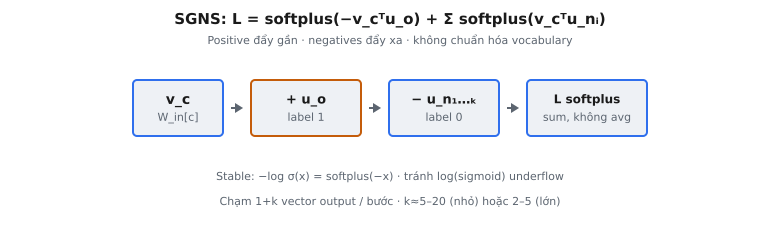

Skip-gram with Negative Sampling (SGNS) là objective huấn luyện Mikolov et al. (2013) giới thiệu làm word2vec đủ nhanh để huấn luyện trên hàng tỷ từ. Thay vì dự đoán phân phối xác suất đầy đủ trên toàn vocabulary cho mỗi từ context, SGNS khung lại huấn luyện thành tập bài toán phân loại nhị phân độc lập: phân biệt cặp (center, context) thật khỏi cặp nhiễu lấy mẫu ngẫu nhiên.

## Vấn đề full-softmax

Mô hình skip-gram gốc dự đoán từ context từ từ center. Với từ center $c$ và từ context $o$, mô hình dùng embedding đầu vào $v_c$ và embedding đầu ra $u_o$, và định nghĩa xác suất bằng softmax trên cả vocabulary $W$:

$$
p(o \mid c) = \frac{\exp(u_o^\top v_c)}{\sum_{w=1}^{W} \exp(u_w^\top v_c)}
$$

Mẫu số cộng trên mọi từ trong vocabulary. Vocabulary thực có $10^5$ đến $10^7$ từ, nên mỗi ví dụ huấn luyện sẽ đòi hỏi tích vô hướng với mọi vector đầu ra, cộng cùng chi phí lần nữa khi lan truyền ngược. Với hàng tỷ token huấn luyện điều này tính toán tuyệt vọng.

Bài báo nêu mục tiêu rõ: chuẩn hóa softmax là “impractical because the cost of computing the gradient is proportional to $W$”. Mọi lựa chọn thay trong bài báo tồn tại để tránh đụng mọi $W$ vector đầu ra mỗi cập nhật.

## Từ NCE đến negative sampling

Negative sampling là đơn giản hóa của **Noise Contrastive Estimation** (NCE, Gutmann và Hyvärinen, 2012; Mnih và Teh, 2012). NCE giảm ước lượng mật độ thành phân loại nhị phân: huấn luyện bộ phân loại logistic tách mẫu dữ liệu thật khỏi mẫu rút từ phân phối nhiễu đã biết. NCE bảo toàn đủ cấu trúc để xấp xỉ xác suất softmax.

word2vec chỉ cần embedding tốt, không phải xác suất đã calibrate. Nên các tác giả bỏ các phần của NCE cần cho ước lượng mật độ và chỉ giữ lõi phân loại nhị phân. Kết quả là negative sampling: objective rẻ hơn, tune cụ thể để học biểu diễn chứ không mô hình likelihood.

Cụ thể, NCE trọng số mỗi mẫu nhiễu bằng tỷ số mật độ dữ liệu và nhiễu để đầu ra classifier có thể chuyển lại thành xác suất. Negative sampling bỏ các trọng số đó và chuẩn hóa nhiễu, coi mọi negative lấy mẫu như ví dụ nhãn-0 thuần. Bài báo lưu ý rằng trong khi NCE xấp xỉ tối đa hóa log-probability của softmax, negative sampling thì không, và đánh đổi này chấp nhận được đúng vì embedding, không phải xác suất, là sản phẩm.

## Objective SGNS

Với một cặp (center, positive context) quan sát được $(c, o)$, mô hình rút $k$ từ negative $n_1, \dots, n_k$ từ phân phối nhiễu và tối thiểu hóa:

$$
L = -\log\sigma(v_c^\top u_o) - \sum_{i=1}^{k}\log\sigma(-v_c^\top u_{n_i})
$$

với $\sigma(x) = 1 / (1 + e^{-x})$ là logistic sigmoid. Các hạng tử có diễn giải sạch:

* **Hạng tử dương** $-\log\sigma(v_c^\top u_o)$: đẩy điểm số cặp thật lên, vì $\sigma$ tiến tới 1 khi tích vô hướng tăng, đưa loss này về 0.
* **Hạng tử âm** $-\log\sigma(-v_c^\top u_{n_i})$: đẩy điểm số mỗi cặp nhiễu xuống. $\sigma(-x)$ tiến tới 1 khi $x$ rất âm, nên loss được tối thiểu khi tích vô hướng nhiễu lớn và âm.

Mỗi hạng tử là binary cross-entropy của bộ phân loại logistic. Cặp dương có nhãn 1, mọi cặp âm có nhãn 0. Từ center dùng embedding **input** $v_c$; cả từ context dương và âm dùng embedding **output** $u$.

Điểm tinh tế nhưng quan trọng: loss này là cho một cặp (center, positive) quan sát được. Một lượt skip-gram trên câu sinh một cặp như vậy cho mọi từ center và mọi từ context trong cửa sổ, và mỗi cặp đó nhận tập $k$ negatives mới. Objective huấn luyện tổng cộng loss theo cặp trên cả corpus. Vì negatives được lấy mẫu lại mỗi cặp, cùng từ nhiễu có thể xuất hiện như negative cho nhiều center khác nhau — ổn: objective chỉ hỏi liệu một tích vô hướng (center, candidate) cụ thể nên cao hay thấp.

Cũng lưu ý không có chuẩn hóa trên vocabulary ở bất kỳ đâu trong $L$. Mỗi hạng tử chỉ phụ thuộc một tích vô hướng nó chứa. Locality này đúng là thứ làm gradient rẻ: một cập nhật đụng vector input của center, vector output của positive, và $k$ vector output của negatives — không gì khác.

::: {#fig-w2v-sgns fig-cap="SGNS: $L=\\mathrm{softplus}(-v_c^\\top u_o)+\\sum_i \\mathrm{softplus}(v_c^\\top u_{n_i})$ — dương kéo gần, negatives đẩy xa." fig-alt="Chuỗi v_c, positive u_o, negatives, loss softplus."}
{fig-align="center"}
:::

## Sigmoid như phân loại nhị phân

Sigmoid biến tích vô hướng thô thành xác suất rằng một cặp là “thật”. Định nghĩa $D = 1$ cho cặp thật và $D = 0$ cho cặp nhiễu. Thì:

$$
p(D = 1 \mid c, w) = \sigma(v_c^\top u_w), \qquad p(D = 0 \mid c, w) = 1 - \sigma(v_c^\top u_w) = \sigma(-v_c^\top u_w)
$$

Đẳng thức $1 - \sigma(x) = \sigma(-x)$ là vì sao hạng tử âm mang dấu trừ trong sigmoid. Tối đa hóa log-likelihood của nhãn (1 cho cặp quan sát, 0 cho mỗi negative lấy mẫu) cho đúng loss trên. Tối thiểu hóa $L$ là tối đa hóa log-likelihood đó.

## Vì sao softplus cho ổn định số

Tính $-\log\sigma(x)$ ngây thơ nghĩa là đánh giá $\sigma(x)$ trước, rồi lấy log. Khi $x$ là số âm lớn, $\sigma(x)$ underflow đúng về 0 trong floating point, và $\log(0) = -\infty$. Loss rồi thành $\text{inf}$ hoặc $\text{nan}$, và gradient nổ. Với embedding không bị chặn, tích vô hướng dễ đạt độ lớn 30 hoặc hơn, nên đây là failure mode thật, không phải case góc.

Viết lại ổn định dùng hàm softplus $\text{softplus}(x) = \log(1 + e^x)$:

$$
-\log\sigma(x) = -\log\frac{1}{1 + e^{-x}} = \log(1 + e^{-x}) = \text{softplus}(-x)
$$

Vậy hạng tử dương thành $\text{softplus}(-v_c^\top u_o)$ và mỗi hạng tử âm thành $\text{softplus}(v_c^\top u_{n_i})$:

$$
L = \text{softplus}(-v_c^\top u_o) + \sum_{i=1}^{k}\text{softplus}(v_c^\top u_{n_i})
$$

Implementation softplus thư viện dùng đẳng thức $\text{softplus}(x) = \max(x, 0) + \log(1 + e^{-|x|})$, không bao giờ overflow hoặc underflow với mọi đầu vào hữu hạn. Đây cùng trick PyTorch dùng trong `F.softplus` và `F.logsigmoid`.

## Vai trò của $k$

$k$ là số mẫu negative rút mỗi cặp dương. Nó trực tiếp điều khiển chi phí: mỗi cập nhật đụng $k + 1$ vector đầu ra thay vì mọi $W$. Bài báo báo cáo:

* **Dataset nhỏ:** $k$ trong khoảng 5 đến 20 hoạt động tốt.
* **Dataset lớn:** $k$ nhỏ đến 2 đến 5 là đủ, vì có nhiều tín hiệu hơn trong chính dữ liệu.

$k$ lớn hơn cho tín hiệu contrastive mạnh hơn và gradient ổn định hơn, với chi phí mỗi bước cao hơn. Negatives được lấy mẫu từ phân phối unigram nâng lên lũy thừa $3/4$, mà bài báo thấy thực nghiệm tốt hơn unigram thuần hoặc uniform: nó tăng nhẹ từ hiếm trong khi vẫn ưu tiên từ thường.

## Embedding input so với output

word2vec duy trì hai ma trận embedding tách biệt. **Ma trận input** giữ các vector $v_w$ dùng khi từ đóng vai center. **Ma trận output** giữ các vector $u_w$ dùng khi từ đóng vai context (dương hoặc âm). Điểm số một cặp luôn là tích vô hướng giữa một vector input và một vector output, $v_c^\top u_w$, không bao giờ hai vector từ cùng một ma trận.

Giữ ma trận tách tránh artifact tự-tương đồng: một ma trận dùng chung sẽ đẩy vector của một từ có tích vô hướng lớn với chính nó — không mong muốn. Sau huấn luyện, practitioner thường giữ ma trận input làm word vector, hoặc trung bình hai cái.

## So sánh với hierarchical softmax

Cùng bài báo đề xuất **hierarchical softmax** như lựa chọn nhanh khác. Nó xếp vocabulary như lá của cây Huffman nhị phân và tính $p(o \mid c)$ như tích các sigmoid dọc đường root-to-leaf, tốn $O(\log W)$ mỗi ví dụ thay vì $O(W)$.

* **Hierarchical softmax:** cho xác suất chuẩn hóa đúng, chi phí $O(\log W)$, tốt hơn cho từ hiếm vì từ thường có mã ngắn hơn.
* **Negative sampling:** đơn giản hơn để triển khai, chi phí $O(k)$ độc lập $W$, tốt hơn cho từ thường và vector chiều thấp, nhưng điểm số không phải xác suất chuẩn hóa.

Negative sampling trở thành mặc định trong thực tế vì đơn giản và kết quả thực nghiệm mạnh, và cùng ý tưởng contrastive sau này tái xuất hiện xuyên representation learning.

## Bối cảnh hiện đại

SGNS là prototype cho họ **contrastive learning** hiện thống trị representation learning self-supervised. Công thức giống nhau: định nghĩa điểm số cho cặp, gắn nhãn đồng xuất hiện thật là positives, rút negatives từ phân phối nhiễu, và huấn luyện objective logistic để tách chúng.

* **InfoNCE** (van den Oord et al., 2018) tổng quát hóa ý tưởng với softmax trên một positive và nhiều negatives, dùng trong SimCLR và CLIP.
* **GloVe** (Pennington et al., 2014) đạt embedding tương tự qua fit least-squares có trọng số trên count đồng xuất hiện — đường bổ sung tới cùng hình học.
* **Levy và Goldberg (2014)** cho thấy SGNS ngầm factorize ma trận pointwise-mutual-information đã dịch, nối objective neural với phương pháp dựa count cổ điển.

Hiểu loss SGNS do đó không chỉ lịch sử: mẫu phân-loại-nhị-phân-đối-nhiễu là primitive nền tảng trong representation learning.

## Gradient và chúng học gì

Gradient của loss làm hành vi contrastive tường minh. Với cặp dương, đạo hàm của $-\log\sigma(v_c^\top u_o)$ theo điểm số $s_o = v_c^\top u_o$ là $\sigma(s_o) - 1$, giá trị trong $(-1, 0)$. Với cặp âm, đạo hàm của $-\log\sigma(-v_c^\top u_{n_i})$ theo $s_{n_i} = v_c^\top u_{n_i}$ là $\sigma(s_{n_i})$, giá trị trong $(0, 1)$.

Theo chain rule, gradient chảy vào vector input $v_c$ là:

$$
\frac{\partial L}{\partial v_c} = (\sigma(s_o) - 1)\, u_o + \sum_{i=1}^{k} \sigma(s_{n_i})\, u_{n_i}
$$

Diễn giải trực tiếp. Hạng tử $(\sigma(s_o) - 1)$ âm, nên bước gradient đẩy $v_c$ về phía $u_o$, kéo cặp thật gần hơn. Mỗi $\sigma(s_{n_i})$ dương, nên bước đẩy $v_c$ ra xa các vector nhiễu $u_{n_i}$. Độ lớn mỗi đẩy là lỗi hiện tại của mô hình trên cặp đó: negative đã điểm thấp đóng góp gần như không gì, trong khi cái chắc chắn sai đóng góp gradient gần đơn vị. Focus tự động vào ví dụ khó, giàu thông tin này là thứ làm objective hiệu quả mẫu.

## Ví dụ số ($D = 2$, $k = 1$)

Cho $v_c = [1, 0]$, $u_o = [1, 0]$, và một negative $u_{n} = [-1, 0]$.

1. **Điểm dương:** $v_c^\top u_o = 1 \cdot 1 + 0 \cdot 0 = 1$.
2. **Điểm âm:** $v_c^\top u_n = 1 \cdot (-1) + 0 \cdot 0 = -1$.
3. **Loss dương:** $\text{softplus}(-1) = \log(1 + e^{-1}) \approx 0.3133$.
4. **Loss âm:** $\text{softplus}(-1) = \log(1 + e^{-1}) \approx 0.3133$ (lưu ý hạng tử âm dùng $+v_c^\top u_n = -1$ làm đầu vào softplus).
5. **Tổng:** $L \approx 0.3133 + 0.3133 = 0.6266$. Mô hình đang làm tốt ở đây: cặp thật có điểm cao và cặp nhiễu điểm thấp, nên cả hai loss nhỏ.

Sanity check hữu ích: nếu mọi embedding là vector không, mọi tích vô hướng là 0, $\sigma(0) = 0.5$, và loss bằng $(k+1)\log 2 \approx 0.6931(k+1)$.

## Các lỗi thường gặp

* **Lỗi dấu trên hạng tử âm.** Hạng tử âm là $-\log\sigma(-v_c^\top u_{n_i})$, tương đương $\text{softplus}(+v_c^\top u_{n_i})$. Bỏ dấu trừ trong (dùng $\sigma(+v_c^\top u_{n_i})$, tức $\text{softplus}(-v_c^\top u_{n_i})$) huấn luyện mô hình làm cặp nhiễu trông thật — đúng ngược ý định. Loss vẫn trông hợp lý trên đầu vào nhỏ, nên bug này dễ bỏ sót nếu không kiểm với tham chiếu.
* **Overflow số từ log-sigmoid ngây thơ.** Viết $-\log(\text{sigmoid}(x))$ trực tiếp overflow thành $\text{inf}$ hoặc $\text{nan}$ khi $|x|$ lớn, vì sigmoid bão hòa về 0 hoặc 1 trong floating point. Luôn dùng softplus hoặc log-sigmoid fused. Fail chỉ xuất hiện với tích vô hướng độ lớn lớn — đúng thứ embedding đã tách tốt tạo ra.
* **Cộng so với trung bình negatives.** Objective cộng trên $k$ negatives. Trung bình (chia cho $k$) co gradient âm theo hệ số $k$, làm yếu tín hiệu contrastive và đổi động lực học hiệu dụng. Giá trị loss sai với mọi $k > 1$.
* **Nhầm embedding input và output.** Mọi điểm số là $v_c^\top u_w$: vector input của từ center chấm với vector output của từ context. Dùng hai vector input hoặc hai vector output, hoặc đổi ma trận từ nào được lookup, lặng lẽ làm hỏng gradient trong khi vẫn tạo loss trông hữu hạn.

## Code

```python
import torch
import torch.nn.functional as F

def sgns_loss(center_vec: torch.Tensor, pos_vec: torch.Tensor, neg_vecs: torch.Tensor) -> torch.Tensor:
    """
    Return a scalar torch.Tensor: the SGNS loss for one center/positive pair with k negatives.
    center_vec: (D,), pos_vec: (D,), neg_vecs: (k, D).
    """
    pos_score = torch.dot(center_vec, pos_vec)
    neg_scores = neg_vecs @ center_vec  # (k,)
    pos_loss = F.softplus(-pos_score)
    neg_loss = F.softplus(neg_scores).sum()
    return pos_loss + neg_loss
```
