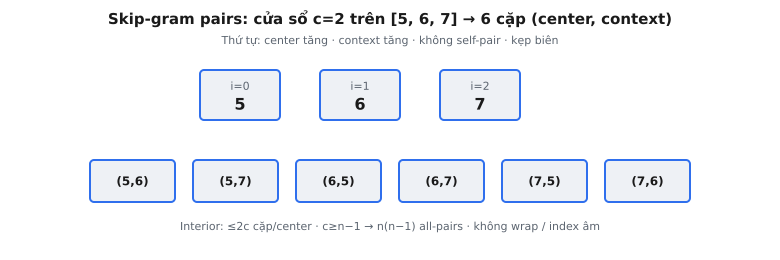

Skip-gram là một trong hai kiến trúc mô hình Mikolov et al. (2013) giới thiệu để học distributed word representations. Dữ liệu huấn luyện không phải văn bản thô mà là luồng **cặp (center, context)** trích từ cửa sổ trượt trên mỗi câu. Chương này triển khai bước trích xuất đó: cho chuỗi token id và kích thước cửa sổ, tạo mọi cặp center-context mà mô hình sẽ được huấn luyện trên.

## Skip-gram học gì

Mục tiêu Skip-gram là **dự đoán từ context xung quanh từ một center cho trước**. Với mỗi vị trí trong corpus, từ center được đưa vào mô hình và mô hình được yêu cầu gán xác suất cao cho mỗi từ thực sự xuất hiện gần đó. Qua hàng triệu cặp như vậy, embedding mỗi từ bị kéo về phía embedding các từ nó đồng xuất hiện, nên từ chia sẻ ngữ cảnh kết thúc gần nhau trong không gian vector.

Hình thức, cho corpus huấn luyện $w_1, w_2, \ldots, w_T$ và kích thước cửa sổ $c$, mô hình tối đa hóa log-probability trung bình:

$$
\frac{1}{T} \sum_{t=1}^{T} \sum_{-c \le j \le c,\ j \ne 0} \log p(w_{t+j} \mid w_t)
$$

Tổng trong chạy trên mọi offset $j$ trong cửa sổ trừ $j = 0$ (bản thân center). Mỗi hạng tử $\log p(w_{t+j} \mid w_t)$ tương ứng đúng một cặp huấn luyện (center, context) $(w_t, w_{t+j})$. Chương này sinh tập cặp $(w_t, w_{t+j})$ mà objective cộng trên.

## Khái niệm cửa sổ

**Cửa sổ** định nghĩa locality. Với kích thước cửa sổ $c$, context của token center tại vị trí $i$ là mọi token tại vị trí $i-c$ đến $i+c$, trừ $i$ chính nó. Cửa sổ nắm trực giác distributional hypothesis: từ xuất hiện ở vị trí xung quanh tương tự có xu hướng nghĩa tương tự.

Cửa sổ lớn hơn kéo vào từ xa hơn và có xu hướng bắt similarity **topic** hoặc **domain** (từ xuất hiện trong cùng loại tài liệu). Cửa sổ nhỏ hơn bắt similarity **cú pháp** hoặc chức năng (từ có thể thay thế trong câu). Mikolov et al. báo cáo kết quả tốt với cửa sổ khoảng 5 đến 10 cho Skip-gram.

Với center tại vị trí $i$ trong chuỗi dài $n$, các chỉ số context là:

$$
\{ j : \max(0, i-c) \le j \le \min(n-1, i+c),\ j \ne i \}
$$

$\max$ và $\min$ kẹp cửa sổ vào biên chuỗi để không bao giờ đọc quá token đầu hoặc cuối.

## Vì sao cặp thay vì vector context đầy đủ

Skip-gram phân rã dự đoán đa từ thành các dự đoán đơn từ độc lập. Thay vì dự đoán toàn bộ context $\{w_{i-c}, \ldots, w_{i+c}\}$ đồng thời, nó phát một cặp mỗi từ context và coi mỗi cái là một ví dụ huấn luyện riêng. Điều này có hai lợi ích thực tiễn:

* **Đơn giản:** mỗi bước huấn luyện xử lý một softmax trên vocabulary cho một từ đích, thay vì phân phối đồng thời trên một tập từ.
* **Khả năng scale:** góc nhìn cặp ghép sạch với negative sampling và hierarchical softmax — hai xấp xỉ Mikolov et al. dùng để tránh full-vocabulary softmax.

Bước sinh cặp do đó là cầu nối giữa chuỗi token thô và luồng ví dụ mà optimizer tiêu thụ. Lấy đúng cặp (center đúng, context đúng, biên đúng) trực tiếp quyết định embedding học gì.

## Skip-gram so với CBOW

Word2Vec mang hai kiến trúc. Chúng dùng cùng cửa sổ nhưng đảo hướng dự đoán:

* **Skip-gram** dự đoán context từ center: đầu vào là một từ $w_i$, đích là các từ xung quanh. Nó sinh một cặp $(w_i, w_{i+j})$ mỗi từ context. Skip-gram hoạt động tốt hơn trên dataset nhỏ và biểu diễn từ hiếm tốt, vì mỗi center hiếm vẫn tạo vài cặp huấn luyện.
* **CBOW (Continuous Bag of Words)** dự đoán center từ context: các từ xung quanh được trung bình thành một đầu vào và mô hình dự đoán từ center $w_i$. CBOW nhanh hơn và hơi tốt hơn trên từ thường, nhưng gộp context thành một ví dụ mỗi vị trí center.

Về mặt cặp, Skip-gram và CBOW dùng cùng membership cửa sổ; khác biệt là phần tử nào là đầu vào và phần tử nào là đích. Chương này triển khai hướng Skip-gram: cột 0 mỗi hàng là center, cột 1 là từ context.

::: {#fig-w2v-pairs fig-cap="Sinh cặp Skip-gram: cửa sổ $c=2$ trên $[5,6,7]$ cho 6 cặp $(center, context)$ theo thứ tự center rồi context tăng dần." fig-alt="Ba token và sáu cặp kết quả."}
{fig-align="center"}
:::

## Cửa sổ cố định so với động

Implementation word2vec gốc dùng **cửa sổ động**: với mỗi từ center nó lấy mẫu số nguyên ngẫu nhiên $r$ đều từ $1$ đến $c$ và dùng $r$ làm cửa sổ hiệu dụng tại vị trí đó. Điều này trọng số từ gần nặng hơn (chúng rơi trong cửa sổ với nhiều giá trị $r$ được lấy mẫu hơn) và hoạt động như weighting theo khoảng cách rẻ.

Chương này cố ý dùng **cửa sổ cố định** đúng $c$ hai phía. Biến thể động phụ thuộc rút ngẫu nhiên mỗi vị trí, khiến đầu ra không xác định và không kiểm tra được đúng từng phần tử. Cố định cửa sổ giữ ánh xạ đầu vào → đầu ra xác định trong khi bảo toàn cơ chế cốt lõi: liệt kê lân cận đối xứng và phát một cặp mỗi hàng xóm.

Nếu muốn hành vi động, thay $c$ hằng trong vòng lặp bằng giá trị lấy mẫu mỗi center. Mọi thứ khác (kẹp biên, loại self, thứ tự phát) giữ nguyên.

## Xử lý biên

Token gần đầu hoặc cuối chuỗi có cửa sổ bị cắt vì không có từ ngoài biên. Token đầu không có context trái; token cuối không có context phải. Xử lý đúng kẹp cửa sổ bằng $\max(0, i-c)$ bên trái và $\min(n-1, i+c)$ bên phải.

Hai lỗi phổ biến:

* **Quấn vòng** (indexing modular như $j \bmod n$) coi chuỗi là vòng và ghép token cuối với token đầu. Sai: câu không phải vòng lặp.
* **Indexing âm** trong Python lặng lẽ đọc từ cuối tensor. $i - c$ không kẹp khi $i < c$ tạo chỉ số âm ánh xạ tới token ở đầu kia chuỗi — lại tạo cặp ma.

Chuỗi một token không có context ở mọi kích thước cửa sổ, nên tạo zero cặp. Hàm trả tensor rỗng shape $(0, 2)$ trong trường hợp đó, giữ shape đầu ra nhất quán cho batching downstream.

## Bối cảnh bài báo và quyết định thiết kế

Mikolov et al. giới thiệu Skip-gram trong “Efficient Estimation of Word Representations in Vector Space” (2013) và tinh chỉnh huấn luyện trong “Distributed Representations of Words and Phrases and their Compositionality” (2013). Bài đầu đề xuất kiến trúc; bài sau làm nó thực tiễn trên corpus tỷ token qua negative sampling và subsample từ thường.

Luồng cặp nằm thượng nguồn các thủ thuật đó. Bài báo mô tả objective huấn luyện như tổng trên các offset context trong cửa sổ — đúng tập cặp chương này tạo. Hai lựa chọn thiết kế trong công trình gốc đáng theo dõi:

* **Subsample từ thường.** Trước khi sinh cặp, từ rất thường (như “the”, “a”) bị bỏ ngẫu nhiên với xác suất gắn tần suất. Điều này vừa tăng tốc huấn luyện vừa dịch cửa sổ hiệu dụng, vì bỏ một từ để từ xa hơn trở thành hàng xóm. Chương này vận hành trên token id như đã cho và không subsample, giữ ánh xạ xác định.
* **Negative sampling.** Thay vì full softmax trên vocabulary mỗi cặp, bài báo rút một nắm từ “negative” mỗi cặp dương và huấn luyện bộ phân loại nhị phân tách từ context thật khỏi negatives. Các cặp dương đưa vào negative sampling đúng là các cặp $(center, context)$ sinh ở đây.

Các tác giả thấy Skip-gram với negative sampling là đánh đổi tốc độ–chất lượng tốt nhất, và nó trở thành mặc định cho word2vec downstream. Hiểu sinh cặp làm phần còn lại của pipeline (subsample, negative sampling, cập nhật embedding) dễ lập luận, vì mọi thứ downstream tiêu thụ luồng cặp này.

## Độ phức tạp

Mỗi vị trí center đóng góp tối đa $2c$ cặp (cửa sổ đầy đủ trừ center). Với chuỗi dài $n$ tổng số cặp bị chặn trên bởi $2cn$, và đúng $2cn$ khi xa biên. Độ phức tạp thời gian sinh mọi cặp do đó $O(n \cdot c)$, tuyến tính theo cả độ dài chuỗi và kích thước cửa sổ.

Bộ nhớ cũng $O(n \cdot c)$, vì mọi cặp được materialize vào tensor đầu ra. Trong pipeline huấn luyện thật cặp thường được stream thay vì lưu, nhưng ở đây tensor đầy đủ $(N, 2)$ được trả để kiểm tra đúng từng phần tử.

Số đếm chính xác các cặp hữu ích như sanity check. Với vị trí nội thất (nơi cửa sổ đầy đủ vừa), vị trí đóng góp $2c$ cặp. Vị trí biên đóng góp ít hơn: vị trí 0 đóng góp $\min(c, n-1)$ cặp, vị trí 1 đóng góp $\min(c, 1) + \min(c, n-2)$, và cứ thế. Cộng mọi vị trí cho tổng $N$. Khi $c \ge n - 1$, cửa sổ phủ cả chuỗi từ mọi vị trí, nên mỗi trong $n$ center ghép với mọi $n - 1$ token khác, cho đúng $n(n-1)$ cặp. Đó là vì sao cửa sổ lớn hơn chuỗi hành xử như liệt kê all-pairs dày đặc.

## Ví dụ số

Lấy token ids $[5, 6, 7]$ với cửa sổ $c = 2$. Độ dài chuỗi là $n = 3$.

1. **Center tại vị trí 0 (token 5):** cửa sổ là $\max(0, -2) = 0$ đến $\min(2, 2) = 2$, nên vị trí 0, 1, 2. Loại 0. Phát $(5, 6)$ từ vị trí 1 và $(5, 7)$ từ vị trí 2.
2. **Center tại vị trí 1 (token 6):** cửa sổ là vị trí 0 đến 2. Loại 1. Phát $(6, 5)$ rồi $(6, 7)$.
3. **Center tại vị trí 2 (token 7):** cửa sổ là vị trí 0 đến 2. Loại 2. Phát $(7, 5)$ rồi $(7, 6)$.

Tensor cuối, theo thứ tự center rồi context, là:

$$
\begin{pmatrix}
5 & 6 \\
5 & 7 \\
6 & 5 \\
6 & 7 \\
7 & 5 \\
7 & 6
\end{pmatrix}
$$

Sáu cặp tổng cộng, khớp bound $2cn$ bị kẹp bởi chuỗi ngắn. Lưu ý với $c = 2 \ge n - 1$ cửa sổ phủ cả chuỗi, nên mọi cặp có thứ tự của vị trí phân biệt xuất hiện.

## Bối cảnh hiện đại

Cặp Skip-gram là tổ tiên khái niệm của tín hiệu huấn luyện mà nhiều representation learner sau dùng. Ý tưởng cốt lõi — biến đồng xuất hiện thành luồng cặp dương và đối chiếu chúng với negatives — tái xuất hiện xuyên machine learning hiện đại:

* **GloVe** (Pennington et al., 2014) diễn đạt lại cùng tín hiệu đồng xuất hiện như hồi quy least-squares có trọng số trên ma trận đếm word-word toàn cục, nhưng bắt cùng lân cận cửa sổ.
* **Node2vec và DeepWalk** áp dụng Skip-gram trực tiếp lên chuỗi nút sinh bởi random walk trên đồ thị, coi walk như câu và nút như từ.
* **Contrastive learning** trong vision và multimodal tổng quát hóa ý tưởng cặp dương–đối-negatives mà negative sampling lần đầu phổ biến hóa cho word2vec.

Transformer language model thay embedding word2vec tĩnh bằng biểu diễn có ngữ cảnh, nhưng trực giác đồng xuất hiện cửa sổ vẫn nằm dưới cách các mô hình đó học: token gần định hình biểu diễn lẫn nhau. Bước sinh cặp ở đây là phiên bản tối thiểu, trong suốt của tín hiệu đó.

## Thứ tự phát

Cặp được phát theo thứ tự xác định cố định: **vị trí center tăng dần, rồi vị trí context tăng dần**. Vòng ngoài đi vị trí center $0, 1, \ldots, n-1$; vòng trong đi cửa sổ đã kẹp trái sang phải, bỏ center. Thứ tự này quan trọng vì đầu ra được so sánh đúng từng phần tử. Mọi thứ tự khác (ví dụ context phải-sang-trái, hoặc nhóm mọi context trái trước phải) tạo cùng tập cặp nhưng tensor khác — fail kiểm tra equality chặt.

## Các lỗi thường gặp

* **Gồm self-pair.** Quên kiểm tra $j \ne i$ ghép mỗi center với chính nó. Objective tường minh loại $j = 0$, và cặp center-context nơi cả hai cùng từ không mang thông tin đồng xuất hiện.
* **Off-by-one trên cửa sổ.** Dùng bound trên chặt (range dừng ở $i + c$ exclusive, hoặc so sánh $<$ thay vì $\le$) bỏ từ context xa nhất bên phải. Cửa sổ inclusive hai đầu: vị trí $i - c$ đến $i + c$.
* **Quấn hoặc indexing âm ở biên.** Tính chỉ số context không kẹp để chỉ số trái âm quấn về cuối chuỗi (Python negative indexing) hoặc chỉ số modular vòng chuỗi thành vòng tròn. Cả hai bịa cặp vượt biên câu. Luôn kẹp bằng $\max(0, i-c)$ và $\min(n-1, i+c)$.
* **Đảo cặp.** Phát $(\text{context}, \text{center})$ thay vì $(\text{center}, \text{context})$ đổi cột. Với Skip-gram đầu vào là center và đích là context, nên cột 0 phải là center.
* **Sai dtype.** Token id là chỉ số rời rạc, nên đầu ra phải là tensor nguyên (int64). Trả tensor float phá lookup embedding downstream — chúng đòi hỏi chỉ số nguyên.

## Code

```python
import torch

def skipgram_pairs(token_ids: torch.Tensor, window: int) -> torch.Tensor:
    token_ids = torch.as_tensor(token_ids, dtype=torch.int64)
    n = token_ids.shape[0]
    pairs = []
    for i in range(n):
        lo = max(0, i - window)
        hi = min(n - 1, i + window)
        for j in range(lo, hi + 1):
            if j == i:
                continue
            pairs.append([int(token_ids[i].item()), int(token_ids[j].item())])
    if not pairs:
        return torch.zeros((0, 2), dtype=torch.int64)
    return torch.tensor(pairs, dtype=torch.int64)
```
