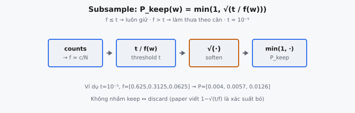

Frequent-word subsampling là thủ thuật preprocessing từ Mikolov et al. (2013), “Distributed Representations of Words and Phrases and their Compositionality”, bỏ ngẫu nhiên các từ rất phổ biến khi huấn luyện Skip-gram. Các từ như “the”, “a”, và “of” xuất hiện hàng triệu lần nhưng gần như không mang tín hiệu đồng xuất hiện hữu ích, nên các tác giả giữ mỗi lần xuất hiện với xác suất giảm khi từ trở nên thường hơn.

## Vì sao từ thường làm hại huấn luyện

Word2Vec học embedding bằng cách dự đoán từ context từ center (Skip-gram) trên cửa sổ trượt. Số cặp huấn luyện một từ sinh ra gần tỷ lệ với số lần nó xuất hiện trong corpus. Điều này tạo hai vấn đề với các từ phổ biến nhất.

* **Tín hiệu yếu.** Đồng xuất hiện của “France” và “Paris” mang thông tin: nó nói cho mô hình điều gì đó cụ thể về nghĩa. Đồng xuất hiện của “the” và “Paris” gần như không nói gì, vì “the” xuất hiện cạnh gần như mọi danh từ. Function word thường không giúp phân biệt ngữ cảnh này với ngữ cảnh khác.
* **Gradient bị chiếm.** Vì “the” có thể chiếm vài phần trăm mọi token, nó tham gia một phần rất lớn các cặp huấn luyện. Embedding của nó nhận số cập nhật lớn hơn hàng bậc so với từ hiếm nhưng có nghĩa, nên optimizer dành hầu hết công sức cho những từ cần ít nhất.

Bài báo quan sát rằng “the vector representations of frequent words do not change significantly after training on several million examples.” Nói cách khác, thêm exposure với “the” là compute lãng phí. Subsampling chuyển compute đó sang từ hiếm hơn, giàu thông tin hơn và, như hiệu ứng phụ, để cửa sổ ngữ cảnh hiệu dụng với các từ còn lại đi xa hơn.

::: {#fig-w2v-subsample fig-cap="Keep-probability: $P_{\\mathrm{keep}}(w)=\\min(1,\\sqrt{t/f(w)})$ — từ hiếm ($f\\le t$) luôn giữ; từ thường bị làm thưa theo căn." fig-alt="Chuỗi counts → t/f → căn → min(1) thành P_keep."}
{fig-align="center"}
:::

## Công thức xác suất giữ

Gọi $\text{count}(w)$ là số lần từ $w$ xuất hiện trong corpus và $N = \sum_w \text{count}(w)$ là tổng số token. Tần suất của $w$ là:

$$
f(w) = \frac{\text{count}(w)}{N}
$$

Mỗi lần xuất hiện của $w$ rồi được giữ với xác suất:

$$
P_{\text{keep}}(w) = \min\!\left(1, \sqrt{\frac{t}{f(w)}}\right)
$$

trong đó:

* $t$ là ngưỡng chọn, thường khoảng $10^{-5}$ với corpus lớn
* $f(w)$ là tần suất tương đối, số trong $(0, 1]$ cộng thành 1 trên vocabulary
* $\min$ với 1 kẹp xác suất để không bao giờ vượt xác suất hợp lệ

Bài báo gốc viết quy tắc dưới dạng bỏ từ $w_i$ với xác suất $P(w_i) = 1 - \sqrt{t / f(w_i)}$. Giữ là phần bù, nên $P_{\text{keep}}(w) = \sqrt{t / f(w)}$, kẹp ở 1. Cả hai cách nói cùng một phép toán. Chương này tính trực tiếp keep-probability.

## Đọc từng hạng tử

Hành vi công thức dễ hiểu nhất khi tách vocabulary tại ngưỡng $t$.

* **Từ hiếm ($f(w) \le t$).** Ở đây $t / f(w) \ge 1$, nên $\sqrt{t / f(w)} \ge 1$ và $\min$ kẹp keep-probability đúng bằng 1. Mọi lần xuất hiện từ hiếm được giữ. Subsampling không bao giờ vứt tín hiệu từ các từ vốn đã khan.
* **Từ thường ($f(w) > t$).** Lúc này $t / f(w) < 1$, nên keep-probability rơi dưới 1. Từ càng thường, tỷ số càng nhỏ, và lần xuất hiện bị bỏ càng mạnh.

Ngưỡng $t$ đóng vai cutoff mềm: từ dưới nó không bị đụng, từ trên nó bị làm thưa tỷ lệ với mức vượt ngưỡng.

## Vì sao căn bậc hai

Một lựa chọn tự nhiên sẽ là giữ từ với xác suất $t / f(w)$, không có căn. Cách đó suy giảm quá nhanh. Nếu “the” có tần suất $f = 5 \times 10^{-2}$ và $t = 10^{-5}$, thì $t / f = 2 \times 10^{-4}$, nên chỉ khoảng một trong năm nghìn lần xuất hiện sống sót. Quá hung hãn đến mức có thể xóa gần hết một từ và làm đói ngữ cảnh các từ lân cận.

Căn bậc hai làm mềm suy giảm. Dưới $\sqrt{t / f}$, cùng “the” được giữ với xác suất $\sqrt{2 \times 10^{-4}} \approx 0.014$, khoảng một trong bảy mươi lần. Từ thường vẫn bị làm thưa mạnh, nhưng không bị hủy diệt. Bài báo mô tả công thức là “heuristically chosen” vì nó “aggressively subsamples words whose frequency is greater than $t$ while preserving the ranking of the frequencies.” Căn giữ thứ tự tương đối của tần suất trong khi nén dải động.

Còn một tính chất scale hữu ích. Nếu một từ thường gấp bốn lần từ khác (và cả hai trên $t$), keep-probability của nó chỉ còn một nửa, vì $\sqrt{1/4} = 1/2$. Căn biến khoảng cách nhân về tần suất thành khoảng cách nhân nhỏ hơn về keep-probability. Quy tắc tuyến tính như $t/f$ sẽ biến cùng khoảng cách bốn lần thành chênh lệch bốn lần về keep-probability, phóng đại thay vì làm dịu mất cân bằng mà kỹ thuật nhằm giảm.

## Ảnh hưởng tới tốc độ và chất lượng embedding

Subsampling có hai hiệu ứng củng cố lẫn nhau mà bài báo báo cáo.

* **Huấn luyện nhanh hơn.** Bỏ một phần lớn token phổ biến nhất co số cặp huấn luyện đáng kể. Mikolov et al. báo cáo tăng tốc khoảng 2× đến 10× tùy ngưỡng và corpus.
* **Vector từ hiếm tốt hơn.** Với ít cặp kiểu “the” tràn gradient, optimizer phân bổ nhiều cập nhật hơn cho từ giàu thông tin. Bài báo báo cáo “significant improvement in the accuracy of the learned vectors of the rare words” trên benchmark analogy.
* **Cả vector từ thường cũng tốt hơn.** Nghịch lý là làm thưa từ phổ biến cũng có thể làm sắc embedding của chính chúng. Biểu diễn của chúng đã hội tụ từ over-exposure, và bỏ cập nhật dư thừa để lại các lần còn giữ trong ngữ cảnh giàu thông tin hơn (vì function word lân cận cũng bị bỏ), nên tỷ lệ tín hiệu/nhiễu mỗi cặp sống sót cải thiện.

Bonus tinh tế là cửa sổ mở rộng hiệu dụng. Khi function word xen giữa bị bỏ, các từ context còn lại ngồi gần nhau hơn trong cửa sổ trượt, nên từ có nghĩa vốn vừa ngoài cửa sổ giờ có thể đồng xuất hiện. Điều này cho cửa sổ cố định bắt quan hệ ngữ nghĩa tầm xa hơn.

## Vị trí trong Skip-gram

Subsampling là bước preprocessing corpus, áp dụng trước mọi cập nhật embedding. Hiểu nó nằm đâu trong pipeline làm rõ vì sao nó được tính một lần, ở đầu.

1. **Lượt đếm:** quét corpus một lần và tally $\text{count}(w)$ cho mọi từ, cộng tổng $N$.
2. **Lượt xác suất:** tính $P_{\text{keep}}(w)$ cho mỗi từ trong vocabulary bằng công thức trên. Đây là phép vector một lần trên vocabulary, không trên corpus, nên rẻ.
3. **Lượt stream:** đi token-by-token trên corpus. Với mỗi lần xuất hiện từ $w$, rút số ngẫu nhiên đều $r \in [0, 1)$ và chỉ giữ token nếu $r < P_{\text{keep}}(w)$. Token bị bỏ bị loại trước khi cửa sổ trượt tạo cặp huấn luyện.

Vì keep-probability chỉ phụ thuộc tần suất toàn cục, nó giống nhau cho mọi lần xuất hiện của cùng một từ. Hai lần “the” có cùng xác suất bị bỏ, độc lập với vị trí. Ngẫu nhiên nằm ở lượt thứ ba; chương này cô lập lượt thứ hai xác định — phần phải đúng số trước khi bất kỳ sampling nào xảy ra.

## Chọn ngưỡng $t$

Ngưỡng $t$ là núm đơn điều khiển subsample hung hãn thế nào. Nó là tần suất tại đó một từ chuyển từ “luôn giữ” sang “bỏ một phần”.

* **$t$ nhỏ hơn (ví dụ $10^{-6}$)** hạ cutoff, nên nhiều từ hơn bị coi là “thường” và bị làm thưa, kể cả từ tần suất trung bình. Tối đa hóa tăng tốc nhưng rủi ro bỏ từ mid-frequency hữu ích.
* **$t$ lớn hơn (ví dụ $10^{-3}$)** nâng cutoff, nên chỉ các từ phổ biến nhất bị đụng và corpus gần như không bị làm thưa. Nhẹ tay hơn nhưng tăng tốc nhỏ hơn.

Bài báo báo cáo giá trị khoảng $t = 10^{-5}$ hoạt động tốt trên corpus tin tức lớn họ huấn luyện. Giá trị đúng scale theo kích thước corpus và phân phối vocabulary: corpus nơi một từ thống trị cần cutoff khác phân phối phẳng hơn. Vì công thức bảo toàn ranking tần suất với mọi $t > 0$, quét $t$ đổi lượng bị bỏ mà không xáo trộn từ nào được coi là phổ biến nhất.

## So sánh với chiến lược đơn giản hơn

* **Không subsample.** Mọi token đều huấn luyện. Lãng phí compute trên function word và để gradient của chúng chiếm ưu thế — đúng failure mode kỹ thuật sửa.
* **Danh sách stop-word cứng.** Xóa danh sách cố định (cách stop-word cổ điển) thô: coi mọi từ trong list là vô giá trị và mọi từ khác được giữ hết, không có mức độ. Cũng đòi hỏi list thủ công theo ngôn ngữ. Subsampling theo tần suất, không phụ thuộc ngôn ngữ, và xác suất, nên từ moderately frequent chỉ bị làm thưa một phần thay vì bị xóa hết.
* **Cutoff tần suất cứng.** Bỏ mọi từ trên một ngưỡng count lại là all-or-nothing. Quy tắc căn thay vào đó cung cấp xác suất mượt bảo toàn ranking tần suất — bài báo lập luận điều này quan trọng.

## Ví dụ số ($t = 10^{-5}$)

Lấy corpus đồ chơi với ba từ và counts $[100, 50, 10]$. Tổng là $N = 160$.

1. **Tần suất:** $f = [100/160, 50/160, 10/160] = [0.625, 0.3125, 0.0625]$.
2. **Tỷ số $t / f$:** với $t = 10^{-5}$, là $[1.6 \times 10^{-5}, 3.2 \times 10^{-5}, 1.6 \times 10^{-4}]$.
3. **Căn bậc hai:** $\sqrt{t/f} = [0.004, 0.005657, 0.012649]$ (làm tròn).
4. **Kẹp ở 1:** cả ba đã dưới 1, nên $P_{\text{keep}} = [0.004, 0.005657, 0.012649]$.

Từ thường nhất chỉ được giữ khoảng 0.4% thời gian, trong khi từ ít thường nhất trong ba sống sót khoảng gấp ba lần. Lưu ý keep-probability theo dõi tần suất: từ 1 thường gấp đôi từ 2, và keep-probability của nó ($0.004$) khoảng $1/\sqrt{2} \approx 0.707$ lần của từ 2 ($0.005657$) — đúng scale căn mô tả ở trên. Đối chiếu từ hiếm: nếu tần suất $f = 10^{-6}$ (dưới $t$), thì $t/f = 10$ và $\sqrt{10} \approx 3.16$, $\min$ kẹp về 1, nên mọi lần xuất hiện được giữ.

Kiểm tra thứ hai: bốn từ count bằng nhau $[25, 25, 25, 25]$. Mỗi cái có $f = 0.25$, nên mỗi keep-probability là $\sqrt{10^{-5} / 0.25} = \sqrt{4 \times 10^{-5}} \approx 0.006325$. Từ tần suất bằng nhau nhận keep-probability giống nhau — xác nhận công thức chỉ phụ thuộc tần suất tương đối và xử lý đầu vào đối xứng một cách đối xứng.

## Ghi chú triển khai

Phép tính là pipeline ngắn, vector hóa hoàn toàn trên tensor count.

* Cast count sang floating point trước khi chia, nếu không phép chia nguyên tạo số 0 và tần suất sụp.
* Tính tổng bằng một reduction trên cả vector, không vòng lặp từng phần tử.
* Tạo $f = \text{counts} / \text{total}$, rồi $\sqrt{t / f}$ theo phần tử, rồi kẹp max về 1.
* Dùng double precision khi dải động lớn. Với $t$ rất nhỏ và count lớn, tỷ số $t / f$ có thể rất nhỏ, và single precision có thể mất độ chính xác ở căn.

Trong thực tế Word2Vec áp dụng keep-probability mỗi lần xuất hiện bằng cách rút số đều và bỏ token nếu vượt $P_{\text{keep}}$. Chương này dừng ở tính xác suất theo từ xác định — phần phải đúng trước khi bất kỳ sampling nào xảy ra.

## Các lỗi thường gặp

* **Quên kẹp ở 1.** Không có $\min$, từ hiếm với $f(w) < t$ nhận “xác suất” lớn hơn 1 — vô nghĩa và, sau sampling, sẽ hành xử như always-keep nhưng làm hỏng mọi phép số downstream giả định xác suất hợp lệ. Clamp là thứ làm từ hiếm an toàn.
* **Bỏ căn bậc hai.** Dùng $t / f$ thay vì $\sqrt{t / f}$ subsample quá hung hãn và có thể xóa gần hết từ thường, làm đói ngữ cảnh hàng xóm. Căn là toàn bộ điểm của heuristic.
* **Nhầm keep-probability với discard-probability.** Bài báo viết quy tắc như discard probability $1 - \sqrt{t/f}$. Trả $1 - \sqrt{t/f}$ khi kỳ vọng keep đảo hành vi — giữ từ phổ biến và bỏ từ hiếm.
* **Phép chia nguyên.** Tính $\text{count} / N$ bằng số nguyên cho 0 với mọi từ trừ có thể một, tạo tần suất rác. Luôn convert count sang float trước.
* **Mất precision với tỷ số cực đoan.** Với ngưỡng rất nhỏ và từ thống trị mạnh, tỷ số $t / f$ có thể cỡ $10^{-9}$ hoặc nhỏ hơn. Ở single precision căn của giá trị đó có thể mất chữ số có nghĩa — dùng double khi độ đúng ở xác suất nhỏ quan trọng.

## Code

```python
import torch

def subsample_keep_probs(counts: torch.Tensor, t: float = 1e-5) -> torch.Tensor:
    counts = torch.as_tensor(counts, dtype=torch.float64)
    total = counts.sum()
    f = counts / total
    keep = torch.sqrt(t / f)
    return torch.clamp(keep, max=1.0)
```
