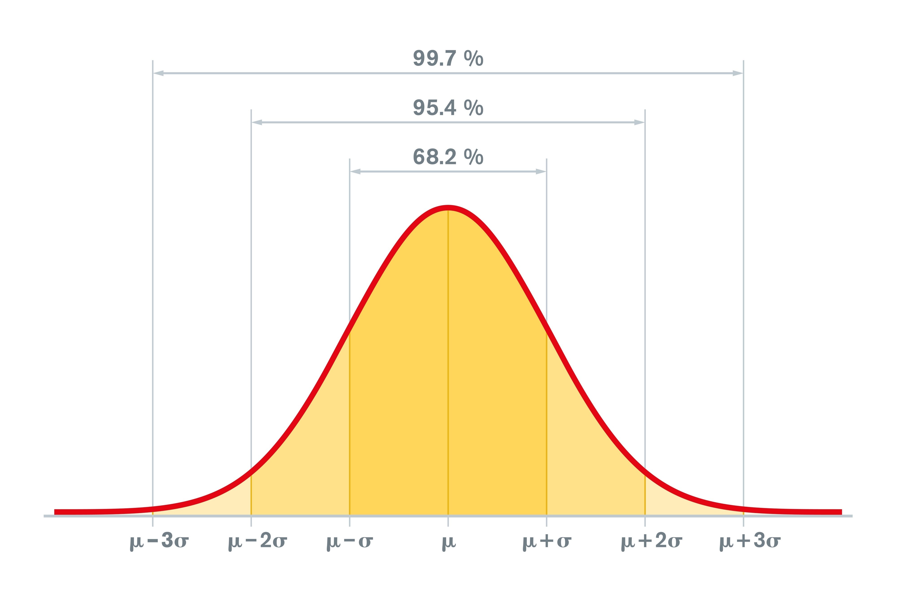

# Định lý giới hạn trung tâm (Central Limit Theorem - CLT)

Phép màu toán học cho phép bạn tìm ra trật tự trong sự hỗn loạn và đưa ra dự đoán từ bất kỳ phân phối dữ liệu nào.

## Giới thiệu
**Định lý giới hạn trung tâm (CLT)** được xem là một trong những khái niệm sâu sắc nhất trong thống kê. Về bản chất, nó giải thích hiện tượng rằng tổng (hoặc trung bình) của nhiều biến ngẫu nhiên độc lập, lấy từ bất kỳ phân phối nào, sẽ có xu hướng tuân theo một đường cong hình chuông (phân phối chuẩn - Normal Distribution), bất kể hình dạng ban đầu của phân phối tổng thể.

### Ví dụ trực quan (Explain Like I'm 5)
Hãy tưởng tượng bạn có một túi Lego khổng lồ với đủ mọi hình dạng và kích thước (đây là tổng thể - population). Nếu bạn lấy ra một miếng Lego, kích thước của nó có thể là bất kỳ.

Tuy nhiên, nếu bạn lấy 100 nắm Lego, đếm số miếng trong mỗi nắm và tính trung bình cho từng nắm, thì các giá trị "trung bình" này sẽ tạo thành một đường cong chuông mượt mà, có thể dự đoán được.

Các trung bình của các mẫu ngẫu nhiên có xu hướng tập trung quanh một giá trị điển hình, giúp ta có thể đưa ra dự đoán lớn về toàn bộ tổng thể, ngay cả khi dữ liệu ban đầu rất hỗn loạn.

## Khái niệm cốt lõi
CLT phát biểu rằng với một biến ngẫu nhiên $X$ từ một tổng thể có trung bình $\mu$ và độ lệch chuẩn $\sigma$, thì phân phối của trung bình mẫu ($\bar{X}$) sẽ tiến dần đến phân phối chuẩn khi kích thước mẫu $n$ tăng lên.

### Bản chất của sự chuyển đổi:

* **Bất kể Tổng thể là gì:** Dù dữ liệu gốc của bạn có phân phối lệch trái, lệch phải, phân phối đều (Uniform), hay phân phối nhị thức (Tung đồng xu) đầy góc cạnh...
* **Hành động lấy mẫu ($n \ge 30$):** Khi bạn liên tục lấy ra các mẫu có kích thước $n$ và chỉ tính **Giá trị trung bình ($\bar{X}$)** của từng mẫu đó.
* **Kết quả kỳ diệu:** Tập hợp tất cả các giá trị trung bình mẫu này sẽ tự động triệt tiêu các góc cạnh cực đoan, bo tròn lại và tạo thành một **Phân phối chuẩn (Normal Distribution)** hoàn hảo.

> **Câu thần chú:** Tổng thể gốc có thể "quái dị", nhưng **phân phối của các trung bình mẫu** thì luôn luôn "gầy dựng" nên một hình chuông!

### Mục tiêu học tập chính:
1. Hiểu tại sao kích thước mẫu ($n$) lại quan trọng để CLT phát huy tác dụng.
2. Nhận biết cách sai số chuẩn (standard error) thay đổi theo $n$.
3. Nắm vững công thức Z-score trong bối cảnh CLT.

## Định nghĩa chính thức & Toán học
Khi kích thước mẫu ($n$) đủ lớn, phân phối của các trung bình mẫu ($\bar{X}$) từ một tổng thể có trung bình $\mu$ và độ lệch chuẩn $\sigma$ sẽ tuân theo:

$$\bar{X}_n \xrightarrow{d} \mathcal{N}\left(\mu, \frac{\sigma^2}{n}\right)$$

Để tính xác suất của một giá trị trung bình mẫu cụ thể, ta chuyển nó về Z-score chuẩn hóa:

$$Z = \frac{\bar{X} - \mu}{\sigma / \sqrt{n}} \sim \mathcal{N}(0,1)$$

### Phân tích các tham số:
* **Trung bình của phân phối lấy mẫu:** $\mu_{\bar{X}} = \mu$  
  Trung bình của các trung bình mẫu bằng đúng trung bình của tổng thể.

* **Sai số chuẩn (Standard Error):** $SE = \sigma / \sqrt{n}$  
  Độ phân tán của các trung bình mẫu (chính là độ lệch chuẩn của phân phối lấy mẫu).

### Bản chất của mẫu số - Sai số chuẩn (Standard Error - SE):

* **$\sigma$ (Độ lệch chuẩn tổng thể):** Đại diện cho độ nhiễu, độ biến động tự nhiên của thế giới. Thế giới càng hỗn loạn, $\sigma$ càng lớn.
* **$\sqrt{n}$ (Kích thước mẫu):** Đại diện cho "lượng thông tin" bạn thu thập được.
* **Tỷ số $\sigma / \sqrt{n}$ nói lên điều gì?** Khi bạn tăng kích thước mẫu $n$, mẫu số $\sqrt{n}$ sẽ lớn lên. Khi mẫu số lớn lên, toàn bộ giá trị $SE$ sẽ **nhỏ lại**.

> **Insight thực tế:** Mẫu càng lớn ($n$ càng to), các trung bình mẫu càng ít bị nhảy lung tung, chúng sẽ co cụm cực kỳ sát xung quanh trung bình thật $\mu$. Đó là lý do tại sao các cuộc khảo sát lớn luôn đáng tin cậy hơn khảo sát nhỏ!

## Các giả định quan trọng
CLT chỉ áp dụng khi các điều kiện sau được thỏa mãn:

1. **Tính độc lập:** Các giá trị trong mẫu phải độc lập. Thông thường, kích thước mẫu nên nhỏ hơn 10% tổng thể.
2. **Lấy mẫu ngẫu nhiên:** Dữ liệu phải được chọn ngẫu nhiên từ tổng thể.
3. **Phương sai hữu hạn:** Tổng thể phải có phương sai hữu hạn $\sigma^2$ (điều này đúng với hầu hết dữ liệu thực tế).
4. **Kích thước mẫu ($n$):** Mẫu phải đủ lớn. Quy tắc phổ biến là $n \geq 30$.

## Bản chất của "Con số kỳ diệu $n = 30$" trong kỷ nguyên Big Data/AI

Quy tắc cổ điển nói rằng $n \ge 30$ là đủ. Nhưng dưới góc nhìn kỹ thuật, bạn cần phân biệt rõ:

* **Khi nào $n < 30$ vẫn dùng được?** Khi tổng thể ban đầu đã có dạng hình chuông hoặc đối xứng sẵn. Lúc này, thậm chí $n = 5$ hay $n = 10$, phân phối của trung bình mẫu đã chuẩn hóa rất đẹp rồi.
* **Khi nào $n = 30$ vẫn chưa đủ?** Khi tổng thể ban đầu bị **lệch cực đoan (Highly Skewed)** hoặc có rất nhiều giá trị ngoại lai (Outliers) dữ dội (ví dụ: Phân phối thu nhập, phân phối lượt click trên web). Lúc này, bạn có thể cần $n = 100$ hoặc $n = 500$ thì đồ thị mới hội tụ về hình chuông được.

## Ứng dụng thực tế
Tại sao CLT lại cực kỳ quan trọng trong AI và Data Science?

1. **A/B Testing:** So sánh tỷ lệ chuyển đổi giữa các nhóm (ví dụ: giao diện website) dựa vào CLT để kiểm tra ý nghĩa thống kê.
2. **Machine Learning:** Huấn luyện mô hình (đặc biệt Neural Networks) sử dụng trung bình gradient theo batch — các giá trị này tuân theo CLT, giúp tối ưu ổn định.
3. **Kiểm soát chất lượng:** Nhà máy dùng CLT để kiểm tra mẫu nhỏ thay vì toàn bộ sản phẩm.
4. **Monte Carlo Simulation:** Mô phỏng hàng nghìn kịch bản ngẫu nhiên để ước lượng rủi ro hoặc kết quả.

### Deep Dive: Ứng dụng sống còn của CLT trong AI & Data Science

Hãy làm rõ hơn phần ứng dụng để thấy CLT không chỉ là lý thuyết trên giấy:

#### Vì sao Batch Size trong Deep Learning lại hoạt động ổn định?

Khi huấn luyện các mạng Neural Network nặng đô (như LLM hay CNN), chúng ta dùng **Mini-batch Gradient Descent**.

* Thay vì tính toán đạo hàm (gradient) cho toàn bộ hàng tỷ dữ liệu ($N$), ta lấy ngẫu nhiên một batch gồm $n = 32$ hoặc $n = 64$ dòng để tính trung bình gradient.
* Nhờ có CLT, **trung bình gradient của các batch** này sẽ xấp xỉ phân phối chuẩn xung quanh gradient thật của toàn bộ hệ thống. Điều này giúp hướng đi của thuật toán tối ưu (như Adam, SGD) không bị hỗn loạn mà hội tụ mượt mà về đích. 

#### Bản chất toán học của Quy tắc $3\sigma$ (68 - 95 - 99.7) trong Ví dụ 2

Ở Ví dụ 2 của bạn, kết quả ra xác suất **68.27%**. Hãy thêm phần giải thích quy tắc thực nghiệm này để việc học thuộc trở nên dễ dàng:

> **Quy tắc thực nghiệm (Empirical Rule) của phân phối chuẩn:**
> * Khoảng $\pm 1 SE$ chứa **68.27%** dữ liệu mẫu (Chính là kết quả Ví dụ 2 của bạn: $P(-1 < Z < 1)$).
> * Khoảng $\pm 2 SE$ chứa **95.45%** dữ liệu mẫu.
> * Khoảng $\pm 3 SE$ chứa **99.73%** dữ liệu mẫu.
> 
> 

## Ví dụ minh họa

### Ví dụ: Bài toán ước lượng tải trọng thang máy (Ứng dụng CLT)

**Bối cảnh:** Một thang máy trong tòa nhà công nghệ có sức chứa tối đa là **1550 kg** và chỉ cho phép tối đa **10 người** vào cùng lúc. Giả sử trọng lượng của toàn bộ cư dân trong tòa nhà (**Tổng thể**) có trung bình $\mu = 150 \text{ kg}$ và độ lệch chuẩn $\sigma = 20 \text{ kg}$ (Phân phối gốc có thể bị lệch vì có người gầy người béo).

**Câu hỏi:** Xác suất để một nhóm ngẫu nhiên gồm $n = 10$ người bước vào thang máy làm **quá tải** thang máy là bao nhiêu?

#### Lời giải từng bước:

1. **Phân tích điều kiện quá tải:**
Thang máy quá tải khi tổng trọng lượng $> 1550 \text{ kg}$, tương đương với việc **trọng lượng trung bình của 10 người đó** vượt quá:

$$\bar{X} > \frac{1550}{10} = 155 \text{ kg}$$

2. **Áp dụng CLT để tính Sai số chuẩn ($SE$):**
Dù phân phối trọng lượng gốc không chuẩn, nhưng theo CLT, trọng lượng trung bình của nhóm 10 người sẽ tiến về phân phối chuẩn với:

$$SE = \frac{\sigma}{\sqrt{n}} = \frac{20}{\sqrt{10}} \approx \frac{20}{3.162} \approx 6.32 \text{ kg}$$

3. **Tính Z-score cho mốc 155 kg:**

$$Z = \frac{\bar{X} - \mu}{SE} = \frac{155 - 150}{6.32} = \frac{5}{6.32} \approx 0.79$$

4. **Tính xác suất vượt tải:**
Tra bảng Z để tìm diện tích phần nằm bên phải $Z = 0.79$:

$$P(\bar{X} > 155) = P(Z > 0.79) = 1 - P(Z < 0.79) \approx 1 - 0.7852 = 0.2148 \text{ (21.48\%)}$$

* **Kết luận của nhà kỹ nghệ:** Tỷ lệ quá tải lên tới **21.48%** là quá nguy hiểm. Kỹ sư vận hành cần phải hạ số người tối đa xuống 9 người hoặc nâng mức tải trọng của thang máy lên để đảm bảo an toàn!

### Ví dụ 2: Tính xác suất

Tính xác suất trung bình mẫu nằm trong khoảng từ 148 đến 152:

1. **Tính Z cho 148:**  
   $Z = (148 - 150) / 2 = -1.0$

2. **Tính Z cho 152:**  
   $Z = (152 - 150) / 2 = +1.0$

3. **Tra bảng Z:**  
   Diện tích giữa $-1$ và $+1$

4. **Kết quả xác suất:**  
   $P(-1 < Z < 1) = 0.6827$ (**68.27%**)