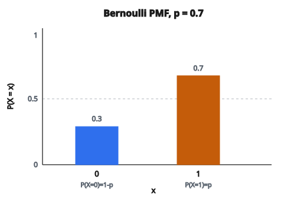

# PMF Bernoulli và các moment

## Phân phối Bernoulli là gì

Phân phối Bernoulli là phân phối xác suất rời rạc đơn giản nhất. Nó mô hình **một phép thử** với đúng **hai kết quả**: thành công (1) hoặc thất bại (0).

Mang tên nhà toán học Thụy Sĩ Jacob Bernoulli, phân phối này là viên gạch cho nhiều phân phối khác, gồm Binomial, Geometric và Negative Binomial.

## Ví dụ thực tế

Nhiều tình huống thực tế tuân theo phân phối Bernoulli:

* Tung đồng xu (ngửa hoặc sấp)
* Bệnh nhân đáp ứng điều trị (đáp ứng hoặc không)
* Người xem website bấm quảng cáo (bấm hoặc không)
* Sản phẩm lỗi (lỗi hoặc không)
* Học sinh đậu kỳ thi (đậu hoặc rớt)
* Email là spam (spam hoặc không)

Mọi tình huống có kết quả nhị phân và xác suất thành công cố định đều có thể mô hình bằng Bernoulli.

## Tham số $p$

Phân phối Bernoulli có một tham số:

$$
\begin{aligned}
p &:\ P(X = 1),\ \text{xác suất thành công}, \\
q = 1 - p &:\ P(X = 0),\ \text{xác suất thất bại}.
\end{aligned}
$$

**Ràng buộc:**

* $0 \leq p \leq 1$
* $p$ và $q$ phải cộng bằng 1

## Hàm khối xác suất (PMF)

**PMF** cho xác suất của từng kết quả:

$$
P(X = x) = p^x (1-p)^{1-x}
$$

với $x \in \{0, 1\}$.

**Khai triển công thức:**

Khi $x = 1$ (thành công):

$$
P(X = 1) = p^1 (1-p)^{1-1} = p \cdot (1-p)^0 = p \cdot 1 = p
$$

Khi $x = 0$ (thất bại):

$$
P(X = 0) = p^0 (1-p)^{1-0} = 1 \cdot (1-p) = 1 - p
$$

## Ký hiệu PMF thay thế

PMF cũng có thể viết từng khúc:

$$
P(X = x) = \begin{cases}
p & \text{nếu } x = 1 \\
1 - p & \text{nếu } x = 0 \\
0 & \text{nếu khác}
\end{cases}
$$

Hai cách viết tương đương và đều được dùng phổ biến.

## Ví dụ số: tung đồng xu cân

**Thiết lập:** Đồng xu cân có $p = 0.5$ cho mặt ngửa.

**Giá trị PMF:**

* $P(X = 1) = 0.5$ (xác suất ngửa)
* $P(X = 0) = 1 - 0.5 = 0.5$ (xác suất sấp)

**Kiểm tra:** $P(X = 0) + P(X = 1) = 0.5 + 0.5 = 1$

## Ví dụ số: đồng xu lệch

**Thiết lập:** Đồng xu lệch có $p = 0.7$ cho mặt ngửa.

**Giá trị PMF:**

* $P(X = 1) = 0.7$ (xác suất ngửa)
* $P(X = 0) = 1 - 0.7 = 0.3$ (xác suất sấp)

**Dùng công thức:**

$$
\begin{aligned}
P(X = 1) &= 0.7^{1} \cdot 0.3^{0} = 0.7 \cdot 1 = 0.7 \\
P(X = 0) &= 0.7^{0} \cdot 0.3^{1} = 1 \cdot 0.3 = 0.3
\end{aligned}
$$

::: {#fig-59-bernoulli-pmf fig-cap="Bernoulli(p = 0.7): P(X = 1) = p = 0.7 và P(X = 0) = 1 − p = 0.3; hai khối cộng bằng 1." fig-alt="Hai cột PMF Bernoulli với p = 0.7: P(X = 0) = 0.3 và P(X = 1) = 0.7."}
{fig-align="center"}
:::

## Ví dụ số: tỷ lệ bấm quảng cáo

**Thiết lập:** Quảng cáo có tỷ lệ bấm 3%, nên $p = 0.03$.

**Giá trị PMF:**

* $P(X = 1) = 0.03$ (xác suất người dùng bấm)
* $P(X = 0) = 0.97$ (xác suất không bấm)

Với mọi người dùng xem quảng cáo một lần, xác suất họ bấm là 3%.

## Kỳ vọng (trung bình)

Kỳ vọng của biến ngẫu nhiên Bernoulli là:

$$
\mathbb{E}[X] = \sum_{x} x \cdot P(X = x) = 0 \cdot (1-p) + 1 \cdot p = p
$$

Trung bình đúng bằng xác suất thành công.

**Diễn giải:** Nếu lặp phép thử nhiều lần, kết quả trung bình hội tụ về $p$.

**Ví dụ:** Đồng xu cân ($p = 0.5$) có kỳ vọng $0.5$. Qua nhiều lần tung, khoảng một nửa sẽ là ngửa.

## Phương sai

Phương sai đo độ phân tán của kết quả:

$$
\operatorname{Var}(X) = \mathbb{E}[X^2] - (\mathbb{E}[X])^2
$$

Trước hết tính $\mathbb{E}[X^2]$:

$$
\mathbb{E}[X^2] = 0^2 \cdot (1-p) + 1^2 \cdot p = p
$$

Lưu ý $\mathbb{E}[X^2] = \mathbb{E}[X] = p$ vì $X$ chỉ nhận 0 và 1.

Do đó:

$$
\operatorname{Var}(X) = p - p^2 = p(1-p)
$$

## Hiểu phương sai

Phương sai $p(1-p)$ cực đại khi $p = 0.5$:

$$
\operatorname{Var}(X) = 0.5 \times 0.5 = 0.25
$$

Điều này hợp lý: bất định lớn nhất khi thành công và thất bại cùng xác suất.

Khi $p$ tiến tới 0 hoặc 1, phương sai tiến tới 0:

* Nếu $p = 0.01$: $\operatorname{Var}(X) = 0.01 \times 0.99 = 0.0099$ (gần như luôn 0)
* Nếu $p = 0.99$: $\operatorname{Var}(X) = 0.99 \times 0.01 = 0.0099$ (gần như luôn 1)

## Độ lệch chuẩn

Độ lệch chuẩn là:

$$
\sigma = \sqrt{\operatorname{Var}(X)} = \sqrt{p(1-p)}
$$

**Ví dụ:** Với $p = 0.5$:

$$
\sigma = \sqrt{0.5 \times 0.5} = \sqrt{0.25} = 0.5
$$

## Hàm phân phối tích lũy (CDF)

**CDF** cho xác suất $X$ nhỏ hơn hoặc bằng một giá trị:

$$
F(x) = P(X \leq x) = \begin{cases}
0 & \text{nếu } x < 0 \\
1 - p & \text{nếu } 0 \leq x < 1 \\
1 & \text{nếu } x \geq 1
\end{cases}
$$

CDF là hàm bậc thang, nhảy tại $x = 0$ và $x = 1$.

## Hàm sinh moment

Hàm sinh moment (MGF) là:

$$
M_X(t) = \mathbb{E}[e^{tX}] = e^{t \cdot 0} (1-p) + e^{t \cdot 1} p = (1-p) + p e^{t}
$$

MGF dùng để suy ra các moment:

* $M'_X(0) = \mathbb{E}[X] = p$
* $M''_X(0) = \mathbb{E}[X^2] = p$

## Liên hệ với phân phối khác

**Phân phối Binomial:**

Tổng $n$ phép thử Bernoulli độc lập cùng $p$ tuân theo $\mathrm{Binomial}(n, p)$:

$$
Y = \sum_{i=1}^{n} X_i \sim \mathrm{Binomial}(n, p)
$$

Bernoulli là trường hợp riêng: $\mathrm{Binomial}(1, p)$.

**Phân phối Geometric:**

Số phép thử Bernoulli đến lần thành công đầu tiên tuân theo phân phối Geometric.

**Phân phối Beta:**

Beta là conjugate prior cho tham số Bernoulli $p$ trong suy diễn Bayes.

## Nhiều phép thử Bernoulli độc lập

Nếu $X_1, X_2, \ldots, X_n$ độc lập, mỗi cái $\mathrm{Bernoulli}(p)$:

**Tổng:**

$$
\sum_{i=1}^{n} X_i \sim \mathrm{Binomial}(n, p)
$$

**Trung bình mẫu:**

$$
\bar{X} = \frac{1}{n} \sum_{i=1}^{n} X_i
$$

$\mathbb{E}[\bar{X}] = p$ và $\operatorname{Var}(\bar{X}) = \frac{p(1-p)}{n}$.

Khi $n \to \infty$, $\bar{X} \to p$ (luật số lớn).

## Ước lượng hợp lý cực đại

Cho $n$ quan sát $x_1, x_2, \ldots, x_n$ từ phân phối Bernoulli, MLE của $p$ là:

$$
\hat{p} = \frac{1}{n} \sum_{i=1}^{n} x_i = \frac{\text{số lần thành công}}{n}
$$

Đây đúng là tỷ lệ thành công trong mẫu.

**Suy ra:**

Hàm hợp lý:

$$
L(p) = \prod_{i=1}^{n} p^{x_i}(1-p)^{1-x_i} = p^{\sum x_i}(1-p)^{n - \sum x_i}
$$

Log-hợp lý:

$$
\ell(p) = \sum x_i \log p + (n - \sum x_i) \log(1-p)
$$

Đặt $\frac{d\ell}{dp} = 0$ rồi giải được $\hat{p} = \frac{\sum x_i}{n}$.

## Bernoulli trong machine learning

Phân phối Bernoulli xuất hiện xuyên suốt machine learning:

**Phân loại nhị phân:**
Xác suất dự đoán $\hat{p}$ chính là $P(Y = 1 \mid X)$.

**Logistic regression:**
Mô hình $p = \sigma(w^{T} x)$ với $\sigma$ là hàm sigmoid.

**Binary cross-entropy loss:**

$$
L = -[y \log \hat{p} + (1-y) \log(1-\hat{p})]
$$

Đây là âm log-hợp lý của một phân phối Bernoulli.

**Bernoulli Naive Bayes:**
Giả sử đặc trưng nhị phân và độc lập Bernoulli khi biết lớp.

**Dropout:**
Mỗi neuron được giữ với xác suất $p$, theo phân phối Bernoulli.

## Tóm tắt tính chất

* **Giá trị nhận:** $\{0, 1\}$
* **Tham số:** $p \in [0, 1]$
* **PMF:** $P(X = x) = p^x(1-p)^{1-x}$
* **Kỳ vọng:** $\mathbb{E}[X] = p$
* **Phương sai:** $\operatorname{Var}(X) = p(1-p)$
* **Độ lệch:** $\dfrac{1-2p}{\sqrt{p(1-p)}}$
* **MGF:** $M_X(t) = (1-p) + p e^{t}$

## Code

```python
import numpy as np

def bernoulli_pmf_and_moments(x, p):
    """
    Compute Bernoulli PMF and distribution moments.
    """
    x = np.asarray(x, dtype=int)
    pmf = np.where(x == 1, p, 1 - p)
    mean = float(p)
    var = float(p * (1 - p))
    return pmf, mean, var
```

<!-- SELFCHECK_BERN -->

::: {.callout-note}
## Kiểm tra nhanh
<details>
<summary>Var(X) của Bernoulli(p) bằng bao nhiêu?</summary>
$\operatorname{Var}(X) = p(1-p)$. Kỳ vọng $\mathbb{E}[X]=p$.
</details>
<details>
<summary>Khi nào Binomial suy về Bernoulli?</summary>
Khi $n=1$: $\mathrm{Binomial}(1,p)\equiv\mathrm{Bernoulli}(p)$.
</details>
:::
