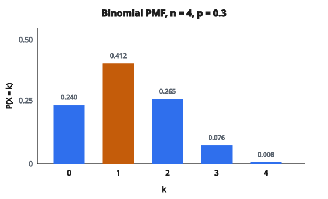

# PMF nhị thức (Binomial)

## Phân phối Binomial là gì

Phân phối Binomial mô hình **số lần thành công** trong một số phép thử độc lập cố định, mỗi phép thử có cùng xác suất thành công.

Nó trả lời: “Nếu lặp thí nghiệm $n$ lần, mỗi lần xác suất thành công $p$, xác suất có đúng $k$ lần thành công là bao nhiêu?”

## Bốn điều kiện

Biến ngẫu nhiên tuân theo Binomial khi và chỉ khi:

**1. Số phép thử cố định ($n$)**

Thí nghiệm được lặp một số lần đã định trước.

**2. Các phép thử độc lập**

Kết quả một lần không ảnh hưởng các lần khác.

**3. Hai kết quả mỗi lần**

Mỗi phép thử cho “thành công” hoặc “thất bại.”

**4. Xác suất không đổi ($p$)**

Xác suất thành công giống nhau mọi lần.

Nếu một điều kiện bị vi phạm, mô hình Binomial có thể không còn phù hợp.

## Ký hiệu và tham số

Viết $X \sim \mathrm{Binomial}(n, p)$ nghĩa là $X$ theo phân phối Binomial với:

$$
\begin{aligned}
n &:\ \text{số phép thử (số nguyên dương)}, \\
p &:\ \text{xác suất thành công mỗi lần }(0 \leq p \leq 1).
\end{aligned}
$$

Biến $X$ nhận các giá trị $0, 1, 2, \ldots, n$.

## Hàm khối xác suất (PMF)

PMF cho xác suất đúng $k$ lần thành công:

$$
P(X = k) = \binom{n}{k} p^k (1-p)^{n-k}
$$

với $k \in \{0, 1, 2, \ldots, n\}$.

**Từng thành phần:**

* $\binom{n}{k} = \dfrac{n!}{k!(n-k)!}$ là hệ số nhị thức, đếm số cách chọn $k$ phép thử thành công
* $p^k$ là xác suất $k$ lần thành công
* $(1-p)^{n-k}$ là xác suất $n-k$ lần thất bại

## Hiểu hệ số nhị thức

Hạng $\binom{n}{k}$ đếm số cách xếp $k$ lần thành công trong $n$ phép thử.

**Ví dụ:** $n = 4$ phép thử và $k = 2$ lần thành công:

$$
\binom{4}{2} = \frac{4!}{2! \cdot 2!} = \frac{24}{2 \cdot 2} = 6
$$

Sáu mẫu hình: SSFF, SFSF, SFFS, FSSF, FSFS, FFSS

Mỗi mẫu có xác suất $p^2(1-p)^2$, và có đúng 6 mẫu.

## Ví dụ số: tung đồng xu

**Thiết lập:** Tung đồng xu cân ($p = 0.5$) 5 lần. Xác suất đúng 3 mặt ngửa?

**Lời giải:**

$n = 5$, $k = 3$, $p = 0.5$

$$
\begin{aligned}
P(X = 3)
&= \binom{5}{3} (0.5)^3 (0.5)^2 \\
&= \frac{5!}{3! \cdot 2!} \cdot 0.125 \cdot 0.25 \\
&= 10 \cdot 0.03125 = 0.3125
\end{aligned}
$$

Xác suất đúng 3 mặt ngửa là 31.25%.

## Tính cả PMF

**Thiết lập:** $n = 4$, $p = 0.3$

**Với từng $k$:**

$$
\begin{aligned}
P(X = 0) &= \binom{4}{0}(0.3)^0(0.7)^4 = 1 \cdot 1 \cdot 0.2401 = 0.2401 \\
P(X = 1) &= \binom{4}{1}(0.3)^1(0.7)^3 = 4 \cdot 0.3 \cdot 0.343 = 0.4116 \\
P(X = 2) &= \binom{4}{2}(0.3)^2(0.7)^2 = 6 \cdot 0.09 \cdot 0.49 = 0.2646 \\
P(X = 3) &= \binom{4}{3}(0.3)^3(0.7)^1 = 4 \cdot 0.027 \cdot 0.7 = 0.0756 \\
P(X = 4) &= \binom{4}{4}(0.3)^4(0.7)^0 = 1 \cdot 0.0081 \cdot 1 = 0.0081
\end{aligned}
$$

**Kiểm tra:** $0.2401 + 0.4116 + 0.2646 + 0.0756 + 0.0081 = 1.0$

::: {#fig-60-binomial-pmf fig-cap="Binomial(n = 4, p = 0.3): P(X = k) lệch phải; mode tại k = 1 (0.4116) và tổng năm khối bằng 1." fig-alt="Năm cột PMF Binomial n = 4, p = 0.3 cho k = 0 đến 4; đỉnh tại k = 1 với xác suất 0.4116."}
{fig-align="center"}
:::

## Hàm phân phối tích lũy (CDF)

CDF cho xác suất **nhiều nhất** $k$ lần thành công:

$$
F(k) = P(X \leq k) = \sum_{i=0}^{k} \binom{n}{i} p^i (1-p)^{n-i}
$$

**Tính chất:**

* $F(k)$ là hàm bậc thang, tăng tại mỗi số nguyên
* $F(-1) = 0$ (quy ước)
* $F(n) = 1$

## Tính giá trị CDF

**Thiết lập:** $n = 4$, $p = 0.3$ (tiếp ví dụ trên)

$$
\begin{aligned}
F(0) &= P(X \leq 0) = 0.2401 \\
F(1) &= P(X \leq 1) = 0.2401 + 0.4116 = 0.6517 \\
F(2) &= P(X \leq 2) = 0.6517 + 0.2646 = 0.9163 \\
F(3) &= P(X \leq 3) = 0.9163 + 0.0756 = 0.9919 \\
F(4) &= P(X \leq 4) = 0.9919 + 0.0081 = 1.0
\end{aligned}
$$

## Dùng CDF cho xác suất theo khoảng

CDF giúp tính xác suất trên một khoảng:

**$P(X > k)$:**

$$
P(X > k) = 1 - F(k) = 1 - P(X \leq k)
$$

**$P(X \geq k)$:**

$$
P(X \geq k) = 1 - F(k-1) = 1 - P(X \leq k-1)
$$

**$P(a \leq X \leq b)$:**

$$
P(a \leq X \leq b) = F(b) - F(a-1)
$$

## Ví dụ số: xác suất theo khoảng

**Thiết lập:** $n = 10$, $p = 0.4$. Tìm $P(3 \leq X \leq 6)$.

$$
\begin{aligned}
P(3 \leq X \leq 6)
&= F(6) - F(2) \\
&= P(X \leq 6) - P(X \leq 2) \\
&= \sum_{k=0}^{6} \binom{10}{k}(0.4)^k(0.6)^{10-k} - \sum_{k=0}^{2} \binom{10}{k}(0.4)^k(0.6)^{10-k}
\end{aligned}
$$

Tính được $F(6) \approx 0.9452$ và $F(2) \approx 0.1673$

$$
P(3 \leq X \leq 6) \approx 0.9452 - 0.1673 = 0.7779
$$

## Kỳ vọng (trung bình)

Số lần thành công kỳ vọng là:

$$
\mathbb{E}[X] = np
$$

**Suy ra:**

$X = X_1 + X_2 + \ldots + X_n$ với mỗi $X_i \sim \mathrm{Bernoulli}(p)$

Theo tuyến tính của kỳ vọng:

$$
\mathbb{E}[X] = \mathbb{E}[X_1] + \mathbb{E}[X_2] + \ldots + \mathbb{E}[X_n] = p + p + \ldots + p = np
$$

**Ví dụ:** 100 lần tung đồng xu với $p = 0.5$, kỳ vọng $100 \times 0.5 = 50$ mặt ngửa.

## Phương sai

Phương sai của số lần thành công là:

$$
\operatorname{Var}(X) = np(1-p)
$$

**Suy ra:**

Vì $X_1, X_2, \ldots, X_n$ độc lập:

$$
\operatorname{Var}(X) = \operatorname{Var}(X_1) + \ldots + \operatorname{Var}(X_n) = np(1-p)
$$

**Độ lệch chuẩn:**

$$
\sigma = \sqrt{np(1-p)}
$$

**Ví dụ:** $n = 100$, $p = 0.5$:

$$
\begin{aligned}
\operatorname{Var}(X) &= 100 \times 0.5 \times 0.5 = 25 \\
\sigma &= \sqrt{25} = 5
\end{aligned}
$$

## Mode của phân phối

Mode (giá trị có xác suất lớn nhất) xấp xỉ:

$$
\mathrm{mode} \approx \lfloor (n+1)p \rfloor \quad \text{hoặc} \quad \lceil (n+1)p \rceil - 1
$$

Khi $(n+1)p$ là số nguyên, có thể có hai mode.

**Ví dụ:** $n = 10$, $p = 0.3$

$(n+1)p = 11 \times 0.3 = 3.3$

Mode $= \lfloor 3.3 \rfloor = 3$

Số lần thành công có xác suất lớn nhất là 3.

## Dạng của phân phối

Dạng phụ thuộc $p$:

**$p < 0.5$:** lệch phải (đuôi kéo về giá trị lớn)

**$p = 0.5$:** đối xứng

**$p > 0.5$:** lệch trái (đuôi kéo về giá trị nhỏ)

Khi $n$ tăng, phân phối đối xứng hơn và gần hình chuông (định lý giới hạn trung tâm).

## Xấp xỉ chuẩn

Với $n$ lớn, Binomial có thể xấp xỉ bằng phân phối chuẩn:

$$
X \approx \mathcal{N}\bigl(np,\ np(1-p)\bigr)
$$

**Quy tắc thực hành:** xấp xỉ hợp lý khi

* $np \geq 10$ và $n(1-p) \geq 10$

**Hiệu chỉnh liên tục:** Binomial rời rạc còn chuẩn liên tục:

$$
P(X \leq k) \approx \Phi\left(\frac{k + 0.5 - np}{\sqrt{np(1-p)}}\right)
$$

với $\Phi$ là CDF chuẩn tắc.

## Xấp xỉ Poisson

Với $n$ lớn và $p$ nhỏ (để $np = \lambda$ vừa phải):

$$
\mathrm{Binomial}(n, p) \approx \mathrm{Poisson}(\lambda = np)
$$

**Quy tắc thực hành:** tốt khi $n \geq 20$ và $p \leq 0.05$.

Hữu ích vì xác suất Poisson dễ tính hơn.

## Liên hệ với Bernoulli

Binomial là tổng các phép thử Bernoulli độc lập:

$$
X = \sum_{i=1}^{n} X_i
$$

với $X_i \sim \mathrm{Bernoulli}(p)$ độc lập.

Trường hợp riêng: $\mathrm{Binomial}(1, p) = \mathrm{Bernoulli}(p)$

## Tổng hai biến Binomial

Nếu $X \sim \mathrm{Binomial}(n_1, p)$ và $Y \sim \mathrm{Binomial}(n_2, p)$ độc lập, **cùng** $p$:

$$
X + Y \sim \mathrm{Binomial}(n_1 + n_2, p)
$$

Tính chất này không còn nếu các $p$ khác nhau.

## Ứng dụng trong machine learning

**A/B testing:**

So sánh tỷ lệ chuyển đổi giữa hai phiên bản. Hành động mỗi người dùng là Bernoulli; tổng chuyển đổi là Binomial.

**Metric phân loại:**

Số true positive trong $n$ dự đoán tuân theo Binomial nếu các dự đoán độc lập.

**Bootstrap sampling:**

Số lần một mẫu cụ thể xuất hiện xấp xỉ $\mathrm{Binomial}(n, 1/n) \approx \mathrm{Poisson}(1)$.

**Dropout:**

Số neuron được giữ trong một lớp tuân theo phân phối Binomial.

## Ước lượng hợp lý cực đại

Cho quan sát từ $\mathrm{Binomial}(n, p)$ với $n$ đã biết, MLE của $p$ là:

$$
\hat{p} = \frac{\bar{x}}{n}
$$

với $\bar{x}$ là trung bình mẫu của các số đếm quan sát được.

Nếu chỉ quan sát một giá trị $x$:

$$
\hat{p} = \frac{x}{n}
$$

## Tóm tắt tính chất

* **Giá trị nhận:** $\{0, 1, 2, \ldots, n\}$
* **Tham số:** $n \in \{1, 2, \ldots\}$, $p \in [0, 1]$
* **PMF:** $P(X = k) = \binom{n}{k}p^k(1-p)^{n-k}$
* **Kỳ vọng:** $\mathbb{E}[X] = np$
* **Phương sai:** $\operatorname{Var}(X) = np(1-p)$
* **Độ lệch:** $\dfrac{1-2p}{\sqrt{np(1-p)}}$
* **MGF:** $M_X(t) = [(1-p) + p e^{t}]^n$

## Code

```python
from scipy.special import comb

def binomial_pmf_cdf(n, p, k):
    """
    Compute Binomial PMF and CDF.
    """
    pmf = comb(n, k, exact=False) * (p ** k) * ((1 - p) ** (n - k))
    cdf = 0.0
    for i in range(k + 1):
        cdf += comb(n, i, exact=False) * (p ** i) * ((1 - p) ** (n - i))
    return float(pmf), float(cdf)
```

<!-- auto-self-check -->

::: {.callout-note}
## Kiểm tra nhanh
<details>
<summary>Ý chính của bài «PMF nhị thức (Binomial)» là gì?</summary>
Phân phối Binomial mô hình **số lần thành công** trong một số phép thử độc lập cố định, mỗi phép thử có cùng xác suất thành công.
</details>
<details>
<summary>Công thức / quan hệ cốt lõi trong bài là gì?</summary>
$$\begin{aligned} n &:\ \text{số phép thử (số nguyên dương)}, \\ p &:\ \text{xác suất thành công mỗi lần }(0 \leq p \leq 1). \end{aligned}$$
</details>
:::
