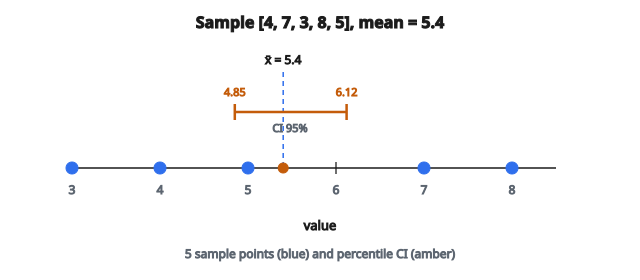

# Bootstrap: trung bình và khoảng tin cậy

## Bootstrapping là gì

Bootstrapping là kỹ thuật **lấy mẫu lại** (resampling) mạnh, cho phép ước lượng độ biến thiên của một thống kê mà không cần giả định mạnh về phân phối gốc.

Ý tưởng cốt lõi: coi mẫu hiện có như thể nó là quần thể, rồi lấy mẫu **có hoàn lại** nhiều lần để xem thống kê có thể dao động ra sao.

Bradley Efron đặt tên năm 1979, từ thành ngữ “pulling yourself up by your bootstraps”: phương pháp tạo thông tin dường như từ không.

## Vì sao dùng bootstrap

**Vấn đề:** Có một mẫu và muốn biết ước lượng (ví dụ trung bình) sẽ dao động bao nhiêu nếu thu thập dữ liệu mới.

**Cách truyền thống:** Dùng công thức giả định dữ liệu theo một phân phối cụ thể (thường là chuẩn).

**Cách bootstrap:** Mô phỏng quá trình lấy mẫu bằng cách lấy mẫu lại từ dữ liệu.

**Ưu điểm:**

* Dùng được cho mọi thống kê (trung bình, trung vị, tương quan, hệ số hồi quy)
* Giả định tối thiểu về phân phối dữ liệu
* Cho khoảng tin cậy khi công thức không có hoặc không tin cậy
* Ổn với mẫu nhỏ

## Quy trình bootstrap

**Bước 1:** Bắt đầu với mẫu gốc cỡ $n$

**Bước 2:** Lấy một mẫu bootstrap cỡ $n$ **có hoàn lại** từ mẫu gốc

**Bước 3:** Tính thống kê quan tâm (ví dụ trung bình) trên mẫu bootstrap đó

**Bước 4:** Lặp bước 2–3 nhiều lần (thường $B = 1000$ đến $10000$)

**Bước 5:** Phân tích phân phối của $B$ thống kê bootstrap

## Lấy mẫu có hoàn lại

**Có hoàn lại** nghĩa là mỗi quan sát có thể được chọn nhiều lần trong một mẫu bootstrap.

**Ví dụ:** Mẫu gốc = $[3, 7, 2, 9, 5]$

Một số mẫu bootstrap có thể:

* $[3, 3, 7, 2, 5]$ (3 xuất hiện hai lần, 9 không có)
* $[9, 9, 9, 7, 2]$ (9 xuất hiện ba lần)
* $[5, 2, 7, 3, 9]$ (cùng phần tử, thứ tự khác)

Mỗi mẫu bootstrap cùng cỡ với mẫu gốc nhưng có thể trùng và bỏ sót một số giá trị gốc.

## Phân phối bootstrap của trung bình

**Mục tiêu:** Ước lượng phân phối mẫu của trung bình mẫu $\bar{X}$.

**Quy trình:**

1. Mẫu gốc: $x_1, x_2, \ldots, x_n$ với trung bình $\bar{x}$
2. Với $b = 1, 2, \ldots, B$:
   * Lấy mẫu bootstrap $x_1^{\ast b}, x_2^{\ast b}, \ldots, x_n^{\ast b}$
   * Tính trung bình bootstrap: $\bar{x}^{\ast b} = \frac{1}{n}\sum_{i=1}^{n} x_i^{\ast b}$
3. Tập $\{\bar{x}^{\ast 1}, \bar{x}^{\ast 2}, \ldots, \bar{x}^{\ast B}\}$ xấp xỉ phân phối mẫu

## Ví dụ số

**Mẫu gốc:** $[4, 7, 3, 8, 5]$ ($n = 5$)

**Trung bình gốc:** $\bar{x} = (4 + 7 + 3 + 8 + 5)/5 = 27/5 = 5.4$

**Vòng bootstrap 1:**

* Mẫu bootstrap: $[7, 3, 3, 8, 4]$
* Trung bình: $(7 + 3 + 3 + 8 + 4)/5 = 25/5 = 5.0$

**Vòng bootstrap 2:**

* Mẫu bootstrap: $[5, 8, 8, 7, 3]$
* Trung bình: $(5 + 8 + 8 + 7 + 3)/5 = 31/5 = 6.2$

**Vòng bootstrap 3:**

* Mẫu bootstrap: $[4, 4, 5, 3, 7]$
* Trung bình: $(4 + 4 + 5 + 3 + 7)/5 = 23/5 = 4.6$

Sau $B = 1000$ vòng, có 1000 trung bình bootstrap để phân tích.

## Sai số chuẩn bootstrap

**Sai số chuẩn bootstrap** ước lượng độ lệch chuẩn của phân phối mẫu:

$$
\mathrm{SE}_{\mathrm{boot}} = \sqrt{\frac{1}{B-1}\sum_{b=1}^{B}(\bar{x}^{\ast b} - \bar{\bar{x}}^{\ast})^2}
$$

với $\bar{\bar{x}}^{\ast} = \frac{1}{B}\sum_{b=1}^{B}\bar{x}^{\ast b}$ là trung bình của các trung bình bootstrap.

Đại lượng này ước lượng $\bar{x}$ sẽ dao động bao nhiêu giữa các mẫu khác nhau từ quần thể.

## Khoảng tin cậy bootstrap

Có vài cách dựng khoảng tin cậy:

**1. Phương pháp percentile:**

Với CI 95%, lấy percentile 2.5 và 97.5 của các trung bình bootstrap:

$$
\mathrm{CI}_{95\%} = \bigl[\bar{x}^{\ast}_{(0.025)},\ \bar{x}^{\ast}_{(0.975)}\bigr]
$$

**2. Bootstrap cơ bản (reverse percentile):**

$$
\mathrm{CI}_{95\%} = \bigl[2\bar{x} - \bar{x}^{\ast}_{(0.975)},\ 2\bar{x} - \bar{x}^{\ast}_{(0.025)}\bigr]
$$

**3. Khoảng chuẩn:**

$$
\mathrm{CI}_{95\%} = \bigl[\bar{x} - 1.96 \cdot \mathrm{SE}_{\mathrm{boot}},\ \bar{x} + 1.96 \cdot \mathrm{SE}_{\mathrm{boot}}\bigr]
$$

## Ví dụ phương pháp percentile

**Thiết lập:** Sau 1000 vòng bootstrap, giả sử các trung bình bootstrap nằm từ 4.2 đến 6.8.

**Trung bình bootstrap đã sắp:** $\bar{x}^{\ast}_{(1)}, \bar{x}^{\ast}_{(2)}, \ldots, \bar{x}^{\ast}_{(1000)}$

**Percentile 2.5:** $\bar{x}^{\ast}_{(25)} = 4.85$ (giá trị nhỏ thứ 25)

**Percentile 97.5:** $\bar{x}^{\ast}_{(975)} = 6.12$ (giá trị nhỏ thứ 975)

**CI 95%:** $[4.85,\ 6.12]$

Ta tin 95% rằng trung bình quần thể nằm trong khoảng này.

::: {#fig-83-bootstrap-ci fig-cap="Mẫu [4, 7, 3, 8, 5] có x̄ = 5.4; CI 95% percentile [4.85, 6.12] từ 1000 trung bình bootstrap trong bài." fig-alt="Trục số với năm điểm mẫu 3, 4, 5, 7, 8, trung bình 5.4 và khoảng tin cậy 95% từ 4.85 đến 6.12."}
{fig-align="center"}
:::

## Ước lượng bias

Bootstrap ước lượng được bias của một ước lượng:

$$
\mathrm{Bias} = \bar{\bar{x}}^{\ast} - \bar{x}
$$

với:

* $\bar{\bar{x}}^{\ast}$ là trung bình các ước lượng bootstrap
* $\bar{x}$ là ước lượng trên mẫu gốc

**Ước lượng hiệu chỉnh bias:**

$$
\hat{\theta}_{\mathrm{corrected}} = \bar{x} - \mathrm{Bias} = 2\bar{x} - \bar{\bar{x}}^{\ast}
$$

Với trung bình mẫu, bias thường gần 0.

## Khoảng tin cậy BCa

Phương pháp **Bias-Corrected and Accelerated (BCa)** cải thiện percentile bằng cách chỉnh:

1. **Bias:** nếu phân phối bootstrap không tâm tại ước lượng
2. **Độ lệch (skewness):** nếu phân phối bootstrap không đối xứng

Khoảng BCa thường được khuyến nghị nhưng tính phức tạp hơn.

## Cần bao nhiêu mẫu bootstrap?

**Quy tắc thực hành:**

* Sai số chuẩn: $B = 200$ đến $500$ thường đủ
* Khoảng tin cậy: $B = 1000$ đến $10000$
* Kiểm định giả thuyết: $B = 10000$ trở lên

Nhiều mẫu bootstrap cho ước lượng ổn định hơn nhưng tốn tính hơn.

**Kiểm tra ổn định:** Chạy bootstrap hai lần với seed khác. Nếu kết quả lệch nhiều, tăng $B$.

## Tính chất của bootstrap

**Nhất quán:**

Khi cỡ mẫu $n \to \infty$, phân phối bootstrap hội tụ về phân phối mẫu thật.

**Coverage:**

Với thống kê trơn, khoảng tin cậy bootstrap đạt xấp xỉ xác suất phủ đúng.

**Hạn chế:**

* Có thể thất bại với thống kê ở biên (max, min)
* Cần quan sát trao đổi được (exchangeable)
* Có thể lệch với mẫu rất nhỏ

## Khi bootstrap hoạt động tốt

**Tốt với:**

* Thống kê trơn (trung bình, phương sai, hệ số hồi quy)
* Mẫu cỡ vừa ($n \geq 20$)
* Thống kê là hàm của phân phối thực nghiệm

**Có thể gặp vấn đề với:**

* Thống kê thứ tự cực trị (min, max)
* Mẫu rất nhỏ ($n < 10$)
* Phân phối đuôi nặng
* Chuỗi thời gian (cần block bootstrap)

## Bootstrap tham số và phi tham số

**Bootstrap phi tham số (chuẩn):**

* Lấy mẫu lại trực tiếp từ dữ liệu
* Không giả định phân phối

**Bootstrap tham số:**

1. Khớp một mô hình tham số vào dữ liệu
2. Sinh mẫu bootstrap từ mô hình đã khớp
3. Hiệu quả hơn nếu mô hình đúng

**Ví dụ:** Nếu dữ liệu trông giống chuẩn, khớp $N(\hat{\mu}, \hat{\sigma}^2)$ rồi lấy mẫu từ đó.

## Bootstrap cho thống kê khác

Cùng quy trình áp dụng cho mọi thống kê:

**Trung vị:**

* Tính trung vị mỗi mẫu bootstrap
* Phân tích phân phối các trung vị bootstrap

**Tương quan:**

* Lấy mẫu lại các cặp $(x_i, y_i)$ cùng nhau
* Tính tương quan mỗi mẫu bootstrap

**Hệ số hồi quy:**

* Lấy mẫu lại phần dư hoặc các quan sát
* Khớp lại hồi quy mỗi mẫu bootstrap

## Bootstrap so với phương pháp truyền thống

**Truyền thống (ví dụ khoảng $t$ cho trung bình):**

* Giả định phân phối chuẩn hoặc mẫu lớn
* Dùng $\bar{x} \pm t_{n-1, \alpha/2} \cdot s/\sqrt{n}$
* Công thức đơn giản

**Bootstrap:**

* Không giả định phân phối
* Dùng được cho thống kê phức tạp
* Tốn tính toán

Với trung bình và dữ liệu chuẩn, hai cách cho kết quả tương tự. Bootstrap nổi bật ở tình huống không chuẩn.

## Cân nhắc tính toán

**Bộ nhớ:** Lưu $B$ thống kê, không lưu $B$ mẫu đầy đủ

**Tốc độ:** Với trung bình, mỗi vòng bootstrap là $O(n)$

**Song song:** Các vòng bootstrap độc lập, dễ song song hóa

**Random seed:** Đặt seed để tái lập

## Ứng dụng trong machine learning

**Đánh giá mô hình:**

* Bootstrap để ước lượng độ biến thiên của lỗi dự đoán

**Tầm quan trọng đặc trưng:**

* Bootstrap để đánh giá độ ổn định của thứ hạng đặc trưng

**Ensemble:**

* Bagging dùng mẫu bootstrap để huấn luyện nhiều mô hình

**Định lượng bất định:**

* Dự đoán bootstrap cho khoảng tin cậy

## Code

```python
import numpy as np

def bootstrap_mean(x, n_bootstrap=1000, ci=0.95, rng=None):
    """
    Returns: (boot_means, lower, upper)
    """
    x = np.asarray(x)
    if rng is None:
        rng = np.random.default_rng()
    n = len(x)
    boot_means = np.zeros(n_bootstrap)
    for i in range(n_bootstrap):
        indices = rng.integers(0, n, size=n)
        boot_means[i] = x[indices].mean()
    alpha = (1 - ci) / 2
    lower = np.quantile(boot_means, alpha)
    upper = np.quantile(boot_means, 1 - alpha)
    return boot_means, lower, upper
```
