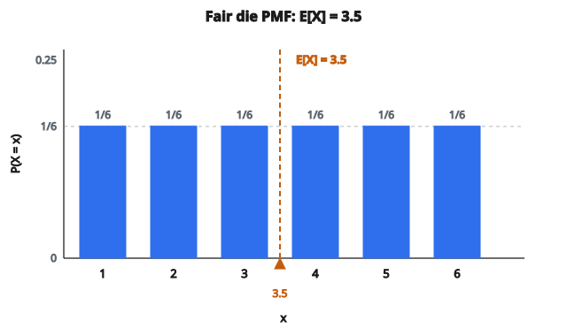

# Kỳ vọng (phân phối rời rạc)

## Kỳ vọng là gì

**Expected value** (còn gọi là expectation hoặc mean) là **trung bình dài hạn** của một biến ngẫu nhiên. Nó biểu diễn tâm của phân phối xác suất và trả lời câu hỏi: “Giá trị trung bình tôi kỳ vọng là bao nhiêu?”

Với biến ngẫu nhiên rời rạc, đó là trung bình có trọng số của mọi giá trị có thể, trong đó trọng số là các xác suất.

## Định nghĩa cho biến ngẫu nhiên rời rạc

Với biến ngẫu nhiên rời rạc $X$ nhận các giá trị $x_1, x_2, \ldots, x_n$ với xác suất $P(X = x_i)$:

$$
\mathbb{E}[X] = \sum_{i=1}^{n} x_i \cdot P(X = x_i)
$$

**Ký hiệu:** $\mathbb{E}[X]$, $\mu$, $\mu_X$, hoặc $\langle X \rangle$ đều chỉ expected value.

Expected value có thể không phải là một giá trị mà $X$ thực sự nhận được.

## Hiểu trực giác

Hình dung lặp lại thí nghiệm ngẫu nhiên rất nhiều lần:

1. Mỗi lần, quan sát một giá trị của $X$
2. Ghi lại mọi giá trị
3. Tính trung bình của tất cả giá trị đã ghi

Khi số lần lặp tiến tới vô hạn, trung bình này hội tụ về $\mathbb{E}[X]$.

Đó chính là **Law of Large Numbers**.

## Ví dụ số: xúc xắc công bằng

**Thiết lập:** Tung một xúc xắc 6 mặt công bằng. Gọi $X$ là số chấm hiện ra.

**Giá trị có thể:** $x \in \{1, 2, 3, 4, 5, 6\}$

**Xác suất:** $P(X = x) = 1/6$ cho mỗi giá trị.

**Expected value:**

$$
\begin{aligned}
\mathbb{E}[X]
&= 1 \cdot \frac{1}{6} + 2 \cdot \frac{1}{6} + 3 \cdot \frac{1}{6} + 4 \cdot \frac{1}{6} + 5 \cdot \frac{1}{6} + 6 \cdot \frac{1}{6} \\
&= \frac{1}{6}(1 + 2 + 3 + 4 + 5 + 6) = \frac{21}{6} = 3.5
\end{aligned}
$$

Expected value bằng 3.5, dù không bao giờ tung ra được 3.5.

::: {#fig-13-fair-die-expectation fig-cap="Sáu mặt xác suất đều 1/6 nên $\mathbb{E}[X] = 3.5$, nằm giữa 3 và 4 dù $X$ không nhận giá trị 3.5." fig-alt="PMF xúc xắc công bằng: sáu cột P(X=x)=1/6 tại x=1 đến 6; đường thẳng đứng đánh dấu E[X]=3.5."}
{fig-align="center"}
:::

## Ví dụ số: xúc xắc lệch

**Thiết lập:** Một xúc xắc lệch có các xác suất sau:

* $P(X = 1) = 0.1$
* $P(X = 2) = 0.1$
* $P(X = 3) = 0.1$
* $P(X = 4) = 0.1$
* $P(X = 5) = 0.2$
* $P(X = 6) = 0.4$

**Kiểm tra:** $0.1 + 0.1 + 0.1 + 0.1 + 0.2 + 0.4 = 1$

**Expected value:**

$$
\begin{aligned}
\mathbb{E}[X]
&= 1(0.1) + 2(0.1) + 3(0.1) + 4(0.1) + 5(0.2) + 6(0.4) \\
&= 0.1 + 0.2 + 0.3 + 0.4 + 1.0 + 2.4 = 4.4
\end{aligned}
$$

Cao hơn 3.5 vì xúc xắc lệch về các số lớn.

## Ví dụ số: biến ngẫu nhiên Bernoulli

**Thiết lập:** $X \sim \mathrm{Bernoulli}(p)$ với $P(X = 1) = p$ và $P(X = 0) = 1 - p$.

**Expected value:**

$$
\mathbb{E}[X] = 0 \cdot (1-p) + 1 \cdot p = p
$$

Expected value của biến ngẫu nhiên Bernoulli đúng bằng xác suất thành công.

**Ví dụ:** Với đồng xu công bằng ($p = 0.5$), $\mathbb{E}[X] = 0.5$.

## Ví dụ số: số mặt ngửa trong hai lần tung

**Thiết lập:** Tung đồng xu công bằng hai lần. Gọi $X$ = số mặt ngửa.

**Kết quả có thể:**

* TT: $X = 0$, xác suất $= 0.25$
* TH hoặc HT: $X = 1$, xác suất $= 0.50$
* HH: $X = 2$, xác suất $= 0.25$

**Expected value:**

$$
\begin{aligned}
\mathbb{E}[X]
&= 0(0.25) + 1(0.50) + 2(0.25) \\
&= 0 + 0.5 + 0.5 = 1
\end{aligned}
$$

Trung bình, kỳ vọng 1 mặt ngửa trong 2 lần tung.

## Tính chất của kỳ vọng

**1. Tuyến tính:**

$$
\mathbb{E}[aX + b] = a\mathbb{E}[X] + b
$$

với $a$ và $b$ là hằng số.

**2. Tổng các biến ngẫu nhiên:**

$$
\mathbb{E}[X + Y] = \mathbb{E}[X] + \mathbb{E}[Y]
$$

Đẳng thức này đúng ngay cả khi $X$ và $Y$ phụ thuộc.

**3. Hằng số:**

$$
\mathbb{E}[c] = c
$$

với mọi hằng số $c$.

## Ví dụ tuyến tính

**Ví dụ 1:** Nếu $\mathbb{E}[X] = 5$, tìm $\mathbb{E}[3X + 2]$.

$$
\mathbb{E}[3X + 2] = 3\mathbb{E}[X] + 2 = 3(5) + 2 = 17
$$

**Ví dụ 2:** Nếu $\mathbb{E}[X] = 10$ và $\mathbb{E}[Y] = 7$, tìm $\mathbb{E}[X + Y]$.

$$
\mathbb{E}[X + Y] = \mathbb{E}[X] + \mathbb{E}[Y] = 10 + 7 = 17
$$

**Ví dụ 3:** Tìm $\mathbb{E}[2X - 3Y + 5]$.

$$
\mathbb{E}[2X - 3Y + 5] = 2\mathbb{E}[X] - 3\mathbb{E}[Y] + 5 = 2(10) - 3(7) + 5 = 20 - 21 + 5 = 4
$$

## Kỳ vọng của tích

Với các biến ngẫu nhiên **độc lập**:

$$
\mathbb{E}[XY] = \mathbb{E}[X] \cdot \mathbb{E}[Y]
$$

Đẳng thức này **không** đúng nói chung. Với biến phụ thuộc:

$$
\mathbb{E}[XY] = \mathbb{E}[X]\mathbb{E}[Y] + \operatorname{Cov}(X, Y)
$$

## Kỳ vọng so với trung bình mẫu

**Expected value (trung bình quần thể, $\mu$):**

* Giá trị lý thuyết của một phân phối xác suất
* Tính từ các xác suất
* Cố định (không ngẫu nhiên)

**Trung bình mẫu ($\bar{x}$):**

* Tính từ dữ liệu quan sát
* $\bar{x} = \dfrac{1}{n}\sum_{i=1}^{n} x_i$
* Thay đổi từ mẫu này sang mẫu khác

Trung bình mẫu ước lượng expected value:

$$
\mathbb{E}[\bar{X}] = \mu
$$

## Kỳ vọng của các phân phối thường gặp

**Bernoulli$(p)$:**

$$
\mathbb{E}[X] = p
$$

**Binomial$(n, p)$:**

$$
\mathbb{E}[X] = np
$$

**Geometric$(p)$:**

$$
\mathbb{E}[X] = \frac{1}{p}
$$

**Poisson$(\lambda)$:**

$$
\mathbb{E}[X] = \lambda
$$

**Uniform (rời rạc) trên $\{1, 2, \ldots, n\}$:**

$$
\mathbb{E}[X] = \frac{n + 1}{2}
$$

## Kỳ vọng và ra quyết định

Expected value nằm ở trung tâm của lý thuyết quyết định và phân tích rủi ro.

**Ví dụ:** Một trò chơi trả 10 với xác suất $0.3$ và 0 trong các trường hợp còn lại. Phí tham gia là 2.

Kỳ vọng tiền thắng: $\mathbb{E}[W] = 10(0.3) + 0(0.7) = 3$

Kỳ vọng lợi nhuận: $\mathbb{E}[P] = 3 - 2 = 1$

Trung bình, mỗi ván lãi 1. Trò chơi có lợi.

## Law of the Unconscious Statistician (LOTUS)

Để tìm $\mathbb{E}[g(X)]$ với $g$ là một hàm:

$$
\mathbb{E}[g(X)] = \sum_{x} g(x) \cdot P(X = x)
$$

Không cần tìm phân phối của $g(X)$ trước.

**Ví dụ:** Tìm $\mathbb{E}[X^2]$ cho xúc xắc công bằng.

$$
\begin{aligned}
\mathbb{E}[X^2]
&= \frac{1}{6}(1^2 + 2^2 + 3^2 + 4^2 + 5^2 + 6^2) \\
&= \frac{1}{6}(1 + 4 + 9 + 16 + 25 + 36) = \frac{91}{6} \approx 15.17
\end{aligned}
$$

Lưu ý: $\mathbb{E}[X^2] \neq (\mathbb{E}[X])^2 = 3.5^2 = 12.25$

## Phương sai từ kỳ vọng

Phương sai có thể tính từ expected value:

$$
\operatorname{Var}(X) = \mathbb{E}[X^2] - (\mathbb{E}[X])^2
$$

**Ví dụ:** Với xúc xắc công bằng:

$$
\operatorname{Var}(X) = \mathbb{E}[X^2] - (\mathbb{E}[X])^2 = 15.17 - 12.25 = 2.92
$$

## Khi kỳ vọng không tồn tại

Một số phân phối có expected value không xác định:

**Phân phối Cauchy:**

$$
\mathbb{E}[X] = \int_{-\infty}^{\infty} x \cdot \frac{1}{\pi(1 + x^2)}\, dx
$$

Tích phân này không hội tụ. Expected value không xác định.

Với phân phối rời rạc, $\mathbb{E}[X]$ có thể không xác định nếu $\sum |x_i| P(x_i) = \infty$.

## Kỳ vọng có điều kiện

Expected value của $X$ khi biết $Y = y$:

$$
\mathbb{E}[X \mid Y = y] = \sum_{x} x \cdot P(X = x \mid Y = y)
$$

**Law of total expectation:**

$$
\mathbb{E}[X] = \mathbb{E}[\mathbb{E}[X \mid Y]] = \sum_{y} \mathbb{E}[X \mid Y = y] \cdot P(Y = y)
$$

## Ứng dụng trong machine learning

**Hàm mất mát:**
Expected loss trên phân phối dữ liệu định hướng việc huấn luyện mô hình.

**Risk minimization:**
$\mathbb{E}[L(Y, \hat{Y})]$ được cực tiểu hóa khi $\hat{Y} = \mathbb{E}[Y \mid X]$ với squared error loss.

**Reinforcement learning:**
Expected cumulative reward (value function) định hướng chọn hành động.

**Đánh giá mô hình:**
Expected accuracy, precision, recall trên phân phối dữ liệu.

## Code
```python
import numpy as np

def expected_value_discrete(x, p):
    """
    Returns: float expected value
    """
    x = np.asarray(x, dtype=float)
    p = np.asarray(p, dtype=float)
    if x.shape != p.shape:
        raise ValueError("x and p must have the same shape")
    if abs(p.sum() - 1.0) > 1e-6:
        raise ValueError("probabilities must sum to 1")
    return float(np.sum(x * p))
```


<!-- CROSSLINK_MATH_THEORY -->
::: {.callout-tip}
## Nền đầy đủ (Math Base)
Biến ngẫu nhiên & kỳ vọng (chiều sâu): [Random Variables and Expectation](../../math-base/01-probability/random-variables-and-expectation.qmd).
:::

<!-- SELFCHECK_EXPEV -->

::: {.callout-note}
## Kiểm tra nhanh
<details>
<summary>$\mathbb{E}[X]$ có luôn là giá trị $X$ có thể nhận không?</summary>
Không. Kỳ vọng là trung bình có trọng số — có thể nằm giữa các giá trị hỗ trợ (ví dụ xúc xắc công bằng: $3.5$).
</details>
:::
