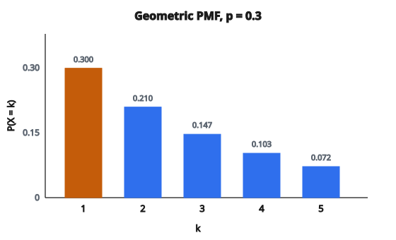

# PMF hình học (Geometric) và kỳ vọng

## Phân phối Geometric là gì

Phân phối Geometric mô hình **số phép thử đến lần thành công đầu tiên** trong một dãy phép thử Bernoulli độc lập.

Nó trả lời: “Phải lặp thí nghiệm bao nhiêu lần trước khi thành công lần đầu?”

## Hai quy ước

Có hai cách định nghĩa Geometric phổ biến:

**Quy ước 1: số phép thử đến lần thành công đầu**

$X \in \{1, 2, 3, \ldots\}$

Tính cả phép thử thành công.

**Quy ước 2: số lần thất bại trước lần thành công đầu**

$Y \in \{0, 1, 2, \ldots\}$

Chỉ đếm thất bại, không đếm thành công.

Hai biến liên hệ bởi $X = Y + 1$. Bài này dùng chủ yếu quy ước 1.

## Ví dụ thực tế

Nhiều tình huống thời gian chờ tuân theo Geometric:

* Số lần tung đồng xu đến mặt ngửa đầu tiên
* Số đơn xin việc đến lời mời đầu tiên
* Số khách đến lần mua đầu tiên
* Số lần thi đến khi đậu
* Số lần gieo đến mặt sáu
* Số request tới server đến lần lỗi đầu tiên

## Tham số $p$

Phân phối Geometric có một tham số:

$$
p = P(\text{thành công mỗi phép thử})
$$

**Ràng buộc:**

* $0 < p \leq 1$
* $p = 0$ không được phép (sẽ chờ vô hạn)

Xác suất thất bại là $q = 1 - p$.

## Hàm khối xác suất (PMF)

Với quy ước 1 (số phép thử đến lần thành công đầu):

$$
P(X = k) = (1-p)^{k-1} p
$$

với $k \in \{1, 2, 3, \ldots\}$.

**Diễn giải:**

* $(1-p)^{k-1}$ = xác suất thất bại $k-1$ lần đầu
* $p$ = xác suất thành công ở phép thử $k$

## Suy ra PMF

Để lần thành công đầu rơi vào phép thử $k$, cần:

* Thất bại lần 1: xác suất $(1-p)$
* Thất bại lần 2: xác suất $(1-p)$
* …
* Thất bại lần $k-1$: xác suất $(1-p)$
* Thành công lần $k$: xác suất $p$

Vì các phép thử độc lập:

$$
P(X = k) = \underbrace{(1-p) \cdot (1-p) \cdots (1-p)}_{k-1 \text{ lần}} \cdot p = (1-p)^{k-1} p
$$

## Ví dụ số: tung đồng xu

**Thiết lập:** Tung đồng xu cân ($p = 0.5$) đến khi được ngửa. Xác suất mặt ngửa đầu tiên ở lần tung 4?

**Lời giải:**

$$
P(X = 4) = (1 - 0.5)^{4-1} \cdot 0.5 = (0.5)^3 \cdot 0.5 = 0.125 \cdot 0.5 = 0.0625
$$

Xác suất mặt ngửa đầu tiên ở lần 4 là 6.25%.

## Tính nhiều giá trị PMF

**Thiết lập:** $p = 0.3$ (30% thành công mỗi lần)

$$
\begin{aligned}
P(X = 1) &= (0.7)^0 \cdot 0.3 = 1 \cdot 0.3 = 0.300 \\
P(X = 2) &= (0.7)^1 \cdot 0.3 = 0.7 \cdot 0.3 = 0.210 \\
P(X = 3) &= (0.7)^2 \cdot 0.3 = 0.49 \cdot 0.3 = 0.147 \\
P(X = 4) &= (0.7)^3 \cdot 0.3 = 0.343 \cdot 0.3 = 0.103 \\
P(X = 5) &= (0.7)^4 \cdot 0.3 = 0.240 \cdot 0.3 = 0.072
\end{aligned}
$$

Xác suất giảm theo cấp số nhân (đúng với tên *geometric*).

::: {#fig-62-geometric-pmf fig-cap="Geometric(p = 0.3), quy ước số phép thử: P(X = k) = (1−p)^{k−1} p giảm theo k; mode luôn tại k = 1." fig-alt="Năm cột PMF Geometric p = 0.3 cho k = 1 đến 5, giảm từ 0.300 xuống 0.072."}
{fig-align="center"}
:::

## Kiểm tra PMF cộng bằng 1

Tổng mọi xác suất phải bằng 1:

$$
\sum_{k=1}^{\infty} P(X = k) = \sum_{k=1}^{\infty} (1-p)^{k-1} p = p \sum_{j=0}^{\infty} (1-p)^j
$$

Dùng công thức cấp số nhân $\sum_{j=0}^{\infty} r^j = \frac{1}{1-r}$ với $|r| < 1$:

$$
= p \cdot \frac{1}{1 - (1-p)} = p \cdot \frac{1}{p} = 1
$$

## Kỳ vọng (trung bình)

Số phép thử kỳ vọng đến lần thành công đầu là:

$$
\mathbb{E}[X] = \frac{1}{p}
$$

**Trực giác:** Nếu $p = 0.2$ (20%), kỳ vọng cần $1/0.2 = 5$ phép thử.

**Suy ra:**

$$
\mathbb{E}[X] = \sum_{k=1}^{\infty} k \cdot (1-p)^{k-1} p
$$

Tổng này bằng $1/p$ (đạo hàm của chuỗi hình học).

## Ví dụ kỳ vọng

**Đồng xu cân ($p = 0.5$):**

$$
\mathbb{E}[X] = \frac{1}{0.5} = 2
$$

Trung bình 2 lần tung để được ngửa.

**Gieo mặt sáu ($p = 1/6$):**

$$
\mathbb{E}[X] = \frac{1}{1/6} = 6
$$

Trung bình 6 lần gieo để được sáu.

**Tỷ lệ thành công 1% ($p = 0.01$):**

$$
\mathbb{E}[X] = \frac{1}{0.01} = 100
$$

Trung bình 100 phép thử để thành công.

## Phương sai

Phương sai của Geometric là:

$$
\operatorname{Var}(X) = \frac{1-p}{p^2}
$$

**Độ lệch chuẩn:**

$$
\sigma = \frac{\sqrt{1-p}}{p}
$$

**Ví dụ:** Với $p = 0.2$:

$$
\begin{aligned}
\operatorname{Var}(X) &= \frac{0.8}{0.04} = 20 \\
\sigma &= \sqrt{20} \approx 4.47
\end{aligned}
$$

## Hàm phân phối tích lũy (CDF)

CDF cho xác suất đã thành công chậm nhất ở phép thử $k$:

$$
F(k) = P(X \leq k) = 1 - (1-p)^k
$$

**Suy ra:**

$P(X \leq k)$ = xác suất có ít nhất một lần thành công trong $k$ phép thử

$= 1 - P(\text{không thành công nào trong } k \text{ lần})$

$= 1 - (1-p)^k$

## Ví dụ CDF

**Thiết lập:** $p = 0.3$

$$
\begin{aligned}
F(1) &= 1 - (0.7)^1 = 1 - 0.7 = 0.30 \\
F(2) &= 1 - (0.7)^2 = 1 - 0.49 = 0.51 \\
F(3) &= 1 - (0.7)^3 = 1 - 0.343 = 0.657 \\
F(5) &= 1 - (0.7)^5 = 1 - 0.168 = 0.832 \\
F(10) &= 1 - (0.7)^{10} = 1 - 0.028 = 0.972
\end{aligned}
$$

Đến phép thử 10, xác suất đã thành công là 97.2%.

## Hàm sống sót

Xác suất **chưa** thành công sau $k$ phép thử:

$$
P(X > k) = 1 - F(k) = (1-p)^k
$$

Đây là xác suất $k$ lần thất bại liên tiếp.

**Ví dụ:** Với $p = 0.3$, xác suất vẫn đang chờ sau 5 phép thử:

$$
P(X > 5) = (0.7)^5 = 0.168 = 16.8\%
$$

## Tính không nhớ (memoryless)

Phân phối Geometric **không nhớ**:

$$
P(X > s + t \mid X > s) = P(X > t)
$$

Nếu đã thất bại $s$ lần, xác suất còn cần ít nhất $t$ phép thử nữa giống như bắt đầu lại từ đầu.

**Trực giác:** Thất bại quá khứ không đổi xác suất thành công tương lai. Mỗi phép thử độc lập.

**Ví dụ:** Đã tung 10 mặt sấp liên tiếp, số lần tung thêm kỳ vọng để được ngửa vẫn là $1/p$, không nhỏ hơn.

## Chứng minh không nhớ

$$
P(X > s + t \mid X > s) = \frac{P(X > s + t \text{ và } X > s)}{P(X > s)}
$$

Vì $X > s + t$ kéo theo $X > s$:

$$
= \frac{P(X > s + t)}{P(X > s)} = \frac{(1-p)^{s+t}}{(1-p)^s} = (1-p)^t = P(X > t)
$$

Geometric là **phân phối rời rạc không nhớ duy nhất**.

## PMF thay thế (quy ước 2)

Với $Y$ = số lần thất bại trước lần thành công đầu:

$$
P(Y = k) = (1-p)^k p
$$

với $k \in \{0, 1, 2, \ldots\}$.

**Kỳ vọng:**

$$
\mathbb{E}[Y] = \frac{1-p}{p}
$$

**Phương sai:**

$$
\operatorname{Var}(Y) = \frac{1-p}{p^2}
$$

Lưu ý $Y = X - 1$, nên $\mathbb{E}[Y] = \mathbb{E}[X] - 1 = \frac{1}{p} - 1 = \frac{1-p}{p}$.

## Liên hệ với phân phối khác

**Negative Binomial:**

Geometric là trường hợp riêng của Negative Binomial với $r = 1$ lần thành công.

**Exponential:**

Geometric là analog rời rạc của Exponential. Cả hai đều không nhớ.

**Bernoulli:**

Mỗi phép thử trong dãy Geometric là một phép thử Bernoulli.

## Tổng các biến Geometric

Nếu $X_1, X_2, \ldots, X_r$ độc lập, mỗi cái $\mathrm{Geometric}(p)$:

$$
\sum_{i=1}^{r} X_i \sim \mathrm{NegativeBinomial}(r, p)
$$

Đây là số phép thử để được $r$ lần thành công.

## Ước lượng hợp lý cực đại

Cho quan sát $x_1, x_2, \ldots, x_n$ từ $\mathrm{Geometric}(p)$:

$$
\hat{p} = \frac{n}{\sum_{i=1}^{n} x_i} = \frac{1}{\bar{x}}
$$

MLE là nghịch đảo của trung bình mẫu.

## Mode của phân phối

Mode (giá trị có xác suất lớn nhất) luôn là:

$$
\mathrm{mode} = 1
$$

Xác suất giảm khi $k$ tăng, nên phép thử đầu luôn là lần thành công có xác suất lớn nhất.

## Ứng dụng trong machine learning

**Mô hình thời gian chờ:**
Số vòng lặp kỳ vọng đến khi hội tụ.

**Độ tin cậy:**
Số lần dùng đến lần lỗi đầu tiên.

**Sampling:**
Số mẫu ngẫu nhiên đến khi gặp một kiểu cụ thể.

**Coupon collector:**
Liên quan đến việc thu đủ mọi phần tử trong một tập.

## Code

```python
import numpy as np

def geometric_pmf_mean(k, p):
    """
    Compute Geometric PMF and Mean.
    """
    k = np.asarray(k)
    pmf = ((1 - p) ** (k - 1)) * p
    mean = 1.0 / p
    return pmf, float(mean)
```

<!-- auto-self-check -->

::: {.callout-note}
## Kiểm tra nhanh
<details>
<summary>Ý chính của bài «PMF hình học (Geometric) và kỳ vọng» là gì?</summary>
Phân phối Geometric mô hình **số phép thử đến lần thành công đầu tiên** trong một dãy phép thử Bernoulli độc lập.
</details>
<details>
<summary>Công thức / quan hệ cốt lõi trong bài là gì?</summary>
$$p = P(\text{thành công mỗi phép thử})$$
</details>
:::
