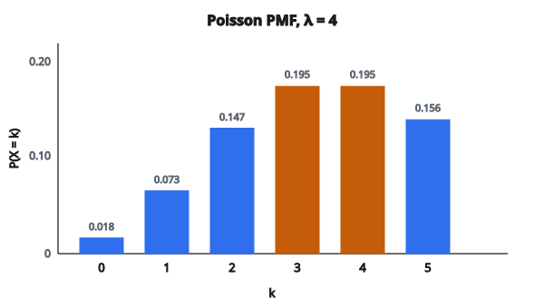

# PMF Poisson và hàm phân phối tích lũy

## Phân phối Poisson là gì

Phân phối Poisson mô hình **số sự kiện** xảy ra trong một khoảng thời gian hoặc không gian cố định, khi các sự kiện độc lập và có tốc độ trung bình không đổi.

Nó trả lời các câu hỏi như: “Bao nhiêu khách sẽ đến trong giờ tới?” hoặc “Bao nhiêu lỗi sẽ tìm thấy trong một lô?”

Mang tên nhà toán học Pháp Siméon Denis Poisson.

## Khi nào dùng Poisson

Phân phối Poisson phù hợp khi:

**1. Sự kiện xảy ra độc lập**

Một sự kiện không đổi xác suất của sự kiện khác.

**2. Tốc độ trung bình không đổi**

Tốc độ $\lambda$ giống nhau suốt khoảng đang xét.

**3. Hai sự kiện không xảy ra đúng cùng một thời điểm**

Sự kiện đếm được và rời rạc.

**4. Xác suất sự kiện trong khoảng nhỏ tỷ lệ với độ dài khoảng**

Gấp đôi thời gian thì kỳ vọng số đếm cũng gấp đôi.

## Ví dụ thực tế

Nhiều hiện tượng tuân theo Poisson:

* Số email nhận mỗi giờ
* Số xe qua một trạm mỗi phút
* Số cuộc gọi tới tổng đài mỗi giờ
* Số lỗi chính tả mỗi trang
* Số tai nạn tại một giao lộ mỗi tháng
* Số đột biến trên một đoạn DNA
* Số photon đập vào detector mỗi giây
* Số khách website mỗi phút

## Tham số $\lambda$

Phân phối Poisson có một tham số:

$$
\lambda = \text{tốc độ trung bình (số sự kiện kỳ vọng)}
$$

**Ràng buộc:**

* $\lambda > 0$

$\lambda$ vừa là kỳ vọng vừa là phương sai của phân phối.

## Hàm khối xác suất (PMF)

Xác suất quan sát đúng $k$ sự kiện là:

$$
P(X = k) = \frac{\lambda^k e^{-\lambda}}{k!}
$$

với $k \in \{0, 1, 2, 3, \ldots\}$.

**Từng thành phần:**

* $\lambda^k$: tốc độ mũ số đếm
* $e^{-\lambda}$: hệ số chuẩn hóa để tổng xác suất bằng 1
* $k!$: giai thừa, tính đến thứ tự sự kiện

## Kiểm tra PMF cộng bằng 1

$$
\sum_{k=0}^{\infty} P(X = k) = \sum_{k=0}^{\infty} \frac{\lambda^k e^{-\lambda}}{k!} = e^{-\lambda} \sum_{k=0}^{\infty} \frac{\lambda^k}{k!}
$$

Chuỗi Taylor của $e^{x}$ là $\sum_{k=0}^{\infty} \frac{x^k}{k!}$, nên:

$$
= e^{-\lambda} \cdot e^{\lambda} = e^{0} = 1
$$

## Ví dụ số: tổng đài

**Thiết lập:** Tổng đài nhận trung bình 5 cuộc gọi mỗi giờ ($\lambda = 5$). Xác suất nhận đúng 3 cuộc trong giờ tới?

**Lời giải:**

$$
\begin{aligned}
P(X = 3)
&= \frac{5^3 e^{-5}}{3!} = \frac{125 \cdot e^{-5}}{6} \\
&= \frac{125 \cdot 0.00674}{6} = \frac{0.8425}{6} = 0.1404
\end{aligned}
$$

Xác suất đúng 3 cuộc gọi khoảng 14%.

## Tính nhiều giá trị PMF

**Thiết lập:** $\lambda = 4$

$$
\begin{aligned}
P(X = 0) &= \frac{4^0 e^{-4}}{0!} = \frac{1 \cdot 0.0183}{1} = 0.0183 \\
P(X = 1) &= \frac{4^1 e^{-4}}{1!} = \frac{4 \cdot 0.0183}{1} = 0.0733 \\
P(X = 2) &= \frac{4^2 e^{-4}}{2!} = \frac{16 \cdot 0.0183}{2} = 0.1465 \\
P(X = 3) &= \frac{4^3 e^{-4}}{3!} = \frac{64 \cdot 0.0183}{6} = 0.1954 \\
P(X = 4) &= \frac{4^4 e^{-4}}{4!} = \frac{256 \cdot 0.0183}{24} = 0.1954 \\
P(X = 5) &= \frac{4^5 e^{-4}}{5!} = \frac{1024 \cdot 0.0183}{120} = 0.1563
\end{aligned}
$$

::: {#fig-61-poisson-pmf fig-cap="Poisson(λ = 4): E[X] = Var(X) = 4; khi λ nguyên, hai mode tại λ − 1 và λ (cùng 0.1954)." fig-alt="Sáu cột PMF Poisson lambda = 4 cho k = 0 đến 5; hai mode bằng nhau tại k = 3 và k = 4 (0.1954)."}
{fig-align="center"}
:::

## Hàm phân phối tích lũy (CDF)

CDF cho xác suất quan sát **nhiều nhất** $k$ sự kiện:

$$
F(k) = P(X \leq k) = \sum_{i=0}^{k} \frac{\lambda^i e^{-\lambda}}{i!}
$$

**Tính chất:**

* $F(k)$ tăng khi $k$ tăng
* $\lim_{k \to \infty} F(k) = 1$

Không có dạng đóng; phải tính bằng tổng hoặc hàm đặc biệt (incomplete gamma).

## Ví dụ CDF

**Thiết lập:** $\lambda = 4$. Tìm $P(X \leq 3)$.

$$
\begin{aligned}
F(3) &= P(X \leq 3) = P(X=0) + P(X=1) + P(X=2) + P(X=3) \\
&= 0.0183 + 0.0733 + 0.1465 + 0.1954 = 0.4335
\end{aligned}
$$

Xác suất 3 sự kiện trở xuống khoảng 43%.

## Dùng CDF cho xác suất theo khoảng

**$P(X > k)$:**

$$
P(X > k) = 1 - F(k) = 1 - P(X \leq k)
$$

**$P(X \geq k)$:**

$$
P(X \geq k) = 1 - F(k-1) = 1 - P(X \leq k-1)
$$

**$P(a \leq X \leq b)$:**

$$
P(a \leq X \leq b) = F(b) - F(a-1)
$$

## Kỳ vọng và phương sai

Với Poisson, một tính chất đáng chú ý:

$$
\mathbb{E}[X] = \lambda
$$

$$
\operatorname{Var}(X) = \lambda
$$

Kỳ vọng và phương sai bằng nhau. Tính chất này giúp nhận diện dữ liệu Poisson.

**Độ lệch chuẩn:**

$$
\sigma = \sqrt{\lambda}
$$

## Vì sao kỳ vọng bằng phương sai

**Suy ra $\mathbb{E}[X]$:**

$$
\begin{aligned}
\mathbb{E}[X]
&= \sum_{k=0}^{\infty} k \cdot \frac{\lambda^k e^{-\lambda}}{k!} \\
&= \lambda e^{-\lambda} \sum_{k=1}^{\infty} \frac{\lambda^{k-1}}{(k-1)!} \\
&= \lambda e^{-\lambda} \cdot e^{\lambda} = \lambda
\end{aligned}
$$

**Suy ra $\operatorname{Var}(X)$:**

Dùng $\operatorname{Var}(X) = \mathbb{E}[X^2] - (\mathbb{E}[X])^2$ và tính $\mathbb{E}[X^2]$ tương tự được $\operatorname{Var}(X) = \lambda$.

## Mode của phân phối

Mode (giá trị có xác suất lớn nhất) là:

$$
\mathrm{mode} = \lfloor \lambda \rfloor
$$

Nếu $\lambda$ nguyên, cả $\lambda$ và $\lambda - 1$ đều là mode.

**Ví dụ:** Với $\lambda = 4.7$, mode $= 4$.

## Dạng của phân phối

Dạng phụ thuộc $\lambda$:

**$\lambda$ nhỏ (ví dụ 1):**

* Lệch phải
* Mode tại 0 hoặc 1
* Giảm nhanh

**$\lambda$ lớn (ví dụ 10+):**

* Đối xứng hơn
* Tiến tới phân phối chuẩn
* Mode gần $\lambda$

## Xấp xỉ chuẩn

Với $\lambda$ lớn, Poisson xấp xỉ được bằng phân phối chuẩn:

$$
X \approx \mathcal{N}(\lambda, \lambda)
$$

**Quy tắc thực hành:** hợp lý khi $\lambda \geq 10$.

**Có hiệu chỉnh liên tục:**

$$
P(X \leq k) \approx \Phi\left(\frac{k + 0.5 - \lambda}{\sqrt{\lambda}}\right)
$$

## Poisson như giới hạn của Binomial

Poisson xuất hiện như giới hạn của Binomial:

Nếu $X \sim \mathrm{Binomial}(n, p)$ với $n \to \infty$, $p \to 0$, và $np = \lambda$ cố định:

$$
\mathrm{Binomial}(n, p) \to \mathrm{Poisson}(\lambda)
$$

Vì thế Poisson phù hợp với sự kiện hiếm trong quần thể lớn.

**Ví dụ:** Xác suất $k$ sản phẩm lỗi trong 1000 món, mỗi món xác suất lỗi 0.003:

$\lambda = np = 1000 \times 0.003 = 3$

Dùng $\mathrm{Poisson}(3)$ thay cho $\mathrm{Binomial}(1000, 0.003)$.

## Tổng hai Poisson độc lập

Nếu $X \sim \mathrm{Poisson}(\lambda_1)$ và $Y \sim \mathrm{Poisson}(\lambda_2)$ độc lập:

$$
X + Y \sim \mathrm{Poisson}(\lambda_1 + \lambda_2)
$$

**Ví dụ:** Phòng A nhận 3 cuộc/giờ và phòng B nhận 5 cuộc/giờ thì tổng là $\mathrm{Poisson}(8)$.

## Đổi độ dài khoảng

Nếu sự kiện xảy ra với tốc độ $\lambda$ mỗi đơn vị thời gian:

* Trong thời gian $t$, số đếm tuân theo $\mathrm{Poisson}(\lambda t)$

**Ví dụ:** 10 email/giờ nghĩa là:

* Mỗi phút: $\mathrm{Poisson}(10/60) = \mathrm{Poisson}(1/6)$
* Mỗi 3 giờ: $\mathrm{Poisson}(30)$

## Liên hệ với Exponential

Quá trình Poisson có quan hệ đối ngẫu với phân phối Exponential:

* **Poisson:** số sự kiện trong thời gian cố định
* **Exponential:** thời gian giữa hai sự kiện liên tiếp

Nếu số đếm tuân theo $\mathrm{Poisson}(\lambda)$ thì thời gian giữa các lần đến tuân theo $\mathrm{Exponential}(\lambda)$.

## Ước lượng hợp lý cực đại

Cho quan sát $x_1, x_2, \ldots, x_n$ từ $\mathrm{Poisson}(\lambda)$:

$$
\hat{\lambda} = \bar{x} = \frac{1}{n}\sum_{i=1}^{n} x_i
$$

MLE chính là trung bình mẫu.

## Kiểm tra dữ liệu có phải Poisson

**Kiểm tra kỳ vọng–phương sai:**

Với dữ liệu Poisson, trung bình $\approx$ phương sai.

Tính chỉ số phân tán:

$$
D = \frac{\operatorname{Var}(X)}{\bar{X}}
$$

Nếu $D \approx 1$: nhất quán với Poisson

Nếu $D > 1$: overdispersion (cân nhắc Negative Binomial)

Nếu $D < 1$: underdispersion

## Ứng dụng trong machine learning

**Mô hình dữ liệu đếm:**

* Số lần bấm, mua, xem trang
* Poisson regression cho đầu ra dạng đếm

**Phân tích văn bản:**

* Mô hình tần suất từ
* Topic modeling

**Phát hiện bất thường:**

* Số sự kiện bất thường (ví dụ phát hiện gian lận)

**Lý thuyết hàng đợi:**

* Mô hình tải server
* Mẫu hình request đến

## Code

```python
import numpy as np

def poisson_pmf_cdf(lam, k):
    """
    Compute Poisson PMF and CDF.
    """
    log_pmf = -lam + k * np.log(lam) - np.sum(np.log(np.arange(1, k + 1)))
    pmf = np.exp(log_pmf)
    cdf = 0.0
    for i in range(k + 1):
        if i == 0:
            log_pmf_i = -lam
        else:
            log_pmf_i = -lam + i * np.log(lam) - np.sum(np.log(np.arange(1, i + 1)))
        cdf += np.exp(log_pmf_i)
    return float(pmf), float(cdf)
```
