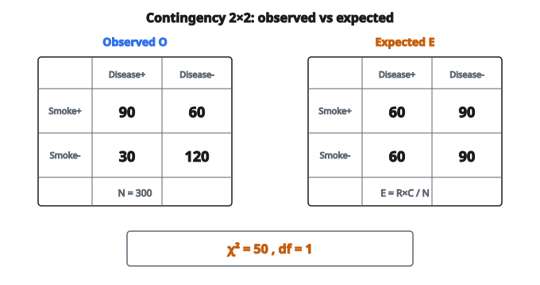

# Kiểm định Chi-Square

## Kiểm định chi-square độc lập là gì?

Kiểm định chi-square độc lập xác định liệu có **liên hệ có ý nghĩa thống kê** giữa hai biến phân loại hay không.

**Giả thuyết không ($H_0$):** Hai biến độc lập (không có liên hệ).

**Giả thuyết đối ($H_1$):** Hai biến không độc lập (có liên hệ).

Nếu kiểm định bác bỏ $H_0$, ta kết luận các biến có liên quan.

## Khi nào dùng kiểm định này

Dùng kiểm định chi-square độc lập khi:

* Có hai biến phân loại (định danh hoặc thứ tự)
* Muốn kiểm tra chúng có liên quan hay không
* Các quan sát độc lập
* Tần số kỳ vọng đủ lớn (thường $\geq 5$)

**Ví dụ:**

* Giới tính có liên hệ với xu hướng bỏ phiếu không?
* Trình độ học vấn có liên quan đến tình trạng việc làm không?
* Loại điều trị có liên hệ với kết cục bệnh nhân không?

## Contingency table

Dữ liệu được xếp trong **contingency table** (bảng chéo):

Với hai biến có $r$ hàng và $c$ cột:

* $O_{ij}$ = số đếm quan sát trong ô $(i, j)$
* Tổng hàng: $R_i = \sum_{j=1}^{c} O_{ij}$
* Tổng cột: $C_j = \sum_{i=1}^{r} O_{ij}$
* Tổng chung: $N = \sum_{i}\sum_{j} O_{ij}$

## Tần số kỳ vọng dưới giả thuyết độc lập

Nếu các biến độc lập, số đếm kỳ vọng trong mỗi ô là:

$$
E_{ij} = \frac{R_i \times C_j}{N}
$$

Công thức này xuất phát từ định nghĩa độc lập:

$$
P(\text{hàng } i \text{ và cột } j) = P(\text{hàng } i) \times P(\text{cột } j)
$$

$$
E_{ij} = N \times \frac{R_i}{N} \times \frac{C_j}{N} = \frac{R_i \times C_j}{N}
$$

## Thống kê kiểm định chi-square

Thống kê kiểm định đo mức độ số đếm quan sát lệch khỏi kỳ vọng:

$$
\chi^2 = \sum_{i=1}^{r} \sum_{j=1}^{c} \frac{(O_{ij} - E_{ij})^2}{E_{ij}}
$$

**Diễn giải:**

* Mỗi ô đóng góp $(O - E)^2 / E$ vào thống kê
* Độ lệch lớn làm tăng $\chi^2$
* Dưới $H_0$, $\chi^2$ tuân theo phân phối chi-square

## Degrees of freedom

Degrees of freedom của kiểm định:

$$
df = (r - 1)(c - 1)
$$

với $r$ = số hàng và $c$ = số cột.

**Trực giác:** Mất 1 bậc tự do cho mỗi ràng buộc hàng và cột (các tổng phải khớp).

**Ví dụ:**

* Bảng $2 \times 2$: $df = (2-1)(2-1) = 1$
* Bảng $3 \times 4$: $df = (3-1)(4-1) = 6$

## Quy trình từng bước

**Bước 1:** Đặt giả thuyết

* $H_0$: Các biến độc lập
* $H_1$: Các biến không độc lập

**Bước 2:** Chọn mức ý nghĩa $\alpha$ (thường $0.05$)

**Bước 3:** Tính tần số kỳ vọng $E_{ij}$

**Bước 4:** Tính thống kê kiểm định $\chi^2$

**Bước 5:** Tìm giá trị tới hạn hoặc p-value từ phân phối $\chi^2_{df}$

**Bước 6:** Ra quyết định

* Nếu p-value $< \alpha$, bác bỏ $H_0$
* Nếu $\chi^2 > \chi^2_{\text{critical}}$, bác bỏ $H_0$

## Ví dụ số

**Câu hỏi nghiên cứu:** Có liên hệ giữa tình trạng hút thuốc (hút / không hút) và bệnh phổi (có / không) không?

**Dữ liệu quan sát:**

* Người hút có bệnh phổi: $90$
* Người hút không bệnh phổi: $60$
* Người không hút có bệnh phổi: $30$
* Người không hút không bệnh phổi: $120$

**Các tổng:**

* Người hút: $R_1 = 90 + 60 = 150$
* Người không hút: $R_2 = 30 + 120 = 150$
* Có bệnh phổi: $C_1 = 90 + 30 = 120$
* Không bệnh phổi: $C_2 = 60 + 120 = 180$
* Tổng chung: $N = 300$

### Bước 1: Tính tần số kỳ vọng

$$
\begin{aligned}
E_{11} &= \frac{150 \times 120}{300} = \frac{18000}{300} = 60 \\
E_{12} &= \frac{150 \times 180}{300} = \frac{27000}{300} = 90 \\
E_{21} &= \frac{150 \times 120}{300} = \frac{18000}{300} = 60 \\
E_{22} &= \frac{150 \times 180}{300} = \frac{27000}{300} = 90
\end{aligned}
$$

### Bước 2: Tính thống kê kiểm định

$$
\chi^2 = \frac{(90-60)^2}{60} + \frac{(60-90)^2}{90} + \frac{(30-60)^2}{60} + \frac{(120-90)^2}{90}
$$

$$
\begin{aligned}
\chi^2 &= \frac{900}{60} + \frac{900}{90} + \frac{900}{60} + \frac{900}{90} \\
&= 15 + 10 + 15 + 10 = 50
\end{aligned}
$$

### Bước 3: Degrees of freedom

$$
df = (2-1)(2-1) = 1
$$

### Bước 4: P-value

Với $\chi^2 = 50$ và $df = 1$, p-value $< 0.0001$

**Kết luận:** Bác bỏ $H_0$. Có liên hệ có ý nghĩa giữa hút thuốc và bệnh phổi.

::: {#fig-66-chi-square-table fig-cap="Contingency table 2×2: O lệch E rõ (90 vs 60, …); χ² = 50 với df = 1." fig-alt="Bảng 2×2 quan sát O = 90,60 / 30,120 và kỳ vọng E = 60,90 / 60,90; χ² = 50, df = 1."}
{fig-align="center"}
:::

## Giá trị tới hạn

Các giá trị tới hạn thường dùng của phân phối chi-square:

**Tại $\alpha = 0.05$:**

* $df = 1$: $\chi^2_{\text{crit}} = 3.841$
* $df = 2$: $\chi^2_{\text{crit}} = 5.991$
* $df = 3$: $\chi^2_{\text{crit}} = 7.815$
* $df = 4$: $\chi^2_{\text{crit}} = 9.488$
* $df = 5$: $\chi^2_{\text{crit}} = 11.070$

Nếu $\chi^2 > \chi^2_{\text{crit}}$, bác bỏ giả thuyết không.

## Giả định và yêu cầu

**1. Độc lập quan sát**

Mỗi đối tượng chỉ đóng góp vào một ô.

**2. Lấy mẫu ngẫu nhiên**

Dữ liệu phải là mẫu ngẫu nhiên từ quần thể.

**3. Yêu cầu tần số kỳ vọng**

Mọi tần số kỳ vọng nên $\geq 5$ để xấp xỉ hợp lệ.

Nếu tần số kỳ vọng quá nhỏ, dùng Fisher's exact test (với bảng $2 \times 2$) hoặc gộp hạng mục.

## Effect size: Cramér's V

Thống kê chi-square phụ thuộc kích thước mẫu. Để đo effect size, dùng Cramér's V:

$$
V = \sqrt{\frac{\chi^2}{N \times (k - 1)}}
$$

với $k = \min(r, c)$ là số nhỏ hơn giữa hàng và cột.

**Diễn giải:**

* $V \approx 0.1$: Effect nhỏ
* $V \approx 0.3$: Effect trung bình
* $V \approx 0.5$: Effect lớn

**Ví dụ:** Với $\chi^2 = 50$, $N = 300$, $k = 2$:

$$
V = \sqrt{\frac{50}{300 \times 1}} = \sqrt{0.167} = 0.41
$$

Đây là effect từ trung bình đến lớn.

## Với bảng $2 \times 2$: hệ số Phi

Với bảng $2 \times 2$ cụ thể, hệ số phi ($\phi$) bằng Cramér's V:

$$
\phi = \sqrt{\frac{\chi^2}{N}}
$$

Miền: $-1$ đến $1$ (thường báo cáo giá trị tuyệt đối)

## Hiệu chỉnh liên tục Yates

Với bảng $2 \times 2$, hiệu chỉnh Yates điều chỉnh cho tính rời rạc của số đếm:

$$
\chi^2_{\text{Yates}} = \sum \frac{(|O_{ij} - E_{ij}| - 0.5)^2}{E_{ij}}
$$

Cho kiểm định bảo thủ hơn (p-value lớn hơn). Ngày nay ít được dùng hơn.

## Một phía so với hai phía

Kiểm định chi-square độc lập vốn là **hai phía**.

Nó kiểm tra có liên hệ hay không, không kiểm tra hướng của liên hệ.

Để đánh giá hướng, xem:

* Mẫu hình số quan sát so với kỳ vọng
* Residual chuẩn hóa: $(O_{ij} - E_{ij})/\sqrt{E_{ij}}$

## Phân tích residual

**Residual chuẩn hóa** cho thấy ô nào đóng góp nhiều nhất vào chi-square:

$$
r_{ij} = \frac{O_{ij} - E_{ij}}{\sqrt{E_{ij}}}
$$

**Residual chuẩn hóa điều chỉnh** (dùng phổ biến hơn):

$$
d_{ij} = \frac{O_{ij} - E_{ij}}{\sqrt{E_{ij}(1 - R_i/N)(1 - C_j/N)}}
$$

Nếu $|d_{ij}| > 2$, ô đó đóng góp đáng kể vào việc bác bỏ $H_0$.

## Chi-square so với các kiểm định khác

**Kiểm định chi-square:**

* Cho phân loại so với phân loại
* Kiểm tra liên hệ
* Cần tần số kỳ vọng đủ lớn

**Fisher's exact test:**

* Cho bảng $2 \times 2$ với tần số kỳ vọng nhỏ
* P-value chính xác, không xấp xỉ

**G-test (likelihood ratio test):**

* Thay thế cho chi-square
* Dùng $G = 2\sum O_{ij} \ln(O_{ij}/E_{ij})$
* Tương đương tiệm cận

## Quan hệ với các kiểm định chi-square khác

**Goodness-of-fit test:**

* Một biến, so sánh quan sát với phân phối lý thuyết
* $df = k - 1$ với $k$ = số hạng mục

**Kiểm định độc lập:**

* Hai biến, kiểm tra liên hệ
* $df = (r-1)(c-1)$

**Kiểm định đồng nhất:**

* Cùng công thức với kiểm định độc lập
* Khác sơ đồ lấy mẫu (so sánh các nhóm)

## Các lỗi thường gặp

**1. Dùng phần trăm thay vì số đếm**

Luôn dùng số đếm thô, không dùng phần trăm hay tỷ lệ.

**2. Cùng một đối tượng xuất hiện nhiều lần**

Vi phạm giả định độc lập.

**3. Bỏ qua tần số kỳ vọng nhỏ**

Có thể dẫn tới p-value không hợp lệ.

**4. Nhầm ý nghĩa thống kê với ý nghĩa thực tiễn**

Mẫu lớn có thể làm effect nhỏ trở nên có ý nghĩa thống kê.

## Ứng dụng trong machine learning

**Feature selection:**

* Kiểm tra feature phân loại có liên hệ với target không
* Feature có liên hệ có ý nghĩa có thể mang sức dự đoán

**Đánh giá mô hình:**

* So sánh hạng mục dự đoán với thực tế
* Kiểm tra dự đoán có tốt hơn ngẫu nhiên không

**A/B testing:**

* Kiểm tra tỷ lệ chuyển đổi có khác giữa các biến thể không

**Khám phá dữ liệu:**

* Phát hiện quan hệ giữa các biến phân loại

## Code
```python
import numpy as np

def chi2_independence(C):
    """
    Compute chi-square test statistic and expected frequencies.
    """
    C = np.asarray(C, dtype=float)
    row_totals = np.sum(C, axis=1)
    col_totals = np.sum(C, axis=0)
    total = np.sum(C)
    expected = np.outer(row_totals, col_totals) / total
    chi2 = np.sum((C - expected) ** 2 / expected)
    return float(chi2), expected
```
