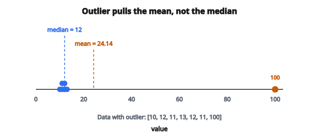

# Mean, Median, Mode

## Các thước đo xu hướng trung tâm

Xu hướng trung tâm mô tả “trung tâm” của một tập dữ liệu nằm ở đâu. Ba thước đo phổ biến nhất:

* **Mean (trung bình):** trung bình số học
* **Median (trung vị):** giá trị giữa khi dữ liệu đã sắp xếp
* **Mode (mốt):** giá trị xuất hiện thường xuyên nhất

Mỗi thước đo có tính chất khác nhau và phù hợp trong các tình huống khác nhau.

## Mean (trung bình số học)

Mean là tổng mọi giá trị chia cho số phần tử:

$$
\bar{x} = \frac{1}{n} \sum_{i=1}^{n} x_i = \frac{x_1 + x_2 + \cdots + x_n}{n}
$$

**Tính chất:**

* Dùng mọi điểm dữ liệu
* Nhạy với outlier
* Cực tiểu hóa tổng bình phương độ lệch
* Có tính chất toán học thuận tiện (ước lượng không chệch của trung bình quần thể)

## Tính mean: ví dụ

**Dữ liệu:** $[4, 8, 6, 5, 3, 9, 7]$

**Bước 1:** Cộng các giá trị

$$
4 + 8 + 6 + 5 + 3 + 9 + 7 = 42
$$

**Bước 2:** Đếm số phần tử

$$
n = 7
$$

**Bước 3:** Chia

$$
\bar{x} = \frac{42}{7} = 6
$$

Mean bằng 6.

## Median (trung vị)

Median là giá trị giữa khi dữ liệu đã sắp xếp:

**Với $n$ lẻ:** median là giá trị ở vị trí $\dfrac{n+1}{2}$.

**Với $n$ chẵn:** median là trung bình của các giá trị ở vị trí $\dfrac{n}{2}$ và $\dfrac{n}{2} + 1$.

**Tính chất:**

* Bền vững với outlier
* Cực tiểu hóa tổng độ lệch tuyệt đối
* Tốt với phân phối lệch
* Chính là percentile thứ 50

## Tính median: $n$ lẻ

**Dữ liệu:** $[4, 8, 6, 5, 3, 9, 7]$

**Bước 1:** Sắp xếp

$$
[3, 4, 5, 6, 7, 8, 9]
$$

**Bước 2:** Tìm vị trí giữa

$$
\text{position} = \frac{n+1}{2} = \frac{7+1}{2} = 4
$$

**Bước 3:** Median là giá trị thứ 4

$$
\text{median} = 6
$$

## Tính median: $n$ chẵn

**Dữ liệu:** $[4, 8, 6, 5, 3, 9]$

**Bước 1:** Sắp xếp

$$
[3, 4, 5, 6, 8, 9]
$$

**Bước 2:** Hai vị trí giữa

$$
\text{positions} = \frac{n}{2} \text{ và } \frac{n}{2} + 1 = 3 \text{ và } 4
$$

**Bước 3:** Trung bình giá trị thứ 3 và thứ 4

$$
\text{median} = \frac{5 + 6}{2} = 5.5
$$

## Mode (mốt)

Mode là giá trị xuất hiện nhiều nhất:

**Tính chất:**

* Dùng được với dữ liệu categorical
* Có thể không tồn tại (mọi giá trị đều duy nhất)
* Có thể không duy nhất (phân phối multimodal)
* Không bị ảnh hưởng bởi outlier

## Tính mode: ví dụ 1

**Dữ liệu:** $[4, 8, 6, 5, 3, 6, 7, 6, 9]$

**Đếm tần suất:**

* 3 xuất hiện 1 lần
* 4 xuất hiện 1 lần
* 5 xuất hiện 1 lần
* 6 xuất hiện 3 lần
* 7 xuất hiện 1 lần
* 8 xuất hiện 1 lần
* 9 xuất hiện 1 lần

**Mode = 6** (xuất hiện nhiều nhất)

## Tính mode: không có mode

**Dữ liệu:** $[4, 8, 6, 5, 3, 9, 7]$

Mỗi giá trị xuất hiện đúng một lần. **Không có mode** (hoặc nói mọi giá trị đều là mode).

## Tính mode: nhiều mode

**Dữ liệu:** $[4, 8, 6, 5, 3, 6, 8, 9]$

**Đếm tần suất:**

* 6 xuất hiện 2 lần
* 8 xuất hiện 2 lần
* Các giá trị còn lại 1 lần

**Modes = 6 và 8** (phân phối bimodal)

## So sánh: mean với median

**Phân phối đối xứng:**

* Mean $\approx$ Median
* Cả hai đều dùng được tốt

**Lệch phải (đuôi dài bên phải):**

* Mean $>$ Median
* Thường ưu tiên median

**Lệch trái (đuôi dài bên trái):**

* Mean $<$ Median
* Thường ưu tiên median

**Có outlier:**

* Mean bị kéo về phía outlier
* Median bền vững hơn

## Ảnh hưởng của outlier: ví dụ

**Không có outlier:** $[10, 12, 11, 13, 12, 11, 14]$

Mean $= (10+12+11+13+12+11+14)/7 = 83/7 = 11.86$

Median $= 12$ (giữa của $[10, 11, 11, 12, 12, 13, 14]$)

**Có outlier:** $[10, 12, 11, 13, 12, 11, 100]$

Mean $= (10+12+11+13+12+11+100)/7 = 169/7 = 24.14$

Median $= 12$ (giữa của $[10, 11, 11, 12, 12, 13, 100]$)

Outlier làm mean đổi mạnh, còn median thì không.

::: {#fig-63-mean-vs-median-outlier fig-cap="Với outlier 100, mean tăng từ 11.86 lên 24.14 còn median vẫn 12 — minh họa độ nhạy của mean." fig-alt="Trục số với dữ liệu 10–14 và outlier 100; mean bị kéo tới 24.14 trong khi median giữ 12."}
{fig-align="center"}
:::

## Khi nào dùng thước đo nào

**Dùng mean khi:**

* Dữ liệu gần đối xứng
* Không có outlier đáng kể
* Cần dùng giá trị trong tính toán tiếp theo
* Muốn tính đến mọi giá trị

**Dùng median khi:**

* Dữ liệu lệch
* Có outlier
* Báo cáo giá trị “điển hình” (thu nhập, giá nhà)
* Làm việc với dữ liệu ordinal

**Dùng mode khi:**

* Dữ liệu categorical
* Muốn giá trị phổ biến nhất
* Mô tả dạng phân phối (số đỉnh)

## Quan hệ trong các dạng phân phối

**Phân phối đối xứng:**

$$
\text{Mean} = \text{Median} = \text{Mode}
$$

**Lệch phải:**

$$
\text{Mode} < \text{Median} < \text{Mean}
$$

**Lệch trái:**

$$
\text{Mean} < \text{Median} < \text{Mode}
$$

Quan hệ này mang tính xấp xỉ, không luôn đúng tuyệt đối.

## Weighted mean

Khi các điểm có trọng số (importance) khác nhau:

$$
\bar{x}_w = \frac{\sum_{i=1}^{n} w_i x_i}{\sum_{i=1}^{n} w_i}
$$

**Ví dụ:** Tính GPA khi các môn có số tín chỉ khác nhau.

Điểm: A(4), B(3), A(4), C(2)
Tín chỉ: 3, 4, 2, 3

$$
\mathrm{GPA} = \frac{4(3) + 3(4) + 4(2) + 2(3)}{3 + 4 + 2 + 3} = \frac{12 + 12 + 8 + 6}{12} = \frac{38}{12} = 3.17
$$

## Trimmed mean

Trimmed mean bỏ một tỷ lệ giá trị cực trị trước khi tính mean:

**Quy trình:**

1. Sắp xếp dữ liệu
2. Bỏ $k\%$ thấp nhất và $k\%$ cao nhất
3. Tính mean của phần còn lại

**Ví dụ:** Trimmed mean 10% trên 20 giá trị bỏ 2 nhỏ nhất và 2 lớn nhất.

Cách này bền vững hơn với outlier nhưng vẫn dùng phần lớn dữ liệu.

## Geometric mean

Với giá trị dương, geometric mean là:

$$
\bar{x}_g = \sqrt[n]{x_1 \cdot x_2 \cdots x_n} = \left(\prod_{i=1}^{n} x_i\right)^{1/n}
$$

**Dùng khi:**

* Tốc độ tăng trưởng và tỷ lệ
* Giá trị trải nhiều bậc độ lớn
* Dữ liệu tỷ lệ

**Ví dụ:** Tốc độ tăng 10%, 20%, 30%

Geometric mean $= \sqrt[3]{1.1 \times 1.2 \times 1.3} = \sqrt[3]{1.716} = 1.197$

Tốc độ tăng trung bình $\approx 19.7\%$

## Harmonic mean

Harmonic mean là:

$$
\bar{x}_h = \frac{n}{\sum_{i=1}^{n} \frac{1}{x_i}}
$$

**Dùng khi:**

* Trung bình các tốc độ (tốc độ xe, năng suất)
* F1-score trong machine learning

**Ví dụ:** Đi 60 mph một chiều, 40 mph chiều về

Harmonic mean $= \dfrac{2}{\frac{1}{60} + \frac{1}{40}} = \dfrac{2}{\frac{2+3}{120}} = \dfrac{2 \times 120}{5} = 48$ mph

Tốc độ trung bình là 48 mph, không phải 50 mph.

## Quan hệ giữa các mean

Với giá trị dương:

$$
\text{Harmonic Mean} \leq \text{Geometric Mean} \leq \text{Arithmetic Mean}
$$

Đẳng thức chỉ khi mọi giá trị bằng nhau.

## Xu hướng trung tâm trong machine learning

**Imputation:**

* Giá trị thiếu thường được điền bằng mean hoặc median
* Median được ưu tiên khi đặc trưng lệch

**Hàm mất mát:**

* Mean squared error được cực tiểu hóa bởi mean
* Mean absolute error được cực tiểu hóa bởi median

**Baseline:**

* Dự đoán mean (hồi quy) hoặc mode (phân loại) làm baseline

**Feature engineering:**

* Mean, median, mode có thể là đặc trưng trong các phép gộp

## Ký hiệu quần thể và mẫu

**Trung bình quần thể:** $\mu = \dfrac{1}{N}\sum_{i=1}^{N} x_i$

**Trung bình mẫu:** $\bar{x} = \dfrac{1}{n}\sum_{i=1}^{n} x_i$

Trung bình mẫu $\bar{x}$ ước lượng trung bình quần thể $\mu$.

**Tính chất then chốt:** $\mathbb{E}[\bar{X}] = \mu$ (ước lượng không chệch)

## Cân nhắc tính toán

**Ổn định số cho mean:**

Với tập rất lớn, dùng mean chạy:

$$
\bar{x}_n = \bar{x}_{n-1} + \frac{x_n - \bar{x}_{n-1}}{n}
$$

**Hiệu quả cho median:**

* Sort đầy đủ: $O(n \log n)$
* Thuật toán selection: $O(n)$ trung bình

**Mode:**

* Dùng hash map: $O(n)$ thời gian, $O(k)$ bộ nhớ với $k$ giá trị phân biệt

## Code

```python
import numpy as np
from collections import Counter

def mean_median_mode(x):
    """
    Compute mean, median, and mode.
    """
    x = np.asarray(x, dtype=float)
    mean = float(np.mean(x))
    median = float(np.median(x))
    counts = Counter(x)
    max_count = max(counts.values())
    modes = [val for val, count in counts.items() if count == max_count]
    mode = float(min(modes))
    return mean, median, mode
```


<!-- CROSSLINK_MATH_THEORY -->
::: {.callout-tip}
## Nền đầy đủ (Math Base)
Thống kê mô tả đầy đủ: [Descriptive Statistics](../../math-base/02-statistics/descriptive-statistics-study-guide.qmd).
:::

<!-- auto-self-check -->

::: {.callout-note}
## Kiểm tra nhanh
<details>
<summary>Ý chính của bài «Mean, Median, Mode» là gì?</summary>
Xu hướng trung tâm mô tả “trung tâm” của một tập dữ liệu nằm ở đâu.
</details>
<details>
<summary>Công thức / quan hệ cốt lõi trong bài là gì?</summary>
$$\bar{x} = \frac{1}{n} \sum_{i=1}^{n} x_i = \frac{x_1 + x_2 + \cdots + x_n}{n}$$
</details>
:::
