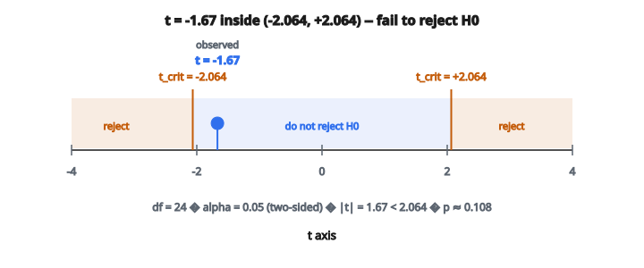

# Kiểm định t một mẫu

## Kiểm định t một mẫu là gì?

**Kiểm định t một mẫu** (one-sample t-test) xác định liệu trung bình của một mẫu có khác biệt có ý nghĩa thống kê so với trung bình quần thể đã biết hoặc giả định hay không.

Nó trả lời câu hỏi: "Trung bình mẫu quan sát có khác với điều ta kỳ vọng dưới giả thuyết không hay không?"

Được William Sealy Gosset phát triển dưới bút danh "Student" năm 1908.

## Khi nào dùng kiểm định t một mẫu

Dùng kiểm định này khi:

* Có một mẫu dữ liệu liên tục
* Muốn so sánh trung bình mẫu với một giá trị đã biết
* Độ lệch chuẩn quần thể chưa biết
* Dữ liệu xấp xỉ phân phối chuẩn (hoặc mẫu đủ lớn)

**Ví dụ:**

* Chiều cao trung bình của sinh viên có khác trung bình quốc gia không?
* Thời gian phản hồi trung bình có khác 100ms không?
* Điểm thi trung bình có khác 75 không?

## Các giả thuyết

**Giả thuyết không ($H_0$):**

Trung bình quần thể bằng giá trị giả định.

$$
H_0: \mu = \mu_0
$$

**Giả thuyết đối ($H_1$):**

**Hai phía:** $H_1: \mu \neq \mu_0$ (trung bình khác)

**Một phía trái:** $H_1: \mu < \mu_0$ (trung bình nhỏ hơn)

**Một phía phải:** $H_1: \mu > \mu_0$ (trung bình lớn hơn)

## Thống kê t

Thống kê kiểm định đo trung bình mẫu cách trung bình giả định bao nhiêu lần sai số chuẩn:

$$
t = \frac{\bar{x} - \mu_0}{s / \sqrt{n}}
$$

với:

* $\bar{x}$ = trung bình mẫu
* $\mu_0$ = trung bình quần thể giả định
* $s$ = độ lệch chuẩn mẫu
* $n$ = cỡ mẫu
* $s / \sqrt{n}$ = sai số chuẩn của trung bình

## Hiểu thống kê t

**$|t|$ lớn:** Trung bình mẫu cách xa $\mu_0$ theo đơn vị sai số chuẩn. Bằng chứng chống lại $H_0$.

**$|t|$ nhỏ:** Trung bình mẫu gần $\mu_0$. Phù hợp với $H_0$.

**Dấu của $t$:**

* Dương: $\bar{x} > \mu_0$
* Âm: $\bar{x} < \mu_0$

## Phân phối t

Dưới $H_0$, thống kê t tuân theo **phân phối t** với $n-1$ degrees of freedom.

**Tính chất của phân phối t:**

* Đối xứng quanh 0
* Hình chuông giống phân phối chuẩn
* Đuôi dày hơn chuẩn (xác suất ở cực trị lớn hơn)
* Tiến tới chuẩn khi $df \to \infty$

**Vì sao đuôi dày hơn?**

Ta ước lượng $\sigma$ bằng $s$, đưa thêm bất định. Đuôi dày phản ánh bất định đó.

## Degrees of freedom

$$
df = n - 1
$$

Mất một bậc tự do vì ước lượng trung bình từ dữ liệu.

**Ảnh hưởng của df:**

* df nhỏ: phân phối rộng hơn, đuôi dày hơn
* df lớn: tiến tới chuẩn tắc
* $df \geq 30$: phân phối t rất gần chuẩn

## Quy trình từng bước

**Bước 1:** Phát biểu giả thuyết ($H_0$ và $H_1$)

**Bước 2:** Chọn mức ý nghĩa $\alpha$ (thường 0.05)

**Bước 3:** Tính trung bình mẫu $\bar{x}$ và độ lệch chuẩn $s$

**Bước 4:** Tính thống kê t

**Bước 5:** Xác định p-value hoặc giá trị tới hạn

**Bước 6:** Quyết định:

* Nếu p-value $< \alpha$, bác bỏ $H_0$
* Nếu $|t| > t_{critical}$, bác bỏ $H_0$

## Ví dụ số

**Câu hỏi nghiên cứu:**
Một công ty tuyên bố pin dùng trung bình 500 giờ. Một mẫu 25 pin có tuổi thọ trung bình 490 giờ với độ lệch chuẩn 30 giờ. Trung bình có khác 500 không?

**Bước 1: Giả thuyết**

$H_0: \mu = 500$

$H_1: \mu \neq 500$ (hai phía)

**Bước 2: Mức ý nghĩa**

$\alpha = 0.05$

**Bước 3: Tính thống kê t**

$\bar{x} = 490$, $\mu_0 = 500$, $s = 30$, $n = 25$

$$
\begin{aligned}
t &= \frac{490 - 500}{30 / \sqrt{25}} = \frac{-10}{30/5} = \frac{-10}{6} = -1.67
\end{aligned}
$$

**Bước 4: Degrees of freedom**

$df = 25 - 1 = 24$

**Bước 5: Giá trị tới hạn và p-value**

Với kiểm định hai phía tại $\alpha = 0.05$ và $df = 24$:

$t_{critical} = \pm 2.064$

p-value $\approx 0.108$ (từ bảng phân phối t hoặc máy tính)

**Bước 6: Quyết định**

$|t| = 1.67 < 2.064$ và p-value = 0.108 > 0.05

**Không bác bỏ $H_0$.** Không đủ bằng chứng rằng tuổi thọ pin trung bình khác 500 giờ.

::: {#fig-67-t-statistic fig-cap="Với df = 24 và α = 0.05, t = −1.67 nằm trong khoảng (−2.064, 2.064) nên không bác bỏ H₀ (p ≈ 0.108)." fig-alt="Trục t với t = -1.67 nằm giữa các biên tới hạn ±2.064; vùng bác bỏ ở hai đuôi, không bác bỏ H0"}
{fig-align="center"}
:::

## Giá trị tới hạn

Các giá trị tới hạn thường dùng cho kiểm định hai phía tại $\alpha = 0.05$:

* $df = 10$: $t_{crit} = \pm 2.228$
* $df = 20$: $t_{crit} = \pm 2.086$
* $df = 30$: $t_{crit} = \pm 2.042$
* $df = 60$: $t_{crit} = \pm 2.000$
* $df = \infty$: $t_{crit} = \pm 1.96$ (chuẩn)

Với kiểm định một phía, dùng $\alpha$ thay vì $\alpha/2$.

## Diễn giải p-value

p-value là xác suất quan sát được thống kê t ít nhất cực đoan bằng giá trị đã tính, giả sử $H_0$ đúng.

**Kiểm định hai phía:**

$$
\text{p-value} = 2 \times P(T > |t|)
$$

**Kiểm định một phía (phải):**

$$
\text{p-value} = P(T > t)
$$

**Kiểm định một phía (trái):**

$$
\text{p-value} = P(T < t)
$$

## Cách tiếp cận khoảng tin cậy

Một khoảng tin cậy $(1-\alpha) \times 100\%$ cho $\mu$:

$$
\bar{x} \pm t_{\alpha/2, n-1} \times \frac{s}{\sqrt{n}}
$$

Nếu $\mu_0$ **không** nằm trong khoảng, bác bỏ $H_0$ ở mức $\alpha$.

**Ví dụ:** Với dữ liệu pin:

$$
\begin{aligned}
CI &= 490 \pm 2.064 \times \frac{30}{5} = 490 \pm 12.38 = [477.62, 502.38]
\end{aligned}
$$

Vì 500 **nằm trong** khoảng, ta không bác bỏ $H_0$ (khớp kết luận trước đó).

## Giả định

**1. Lấy mẫu ngẫu nhiên**

Các quan sát được chọn ngẫu nhiên từ quần thể.

**2. Độc lập**

Các quan sát độc lập với nhau.

**3. Chuẩn**

Quần thể phân phối chuẩn, **hoặc** cỡ mẫu lớn ($n \geq 30$, theo định lý giới hạn trung tâm).

**4. Không có outlier cực đoan**

Outlier có thể làm lệch trung bình và phình độ lệch chuẩn.

## Kiểm tra tính chuẩn

**Phương pháp trực quan:**

* Histogram: nên xấp xỉ hình chuông
* Q-Q plot: các điểm nên bám đường chéo

**Kiểm định hình thức:**

* Shapiro-Wilk test
* Kolmogorov-Smirnov test

**Quy tắc thực hành:**

* $n \geq 30$: CLT áp dụng, tính chuẩn ít quan trọng hơn
* $n < 30$: kiểm tra tính chuẩn cẩn thận

## Effect size: Cohen's d

Thống kê t phụ thuộc cỡ mẫu. Để đo effect size, dùng Cohen's d:

$$
d = \frac{\bar{x} - \mu_0}{s}
$$

**Diễn giải:**

* $|d| = 0.2$: effect nhỏ
* $|d| = 0.5$: effect trung bình
* $|d| = 0.8$: effect lớn

**Ví dụ:** $d = (490 - 500)/30 = -0.33$ (effect nhỏ đến trung bình)

## Power của kiểm định

**Power** = xác suất bác bỏ đúng $H_0$ khi $H_1$ đúng.

$$
\text{Power} = 1 - \beta
$$

với $\beta$ là xác suất lỗi Type II (âm tính giả).

**Yếu tố ảnh hưởng power:**

* Cỡ mẫu lớn hơn $\to$ power cao hơn
* Effect size lớn hơn $\to$ power cao hơn
* $\alpha$ lớn hơn $\to$ power cao hơn
* Phương sai nhỏ hơn $\to$ power cao hơn

## Xác định cỡ mẫu

Để đạt power mong muốn khi phát hiện effect size $d$:

$$
n \approx \frac{2(z_{\alpha/2} + z_{\beta})^2}{d^2}
$$

Với power 80% ($z_{\beta} = 0.84$) tại $\alpha = 0.05$ ($z_{\alpha/2} = 1.96$):

$$
n \approx \frac{2(1.96 + 0.84)^2}{d^2} = \frac{15.68}{d^2}
$$

Với $d = 0.5$: $n \approx 63$

## Kiểm định t một mẫu so với z-test

**Z-test:**

* Độ lệch chuẩn quần thể $\sigma$ đã biết
* Dùng phân phối chuẩn tắc
* Hiếm khi phù hợp trong thực tế

**t-test:**

* Độ lệch chuẩn quần thể chưa biết
* Dùng phân phối t
* Hầu như luôn là lựa chọn phù hợp

Khi $n$ lớn, cả hai cho kết quả gần như giống nhau.

## Quan hệ với khoảng tin cậy

Có tương ứng trực tiếp:

* Bác bỏ $H_0: \mu = \mu_0$ ở mức $\alpha$ $\Leftrightarrow$ $\mu_0$ không nằm trong khoảng tin cậy $(1-\alpha)$

Điều này cho hai cách tương đương để kiểm định giả thuyết.

## Các lỗi thường gặp

**1. Dùng z-test khi $\sigma$ chưa biết**

Luôn dùng t-test khi ước lượng $\sigma$ từ dữ liệu.

**2. Bỏ qua giả định**

Thiếu tính chuẩn với mẫu nhỏ làm kiểm định không còn hợp lệ.

**3. Nhầm ý nghĩa thống kê với ý nghĩa thực tiễn**

Khác biệt nhỏ có thể có ý nghĩa thống kê khi $n$ lớn.

**4. So sánh nhiều lần**

Kiểm định nhiều giả thuyết làm tăng tỷ lệ lỗi Type I.

## Thay thế khi giả định không thỏa

**Dữ liệu không chuẩn với mẫu nhỏ:**

* Wilcoxon signed-rank test (phi tham số)
* Sign test

**Có outlier:**

* Cắt outlier hoặc dùng phương pháp robust
* Cân nhắc kiểm định dựa trên trung vị

**Mẫu rất nhỏ ($n < 10$):**

* Cân nhắc exact tests hoặc phương pháp bootstrap

## Ứng dụng trong machine learning

**A/B testing:**

* So sánh metric với baseline
* Kiểm tra feature mới có cải thiện hiệu năng không

**Đánh giá mô hình:**

* Sai số trung bình có khác 0 có ý nghĩa không?
* Bias dự đoán của mô hình có ý nghĩa không?

**Phân tích feature:**

* Kiểm tra trung bình feature có khác kỳ vọng triển khai không

## Code
```python
import numpy as np

def t_test_one_sample(x, mu0):
    """
    Compute one-sample t-statistic.
    """
    x = np.asarray(x, dtype=float)
    n = len(x)
    if n < 2:
        raise ValueError("Need at least 2 samples for t-test")
    x_bar = np.mean(x)
    s = np.sqrt(np.sum((x - x_bar) ** 2) / (n - 1))
    se = s / np.sqrt(n)
    t_stat = (x_bar - mu0) / se
    return float(t_stat)
```

<!-- auto-self-check -->

::: {.callout-note}
## Kiểm tra nhanh
<details>
<summary>Ý chính của bài «Kiểm định t một mẫu» là gì?</summary>
**Kiểm định t một mẫu** (one-sample t-test) xác định liệu trung bình của một mẫu có khác biệt có ý nghĩa thống kê so với trung bình quần thể đã biết hoặc giả định hay không.
</details>
<details>
<summary>Công thức / quan hệ cốt lõi trong bài là gì?</summary>
$$H_0: \mu = \mu_0$$
</details>
:::
