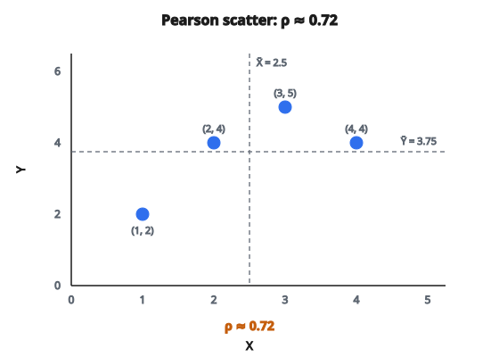

# Ma trận tương quan Pearson

## Correlation Pearson là gì?

**Pearson correlation** đo quan hệ tuyến tính giữa hai biến, cho giá trị trong khoảng $[-1, +1]$. Correlation $+1$ nghĩa là quan hệ tuyến tính dương hoàn hảo, $-1$ là quan hệ tuyến tính âm hoàn hảo, và $0$ nghĩa là không có quan hệ tuyến tính. Ma trận correlation Pearson tính correlation giữa mọi cặp feature trong dataset.

## Vì sao correlation quan trọng

**Feature selection**:
Các feature có correlation cao mang thông tin dư thừa. Loại bỏ một trong chúng có thể giảm chiều mà không mất sức dự đoán.

**Hiểu quan hệ**: Correlation cho thấy biến nào chuyển động cùng nhau, hỗ trợ feature engineering và diễn giải mô hình.

**Kiểm tra giả thiết**: Nhiều phương pháp thống kê giả định lỗi hoặc feature không tương quan.

**Bất biến theo thang đo**: Khác với covariance, correlation được chuẩn hóa và so sánh được giữa các thang đo khác nhau.

## Công thức Pearson correlation

Với hai biến $X_i$ và $X_j$ có $N$ quan sát:

$$
\rho_{ij} = \frac{\operatorname{Cov}(X_i, X_j)}{\sigma_i \sigma_j}
$$

Trong đó:

* $\operatorname{Cov}(X_i, X_j)$ là covariance giữa $X_i$ và $X_j$
* $\sigma_i$ là độ lệch chuẩn của $X_i$
* $\sigma_j$ là độ lệch chuẩn của $X_j$

**Dạng khai triển**:

$$
\rho_{ij} = \frac{\sum_{k=1}^{N} (x_{ki} - \bar{x}_i)(x_{kj} - \bar{x}_j)}{\sqrt{\sum_{k=1}^{N} (x_{ki} - \bar{x}_i)^2} \cdot \sqrt{\sum_{k=1}^{N} (x_{kj} - \bar{x}_j)^2}}
$$

## Dạng ma trận

Với dataset có $D$ feature, ma trận correlation $R$ có kích thước $D \times D$:

$$
R = \frac{\Sigma}{\sigma \sigma^T}
$$

Trong đó:

* $\Sigma$ là ma trận covariance
* $\sigma$ là vector cột các độ lệch chuẩn
* $\sigma \sigma^T$ là tích ngoài tạo ma trận các giá trị $\sigma_i \cdot \sigma_j$

**Theo từng phần tử**:

$$
R_{ij} = \frac{\Sigma_{ij}}{\sigma_i \cdot \sigma_j}
$$

## Tính chất của ma trận correlation

**Đối xứng**: $R_{ij} = R_{ji}$ (correlation giữa $X_i$ và $X_j$ bằng correlation giữa $X_j$ và $X_i$)

**Đường chéo bằng 1**: $R_{ii} = 1$ (mọi biến tương quan hoàn hảo với chính nó)

**Giá trị bị chặn**: $-1 \leq R_{ij} \leq 1$ với mọi $i, j$

**Nửa xác định dương**: Mọi trị riêng không âm

## Diễn giải giá trị correlation

**Dương mạnh** ($\rho > 0.7$): Khi một biến tăng, biến kia thường tăng rõ rệt

**Dương vừa** ($0.3 < \rho < 0.7$): Quan hệ dương nhưng còn nhiều phân tán

**Yếu / không correlation** ($-0.3 < \rho < 0.3$): Ít hoặc không có quan hệ tuyến tính

**Âm vừa** ($-0.7 < \rho < -0.3$): Quan hệ âm kèm phân tán

**Âm mạnh** ($\rho < -0.7$): Khi một biến tăng, biến kia thường giảm rõ rệt

## Ví dụ số

**Dataset** (4 mẫu, 2 feature):

* Sample 0: $X = 1$, $Y = 2$
* Sample 1: $X = 2$, $Y = 4$
* Sample 2: $X = 3$, $Y = 5$
* Sample 3: $X = 4$, $Y = 4$

### Bước 1 — Tính trung bình

$$
\bar{X} = \frac{1 + 2 + 3 + 4}{4} = 2.5
$$

$$
\bar{Y} = \frac{2 + 4 + 5 + 4}{4} = 3.75
$$

### Bước 2 — Tính độ lệch

* $(X - \bar{X})$: $[-1.5, -0.5, 0.5, 1.5]$
* $(Y - \bar{Y})$: $[-1.75, 0.25, 1.25, 0.25]$

### Bước 3 — Tính covariance

$$
\operatorname{Cov}(X, Y) = \frac{(-1.5)(-1.75) + (-0.5)(0.25) + (0.5)(1.25) + (1.5)(0.25)}{3}
$$

$$
\begin{aligned}
\operatorname{Cov}(X, Y) &= \frac{2.625 - 0.125 + 0.625 + 0.375}{3} \\
&= \frac{3.5}{3} \approx 1.167
\end{aligned}
$$

### Bước 4 — Tính độ lệch chuẩn

$$
\sigma_X = \sqrt{\frac{(-1.5)^2 + (-0.5)^2 + (0.5)^2 + (1.5)^2}{3}} = \sqrt{\frac{5}{3}} \approx 1.29
$$

$$
\sigma_Y = \sqrt{\frac{(-1.75)^2 + (0.25)^2 + (1.25)^2 + (0.25)^2}{3}} = \sqrt{\frac{4.75}{3}} \approx 1.26
$$

### Bước 5 — Tính correlation

$$
\rho_{XY} = \frac{1.167}{1.29 \times 1.26} \approx \frac{1.167}{1.625} \approx 0.72
$$

**Diễn giải**: Correlation dương mạnh giữa $X$ và $Y$.

::: {#fig-42-pearson-scatter fig-cap="Bốn điểm ví dụ và ρ ≈ 0.72; xu hướng dương khớp correlation mạnh trong phép tính." fig-alt="Biểu đồ phân tán bốn điểm (1,2), (2,4), (3,5), (4,4) với ρ ≈ 0.72; đánh dấu tùy chọn X̄ = 2.5, Ȳ = 3.75."}
{fig-align="center"}
:::

## Xử lý feature phương sai bằng không

Khi một feature có phương sai bằng không (mọi giá trị giống nhau):

$$
\sigma_i = 0 \Rightarrow \rho_{ij} = \frac{\operatorname{Cov}}{0 \cdot \sigma_j} = \text{undefined}
$$

**Cách xử lý chuẩn**: Trả về NaN cho mọi correlation liên quan đến feature phương sai bằng không

**Lý do**: Feature hằng số không có quan hệ với bất kỳ biến nào vì nó không bao giờ biến thiên

## Kiểm tra đầu vào

**Số mẫu tối thiểu**: Correlation cần ít nhất $N \geq 2$ mẫu để tính phương sai

**Số chiều**: Đầu vào phải là 2D (samples × features)

**Đầu vào không hợp lệ**: Trả về None khi:

* $N < 2$ mẫu
* Mảng không phải 2D
* Mảng rỗng

## Tính toán vector hóa

Để tính toàn bộ ma trận correlation hiệu quả:

1. **Trung tâm hóa dữ liệu**: Trừ trung bình từng cột
2. **Tính ma trận covariance**: $\Sigma = \tilde{X}^T \tilde{X} / (N-1)$
3. **Lấy độ lệch chuẩn**: $\sigma = \sqrt{\operatorname{diag}(\Sigma)}$
4. **Chuẩn hóa**: $R = \Sigma / (\sigma \sigma^T)$

Cách này tránh vòng lặp lồng theo từng cặp feature và tận dụng phép nhân ma trận tối ưu.

## Correlation so với covariance

**Covariance**:

* Đo biến thiên đồng thời
* Phụ thuộc thang đo (đơn vị quan trọng)
* Miền: $(-\infty, +\infty)$
* Khó diễn giải độ lớn

**Correlation**:

* Covariance đã chuẩn hóa
* Độc lập thang đo (không thứ nguyên)
* Miền: $[-1, +1]$
* Diễn giải trực tiếp

**Quan hệ**: Correlation = Covariance / (tích các độ lệch chuẩn)

## Hạn chế của Pearson correlation

**Chỉ quan hệ tuyến tính**: Quan hệ bậc hai hoàn hảo ($Y = X^2$) có thể cho Pearson correlation bằng không

**Nhạy với outlier**: Một điểm cực đoan có thể làm thay đổi mạnh correlation

**Không robust**: Phân phối không chuẩn có thể làm lệch diễn giải

**Thay thế**:

* Spearman correlation (dựa trên hạng, bắt quan hệ đơn điệu phi tuyến)
* Kendall tau (cũng dựa trên hạng, robust hơn với outlier)
* Distance correlation (phát hiện phụ thuộc phi tuyến)

## Pearson correlation xuất hiện ở đâu

* **Feature selection**: Nhận diện và loại feature dư thừa
* **Exploratory data analysis**: Hiểu quan hệ biến trước khi mô hình hóa
* **Tài chính**: Correlation lợi suất tài sản để đa dạng hóa danh mục
* **Genomics**: Mạng correlation biểu hiện gene
* **Xử lý tín hiệu**: Cross-correlation để căn chỉnh tín hiệu
* **Kiểm soát chất lượng**: Theo dõi correlation giữa các biến quy trình
* **Tâm lý học**: Correlation điểm kiểm tra và đo lường
* **Khí hậu học**: Correlation nhiệt độ, lượng mưa và các biến khác

## Code
```python
import numpy as np

def pearson_correlation(X):
    """
    Compute Pearson correlation matrix from dataset X.
    """
    X = np.asarray(X, dtype=float)
    if X.ndim != 2 or X.shape[0] < 2:
        return None
    N = X.shape[0]
    mu = X.mean(axis=0)
    Xc = X - mu
    cov = (Xc.T @ Xc) / (N - 1)
    std = np.sqrt(np.diag(cov))
    outer = np.outer(std, std)
    with np.errstate(divide="ignore", invalid="ignore"):
        corr = np.where(outer == 0, np.nan, cov / outer)
    np.fill_diagonal(corr, np.where(std == 0, np.nan, 1.0))
    return corr
```
