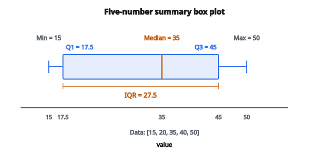

# Percentile / Quantile

## Percentile là gì?

Một percentile cho biết **vị trí tương đối** của một giá trị trong tập dữ liệu. Percentile thứ $p$ là một giá trị mà dưới đó có $p$ phần trăm dữ liệu.

**Ví dụ:** Nếu điểm thi của bạn ở percentile thứ 90, bạn cao hơn 90% người dự thi.

Percentile được dùng để hiểu phân phối, nhận diện outlier, và so sánh giá trị giữa các thang đo khác nhau.

## Định nghĩa hình thức

Percentile thứ $p$ (với $0 \leq p \leq 100$) là một giá trị $x_p$ sao cho:

* Ít nhất $p\%$ dữ liệu $\leq x_p$
* Ít nhất $(100-p)\%$ dữ liệu $\geq x_p$

**Lưu ý:** Có nhiều phương pháp tính percentile, nhất là khi percentile rơi giữa các điểm dữ liệu.

## Các percentile đặc biệt

**Quartile chia dữ liệu thành bốn phần:**

* Q1 (percentile thứ 25): quartile thứ nhất
* Q2 (percentile thứ 50): quartile thứ hai = median
* Q3 (percentile thứ 75): quartile thứ ba

**Decile chia dữ liệu thành mười phần:**

* Các percentile thứ 10, 20, 30, ..., 90

**Median là percentile thứ 50:**

* Một nửa dữ liệu thấp hơn, một nửa cao hơn

## Tính percentile: phương pháp cơ bản

**Bước 1:** Sắp xếp dữ liệu tăng dần

**Bước 2:** Tính vị trí rank:

$$
L = \frac{p}{100} \times (n + 1)
$$

với $p$ là percentile và $n$ là cỡ mẫu.

**Bước 3:**

* Nếu $L$ là số nguyên, percentile là giá trị ở vị trí $L$
* Nếu $L$ không nguyên, nội suy giữa các giá trị kề nhau

## Ví dụ số: tính percentile

**Dữ liệu:** $[15, 20, 35, 40, 50]$ ($n = 5$, đã sắp xếp)

**Tìm percentile thứ 25 (Q1):**

$$
L = \frac{25}{100} \times (5 + 1) = 0.25 \times 6 = 1.5
$$

Vị trí 1.5 nghĩa là: nội suy giữa vị trí 1 và 2

$$
P_{25} = x_1 + 0.5 \times (x_2 - x_1) = 15 + 0.5 \times (20 - 15) = 15 + 2.5 = 17.5
$$

**Tìm percentile thứ 50 (median):**

$$
L = \frac{50}{100} \times 6 = 3
$$

Vị trí 3 đúng bằng giá trị thứ 3.

$$
P_{50} = 35
$$

**Tìm percentile thứ 75 (Q3):**

$$
L = \frac{75}{100} \times 6 = 4.5
$$

$$
P_{75} = x_4 + 0.5 \times (x_5 - x_4) = 40 + 0.5 \times (50 - 40) = 45
$$

## Các phương pháp tính thay thế

Có nhiều quy ước để tính percentile. Các phương pháp phổ biến gồm:

**Phương pháp 1: Nội suy tuyến tính (phổ biến nhất)**

Dùng trong ví dụ trên. Nội suy giữa các điểm dữ liệu kề nhau.

**Phương pháp 2: Nearest rank**

Làm tròn $L$ về số nguyên gần nhất rồi lấy giá trị đó. Không nội suy.

**Phương pháp 3: Exclusive method**

$$
L = \frac{p}{100} \times (n + 1)
$$

**Phương pháp 4: Inclusive method**

$$
L = \frac{p}{100} \times (n - 1) + 1
$$

Các phần mềm khác nhau dùng phương pháp khác nhau. Kết quả có thể lệch nhẹ với mẫu nhỏ.

## Interquartile Range (IQR)

IQR đo độ phân tán của 50% dữ liệu giữa:

$$
\text{IQR} = Q3 - Q1 = P_{75} - P_{25}
$$

**Tính chất:**

* Thước đo độ phân tán bền vững
* Không bị ảnh hưởng bởi outlier
* Dùng trong box plot

**Ví dụ:** Nếu $Q1 = 17.5$ và $Q3 = 45$:

$$
\text{IQR} = 45 - 17.5 = 27.5
$$

## Dùng IQR để phát hiện outlier

Một quy tắc phổ biến định nghĩa outlier là các giá trị nằm ngoài:

**Lower fence:** $Q1 - 1.5 \times \text{IQR}$

**Upper fence:** $Q3 + 1.5 \times \text{IQR}$

**Ví dụ:** Với $Q1 = 17.5$, $Q3 = 45$, $\text{IQR} = 27.5$:

$$
\begin{aligned}
\text{Lower fence} &= 17.5 - 1.5 \times 27.5 = 17.5 - 41.25 = -23.75 \\
\text{Upper fence} &= 45 + 1.5 \times 27.5 = 45 + 41.25 = 86.25
\end{aligned}
$$

Các giá trị dưới $-23.75$ hoặc trên $86.25$ sẽ bị đánh dấu là outlier.

## Five-number summary

Five-number summary gồm:

1. Minimum
2. Q1 (percentile thứ 25)
3. Median (percentile thứ 50)
4. Q3 (percentile thứ 75)
5. Maximum

Tóm tắt này nắm hình dạng và độ phân tán của phân phối, và là nền tảng của box plot.

**Ví dụ:** Với dữ liệu $[15, 20, 35, 40, 50]$:

* Min = 15
* Q1 = 17.5
* Median = 35
* Q3 = 45
* Max = 50

::: {#fig-65-five-number-summary fig-cap="Box plot của [15, 20, 35, 40, 50]: Min $=15$, Q1 $=17.5$, Median $=35$, Q3 $=45$, Max $=50$, IQR $=27.5$." fig-alt="Box plot five-number summary cho [15,20,35,40,50]: Min=15, Q1=17.5, Median=35, Q3=45, Max=50, IQR=27.5."}
{fig-align="center"}
:::

## Box plot (box-and-whisker plot)

Box plot trực quan hóa five-number summary:

* **Box:** trải từ Q1 đến Q3
* **Đường trong box:** median
* **Whisker:** kéo tới min/max (hoặc tới fence, với outlier hiện thành điểm)

Box plot cho phép so sánh nhanh phân phối giữa các nhóm.

## Percentile rank

Percentile rank của một giá trị $x$ cho biết phần trăm dữ liệu nằm tại hoặc dưới $x$:

$$
\text{Percentile Rank}(x) = \frac{\text{number of values} \leq x}{n} \times 100
$$

**Ví dụ:** Trong dữ liệu $[15, 20, 35, 40, 50]$, percentile rank của 35 là bao nhiêu?

Có 3 giá trị $\leq 35$ (15, 20, 35)

$$
\text{Percentile rank} = \frac{3}{5} \times 100 = 60\%
$$

Giá trị 35 ở percentile thứ 60.

## Percentiles vs quantiles

**Percentile:** chia dữ liệu thành 100 phần (thứ 0 đến thứ 100)

**Quartile:** chia dữ liệu thành 4 phần (Q1, Q2, Q3)

**Decile:** chia dữ liệu thành 10 phần

**Quantile:** thuật ngữ tổng quát cho mọi kiểu chia

* Quantile 0.25 = percentile thứ 25 = Q1
* Quantile 0.5 = percentile thứ 50 = median

## Percentile của các phân phối phổ biến

**Phân phối Normal:**

Với $N(\mu, \sigma^2)$:

* Percentile thứ 50 = $\mu$
* Percentile thứ 84 $\approx \mu + \sigma$
* Percentile thứ 97.5 $\approx \mu + 2\sigma$
* Percentile thứ 16 $\approx \mu - \sigma$
* Percentile thứ 2.5 $\approx \mu - 2\sigma$

Các giá trị này tương ứng với standard score (z-score).

## Z-score và percentile

Với phân phối Normal, z-score cho biết cách mean bao nhiêu độ lệch chuẩn:

$$
z = \frac{x - \mu}{\sigma}
$$

**Các z-score phổ biến và percentile:**

* $z = -2$: percentile thứ 2.3
* $z = -1$: percentile thứ 15.9
* $z = 0$: percentile thứ 50
* $z = 1$: percentile thứ 84.1
* $z = 2$: percentile thứ 97.7

## Ứng dụng của percentile

**Kiểm tra chuẩn hóa:**

* SAT, GRE báo cáo percentile rank
* “Percentile thứ 90” nghĩa là bạn vượt 90% người dự thi

**Thu nhập và tài sản:**

* “Top 1%” tương ứng percentile thứ 99
* Median income thường giàu thông tin hơn mean

**Biểu đồ tăng trưởng:**

* Chiều cao/cân nặng trẻ em được báo dưới dạng percentile
* “Percentile thứ 25 về chiều cao” nghĩa là 25% trẻ cùng tuổi thấp hơn

**Hiệu năng website:**

* Thời gian phản hồi ở percentile thứ 95
* Nắm trải nghiệm người dùng điển hình tốt hơn mean

## Percentile trong machine learning

**Feature scaling:**

* Scaling theo percentile (ví dụ scale về $[0, 100]$ theo percentile rank)
* Bền vững với outlier hơn min-max scaling

**Quantile regression:**

* Dự đoán các percentile khác nhau, không chỉ mean
* Hữu ích cho khoảng dự đoán (prediction interval)

**Phát hiện anomaly:**

* Đánh dấu giá trị ngoài một số percentile nhất định là anomaly
* Ví dụ: giá trị dưới percentile thứ 1 hoặc trên percentile thứ 99

**Đánh giá mô hình:**

* Báo cáo percentile của phân phối lỗi
* Lỗi ở percentile thứ 90 cho thấy hiệu năng trường hợp xấu

## Tính percentile hiệu quả

**Với tập dữ liệu nhỏ:**

* Sắp xếp dữ liệu: $O(n \log n)$
* Truy cập vị trí cần thiết: $O(1)$

**Với một percentile đơn lẻ:**

* Thuật toán selection (quickselect): trung bình $O(n)$
* Không cần sắp xếp toàn bộ tập dữ liệu

**Với dữ liệu streaming:**

* Thuật toán xấp xỉ (t-digest, quantile sketches)
* Duy trì percentile xấp xỉ với bộ nhớ bị chặn

## Percentile vs mean và độ lệch chuẩn

**Mean và SD:**

* Giả định phân phối đối xứng
* Nhạy với outlier
* Hữu ích với dữ liệu gần Normal

**Percentile:**

* Không giả định dạng phân phối
* Bền vững với outlier
* Nắm được tính bất đối xứng của phân phối

Với phân phối lệch, báo cáo Q1, median, Q3 thường giàu thông tin hơn mean và SD.

## Code
```python
import numpy as np

def percentiles(x, q):
    """
    Compute percentiles using linear interpolation.
    """
    x = np.asarray(x, dtype=float)
    q = np.asarray(q, dtype=float)
    return np.percentile(x, q, method="linear")
```

<!-- auto-self-check -->

::: {.callout-note}
## Kiểm tra nhanh
<details>
<summary>Ý chính của bài «Percentile / Quantile» là gì?</summary>
Một percentile cho biết **vị trí tương đối** của một giá trị trong tập dữ liệu.
</details>
<details>
<summary>Công thức / quan hệ cốt lõi trong bài là gì?</summary>
$$L = \frac{p}{100} \times (n + 1)$$
</details>
:::
