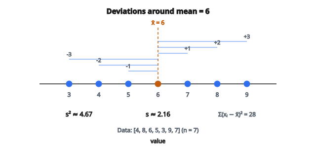

# Phương sai mẫu & độ lệch chuẩn

## Variance là gì?

Variance đo **độ phân tán** (spread / dispersion) của các điểm dữ liệu quanh mean. Nó định lượng mức các giá trị thường lệch khỏi trung bình bao xa.

**Variance cao:** các điểm dữ liệu nằm xa mean.

**Variance thấp:** các điểm dữ liệu tụ gần mean.

**Variance bằng 0:** mọi điểm dữ liệu giống hệt nhau.

## Population vs sample

**Phương sai quần thể ($\sigma^2$):**

Dùng khi bạn có dữ liệu của toàn bộ population.

$$
\sigma^2 = \frac{1}{N}\sum_{i=1}^{N}(x_i - \mu)^2
$$

**Phương sai mẫu ($s^2$):**

Dùng khi bạn có một sample lấy từ population lớn hơn.

$$
s^2 = \frac{1}{n-1}\sum_{i=1}^{n}(x_i - \bar{x})^2
$$

Khác biệt then chốt là chia cho $n-1$ thay vì $n$ với sample.

## Vì sao chia cho $n-1$? (Bessel's correction)

Phương sai mẫu dùng $n-1$ thay vì $n$ vì:

**1. Không chệch (unbiasedness):**

Chia cho $n$ sẽ ước lượng thấp phương sai quần thể. Dùng $n-1$ làm $s^2$ thành **ước lượng không chệch** của $\sigma^2$:

$$
\mathbb{E}[s^2] = \sigma^2
$$

**2. Bậc tự do (degrees of freedom):**

Sau khi tính sample mean $\bar{x}$, chỉ còn $n-1$ độ lệch “tự do” thay đổi. Độ lệch cuối bị ràng buộc bởi tổng các độ lệch bằng 0:

$$
\sum_{i=1}^{n}(x_i - \bar{x}) = 0
$$

## Tính phương sai mẫu từng bước

**Bước 1:** Tính sample mean $\bar{x}$

**Bước 2:** Trừ mean khỏi mỗi điểm dữ liệu để được các độ lệch (deviations)

**Bước 3:** Bình phương từng độ lệch

**Bước 4:** Cộng các bình phương độ lệch

**Bước 5:** Chia cho $n-1$

## Ví dụ số

**Dữ liệu:** $[4, 8, 6, 5, 3, 9, 7]$ ($n = 7$)

**Bước 1: Tính mean**

$$
\bar{x} = \frac{4 + 8 + 6 + 5 + 3 + 9 + 7}{7} = \frac{42}{7} = 6
$$

**Bước 2: Tính các độ lệch**

* $4 - 6 = -2$
* $8 - 6 = 2$
* $6 - 6 = 0$
* $5 - 6 = -1$
* $3 - 6 = -3$
* $9 - 6 = 3$
* $7 - 6 = 1$

**Bước 3: Bình phương các độ lệch**

$(-2)^2 = 4$, $2^2 = 4$, $0^2 = 0$, $(-1)^2 = 1$, $(-3)^2 = 9$, $3^2 = 9$, $1^2 = 1$

**Bước 4: Tổng bình phương độ lệch**

$$
\sum(x_i - \bar{x})^2 = 4 + 4 + 0 + 1 + 9 + 9 + 1 = 28
$$

**Bước 5: Chia cho $n-1$**

$$
s^2 = \frac{28}{7-1} = \frac{28}{6} \approx 4.67
$$

## Độ lệch chuẩn (standard deviation)

Độ lệch chuẩn là căn bậc hai của variance:

**Độ lệch chuẩn quần thể:**

$$
\sigma = \sqrt{\sigma^2} = \sqrt{\frac{1}{N}\sum_{i=1}^{N}(x_i - \mu)^2}
$$

**Độ lệch chuẩn mẫu:**

$$
s = \sqrt{s^2} = \sqrt{\frac{1}{n-1}\sum_{i=1}^{n}(x_i - \bar{x})^2}
$$

## Tiếp tục ví dụ

Từ ví dụ trước, $s^2 \approx 4.67$

$$
s = \sqrt{4.67} \approx 2.16
$$

**Diễn giải:** Trung bình, các điểm dữ liệu lệch khoảng 2.16 đơn vị so với mean bằng 6.

::: {#fig-64-sample-variance fig-cap="Với dữ liệu [4, 8, 6, 5, 3, 9, 7] và $\bar{x}=6$, các độ lệch quanh mean cho $s^2\approx 4.67$ và $s\approx 2.16$." fig-alt="Trục số với dữ liệu [4,8,6,5,3,9,7] quanh mean 6; các độ lệch -3..+3; chú thích s²≈4.67 và s≈2.16."}
{fig-align="center"}
:::

## Vì sao dùng độ lệch chuẩn?

**Cùng đơn vị với dữ liệu:**

Variance có đơn vị bình phương (ví dụ mét$^2$). Độ lệch chuẩn giữ đơn vị gốc (mét).

**Dễ diễn giải:**

Với dữ liệu gần phân phối Normal:

* Khoảng 68% dữ liệu nằm trong $\bar{x} \pm s$
* Khoảng 95% nằm trong $\bar{x} \pm 2s$
* Khoảng 99.7% nằm trong $\bar{x} \pm 3s$

## Công thức variance thay thế

Một công thức tiện về mặt tính toán:

$$
s^2 = \frac{1}{n-1}\left[\sum_{i=1}^{n}x_i^2 - \frac{(\sum_{i=1}^{n}x_i)^2}{n}\right]
$$

Hoặc tương đương:

$$
s^2 = \frac{n}{n-1}\left[\frac{\sum x_i^2}{n} - \bar{x}^2\right]
$$

Công thức này tránh tính các độ lệch tường minh.

## Dùng công thức thay thế

**Dữ liệu:** $[4, 8, 6, 5, 3, 9, 7]$

$\sum x_i = 42$

$\sum x_i^2 = 16 + 64 + 36 + 25 + 9 + 81 + 49 = 280$

$$
\begin{aligned}
s^2
&= \frac{1}{6}\left[280 - \frac{42^2}{7}\right] = \frac{1}{6}\left[280 - \frac{1764}{7}\right] \\
&= \frac{1}{6}[280 - 252] = \frac{28}{6} \approx 4.67
\end{aligned}
$$

Kết quả giống như trước.

## Tính chất của variance

**1. Luôn không âm:**

$$
s^2 \geq 0
$$

**2. Bằng 0 chỉ khi mọi giá trị bằng nhau**

**3. Cộng một hằng số không đổi variance:**

$$
\operatorname{Var}(X + c) = \operatorname{Var}(X)
$$

**4. Nhân với một hằng số:**

$$
\operatorname{Var}(cX) = c^2 \cdot \operatorname{Var}(X)
$$

**5. Biến đổi tuyến tính:**

$$
\operatorname{Var}(aX + b) = a^2 \cdot \operatorname{Var}(X)
$$

## Variance của tổng biến độc lập

Với các biến ngẫu nhiên độc lập $X$ và $Y$:

$$
\operatorname{Var}(X + Y) = \operatorname{Var}(X) + \operatorname{Var}(Y)
$$

$$
\operatorname{Var}(X - Y) = \operatorname{Var}(X) + \operatorname{Var}(Y)
$$

Lưu ý: variance vẫn cộng ngay cả khi trừ!

## Coefficient of variation

Coefficient of variation (CV) là thước đo không thứ nguyên của biến thiên tương đối:

$$
CV = \frac{s}{\bar{x}} \times 100\%
$$

**Trường hợp dùng:**

* So sánh biến thiên giữa các thang đo khác nhau
* So sánh biến thiên khi các mean khác nhau

**Ví dụ:** Hai tập dữ liệu có $s = 10$:

* Dataset A: $\bar{x} = 100$, CV = 10%
* Dataset B: $\bar{x} = 20$, CV = 50%

Dataset B có biến thiên tương đối lớn hơn.

## Standard error of the mean

Standard error (SE) đo độ bất định của sample mean:

$$
SE = \frac{s}{\sqrt{n}}
$$

Khi cỡ mẫu tăng, SE giảm (độ chính xác cao hơn).

**Ví dụ:** $s = 2.16$, $n = 7$

$$
SE = \frac{2.16}{\sqrt{7}} = \frac{2.16}{2.65} \approx 0.82
$$

## Pooled variance

Khi gộp sample từ các nhóm giả định cùng variance:

$$
s_p^2 = \frac{(n_1 - 1)s_1^2 + (n_2 - 1)s_2^2}{n_1 + n_2 - 2}
$$

Đây là trung bình có trọng số của các variance nhóm, dùng trong two-sample t-test.

## Các lựa chọn bền vững hơn

Độ lệch chuẩn nhạy với outlier. Các lựa chọn bền vững gồm:

**Median Absolute Deviation (MAD):**

$$
MAD = \text{median}(|x_i - \text{median}(x)|)
$$

**Interquartile Range (IQR):**

$$
IQR = Q3 - Q1
$$

Với dữ liệu Normal: $\sigma \approx 1.4826 \times MAD \approx 0.7413 \times IQR$

## Phương sai mẫu không chệch, độ lệch chuẩn mẫu thì có

**Phương sai mẫu:** $\mathbb{E}[s^2] = \sigma^2$ (không chệch)

**Độ lệch chuẩn mẫu:** $\mathbb{E}[s] \neq \sigma$ (hơi chệch thấp)

Độ chệch của $s$ nhỏ và giảm khi cỡ mẫu tăng. Trong hầu hết trường hợp, $s$ được dùng mà không hiệu chỉnh.

## Ổn định số học

Công thức $s^2 = \frac{\sum x_i^2 - n\bar{x}^2}{n-1}$ có thể gặp vấn đề số học khi cả $\sum x_i^2$ và $n\bar{x}^2$ đều lớn.

**Thuật toán online của Welford** tính variance trong một lần duyệt với độ ổn định số tốt:

$$
M_k = M_{k-1} + \frac{x_k - M_{k-1}}{k}
$$

$$
S_k = S_{k-1} + (x_k - M_{k-1})(x_k - M_k)
$$

$$
s^2 = \frac{S_n}{n-1}
$$

## Variance trong machine learning

**Feature scaling:**

* Standardization: $z = (x - \bar{x})/s$
* Quan trọng với các thuật toán dựa trên khoảng cách

**Đánh giá mô hình:**

* Variance của dự đoán cho biết độ ổn định của mô hình

**Bias-variance tradeoff:**

* Mô hình variance cao thì overfitting
* Variance thấp có thể underfitting

**Principal Component Analysis:**

* Tìm các hướng có variance cực đại
* Các thành phần được sắp theo variance giải thích được

## Các lỗi thường gặp

**1. Dùng $n$ thay vì $n-1$ cho sample**

Dẫn tới variance bị chệch (ước lượng thấp).

**2. Quên bình phương độ lệch chuẩn**

Variance là $s^2$, không phải $s$.

**3. Nhầm SD với SE**

SD đo độ phân tán của dữ liệu; SE đo độ bất định của mean.

**4. Cộng trực tiếp các độ lệch chuẩn**

Variance cộng được, độ lệch chuẩn thì không.

$$
\sigma_{X+Y} = \sqrt{\sigma_X^2 + \sigma_Y^2} \neq \sigma_X + \sigma_Y
$$

## Code
```python
import numpy as np

def sample_var_std(x):
    """
    Compute sample variance and standard deviation.
    """
    x = np.asarray(x, dtype=float)
    n = len(x)
    mean_x = np.mean(x)
    var = np.sum((x - mean_x) ** 2) / (n - 1)
    std = np.sqrt(var)
    return float(var), float(std)
```
