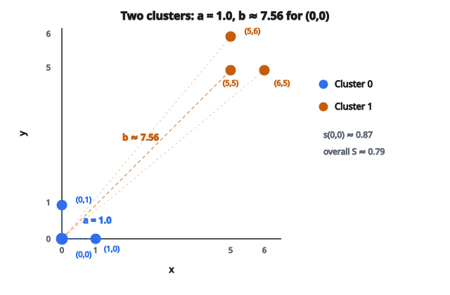

# Điểm silhouette

## Bài toán đánh giá clustering

Các thuật toán clustering như K-Means, DBSCAN, hay agglomerative clustering nhóm các điểm dữ liệu theo độ tương đồng. Nhưng khi đã có gán cluster, làm sao biết chúng tốt hay không?

Trong học có giám sát, bạn có nhãn đúng để so sánh. Trong clustering, thường không có. Bạn cần cách đánh giá chất lượng cluster chỉ từ dữ liệu và các gán đó. Đây gọi là **đánh giá nội tại** (internal evaluation).

**Điểm silhouette** là một trong những metric đánh giá clustering nội tại được dùng rộng rãi nhất. Peter Rousseeuw giới thiệu năm 1987.

## Hai đại lượng: a(i) và b(i)

Điểm silhouette được xây từ hai phép đo cho mỗi điểm dữ liệu $i$:

**a(i): Khoảng cách trong cluster (cohesion)**

$a(i)$ là khoảng cách trung bình từ điểm $i$ tới mọi điểm *khác* trong cùng cluster:

$$
a(i) = \frac{1}{|C_i| - 1} \sum_{\substack{j \in C_i \\ j \neq i}} d(i, j)
$$

với $C_i$ là cluster chứa điểm $i$, $|C_i|$ là số điểm trong cluster đó, và $d(i, j)$ là khoảng cách Euclidean giữa $i$ và $j$.

$a(i)$ đo **điểm $i$ gắn chặt với cluster của nó đến mức nào**. $a(i)$ nhỏ nghĩa là điểm gần các điểm cùng cluster. $a(i)$ lớn nghĩa là điểm lan xa khỏi chúng.

**b(i): Khoảng cách giữa cluster gần nhất (separation)**

Với mỗi cluster mà điểm $i$ *không* thuộc về, tính khoảng cách trung bình từ $i$ tới mọi điểm trong cluster đó. Sau đó lấy min trên mọi cluster như vậy:

$$
b(i) = \min_{C \neq C_i} \frac{1}{|C|} \sum_{j \in C} d(i, j)
$$

$b(i)$ đo **điểm $i$ cách cluster lân cận gần nhất bao xa**. Cluster đạt min này gọi là "neighboring cluster" của điểm $i$. Đó là cluster mà $i$ sẽ được gán nếu bị loại khỏi cluster hiện tại.

$b(i)$ lớn nghĩa là điểm tách biệt tốt khỏi mọi cluster khác. $b(i)$ nhỏ nghĩa là có cluster khác nằm sát một cách khó chịu.

## Giá trị silhouette

Với mỗi điểm $i$, giá trị silhouette kết hợp $a(i)$ và $b(i)$:

$$
s(i) = \frac{b(i) - a(i)}{\max(a(i), b(i))}
$$

Chia cho $\max(a(i), b(i))$ chuẩn hóa điểm về khoảng $[-1, 1]$.

**Hiểu công thức:**

* Tử số $b(i) - a(i)$ là hiệu thô giữa separation và cohesion. Nếu separation lớn hơn nhiều so với cohesion ($b \gg a$), tử số dương lớn. Nếu cohesion lớn hơn nhiều so với separation ($a \gg b$), tử số âm lớn.
* Mẫu số chuẩn hóa theo đại lượng lớn hơn trong hai, đảm bảo kết quả nằm trong $[-1, 1]$.

## Diễn giải điểm số

**s(i) gần +1**: Điểm nằm sâu trong cluster của nó ($a(i)$ nhỏ) và xa cluster khác gần nhất ($b(i)$ lớn). Đây là trường hợp tốt nhất. Gán cluster cho điểm này chắc chắn và đúng.

**s(i) gần 0**: Điểm nằm trên hoặc gần biên giữa hai cluster. $a(i)$ và $b(i)$ gần bằng nhau, nghĩa là điểm cách cluster của nó gần như bằng cách cluster gần kế tiếp. Việc gán mơ hồ.

**s(i) gần -1**: Điểm gần cluster lân cận hơn cluster của chính nó. $b(i) < a(i)$, nghĩa là điểm sẽ khớp tốt hơn ở cluster khác. Điều này gợi ý gán sai. Điểm có lẽ bị gán nhầm cluster.

**Điểm silhouette tổng thể** cho toàn bộ clustering là trung bình mọi giá trị silhouette cá nhân:

$$
S = \frac{1}{N} \sum_{i=1}^{N} s(i)
$$

Quy tắc thô để diễn giải điểm tổng thể:

* $S > 0.7$: Cấu trúc cluster mạnh
* $0.5 < S < 0.7$: Cấu trúc hợp lý
* $0.25 < S < 0.5$: Cấu trúc yếu, các cluster có thể chồng
* $S < 0.25$: Ít hoặc không có cấu trúc có nghĩa

Các ngưỡng này là quy tắc thực hành, không phải biên cứng. Khoảng phù hợp phụ thuộc dataset và domain.

## Ví dụ số

Xét 6 điểm trong 2D, chia thành hai cluster:

**Cluster 0**: (0,0), (0,1), (1,0)

**Cluster 1**: (5,5), (5,6), (6,5)

Với điểm (0,0) trong Cluster 0:

**Tính a(0)**: Khoảng cách trung bình tới các điểm khác trong Cluster 0:

* Khoảng cách tới (0,1) = 1.0
* Khoảng cách tới (1,0) = 1.0
* $a(0) = (1.0 + 1.0) / 2 = 1.0$

**Tính b(0)**: Khoảng cách trung bình tới mọi điểm trong Cluster 1:

* Khoảng cách tới (5,5) = $\sqrt{50} \approx 7.07$
* Khoảng cách tới (5,6) = $\sqrt{61} \approx 7.81$
* Khoảng cách tới (6,5) = $\sqrt{61} \approx 7.81$
* $b(0) = (7.07 + 7.81 + 7.81) / 3 \approx 7.56$

Vì chỉ có 2 cluster, đây là ứng viên duy nhất cho $b$.

**Silhouette**: $s(0) = (7.56 - 1.0) / \max(1.0, 7.56) = 6.56 / 7.56 \approx 0.87$

Điểm này được clustering tốt: gần cluster của nó hơn nhiều so với cluster kia.

Lặp lại cho cả 6 điểm rồi lấy trung bình cho điểm silhouette tổng thể khoảng 0.79.

::: {#fig-24-silhouette-clusters fig-cap="Với (0,0): a = 1.0 (trung bình tới các điểm cùng Cluster 0), b ≈ 7.56 (tới Cluster 1); s(0) ≈ 0.87; silhouette tổng thể ≈ 0.79." fig-alt="Hai cluster 2D: Cluster 0 quanh gốc với a≈1.0, Cluster 1 quanh (5,5); mũi tên minh họa a và b từ điểm (0,0)"}
{fig-align="center"}
:::

## Vì sao lấy cluster "gần nhất" cho b(i)?

Định nghĩa $b(i)$ dùng khoảng cách trung bình *nhỏ nhất* trên mọi cluster khác, không phải trung bình trên mọi cluster khác. Điều này có chủ đích.

Nếu một điểm xa hầu hết các cluster nhưng sát một cluster lân cận, nó đang ở vị trí mong manh. Neighbor xấu nhất mới quan trọng khi đánh giá điểm có thể bị gán sai. Lấy min nắm bắt điều đó: nó chỉ ra cluster đe dọa nhất đối với gán hiện tại.

Cluster đạt min cho $b(i)$ gọi là **neighboring cluster** của điểm $i$. Nếu $s(i)$ âm, neighboring cluster là nơi điểm có lẽ nên được gán tốt hơn.

## Dùng điểm silhouette để chọn K

Một trong những ứng dụng phổ biến nhất của điểm silhouette là chọn số cluster $K$ cho các thuật toán như K-Means.

Quy trình:

1. Chạy thuật toán clustering cho mỗi giá trị ứng viên của $K$ (ví dụ $K = 2, 3, 4, \ldots, 10$).
2. Tính điểm silhouette tổng thể cho mỗi $K$.
3. Chọn $K$ cho điểm silhouette cao nhất.

Đây đôi khi gọi là **phương pháp silhouette** để chọn $K$, và là thay thế cho phương pháp elbow (dùng tổng bình phương trong cluster). Phương pháp silhouette có ưu thế cho ra tối ưu xác định rõ hơn là "elbow" chủ quan.

Tuy nhiên, điểm silhouette có xu hướng ưu tiên các cluster lồi, kích thước tương đương. Với cluster hình dạng bất thường hoặc mất cân bằng mạnh, nó có thể không chọn $K$ có nghĩa nhất.

## Biểu đồ silhouette

Ngoài một điểm tổng thể duy nhất, **biểu đồ silhouette** trực quan hóa giá trị silhouette của từng điểm, nhóm theo cluster. Mỗi cluster tạo thành hình "lá" nằm ngang:

* Độ rộng của lá là giá trị silhouette của mỗi điểm.
* Các điểm được sắp theo giá trị silhouette trong mỗi cluster.
* Một đường đứt nét thẳng đứng thể hiện trung bình tổng thể.

Một clustering tốt tạo ra các lá có độ rộng gần như nhau (chất lượng cluster nhất quán) và kéo dài rõ qua đường trung bình. Nếu lá của một cluster hẹp hơn nhiều hoặc có nhiều giá trị âm, cluster đó có vấn đề.

Biểu đồ silhouette lộ ra các vấn đề mà điểm trung bình che giấu: điểm tổng thể tầm thường có thể đến từ một cluster xuất sắc và một cluster tồi, hoặc từ mọi cluster đều tầm thường như nhau.

## Hạn chế của điểm silhouette

**Giả định cluster lồi**: Điểm silhouette dùng khoảng cách trung bình, ngầm giả định các cluster gần như hình cầu (lồi). Với cluster không lồi (ví dụ hình lưỡi liềm, hình vòng), một điểm có thể gần cluster sai theo khoảng cách Euclidean dù rõ ràng thuộc cluster của nó theo hình dạng. Trong các trường hợp này, điểm silhouette có thể cho giá trị thấp một cách gây hiểu nhầm.

**Nhạy với mất cân bằng mật độ cluster**: Nếu một cluster rất dày và một cluster rất thưa, các điểm trong cluster thưa sẽ có $a(i)$ lớn và có thể nhận điểm silhouette thấp dù được clustering đúng.

**Chi phí tính toán**: Tính mọi khoảng cách cặp đôi có độ phức tạp thời gian và không gian $O(N^2)$. Với dataset rất lớn (hàng triệu điểm), điều này trở nên không thực tế. Cần xấp xỉ hoặc cách tiếp cận dựa trên lấy mẫu.

**Chỉ đánh giá chất lượng tương đối**: Điểm silhouette 0.6 không có nghĩa clustering "tốt" theo nghĩa tuyệt đối. Nó nghĩa là các điểm, trung bình, gần cluster của chúng hơn cluster khác gần nhất với biên độ vừa phải. Việc đó có chấp nhận được hay không phụ thuộc ứng dụng.

## So sánh với các metric clustering khác

**Davies-Bouldin Index**: Đo độ tương đồng trung bình giữa mỗi cluster và cluster giống nhất của nó. Thấp hơn thì tốt hơn. Giống điểm silhouette, đây là metric nội tại không cần ground truth. Rẻ hơn để tính (dùng centroid thay vì mọi khoảng cách cặp đôi) nhưng ít thông tin hơn ở mức từng điểm.

**Calinski-Harabasz Index** (Variance Ratio Criterion): Tỷ số giữa phân tán giữa cluster và phân tán trong cluster. Cao hơn thì tốt hơn. Tính nhanh nhưng thiên lệch mạnh về cluster lồi và nhạy với số cluster.

**Adjusted Rand Index / Normalized Mutual Information**: Đây là metric *ngoại tại* cần nhãn ground-truth. Chúng đo clustering khớp nhãn đã biết đến mức nào. Hữu ích khi đánh giá trong nghiên cứu nhưng không áp dụng được khi không biết nhãn đúng.

Điểm silhouette cân bằng: cung cấp chẩn đoán theo từng điểm (không chỉ một số), hoạt động không cần ground truth, và có diễn giải trực quan. Trade-off chính là chi phí tính toán.

## Điểm silhouette xuất hiện ở đâu

**Phân khúc khách hàng**: Sau khi clustering khách hàng theo hành vi mua, điểm silhouette giúp xác định các phân khúc có nghĩa hay biên giới chỉ mang tính tùy ý.

**Phân đoạn ảnh**: Đánh giá liệu các cluster pixel (vùng) trong ảnh có được định nghĩa rõ hay không, đặc biệt khi so sánh các thuật toán phân đoạn khác nhau.

**Clustering tài liệu**: Đo liệu các nhóm tài liệu (cluster theo chủ đề) có mạch lạc không, giúp chọn số chủ đề đúng cho topic modeling không giám sát.

**Bioinformatics**: Đánh giá cluster biểu hiện gene hoặc nhóm cấu trúc protein, nơi nhãn ground-truth thường không có và chất lượng nhóm ảnh hưởng trực tiếp tới phân tích hạ nguồn.

## Code
```python
import numpy as np

def silhouette_score(X, labels):
    """
    Compute the mean Silhouette Score for given points and cluster labels.
    X: np.ndarray of shape (n_samples, n_features)
    labels: np.ndarray of shape (n_samples,)
    Returns: float
    """
    X = np.asarray(X, float)
    labels = np.asarray(labels, int)
    n = len(X)
    dist = np.sqrt(((X[:, None, :] - X[None, :, :]) ** 2).sum(axis=2))
    s = np.zeros(n)
    for i in range(n):
        same = labels == labels[i]
        a = np.mean(dist[i, same & (np.arange(n) != i)])
        b = np.min([
            np.mean(dist[i, labels == lab])
            for lab in np.unique(labels) if lab != labels[i]
        ])
        s[i] = (b - a) / max(a, b)
    return float(np.mean(s))

```
