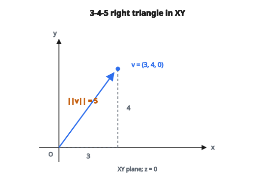

# Norm vector 3D

## Norm của vector là gì

Norm của vector là một hàm gán cho mỗi vector một **độ dài** (length) hoặc **độ lớn** (magnitude) không âm. Nó đo “vector lớn đến mức nào”.

Norm phổ biến nhất trong hình học 3D là **Euclidean norm** (L2 norm), tương ứng khoảng cách đường thẳng từ gốc tọa độ đến đầu vector.

## Euclidean norm (L2 norm)

Với vector 3D $\mathbf{v} = (v_x, v_y, v_z)$:

$$
\lVert\mathbf{v}\rVert_2 = \sqrt{v_x^2 + v_y^2 + v_z^2}
$$

Đây chính là khoảng cách từ gốc đến điểm $(v_x, v_y, v_z)$ trong không gian 3D.

Khi bỏ chỉ số dưới, $\lVert\mathbf{v}\rVert$ thường được hiểu là L2 norm.

::: {#fig-95-l2-norm-345 fig-cap="Với $\mathbf{v} = (3, 4, 0)$ trong mặt phẳng XY, $\lVert\mathbf{v}\rVert_2 = \sqrt{3^2 + 4^2} = 5$ — tam giác vuông 3-4-5." fig-alt="Tam giac vuong 3-4-5 trong mat phang XY: vector v = (3, 4, 0) tu goc den (3,4), canh ngang 3, canh doc 4, canh cheo L2 norm = 5."}
{fig-align="center"}
:::

## Diễn giải hình học

Euclidean norm biểu diễn:

**1. Độ dài của vector:**

Khoảng cách đường thẳng từ gốc đến đầu mũi vector.

**2. Độ lớn của một đại lượng:**

Tốc độ (độ lớn của vận tốc), độ lớn lực, v.v.

**3. Khoảng cách trong không gian 3D:**

Khoảng cách từ điểm A đến điểm B là $\lVert\mathbf{B} - \mathbf{A}\rVert$.

## Suy ra từ định lý Pythagore

Trong 2D, định lý Pythagore cho:

$$
\lVert\mathbf{v}\rVert^2 = v_x^2 + v_y^2
$$

Trong 3D, áp dụng hai lần:

Đầu tiên trong mặt phẳng XY: $d_{xy}^2 = v_x^2 + v_y^2$

Sau đó từ XY lên Z: $\lVert\mathbf{v}\rVert^2 = d_{xy}^2 + v_z^2 = v_x^2 + v_y^2 + v_z^2$

## Ví dụ số 1

**Vector:** $\mathbf{v} = (3, 4, 0)$

$$
\lVert\mathbf{v}\rVert = \sqrt{3^2 + 4^2 + 0^2} = \sqrt{9 + 16 + 0} = \sqrt{25} = 5
$$

Đây là tam giác vuông 3-4-5 cổ điển trong mặt phẳng XY.

## Ví dụ số 2

**Vector:** $\mathbf{v} = (1, 2, 2)$

$$
\lVert\mathbf{v}\rVert = \sqrt{1^2 + 2^2 + 2^2} = \sqrt{1 + 4 + 4} = \sqrt{9} = 3
$$

## Ví dụ số 3

**Vector:** $\mathbf{v} = (1, 1, 1)$

$$
\lVert\mathbf{v}\rVert = \sqrt{1^2 + 1^2 + 1^2} = \sqrt{3} \approx 1.732
$$

Đây là đường chéo không gian của khối lập phương đơn vị.

## Tính chất của norm

**1. Không âm:**

$$
\lVert\mathbf{v}\rVert \geq 0
$$

**2. Bằng không chỉ với vector không:**

$$
\lVert\mathbf{v}\rVert = 0 \iff \mathbf{v} = \mathbf{0}
$$

**3. Nhân với vô hướng:**

$$
\lVert c\mathbf{v}\rVert = |c| \cdot \lVert\mathbf{v}\rVert
$$

**4. Bất đẳng thức tam giác:**

$$
\lVert\mathbf{u} + \mathbf{v}\rVert \leq \lVert\mathbf{u}\rVert + \lVert\mathbf{v}\rVert
$$

## Norm bình phương

Thường dùng **squared norm** để tránh lấy căn bậc hai:

$$
\lVert\mathbf{v}\rVert^2 = v_x^2 + v_y^2 + v_z^2
$$

**Lợi ích:**

* Tính nhanh hơn (không cần căn bậc hai)
* Bảo toàn thứ tự: $\lVert\mathbf{a}\rVert < \lVert\mathbf{b}\rVert \iff \lVert\mathbf{a}\rVert^2 < \lVert\mathbf{b}\rVert^2$
* Xuất hiện trong nhiều bài toán tối ưu

## Quan hệ với tích vô hướng

Squared norm bằng tích vô hướng của vector với chính nó:

$$
\lVert\mathbf{v}\rVert^2 = \mathbf{v} \cdot \mathbf{v} = v_x^2 + v_y^2 + v_z^2
$$

Do đó:

$$
\lVert\mathbf{v}\rVert = \sqrt{\mathbf{v} \cdot \mathbf{v}}
$$

Quan hệ này là nền tảng trong đại số tuyến tính.

## Các norm phổ biến khác

**L1 norm (Manhattan norm):**

$$
\lVert\mathbf{v}\rVert_1 = |v_x| + |v_y| + |v_z|
$$

Khoảng cách khi chỉ đi theo các đường song song trục tọa độ.

**L$\infty$ norm (maximum norm):**

$$
\lVert\mathbf{v}\rVert_\infty = \max(|v_x|, |v_y|, |v_z|)
$$

Độ lớn thành phần lớn nhất.

**Lp norm (tổng quát):**

$$
\lVert\mathbf{v}\rVert_p = \left( |v_x|^p + |v_y|^p + |v_z|^p \right)^{1/p}
$$

L2 là trường hợp $p = 2$.

## So sánh các norm

Với cùng vector $\mathbf{v} = (3, 4, 0)$:

$$
\lVert\mathbf{v}\rVert_1 = 3 + 4 + 0 = 7
$$

$$
\lVert\mathbf{v}\rVert_2 = \sqrt{9 + 16} = 5
$$

$$
\lVert\mathbf{v}\rVert_\infty = \max(3, 4, 0) = 4
$$

Tổng quát: $\lVert\mathbf{v}\rVert_\infty \leq \lVert\mathbf{v}\rVert_2 \leq \lVert\mathbf{v}\rVert_1$

## Khoảng cách giữa hai điểm

Khoảng cách Euclidean giữa hai điểm $\mathbf{A}$ và $\mathbf{B}$:

$$
d(\mathbf{A}, \mathbf{B}) = \lVert\mathbf{B} - \mathbf{A}\rVert = \sqrt{(B_x - A_x)^2 + (B_y - A_y)^2 + (B_z - A_z)^2}
$$

**Ví dụ:** Khoảng cách từ $(1, 2, 3)$ đến $(4, 6, 3)$:

$$
d = \sqrt{(4-1)^2 + (6-2)^2 + (3-3)^2} = \sqrt{9 + 16 + 0} = 5
$$

## Unit vector

Một unit vector có norm bằng 1:

$$
\lVert\hat{\mathbf{v}}\rVert = 1
$$

Để tạo unit vector (chuẩn hóa):

$$
\hat{\mathbf{v}} = \frac{\mathbf{v}}{\lVert\mathbf{v}\rVert}
$$

Unit vector biểu diễn hướng thuần túy, không mang độ lớn.

## Ứng dụng trong đồ họa 3D

**Tính khoảng cách:**

* Phát hiện va chạm giữa các đối tượng
* Chọn mức chi tiết (level of detail)
* Culling (loại bỏ đối tượng ở xa)

**Chiếu sáng:**

* Suy giảm ánh sáng: $I \propto \frac{1}{\lVert\mathbf{r}\rVert^2}$
* Vector pháp tuyến (phải có độ dài đơn vị)

**Animation:**

* Tốc độ = norm của vector vận tốc
* Khoảng cách nội suy

## Ứng dụng trong vật lý

**Độ lớn của vector:**

* Tốc độ: $|v| = \lVert\mathbf{v}\rVert$
* Lực: $|F| = \lVert\mathbf{F}\rVert$
* Gia tốc: $|a| = \lVert\mathbf{a}\rVert$

**Năng lượng:**

* Động năng: $KE = \frac{1}{2}m\lVert\mathbf{v}\rVert^2$

**Công:**

* Dùng tích vô hướng, liên hệ trực tiếp với norm

## Ứng dụng trong machine learning

**Metric khoảng cách:**

* Phân loại k-NN dùng khoảng cách Euclidean
* Thuật toán clustering (k-means)

**Regularization:**

* L2 regularization (Ridge): $\lambda \lVert\mathbf{w}\rVert_2^2$
* L1 regularization (Lasso): $\lambda \lVert\mathbf{w}\rVert_1$

**Hàm mất mát:**

* Mean Squared Error dùng squared L2 norm
* Mean Absolute Error dùng L1 norm

## Cân nhắc số học

**Overflow:**

Với thành phần rất lớn, $v_x^2$ có thể tràn số.

**Cách xử lý:** Dùng logarithm hoặc scale trước khi bình phương.

**Underflow:**

Với thành phần rất nhỏ, $v_x^2$ có thể xuống dưới ngưỡng và thành không.

**Cách xử lý:** Dùng độ chính xác mở rộng hoặc so sánh tương đối.

**Catastrophic cancellation:**

Khi các thành phần có độ lớn rất khác nhau, thành phần nhỏ có thể bị mất.

## Tính toán hiệu quả

**Tránh căn bậc hai thừa:**

Khi so sánh khoảng cách, dùng squared norm:

$$
\lVert\mathbf{a}\rVert < \lVert\mathbf{b}\rVert \iff \lVert\mathbf{a}\rVert^2 < \lVert\mathbf{b}\rVert^2
$$

**Tối ưu SIMD:**

CPU hiện đại có thể tính $v_x^2 + v_y^2 + v_z^2$ song song.

**Tính theo batch:**

Với nhiều vector, xử lý theo batch bằng phép toán ma trận.

## Mở rộng sang n chiều

Công thức mở rộng cho mọi số chiều:

$$
\lVert\mathbf{v}\rVert_2 = \sqrt{\sum_{i=1}^{n} v_i^2}
$$

Trong không gian chiều cao, khoảng cách ứng xử khác (curse of dimensionality), nhưng công thức vẫn giữ nguyên.

## Bất đẳng thức về norm

**Bất đẳng thức Cauchy–Schwarz:**

$$
|\mathbf{u} \cdot \mathbf{v}| \leq \lVert\mathbf{u}\rVert \cdot \lVert\mathbf{v}\rVert
$$

**Bất đẳng thức tam giác:**

$$
\lVert\mathbf{u} + \mathbf{v}\rVert \leq \lVert\mathbf{u}\rVert + \lVert\mathbf{v}\rVert
$$

**Bất đẳng thức tam giác ngược:**

$$
\lVert\mathbf{u} - \mathbf{v}\rVert \geq \bigl| \lVert\mathbf{u}\rVert - \lVert\mathbf{v}\rVert \bigr|
$$

Đây là các tính chất nền tảng dùng trong chứng minh và thuật toán.

## Code
```python
import numpy as np

def vector_norm_3d(v):
    """
    Compute the Euclidean norm of 3D vector(s).
    """
    v = np.asarray(v, dtype=float)
    if v.ndim == 1:
        return float(np.sqrt(np.sum(v**2)))
    else:
        return np.sqrt(np.sum(v**2, axis=1))

```
