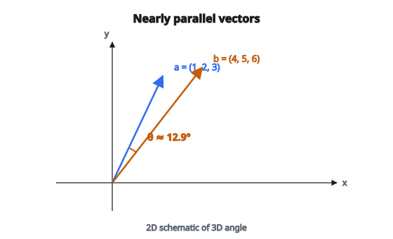

# Góc giữa hai vector 3D

## Góc giữa hai vector là gì

Góc giữa hai vector là khái niệm nền tảng trong hình học và đại số tuyến tính. Nó đo mức độ hai vector “hướng khác nhau” và nằm trong khoảng từ 0 (song song) đến $\pi$ radian hoặc 180 độ (đối song song).

Khái niệm này thiết yếu trong đồ họa 3D, mô phỏng vật lý, robotics và machine learning.

## Liên hệ với tích vô hướng

Góc giữa hai vector gắn chặt với tích vô hướng. Với vector $\mathbf{a}$ và $\mathbf{b}$:

$$
\mathbf{a} \cdot \mathbf{b} = \lVert\mathbf{a}\rVert \cdot \lVert\mathbf{b}\rVert \cdot \cos(\theta)
$$

với:

* $\mathbf{a} \cdot \mathbf{b}$ là tích vô hướng
* $\lVert\mathbf{a}\rVert$ và $\lVert\mathbf{b}\rVert$ là độ lớn (length)
* $\theta$ là góc giữa chúng

## Công thức tính góc

Giải theo $\theta$:

$$
\cos(\theta) = \frac{\mathbf{a} \cdot \mathbf{b}}{\lVert\mathbf{a}\rVert \cdot \lVert\mathbf{b}\rVert}
$$

$$
\theta = \arccos\left(\frac{\mathbf{a} \cdot \mathbf{b}}{\lVert\mathbf{a}\rVert \cdot \lVert\mathbf{b}\rVert}\right)
$$

Kết quả tính bằng radian. Đổi sang độ: $\theta_{\mathrm{deg}} = \theta_{\mathrm{rad}} \times \frac{180}{\pi}$

::: {#fig-97-angle-vectors fig-cap="Với $\mathbf{a} = (1, 2, 3)$ và $\mathbf{b} = (4, 5, 6)$, $\cos\theta \approx 0.9746$ nên $\theta \approx 12.9^\circ$ — gần song song." fig-alt="Hai mui ten a va b gan song song, goc theta khoang 12.9 do giua chung."}
{fig-align="center"}
:::

## Tính tích vô hướng trong 3D

Với vector 3D $\mathbf{a} = (a_x, a_y, a_z)$ và $\mathbf{b} = (b_x, b_y, b_z)$:

$$
\mathbf{a} \cdot \mathbf{b} = a_x b_x + a_y b_y + a_z b_z
$$

Đây là tổng tích theo từng thành phần.

## Tính độ lớn trong 3D

Độ lớn (Euclidean norm) của vector 3D:

$$
\lVert\mathbf{a}\rVert = \sqrt{a_x^2 + a_y^2 + a_z^2}
$$

$$
\lVert\mathbf{b}\rVert = \sqrt{b_x^2 + b_y^2 + b_z^2}
$$

## Quy trình từng bước

**Bước 1:** Tính tích vô hướng $\mathbf{a} \cdot \mathbf{b}$

**Bước 2:** Tính độ lớn $\lVert\mathbf{a}\rVert$ và $\lVert\mathbf{b}\rVert$

**Bước 3:** Tính $\cos(\theta) = \frac{\mathbf{a} \cdot \mathbf{b}}{\lVert\mathbf{a}\rVert \cdot \lVert\mathbf{b}\rVert}$

**Bước 4:** Lấy arccos: $\theta = \arccos(\cos(\theta))$

## Ví dụ số

**Các vector:**

* $\mathbf{a} = (1, 2, 3)$
* $\mathbf{b} = (4, 5, 6)$

**Bước 1: Tích vô hướng**

$$
\mathbf{a} \cdot \mathbf{b} = 1(4) + 2(5) + 3(6) = 4 + 10 + 18 = 32
$$

**Bước 2: Độ lớn**

$$
\lVert\mathbf{a}\rVert = \sqrt{1^2 + 2^2 + 3^2} = \sqrt{1 + 4 + 9} = \sqrt{14} \approx 3.742
$$

$$
\lVert\mathbf{b}\rVert = \sqrt{4^2 + 5^2 + 6^2} = \sqrt{16 + 25 + 36} = \sqrt{77} \approx 8.775
$$

**Bước 3: Cosine của góc**

$$
\cos(\theta) = \frac{32}{3.742 \times 8.775} = \frac{32}{32.83} \approx 0.9746
$$

**Bước 4: Góc**

$$
\theta = \arccos(0.9746) \approx 0.226 \text{ radian} \approx 12.9^\circ
$$

Hai vector gần song song (góc nhỏ).

## Các trường hợp đặc biệt

**Vector song song ($\theta = 0$):**

$$
\cos(\theta) = 1 \implies \mathbf{a} \cdot \mathbf{b} = \lVert\mathbf{a}\rVert \cdot \lVert\mathbf{b}\rVert
$$

Hai vector cùng hướng.

**Vector vuông góc ($\theta = 90^\circ$):**

$$
\cos(\theta) = 0 \implies \mathbf{a} \cdot \mathbf{b} = 0
$$

Hai vector trực giao.

**Vector đối song song ($\theta = 180^\circ$):**

$$
\cos(\theta) = -1 \implies \mathbf{a} \cdot \mathbf{b} = -\lVert\mathbf{a}\rVert \cdot \lVert\mathbf{b}\rVert
$$

Hai vector ngược hướng.

## Ví dụ: vector vuông góc

**Các vector:**

* $\mathbf{a} = (1, 0, 0)$ (trục x)
* $\mathbf{b} = (0, 1, 0)$ (trục y)

**Tích vô hướng:**

$$
\mathbf{a} \cdot \mathbf{b} = 1(0) + 0(1) + 0(0) = 0
$$

**Cosine:**

$$
\cos(\theta) = \frac{0}{1 \times 1} = 0
$$

**Góc:**

$$
\theta = \arccos(0) = \frac{\pi}{2} = 90^\circ
$$

Trục x và y vuông góc, đúng như kỳ vọng.

## Ví dụ: vector ngược hướng

**Các vector:**

* $\mathbf{a} = (1, 2, 3)$
* $\mathbf{b} = (-1, -2, -3) = -\mathbf{a}$

**Tích vô hướng:**

$$
\mathbf{a} \cdot \mathbf{b} = 1(-1) + 2(-2) + 3(-3) = -1 - 4 - 9 = -14
$$

**Độ lớn:**

$$
\lVert\mathbf{a}\rVert = \lVert\mathbf{b}\rVert = \sqrt{14}
$$

**Cosine:**

$$
\cos(\theta) = \frac{-14}{\sqrt{14} \times \sqrt{14}} = \frac{-14}{14} = -1
$$

**Góc:**

$$
\theta = \arccos(-1) = \pi = 180^\circ
$$

## Dùng unit vector

Nếu các vector đã chuẩn hóa (độ dài đơn vị), công thức gọn lại:

$$
\cos(\theta) = \hat{\mathbf{a}} \cdot \hat{\mathbf{b}}
$$

Không cần chia cho độ lớn vì $\lVert\hat{\mathbf{a}}\rVert = \lVert\hat{\mathbf{b}}\rVert = 1$.

Đó là lý do chuẩn hóa vector phổ biến trong đồ họa và vật lý.

## Ổn định số

Do sai số dấu phẩy động, $\cos(\theta)$ có thể hơi vượt khỏi khoảng $[-1, 1]$.

**Vấn đề:** $\arccos(1.0000001)$ không xác định.

**Cách xử lý:** Clamp giá trị:

$$
\cos(\theta) = \max\bigl(-1,\, \min(1,\, \cos(\theta))\bigr)
$$

Rồi áp dụng $\arccos$ an toàn.

## Cách khác: dùng cross product

Góc cũng có thể tìm từ độ lớn của cross product:

$$
\lVert\mathbf{a} \times \mathbf{b}\rVert = \lVert\mathbf{a}\rVert \cdot \lVert\mathbf{b}\rVert \cdot \sin(\theta)
$$

Kết hợp với tích vô hướng:

$$
\tan(\theta) = \frac{\lVert\mathbf{a} \times \mathbf{b}\rVert}{\mathbf{a} \cdot \mathbf{b}}
$$

$$
\theta = \operatorname{arctan2}\bigl(\lVert\mathbf{a} \times \mathbf{b}\rVert,\, \mathbf{a} \cdot \mathbf{b}\bigr)
$$

Cách này ổn định số hơn với góc rất nhỏ hoặc rất lớn.

## Cross product trong 3D

Để đủ ngữ cảnh, cross product là:

$$
\mathbf{a} \times \mathbf{b} = \begin{pmatrix} a_y b_z - a_z b_y \\ a_z b_x - a_x b_z \\ a_x b_y - a_y b_x \end{pmatrix}
$$

Và độ lớn của nó:

$$
\lVert\mathbf{a} \times \mathbf{b}\rVert = \sqrt{(a_y b_z - a_z b_y)^2 + (a_z b_x - a_x b_z)^2 + (a_x b_y - a_y b_x)^2}
$$

## Ứng dụng trong đồ họa 3D

**Tính chiếu sáng:**

Góc giữa pháp tuyến bề mặt và hướng ánh sáng quyết định độ sáng:

$$
\text{intensity} = \max(0,\, \cos(\theta)) = \max(0,\, \mathbf{n} \cdot \mathbf{l})
$$

**Phát hiện va chạm:**

Góc giữa vận tốc và pháp tuyến bề mặt ảnh hưởng phản xạ.

**Hướng camera:**

Góc giữa hướng nhìn và đối tượng quyết định khả năng nhìn thấy.

## Ứng dụng trong machine learning

**Cosine similarity:**

Trong không gian chiều cao, cosine similarity đo độ tương đồng vector:

$$
\text{similarity} = \cos(\theta) = \frac{\mathbf{a} \cdot \mathbf{b}}{\lVert\mathbf{a}\rVert \cdot \lVert\mathbf{b}\rVert}
$$

Dùng trong text embedding, hệ gợi ý và clustering.

**Khoảng cách góc:**

$$
\text{distance} = \frac{\theta}{\pi} = \frac{\arccos(\text{similarity})}{\pi}
$$

## Góc có dấu và không dấu

Công thức trên cho góc **không dấu** trong $[0, \pi]$.

Với góc **có dấu** (xác định chiều quay), cần thêm ngữ cảnh:

* Một mặt phẳng hoặc trục tham chiếu
* Hướng của cross product

Trong 2D, góc có dấu lấy trực tiếp bằng $\operatorname{arctan2}$.

## Mở rộng sang chiều cao hơn

Cùng công thức áp dụng cho mọi số chiều:

$$
\cos(\theta) = \frac{\mathbf{a} \cdot \mathbf{b}}{\lVert\mathbf{a}\rVert \cdot \lVert\mathbf{b}\rVert} = \frac{\sum_i a_i b_i}{\sqrt{\sum_i a_i^2} \cdot \sqrt{\sum_i b_i^2}}
$$

Diễn giải hình học của “góc” mở rộng sang không gian $n$ chiều.

## Các trường hợp biên

**Vector không:**

Nếu một trong hai vector là không, góc không xác định. Kiểm tra $\lVert\mathbf{a}\rVert = 0$ hoặc $\lVert\mathbf{b}\rVert = 0$ trước khi tính.

**Vector gần song song:**

Khi $\cos(\theta) \approx 1$, $\arccos$ có thể không ổn định số. Phương pháp $\operatorname{arctan2}$ vững hơn.

**Vector rất nhỏ:**

Chuẩn hóa cẩn thận để tránh chia cho số rất nhỏ.

## Code
```python
import numpy as np

def angle_between_3d(v, w):
    """
    Compute the angle (in radians) between two 3D vectors.
    """
    v = np.asarray(v, dtype=float)
    w = np.asarray(w, dtype=float)
    norm_v = np.sqrt(np.sum(v**2))
    norm_w = np.sqrt(np.sum(w**2))
    if norm_v < 1e-10 or norm_w < 1e-10:
        return None
    cos_theta = np.dot(v, w) / (norm_v * norm_w)
    cos_theta = np.clip(cos_theta, -1.0, 1.0)
    theta = np.arccos(cos_theta)
    return round(float(theta), 6)

```
