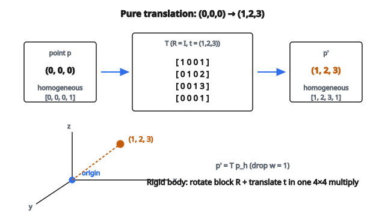

# Áp dụng biến đổi đồng nhất 4×4

## Vấn đề: Rotation và translation không trộn dễ

Khi làm việc với điểm 3D, hai phép toán phổ biến nhất là **rotation** (xoay vật quanh một trục) và **translation** (trượt vật từ vị trí này sang vị trí khác).

Rotation là phép toán *tuyến tính*. Nếu có ma trận rotation $3 \times 3$ là $R$ và điểm $p$, bạn xoay điểm bằng:

$$
p' = R \cdot p
$$

Translation, ngược lại, là phép toán *affine*. Bạn cộng một vector $t$ để dịch điểm:

$$
p' = p + t
$$

Nếu muốn làm cả hai cùng lúc, bạn viết:

$$
p' = R \cdot p + t
$$

Công thức này đúng, nhưng bất tiện. Bạn không thể biểu diễn “xoay rồi dịch” bằng một phép nhân ma trận duy nhất trong 3D. Điều đó nghĩa là bạn không thể xâu chuỗi nhiều bước rotation-and-translation bằng phép nhân ma trận chuẩn. Mỗi bước cần một phép nhân và một phép cộng riêng. Việc này nhanh chóng trở nên đau đớn, đặc biệt trong robotics hay graphics khi có hàng chục hệ tọa độ nối tiếp nhau.

**Homogeneous coordinates** giải quyết vấn đề bằng cách nâng mọi thứ lên 4D, để cả rotation và translation đều trở thành phép nhân ma trận.

## Homogeneous coordinates là gì?

Ý tưởng cốt lõi đơn giản: lấy điểm 3D $(x, y, z)$ và nối thêm số 1 ở cuối để được vector 4D:

$$
p_h = \begin{bmatrix} x \\ y \\ z \\ 1 \end{bmatrix}
$$

Tọa độ thêm này (thường gọi là tọa độ $w$) chính là chìa khóa. Khi làm việc trong không gian 4D, ta mã hóa được cả rotation lẫn translation trong một ma trận $4 \times 4$ duy nhất.

Sau biến đổi, bạn chỉ cần bỏ tọa độ cuối để về lại 3D. Miễn là hàng dưới cùng của ma trận là $[0 \; 0 \; 0 \; 1]$, tọa độ $w$ đầu ra luôn bằng 1, nên bạn lấy ba thành phần đầu.

## Ma trận biến đổi đồng nhất 4×4

Một homogeneous transform $T$ là ma trận $4 \times 4$ với cấu trúc cố định:

$$
T = \begin{bmatrix} R & t \\ 0^\top & 1 \end{bmatrix} = \begin{bmatrix} r_{11} & r_{12} & r_{13} & t_x \\ r_{21} & r_{22} & r_{23} & t_y \\ r_{31} & r_{32} & r_{33} & t_z \\ 0 & 0 & 0 & 1 \end{bmatrix}
$$

Trong đó:

* $R$ là **rotation matrix** $3 \times 3$ chiếm khối trên-trái. Nó mã hóa hướng của vật (hoặc hệ tọa độ). Một rotation matrix hợp lệ thỏa $R^\top R = I$ và $\det(R) = 1$.
* $t = (t_x, t_y, t_z)^\top$ là **translation vector** $3 \times 1$ ở cột phải nhất. Nó mã hóa mức dịch gốc theo từng trục.
* Hàng dưới luôn là $[0 \; 0 \; 0 \; 1]$. Điều này giữ biến đổi “rigid” và đảm bảo tọa độ $w$ vẫn bằng 1 sau phép nhân.

## Từng bước: áp dụng biến đổi

Cho transform $T$ và điểm 3D $p = (x, y, z)$, quy trình đầy đủ:

**Bước 1: Đổi sang homogeneous coordinates**

Nối thêm số 1:

$$
p_h = \begin{bmatrix} x \\ y \\ z \\ 1 \end{bmatrix}
$$

**Bước 2: Nhân với ma trận biến đổi**

$$
p'_h = T \cdot p_h = \begin{bmatrix} R & t \\ 0^\top & 1 \end{bmatrix} \begin{bmatrix} x \\ y \\ z \\ 1 \end{bmatrix}
$$

Khai triển phép nhân:

$$
p'_h = \begin{bmatrix} r_{11}x + r_{12}y + r_{13}z + t_x \\ r_{21}x + r_{22}y + r_{23}z + t_y \\ r_{31}x + r_{32}y + r_{33}z + t_z \\ 1 \end{bmatrix}
$$

Ba hàng trên tính đúng $Rp + t$. Hàng dưới chỉ cho ra 1.

**Bước 3: Lấy kết quả 3D**

Bỏ tọa độ cuối:

$$
p' = \begin{bmatrix} r_{11}x + r_{12}y + r_{13}z + t_x \\ r_{21}x + r_{22}y + r_{23}z + t_y \\ r_{31}x + r_{32}y + r_{33}z + t_z \end{bmatrix}
$$

Đây là điểm đã biến đổi trong không gian 3D.

## Ví dụ số

Giả sử biến đổi là translation thuần $(1, 2, 3)$ không có rotation (rotation identity):

$$
T = \begin{bmatrix} 1 & 0 & 0 & 1 \\ 0 & 1 & 0 & 2 \\ 0 & 0 & 1 & 3 \\ 0 & 0 & 0 & 1 \end{bmatrix}
$$

Áp dụng lên gốc $(0, 0, 0)$:

$$
T \begin{bmatrix} 0 \\ 0 \\ 0 \\ 1 \end{bmatrix} = \begin{bmatrix} 0 + 0 + 0 + 1 \\ 0 + 0 + 0 + 2 \\ 0 + 0 + 0 + 3 \\ 1 \end{bmatrix} = \begin{bmatrix} 1 \\ 2 \\ 3 \\ 1 \end{bmatrix}
$$

Kết quả là $(1, 2, 3)$ — đúng như translation $(1, 2, 3)$ tác động lên gốc.

::: {#fig-11-homogeneous-translate fig-cap="Translation thuần: $T$ với $R = I$ và $t = (1,2,3)$ đưa gốc $(0,0,0)$ thành $(1,2,3)$." fig-alt="Homogeneous translation of origin (0,0,0) to (1,2,3) via 4x4 matrix T with identity rotation and t=(1,2,3)."}
{fig-align="center"}
:::

Tiếp theo, xét rotation 90 độ quanh trục z kết hợp translation $(1, 0, 0)$:

$$
T = \begin{bmatrix} 0 & -1 & 0 & 1 \\ 1 & 0 & 0 & 0 \\ 0 & 0 & 1 & 0 \\ 0 & 0 & 0 & 1 \end{bmatrix}
$$

Áp dụng lên điểm $(1, 0, 0)$:

$$
T \begin{bmatrix} 1 \\ 0 \\ 0 \\ 1 \end{bmatrix} = \begin{bmatrix} 0 \cdot 1 + (-1) \cdot 0 + 0 \cdot 0 + 1 \\ 1 \cdot 1 + 0 \cdot 0 + 0 \cdot 0 + 0 \\ 0 \cdot 1 + 0 \cdot 0 + 1 \cdot 0 + 0 \\ 1 \end{bmatrix} = \begin{bmatrix} 1 \\ 1 \\ 0 \\ 1 \end{bmatrix}
$$

Điểm được xoay trước ($(1,0,0)$ thành $(0,1,0)$ dưới rotation 90 độ quanh z) rồi dịch bởi $(1,0,0)$, cho $(1, 1, 0)$.

## Hiểu ma trận rotation

Ma trận rotation $3 \times 3$ $R$ bên trong $T$ đáng xem kỹ hơn.

**Rotation quanh trục z góc $\theta$:**

$$
R_z(\theta) = \begin{bmatrix} \cos\theta & -\sin\theta & 0 \\ \sin\theta & \cos\theta & 0 \\ 0 & 0 & 1 \end{bmatrix}
$$

**Rotation quanh trục x góc $\theta$:**

$$
R_x(\theta) = \begin{bmatrix} 1 & 0 & 0 \\ 0 & \cos\theta & -\sin\theta \\ 0 & \sin\theta & \cos\theta \end{bmatrix}
$$

**Rotation quanh trục y góc $\theta$:**

$$
R_y(\theta) = \begin{bmatrix} \cos\theta & 0 & \sin\theta \\ 0 & 1 & 0 \\ -\sin\theta & 0 & \cos\theta \end{bmatrix}
$$

Tính chất then chốt của rotation matrix:

* Chúng **orthogonal**: $R^\top R = I$, nghĩa là nghịch đảo bằng transpose.
* Chúng có **determinant 1**, phân biệt rotation đúng nghĩa với reflection.
* Chúng **bảo toàn khoảng cách**: độ dài mọi vector không đổi sau rotation.

## Ghép nhiều biến đổi

Ưu thế lớn của homogeneous transform là xâu chuỗi nhiều biến đổi chỉ là phép nhân ma trận. Nếu muốn áp dụng $T_1$ trước, rồi $T_2$, biến đổi tổng hợp là:

$$
T_{\text{combined}} = T_2 \cdot T_1
$$

Lưu ý thứ tự: $T_1$ áp dụng trước nhưng đứng bên phải. Đây là quy ước nhân ma trận chuẩn. Với điểm $p$:

$$
p' = T_2 \cdot (T_1 \cdot p_h) = (T_2 \cdot T_1) \cdot p_h
$$

Bạn có thể xếp bao nhiêu transform tùy ý. Trong robotics, chẳng hạn, cánh tay robot 6 khớp có 6 transform nối tiếp để tính vị trí end-effector trong tọa độ thế giới:

$$
T_{\text{world}} = T_1 \cdot T_2 \cdot T_3 \cdot T_4 \cdot T_5 \cdot T_6
$$

## Nghịch đảo của biến đổi

Cho homogeneous transform $T$, nghịch đảo hoàn tác phép toán. Với rigid-body transform, nghịch đảo có dạng đóng gọn:

$$
T^{-1} = \begin{bmatrix} R^\top & -R^\top t \\ 0^\top & 1 \end{bmatrix}
$$

Công thức này đúng vì $R$ orthogonal nên $R^{-1} = R^\top$. Nghịch đảo “bỏ translation” bằng $-R^\top t$ rồi “bỏ rotation” bằng $R^\top$. Bạn không cần nghịch đảo ma trận tổng quát cho trường hợp này.

## Homogeneous transform xuất hiện ở đâu

**Robotics**: Mỗi khớp trên cánh tay robot định nghĩa một hệ tọa độ cục bộ. Biến đổi từ khớp này sang khớp kế là ma trận $4 \times 4$. Forward kinematics xâu chúng lại để tìm vị trí bàn tay robot so với gốc.

**Computer Graphics**: Pipeline render áp dụng chuỗi biến đổi: model transform (đặt vật vào thế giới), view transform (hướng camera), và projection transform (chiếu lên màn hình). Mỗi cái là ma trận $4 \times 4$, và chúng được nhân thành một ma trận Model-View-Projection (MVP) duy nhất.

**Computer Vision**: Tham số extrinsic của camera được biểu diễn như homogeneous transform ánh xạ điểm từ tọa độ thế giới sang tọa độ camera. Dùng trong 3D reconstruction, SLAM (Simultaneous Localization and Mapping), và augmented reality.

**Physics Simulations**: Động lực rigid body theo dõi vị trí và hướng của vật theo thời gian. Pose của mỗi vật tại mọi thời điểm là một homogeneous transform.

## Code
```
import numpy as np

def apply_homogeneous_transform(T, points):
    """
    Apply 4x4 homogeneous transform T to 3D point(s).
    """
    T = np.asarray(T, dtype=float)
    points = np.asarray(points, dtype=float)
    single = (points.ndim == 1)
    if single:
        points = points.reshape(1, 3)
    ones = np.ones((points.shape[0], 1))
    points_h = np.hstack([points, ones])
    transformed = (T @ points_h.T).T
    result = transformed[:, :3]
    if single:
        return result[0]
    return result
```

<!-- auto-self-check -->

::: {.callout-note}
## Kiểm tra nhanh
<details>
<summary>Ý chính của bài «Áp dụng biến đổi đồng nhất 4×4» là gì?</summary>
Ý tưởng cốt lõi đơn giản: lấy điểm 3D $(x, y, z)$ và nối thêm số 1 ở cuối để được vector 4D: Tọa độ thêm này (thường gọi là tọa độ $w$) chính là chìa khóa.
</details>
<details>
<summary>Công thức / quan hệ cốt lõi trong bài là gì?</summary>
$$p' = R \cdot p$$
</details>
:::
