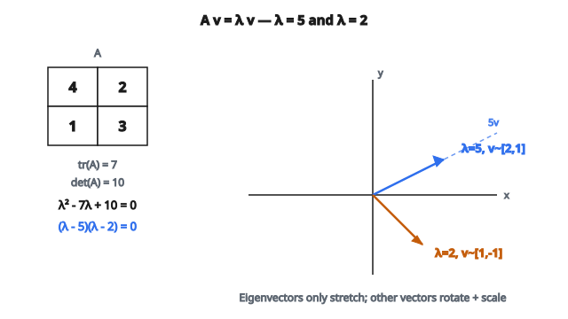

# Trị riêng của ma trận

## Eigenvalue là gì?

Một **eigenvalue** của ma trận vuông $A$ là vô hướng $\lambda$ sao cho tồn tại vector khác không $v$ thỏa:

$$
Av = \lambda v
$$

Nói cách khác: khi nhân ma trận $A$ với vector $v$, kết quả chỉ là $v$ được scale bởi $\lambda$. Hướng của $v$ không đổi (hoặc đảo chiều nếu $\lambda < 0$).

Vector $v$ gọi là **eigenvector** ứng với eigenvalue $\lambda$.

## Diễn giải hình học

Thông thường, nhân một vector với ma trận sẽ vừa xoay vừa kéo giãn nó. Nhưng eigenvector đặc biệt: chúng chỉ bị kéo giãn (scale), không bị xoay.

Với ma trận $A$ và eigenvector $v$:

* $\lambda > 1$: $v$ bị kéo dài
* $0 < \lambda < 1$: $v$ bị nén ngắn
* $\lambda = 1$: $v$ không đổi
* $\lambda < 0$: $v$ bị lật và scale
* $\lambda = 0$: $v$ bị sụp về không

## Phương trình đặc trưng

Để tìm eigenvalue, ta giải:

$$
Av = \lambda v
$$

Sắp xếp lại:

$$
Av - \lambda v = 0
$$

$$
(A - \lambda I)v = 0
$$

Để tồn tại nghiệm $v$ khác không, ma trận $(A - \lambda I)$ phải singular (không khả nghịch). Điều này xảy ra khi:

$$
\det(A - \lambda I) = 0
$$

Đây là **characteristic equation** (phương trình đặc trưng). Nó là đa thức bậc $n$ theo $\lambda$, với $n$ là kích thước ma trận. Các nghiệm của đa thức này chính là các eigenvalue.

## Tính eigenvalue: ví dụ 2×2

Với ma trận $2 \times 2$:

$$
A = \begin{bmatrix} a & b \\ c & d \end{bmatrix}
$$

Phương trình đặc trưng là:

$$
\det\begin{bmatrix} a - \lambda & b \\ c & d - \lambda \end{bmatrix} = 0
$$

$$
(a - \lambda)(d - \lambda) - bc = 0
$$

$$
\lambda^2 - (a + d)\lambda + (ad - bc) = 0
$$

$$
\lambda^2 - \text{tr}(A)\lambda + \det(A) = 0
$$

**Ví dụ cụ thể:**

$$
A = \begin{bmatrix} 4 & 2 \\ 1 & 3 \end{bmatrix}
$$

$\text{tr}(A) = 4 + 3 = 7$

$\det(A) = 4 \cdot 3 - 2 \cdot 1 = 10$

Phương trình đặc trưng: $\lambda^2 - 7\lambda + 10 = 0$

Phân tích: $(\lambda - 5)(\lambda - 2) = 0$

Eigenvalue: $\lambda_1 = 5$, $\lambda_2 = 2$

::: {#fig-40-eigenvalues-2x2 fig-cap="$A=[[4,2],[1,3]]$ có $\lambda_1=5$, $\lambda_2=2$ (từ $\lambda^2-7\lambda+10=0$)." fig-alt="Matrix A equals [[4,2],[1,3]] with eigenvalues lambda=5 and lambda=2; schematic eigenvector directions on the plane."}
{fig-align="center"}
:::

## Tính chất của eigenvalue

**Tổng bằng trace:**

$$
\sum_{i=1}^{n} \lambda_i = \text{tr}(A)
$$

**Tích bằng determinant:**

$$
\prod_{i=1}^{n} \lambda_i = \det(A)
$$

**Số lượng eigenvalue:**

Ma trận $n \times n$ có đúng $n$ eigenvalue (đếm theo bội), dù một số có thể phức.

## Eigenvalue thực và phức

Eigenvalue có thể phức ngay cả khi ma trận thực.

**Ví dụ:**

$$
A = \begin{bmatrix} 0 & -1 \\ 1 & 0 \end{bmatrix}
$$

Đây là ma trận rotation 90 độ. Không có vector nào giữ nguyên hướng sau rotation.

Phương trình đặc trưng: $\lambda^2 + 1 = 0$

Nghiệm: $\lambda = \pm i$ (ảo)

Với ma trận thực, eigenvalue phức xuất hiện theo cặp liên hợp, và mỗi cặp có cùng bội đại số.

## Eigenvalue của các ma trận đặc biệt

**Identity matrix $I$:**

Mọi eigenvalue đều bằng 1.

$Iv = v = 1 \cdot v$

**Diagonal matrix:**

Eigenvalue chính là các phần tử đường chéo.

$$
D = \begin{bmatrix} 3 & 0 \\ 0 & 7 \end{bmatrix}
$$

Eigenvalue: 3 và 7.

**Triangular matrix (upper hoặc lower):**

Eigenvalue là các phần tử đường chéo.

**Singular matrix:**

Ít nhất một eigenvalue bằng 0 (vì $\det(A) = 0$).

**Orthogonal matrix:**

Mọi eigenvalue có trị tuyệt đối 1 ($|\lambda| = 1$).

**Symmetric matrix (Spectral Theorem):**

Ma trận đối xứng thực luôn có eigenvalue thực và eigenvector trực giao. Ma trận có thể chéo hóa trực giao: $A = Q\Lambda Q^T$. Đây là nền tảng của PCA.

**Positive definite matrix:**

Mọi eigenvalue đều dương nghiêm ngặt. Tương đương $x^T A x > 0$ với mọi $x$ khác không.

## Phân tích eigenvalue

Nếu ma trận có $n$ eigenvector độc lập tuyến tính, nó có thể phân tích:

$$
A = V \Lambda V^{-1}
$$

với:

* $V$ là ma trận có các cột là eigenvector
* $\Lambda$ là diagonal matrix với eigenvalue trên đường chéo

Với ma trận đối xứng:

$$
A = Q \Lambda Q^T
$$

với $Q$ orthogonal ($Q^{-1} = Q^T$).

## Ứng dụng trong machine learning

**Principal Component Analysis (PCA):**

Eigenvalue của ma trận hiệp phương sai biểu diễn phương sai mà mỗi principal component nắm bắt. Eigenvector là các hướng chính.

**Spectral clustering:**

Eigenvalue và eigenvector của graph Laplacian lộ cấu trúc cụm.

**PageRank:**

Vector PageRank là eigenvector ứng với eigenvalue 1 của ma trận chuyển tiếp.

**Phân tích ổn định:**

Trong hệ động lực, eigenvalue quyết định ổn định. Hệ ổn định nếu mọi eigenvalue có trị tuyệt đối nhỏ hơn 1.

**Lũy thừa ma trận:**

$A^k = V \Lambda^k V^{-1}$

Eigenvalue giúp tính lũy thừa ma trận hiệu quả.

**Condition number:**

Tỷ số eigenvalue lớn nhất trên nhỏ nhất (với ma trận đối xứng positive definite) chỉ mức nhạy số.

## Tính toán số

Tìm eigenvalue giải tích đòi hỏi giải phương trình đa thức. Với ma trận lớn, điều này không thực tế.

Các phương pháp số gồm:

* **Power iteration:** tìm eigenvalue lớn nhất
* **QR algorithm:** tìm mọi eigenvalue lặp
* **Lanczos algorithm:** cho ma trận thưa

Độ phức tạp thời gian thường là $O(n^3)$ với ma trận dày.

## Eigenvalue và hạng ma trận

Số eigenvalue khác không bằng hạng của ma trận.

Ma trận thiếu hạng có ít nhất một eigenvalue bằng 0.

**Nullity** (số chiều null space) bằng bội của eigenvalue 0.

## Spectral Theorem

Với ma trận đối xứng thực:

1. Mọi eigenvalue đều thực
2. Eigenvector ứng với các eigenvalue khác nhau thì trực giao
3. Ma trận có thể chéo hóa trực giao: $A = Q\Lambda Q^T$

Điều này then chốt với PCA, nơi ta phân tích ma trận hiệp phương sai (đối xứng) thành các principal component trực giao.

## Code
```python
import numpy as np

def calculate_eigenvalues(matrix):
    """
    Calculate eigenvalues of a square matrix.
    """
    try:
        matrix = np.asarray(matrix, dtype=float)
    except (ValueError, TypeError):
        return None
    if matrix.ndim != 2 or matrix.shape[0] != matrix.shape[1]:
        return None
    if matrix.shape[0] == 0:
        return np.array([], dtype=complex)
    eigenvals = np.linalg.eigvals(matrix)
    eigenvals = eigenvals[np.lexsort((eigenvals.imag, eigenvals.real))]
    return eigenvals

```

<!-- auto-self-check -->

::: {.callout-note}
## Kiểm tra nhanh
<details>
<summary>Ý chính của bài «Trị riêng của ma trận» là gì?</summary>
Một **eigenvalue** của ma trận vuông $A$ là vô hướng $\lambda$ sao cho tồn tại vector khác không $v$ thỏa: Nói cách khác: khi nhân ma trận $A$ với vector $v$, kết quả chỉ là $v$ được scale bởi $\lambda$.
</details>
<details>
<summary>Công thức / quan hệ cốt lõi trong bài là gì?</summary>
$$Av = \lambda v$$
</details>
:::
