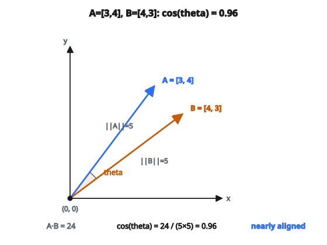

# Cosine Similarity

## Cosine similarity đo gì

**Cosine similarity** đo **góc** giữa hai vector, bỏ qua độ lớn (magnitude). Hai vector cùng hướng có cosine similarity bằng 1, bất kể vector này dài gấp đôi vector kia.

Điều đó khiến nó lý tưởng để so sánh tài liệu, embedding, hoặc mọi dữ liệu mà hướng (tỉ lệ tương đối) quan trọng hơn thang đo.

## Công thức chính

Với hai vector $A$ và $B$:

$$
\cos(\theta) = \frac{A \cdot B}{\|A\| \times \|B\|}
$$

với:

* $A \cdot B$ là dot product: $\sum_{i=1}^{n} A_i \times B_i$
* $\|A\|$ là L2 norm (magnitude): $\sqrt{\sum_{i=1}^{n} A_i^2}$
* $\|B\|$ là L2 norm của $B$
* $\theta$ là góc giữa hai vector

## Khoảng giá trị

Cosine similarity nằm trong khoảng $-1$ tới $1$:

* **1:** các vector cùng hướng chính xác (cùng orientation)
* **0:** các vector vuông góc (orthogonal, không tương đồng)
* **-1:** các vector ngược hướng chính xác

Với vector không âm (như đếm từ hoặc TF-IDF), khoảng giá trị là $0$ tới $1$ vì mọi thành phần đều dương.

## Tính từng bước

**Ví dụ:** $A = [3, 4]$ và $B = [4, 3]$

**Bước 1: Tính dot product**

$$
A \cdot B = 3 \times 4 + 4 \times 3 = 12 + 12 = 24
$$

**Bước 2: Tính magnitude của A**

$$
\|A\| = \sqrt{3^2 + 4^2} = \sqrt{9 + 16} = \sqrt{25} = 5
$$

**Bước 3: Tính magnitude của B**

$$
\|B\| = \sqrt{4^2 + 3^2} = \sqrt{16 + 9} = \sqrt{25} = 5
$$

**Bước 4: Chia**

$$
\cos(\theta) = \frac{24}{5 \times 5} = \frac{24}{25} = 0.96
$$

Hai vector rất tương đồng (gần cùng hướng).

::: {#fig-26-cosine-angle fig-cap="Vector $A=[3,4]$ và $B=[4,3]$: $\cos\theta = 24/(5\times 5) = 0.96$ — gần cùng hướng." fig-alt="Hai vector A=[3,4] va B=[4,3] trong mat phang; goc nho, cos(theta)=0.96."}
{fig-align="center"}
:::

## Vì sao bỏ qua magnitude?

Xét độ tương đồng tài liệu với đếm từ:

**Document A:** nhắc "python" 100 lần, "code" 50 lần  
**Document B:** nhắc "python" 10 lần, "code" 5 lần

Hai tài liệu này có cùng tỉ lệ từ (tỉ lệ 2:1 của python trên code). Chúng nhiều khả năng cùng chủ đề. Nhưng Euclidean distance giữa chúng lớn vì thang đo khác nhau.

Cosine similarity coi chúng giống hệt (similarity $= 1$) vì các vector $[100, 50]$ và $[10, 5]$ cùng hướng.

## Diễn giải hình học

Trong 2D, cosine similarity đúng nghĩa là cosine của góc:

* Hai vector góc $0$ độ: $\cos(0) = 1$
* Hai vector góc $45$ độ: $\cos(45^\circ) \approx 0.707$
* Hai vector góc $90$ độ: $\cos(90^\circ) = 0$
* Hai vector góc $180$ độ: $\cos(180^\circ) = -1$

Ở chiều cao hơn, cùng nguyên lý áp dụng. Công thức tính cosine của góc trong không gian $n$ chiều.

## Cosine Similarity so với Euclidean Distance

**Euclidean distance:**

$$
d(A, B) = \sqrt{\sum_{i=1}^{n} (A_i - B_i)^2}
$$

Đo khoảng cách đường thẳng giữa các đầu mút.

**Khác biệt then chốt:**

Euclidean distance bị ảnh hưởng bởi magnitude. Vector $[1, 0]$ và $[100, 0]$ có Euclidean distance lớn nhưng cosine similarity bằng 1.

Cosine similarity chỉ phụ thuộc hướng. Nó coi $[1, 2, 3]$ và $[2, 4, 6]$ là giống nhau.

**Khi nào dùng cái nào:**

* Cosine similarity: tương đồng văn bản, recommendation systems, so sánh embedding
* Euclidean distance: dữ liệu không gian, clustering khi magnitude quan trọng

## Cosine Distance

Cosine distance suy ra từ cosine similarity:

$$
\text{cosine distance} = 1 - \text{cosine similarity}
$$

Phép này đổi similarity (cao hơn thì giống hơn) thành distance (thấp hơn thì giống hơn):

* Cosine similarity $1$ thành distance $0$
* Cosine similarity $0$ thành distance $1$
* Cosine similarity $-1$ thành distance $2$

Cosine distance được dùng khi thuật toán cần distance metric thay vì similarity score.

## Xử lý vector zero

Nếu một trong hai vector toàn zero, magnitude bằng 0, và xảy ra chia cho zero.

$$
\|[0, 0, 0]\| = 0
$$

**Cách xử lý:**

* Trả về similarity $0$ (hoặc undefined) cho vector zero
* Cộng một epsilon nhỏ vào mẫu số
* Lọc bỏ vector zero trước khi so sánh

Trong thực tế, vector zero hiếm xuất hiện trong dữ liệu có nghĩa (tài liệu không có từ, embedding của "không gì").

## Tính toán hiệu quả

Với vector đã chuẩn hóa (magnitude $= 1$), cosine similarity rút gọn còn đúng dot product:

$$
\cos(\theta) = A \cdot B \quad \text{khi } \|A\| = \|B\| = 1
$$

Đó là lý do nhiều hệ thống chuẩn hóa trước các vector:

* Chuẩn hóa một lần khi lập chỉ mục
* Tính similarity bằng một phép dot product
* Nhanh hơn nhiều cho retrieval quy mô lớn

## Ứng dụng trong machine learning

**Tương đồng tài liệu:**  
Vector TF-IDF của tài liệu được so bằng cosine similarity.

**Semantic search:**  
Query embedding so với document embedding.

**Recommendation systems:**  
Vector sở thích người dùng so với vector mục.

**Word embeddings:**  
Word2Vec, GloVe dùng cosine similarity để tìm từ tương tự.

**Image retrieval:**  
Feature vector CNN so bằng cosine similarity.

**Phát hiện trùng lặp:**  
Tài liệu gần trùng có cosine similarity cao.

## Tính theo batch

Để so một query với nhiều tài liệu, dùng nhân ma trận:

Nếu $Q$ là query vector ($1 \times d$) và $D$ là ma trận các document vector ($n \times d$):

$$
\text{similarities} = \frac{Q \cdot D^{T}}{\|Q\| \times \|D\|_{\text{row-wise}}}
$$

Với vector đã chuẩn hóa trước:

$$
\text{similarities} = Q \cdot D^{T}
$$

Phép này tính cả $n$ similarity trong một thao tác, tận dụng thư viện linear algebra tối ưu.

## Code
```python
import numpy as np

def cosine_similarity(a, b):
    """
    Compute cosine similarity between two 1D NumPy arrays.
    Returns: float in [-1, 1]
    """
    a = np.asarray(a, float)
    b = np.asarray(b, float)
    dot = np.dot(a, b)
    norm_a = np.linalg.norm(a)
    norm_b = np.linalg.norm(b)
    if norm_a == 0 or norm_b == 0:
        return 0.0
    return float(dot / (norm_a * norm_b))

```


<!-- CROSSLINK_MATH_THEORY -->
::: {.callout-tip}
## Nền đầy đủ (Math Base)
Tích vô hướng / chuẩn / góc: [Dot Product & Vector Norms](../../math-base/03-linear-algebra/dot-product-vector-norms.qmd).
:::

<!-- auto-self-check -->

::: {.callout-note}
## Kiểm tra nhanh
<details>
<summary>Ý chính của bài «Cosine Similarity» là gì?</summary>
**Cosine similarity** đo **góc** giữa hai vector, bỏ qua độ lớn (magnitude).
</details>
<details>
<summary>Công thức / quan hệ cốt lõi trong bài là gì?</summary>
$$\cos(\theta) = \frac{A \cdot B}{\|A\| \times \|B\|}$$
</details>
:::
