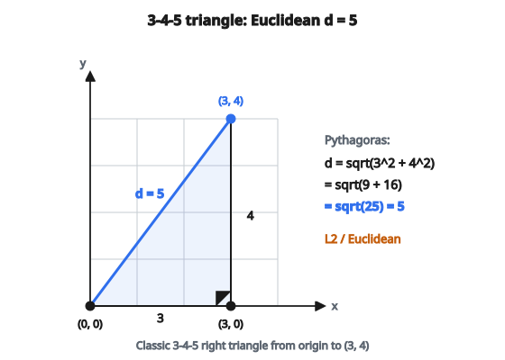

# Euclidean Distance

## Từ Pythagoras tới $n$ chiều

**Euclidean distance** là khoảng cách đường thẳng giữa hai điểm. Nó xuất phát trực tiếp từ định lý Pythagoras. Trong 2D, với hai điểm $(x_1, y_1)$ và $(x_2, y_2)$, hiệu ngang là $\Delta x = x_2 - x_1$ và hiệu dọc là $\Delta y = y_2 - y_1$. Hai hiệu này tạo thành hai cạnh góc vuông của một tam giác vuông, và khoảng cách là cạnh huyền:

$$
d = \sqrt{(\Delta x)^2 + (\Delta y)^2}
$$

Ví dụ kinh điển là điểm $(3, 4)$ và gốc $(0, 0)$: $d = \sqrt{9 + 16} = \sqrt{25} = 5$. Đây là tam giác vuông 3-4-5 mà người Hy Lạp cổ đã biết rõ.

::: {#fig-18-euclidean-345 fig-cap="Tam giác 3-4-5: từ $(0,0)$ đến $(3,4)$, Euclidean distance $d = \sqrt{9+16} = 5$." fig-alt="Tam giac vuong 3-4-5 tu (0,0) den (3,4); canh huyen Euclidean d = 5."}
{fig-align="center"}
:::

Điểm đẹp của công thức này là nó tổng quát hóa dễ dàng. Trong 3D, chỉ cần thêm một hiệu bình phương thứ ba: $d = \sqrt{(\Delta x)^2 + (\Delta y)^2 + (\Delta z)^2}$. Trong $n$ chiều, với vector $x = (x_1, x_2, \ldots, x_n)$ và $y = (y_1, y_2, \ldots, y_n)$:

$$
d(x, y) = \sqrt{\sum_{i=1}^{n} (x_i - y_i)^2}
$$

Mỗi chiều đóng góp một hiệu bình phương. Tổng mọi hiệu bình phương cho khoảng cách bình phương, và căn bậc hai đưa về cùng đơn vị với tọa độ gốc. Đó là Euclidean distance, còn gọi là L2 distance.

## Điều gì làm nó thành khoảng cách "thật"

Không phải mọi hàm đo độ tương đồng đều đủ tư cách là khoảng cách theo nghĩa toán học. Một **metric** đúng phải thỏa bốn tính chất, và Euclidean distance thỏa cả bốn:

**Không âm (non-negativity):** $d(x, y) \geq 0$ với mọi $x, y$. Khoảng cách không bao giờ âm. Điều này suy ra vì ta cộng các bình phương (không âm) rồi lấy căn.

**Đồng nhất các điểm không phân biệt được (identity of indiscernibles):** $d(x, y) = 0$ khi và chỉ khi $x = y$. Hai điểm có khoảng cách zero chỉ khi chúng là cùng một điểm. Tổng bình phương bằng zero chỉ khi mọi hạng tử bằng zero, tức $x_i = y_i$ với mọi $i$.

**Đối xứng (symmetry):** $d(x, y) = d(y, x)$. Khoảng cách từ A tới B giống khoảng cách từ B tới A. Hiển nhiên từ công thức vì $(x_i - y_i)^2 = (y_i - x_i)^2$.

**Bất đẳng thức tam giác (triangle inequality):** $d(x, z) \leq d(x, y) + d(y, z)$. Đi thẳng từ $x$ tới $z$ không bao giờ dài hơn đi từ $x$ tới $y$ rồi từ $y$ tới $z$. Đường thẳng luôn là đường ngắn nhất.

Bốn tính chất này khiến Euclidean distance là một metric hợp lệ. Các thuật toán dựa vào tính chất metric (như KD-tree cho nearest neighbor search, hoặc triangle inequality để cắt tỉa phép tính khoảng cách) phụ thuộc vào cả bốn đều đúng.

## L2 norm và họ khoảng cách Lp

Euclidean distance là trường hợp đặc biệt của họ rộng hơn gọi là **Lp distances** (hoặc Minkowski distances). Công thức tổng quát:

$$
d_p(x, y) = \left( \sum_{i=1}^{n} |x_i - y_i|^p \right)^{1/p}
$$

Các giá trị $p$ khác nhau cho các distance metric khác nhau:

**L1 distance** ($p = 1$) là Manhattan distance, còn gọi taxicab hoặc city-block distance. Nó cộng các hiệu tuyệt đối: $d_1 = \sum |x_i - y_i|$. Hình dung đi trên lưới phố chỉ được đi theo các trục. Trong 2D, L1 distance từ $(0,0)$ tới $(3,4)$ là $3 + 4 = 7$, không phải 5.

**L2 distance** ($p = 2$) là Euclidean distance. Đây là metric tự nhiên và phổ biến nhất vì khớp khoảng cách vật lý đường thẳng và xuất hiện tự nhiên từ định lý Pythagoras cùng dot product.

**L-infinity distance** ($p \to \infty$) là Chebyshev distance. Nó bằng hiệu tuyệt đối lớn nhất trên mọi chiều: $d_\infty = \max_i |x_i - y_i|$. Trong cờ vua, đây là số nước đi của vua giữa hai ô (vì vua đi được cả đường chéo).

Mỗi metric định nghĩa một khái niệm "gần" khác nhau. Unit ball L1 (mọi điểm cách gốc khoảng cách 1) là hình thoi (diamond). Unit ball L2 là hình tròn (hoặc hypersphere). Unit ball L-infinity là hình vuông (hoặc hypercube). Các hình này phản ánh đặc trưng hình học của từng khoảng cách.

Euclidean distance cũng có thể viết bằng **L2 norm** của vector hiệu. L2 norm của vector $v$ là độ dài của nó:

$$
\|v\|_2 = \sqrt{\sum_{i=1}^{n} v_i^2}
$$

Vậy Euclidean distance giữa $x$ và $y$ đơn giản là $d(x, y) = \|x - y\|_2$. Tính vector hiệu, rồi lấy độ dài.

## Liên hệ với dot product

Có quan hệ đại số quan trọng giữa Euclidean distance, dot product và L2 norm. Khoảng cách Euclidean bình phương có thể khai triển:

$$
d(x, y)^2 = \|x - y\|_2^2 = \|x\|_2^2 + \|y\|_2^2 - 2 \, x \cdot y
$$

với $x \cdot y = \sum_i x_i y_i$ là dot product. Nghĩa là nếu đã biết norm của $x$ và $y$ cùng dot product của chúng, có thể tính khoảng cách mà không quay lại hiệu từng phần tử. Đồng nhất thức này được dùng rộng rãi trong các phép tính khoảng cách tối ưu, ví dụ khi tính mọi khoảng cách cặp trong một dataset bằng phép toán ma trận.

Điều này cũng nối Euclidean distance với **cosine similarity**. Cosine similarity đo góc giữa hai vector: $\cos \theta = \frac{x \cdot y}{\|x\| \|y\|}$. Nếu các vector đã chuẩn hóa về độ dài đơn vị ($\|x\| = \|y\| = 1$), thì $d^2 = 2 - 2 \cos \theta$. Vậy với unit vector, Euclidean distance nhỏ tương ứng cosine similarity cao và ngược lại. Đó là lý do Euclidean distance và cosine similarity cho thứ hạng nearest-neighbor tương đương khi áp dụng trên vector đã chuẩn hóa.

## Khi Euclidean Distance kém hiệu lực

Dù rất phổ biến, Euclidean distance có những hạn chế quan trọng cần hiểu trước khi áp dụng mù quáng.

**Nhạy với thang đo (scale sensitivity):** Euclidean distance đối xử mọi chiều như nhau. Nếu một feature đo bằng mét (khoảng 0 tới 1) và feature khác bằng milimét (khoảng 0 tới 1000), feature milimét sẽ thống trị phép tính khoảng cách chỉ vì giá trị số lớn hơn. Hai điểm lệch 1 mét và 0 milimét sẽ trông gần hơn hai điểm lệch 0 mét và 100 milimét, dù lệch vật lý đầu tiên lớn hơn nhiều. Cách sửa là **standardize** hoặc **normalize** các feature trước khi tính khoảng cách, để mọi feature đóng góp tỉ lệ hợp lý.

**Feature tương quan:** Euclidean distance không tính đến tương quan giữa các feature. Nếu chiều cao và sải tay đều nằm trong feature, chúng mang thông tin dư thừa lớn, nhưng Euclidean distance đếm đôi đóng góp của chúng. **Mahalanobis distance** xử lý việc này bằng cách đưa covariance matrix vào, thực chất "whitening" dữ liệu trước khi tính khoảng cách.

**Curse of dimensionality:** Trong không gian rất nhiều chiều (hàng trăm hoặc hàng nghìn feature), Euclidean distance ngày càng kém thông tin. Khi số chiều tăng, khoảng cách giữa mọi cặp điểm hội tụ về gần cùng một giá trị. Tỉ số giữa nearest và farthest neighbor tiến tới 1, khiến khái niệm "nearest neighbor" mất ý nghĩa. Hiện tượng này là thách thức cốt lõi trong phân tích dữ liệu nhiều chiều và là một lý do giảm chiều (PCA, t-SNE, UMAP) thường được áp dụng trước các thuật toán dựa khoảng cách.

**Dữ liệu không phải vector:** Euclidean distance chỉ áp dụng cho vector số cùng độ dài. Với chuỗi, đồ thị, phân phối xác suất, hoặc dữ liệu có cấu trúc khác, cần khoảng cách chuyên biệt (edit distance, graph kernel, KL divergence, v.v.).

## Ứng dụng trong machine learning

Euclidean distance là khối xây dựng cho nhiều thuật toán ML cốt lõi.

**K-Nearest Neighbors (KNN)** phân loại một điểm mới bằng cách tìm $k$ điểm huấn luyện gần nhất (theo Euclidean distance) rồi lấy đa số nhãn. Toàn bộ thuật toán về bản chất là phép tính khoảng cách.

**K-Means clustering** gán mỗi điểm vào cụm có centroid gần nhất (theo Euclidean distance) rồi tính lại centroid như mean của mọi điểm đã gán. Thuật toán xen kẽ hai bước này đến khi hội tụ. Việc dùng Euclidean distance khiến các cụm có dạng cầu (phạm vi gần bằng nhau mọi hướng).

**PCA** tìm các hướng phương sai cực đại, và lỗi tái tạo trong PCA được đo bằng Euclidean distance giữa điểm gốc và hình chiếu của nó lên không gian con chiều thấp hơn.

**Phân phối Gaussian** có đường mức xác suất được định hình bởi Mahalanobis distance, và suy về Euclidean distance khi covariance matrix là ma trận đơn vị. Khớp một Gaussian về bản chất là mô tả một cụm bằng tâm và độ lan Euclidean điển hình quanh tâm đó.

**Hàm mất mát:** Mean squared error (MSE) dùng rộng rãi trong hồi quy chính là Euclidean distance bình phương giữa vector đầu ra dự đoán và thật, trung bình trên dataset. Cực tiểu hóa MSE tương đương cực tiểu hóa trung bình khoảng cách Euclidean bình phương.

**Vector search:** Hệ retrieval dựa embedding (semantic search, recommendation engine, RAG) lưu mục dưới dạng vector và tìm các mục gần nhất với query vector. Euclidean distance (hoặc tương đương, squared Euclidean distance cho mục đích xếp hạng) là một trong các similarity metric chuẩn, cạnh cosine similarity và dot product.

## Code
```python
import numpy as np

def euclidean_distance(x, y):
    """
    Compute the Euclidean (L2) distance between vectors x and y.
    Must return a float.
    """
    x = np.asarray(x, dtype=float)
    y = np.asarray(y, dtype=float)
    return float(np.sqrt(np.sum((x - y) ** 2)))

```
