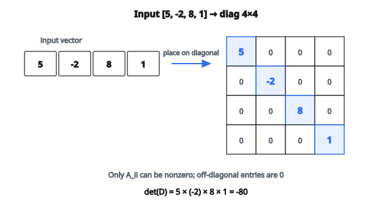

# Ma trận đường chéo

## Diagonal matrix là gì?

Một **diagonal matrix** là ma trận vuông trong đó mọi phần tử ngoài đường chéo chính đều bằng không. Chỉ các phần tử $A_{ii}$ (chỉ số hàng bằng chỉ số cột) mới được khác không.

$$
D = \begin{bmatrix} d_1 & 0 & 0 \\ 0 & d_2 & 0 \\ 0 & 0 & d_3 \end{bmatrix}
$$

Đường chéo chính chạy từ góc trên-trái xuống góc dưới-phải.

## Tạo diagonal matrix

Cho vector giá trị $[d_1, d_2, \ldots, d_n]$, diagonal matrix đặt mỗi giá trị vào vị trí đường chéo tương ứng:

**Vector đầu vào:** $[3, 7, 2]$

**Ma trận đầu ra:**

$$
\begin{bmatrix} 3 & 0 & 0 \\ 0 & 7 & 0 \\ 0 & 0 & 2 \end{bmatrix}
$$

Vị trí $(0, 0)$ nhận 3, vị trí $(1, 1)$ nhận 7, vị trí $(2, 2)$ nhận 2. Mọi vị trí khác bằng 0.

## Quy trình xây dựng

**Bước 1:** Tạo ma trận $n \times n$ toàn số 0, với $n$ là độ dài vector đầu vào.

**Bước 2:** Với mỗi chỉ số $i$ từ 0 đến $n-1$, gán vị trí $(i, i)$ bằng phần tử thứ $i$ của vector đầu vào.

**Ví dụ:**

Đầu vào: $[5, -2, 8, 1]$

Bước 1: Tạo ma trận không $4 \times 4$

$$
\begin{bmatrix} 0 & 0 & 0 & 0 \\ 0 & 0 & 0 & 0 \\ 0 & 0 & 0 & 0 \\ 0 & 0 & 0 & 0 \end{bmatrix}
$$

Bước 2: Điền các vị trí đường chéo

$$
\begin{bmatrix} 5 & 0 & 0 & 0 \\ 0 & -2 & 0 & 0 \\ 0 & 0 & 8 & 0 \\ 0 & 0 & 0 & 1 \end{bmatrix}
$$

::: {#fig-86-diagonal-matrix fig-cap="Từ $[5,-2,8,1]$ thành $\mathrm{diag}(5,-2,8,1)$: chỉ các ô đường chéo (tô đậm) khác không." fig-alt="Input vector [5, -2, 8, 1] mapped onto the main diagonal of a 4x4 matrix; off-diagonal entries are zero."}
{fig-align="center"}
:::

## Các diagonal matrix đặc biệt

**Identity matrix:**

Diagonal matrix với toàn số 1 trên đường chéo.

$$
I_3 = \begin{bmatrix} 1 & 0 & 0 \\ 0 & 1 & 0 \\ 0 & 0 & 1 \end{bmatrix}
$$

Tạo từ vector $[1, 1, 1]$.

**Scalar matrix:**

Diagonal matrix với cùng một giá trị lặp lại.

$$
\begin{bmatrix} 5 & 0 & 0 \\ 0 & 5 & 0 \\ 0 & 0 & 5 \end{bmatrix} = 5I_3
$$

Tạo từ vector $[5, 5, 5]$.

**Zero matrix:**

Diagonal matrix toàn số 0 (trivially, chính là ma trận không).

## Tính chất của diagonal matrix

**Cộng:**

Tổng hai diagonal matrix vẫn là diagonal. Chỉ cộng các phần tử đường chéo tương ứng.

$$
\begin{bmatrix} a & 0 \\ 0 & b \end{bmatrix} + \begin{bmatrix} c & 0 \\ 0 & d \end{bmatrix} = \begin{bmatrix} a+c & 0 \\ 0 & b+d \end{bmatrix}
$$

**Nhân:**

Tích hai diagonal matrix vẫn là diagonal. Nhân các phần tử đường chéo tương ứng.

$$
\begin{bmatrix} a & 0 \\ 0 & b \end{bmatrix} \times \begin{bmatrix} c & 0 \\ 0 & d \end{bmatrix} = \begin{bmatrix} ac & 0 \\ 0 & bd \end{bmatrix}
$$

Phép nhân này đơn giản hơn nhiều so với nhân ma trận tổng quát.

**Lũy thừa:**

Nâng diagonal matrix lên lũy thừa chỉ cần nâng từng phần tử đường chéo lên cùng lũy thừa.

$$
D^k = \begin{bmatrix} d_1^k & 0 & 0 \\ 0 & d_2^k & 0 \\ 0 & 0 & d_3^k \end{bmatrix}
$$

**Nghịch đảo:**

Nghịch đảo của diagonal matrix (nếu tồn tại) cũng là diagonal với các phần tử nghịch đảo.

$$
D^{-1} = \begin{bmatrix} 1/d_1 & 0 & 0 \\ 0 & 1/d_2 & 0 \\ 0 & 0 & 1/d_3 \end{bmatrix}
$$

Nghịch đảo tồn tại chỉ khi không có phần tử đường chéo nào bằng 0.

**Determinant:**

Determinant là tích các phần tử đường chéo.

$$
\det(D) = d_1 \times d_2 \times \cdots \times d_n
$$

**Trace:**

Trace là tổng các phần tử đường chéo.

$$
\text{tr}(D) = d_1 + d_2 + \cdots + d_n
$$

**Eigenvalues:**

Các eigenvalue của diagonal matrix chính là các phần tử đường chéo. Các eigenvector là các vector cơ sở chuẩn.

## Nhân diagonal matrix với vector

Nhân diagonal matrix với vector scale từng thành phần độc lập:

$$
\begin{bmatrix} d_1 & 0 & 0 \\ 0 & d_2 & 0 \\ 0 & 0 & d_3 \end{bmatrix} \begin{bmatrix} x_1 \\ x_2 \\ x_3 \end{bmatrix} = \begin{bmatrix} d_1 x_1 \\ d_2 x_2 \\ d_3 x_3 \end{bmatrix}
$$

Phép này tương đương nhân từng phần tử của vector đường chéo với vector đầu vào.

**Lợi thế tính toán:** $O(n)$ thay vì $O(n^2)$ cho nhân ma trận–vector tổng quát.

## Ứng dụng trong machine learning

**Scale đặc trưng:**

Diagonal matrix biểu diễn scale độc lập theo từng chiều đặc trưng.

$$
X_{\text{scaled}} = X \cdot D
$$

với $D$ chứa các hệ số scale.

**Ma trận hiệp phương sai:**

Khi các đặc trưng không tương quan, ma trận hiệp phương sai là diagonal. Các phần tử đường chéo là phương sai.

$$
\Sigma = \begin{bmatrix} \sigma_1^2 & 0 & 0 \\ 0 & \sigma_2^2 & 0 \\ 0 & 0 & \sigma_3^2 \end{bmatrix}
$$

**Phân tích eigenvalue:**

Mọi ma trận chéo hóa được $A$ có thể viết:

$$
A = V D V^{-1}
$$

với $D$ là diagonal matrix các eigenvalue.

**Singular Value Decomposition (SVD):**

$$
A = U \Sigma V^T
$$

với $\Sigma$ là diagonal matrix các singular value.

**Khởi tạo trọng số mạng nơ-ron:**

Diagonal matrix có thể khởi tạo trọng số để scale độc lập theo từng đặc trưng.

**Cơ chế attention:**

Ma trận attention diagonal biểu diễn self-attention trong đó mỗi vị trí chỉ attend vào chính nó.

## Trích đường chéo

Phép ngược lại trích đường chéo từ một ma trận:

$$
A = \begin{bmatrix} 1 & 2 & 3 \\ 4 & 5 & 6 \\ 7 & 8 & 9 \end{bmatrix}
$$

Đường chéo: $[1, 5, 9]$

Hữu ích để:

* Lấy eigenvalue từ ma trận đã chéo hóa
* Tính trace (tổng đường chéo)
* Trích phương sai từ ma trận hiệp phương sai

## Biểu diễn thưa

Diagonal matrix rất thưa. Với ma trận diagonal $n \times n$:

* Tổng số phần tử: $n^2$
* Phần tử khác không: tối đa $n$
* Độ thưa: $(n^2 - n) / n^2 = 1 - 1/n$

Với $n$ lớn, độ thưa tiến tới gần 100%.

**Hiệu quả lưu trữ:**

Thay vì lưu $n^2$ giá trị, chỉ lưu $n$ giá trị đường chéo.

**Hiệu quả tính toán:**

Phép toán trên diagonal matrix là $O(n)$ thay vì $O(n^2)$ hoặc $O(n^3)$.

## Ma trận ngoài đường chéo

Các khái niệm liên quan:

**Upper triangular:** Mọi phần tử dưới đường chéo đều bằng 0.

**Lower triangular:** Mọi phần tử trên đường chéo đều bằng 0.

**Tridiagonal:** Chỉ khác không trên đường chéo chính và hai đường chéo kề.

**Band matrix:** Chỉ khác không trong một dải quanh đường chéo.

Diagonal matrix là trường hợp đặc biệt với độ rộng dải bằng 1.

## Code
```python
import numpy as np

def make_diagonal(v):
    """
    Returns: (n, n) NumPy array with v on the main diagonal
    """
    v = np.asarray(v, dtype=float)
    n = len(v)
    D = np.zeros((n, n), dtype=float)
    for i in range(n):
        D[i, i] = v[i]
    return D

```
