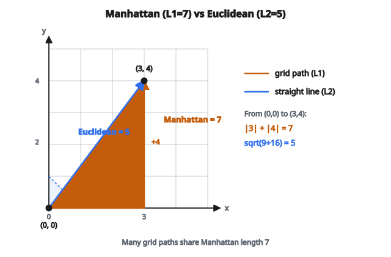

# Manhattan Distance

## Manhattan distance là gì

**Manhattan distance** đo khoảng cách giữa hai điểm bằng tổng các hiệu tuyệt đối theo từng chiều. Tên "Manhattan" đến từ hình ảnh đi bộ trên lưới phố: chỉ được đi ngang hoặc dọc, không đi chéo.

Còn được gọi là:

* L1 distance
* Taxicab distance
* City block distance
* Rectilinear distance

## Công thức chính

Với hai điểm $A = (a_1, a_2, \ldots, a_n)$ và $B = (b_1, b_2, \ldots, b_n)$:

$$
d_{\text{Manhattan}}(A, B) = \sum_{i=1}^{n} |a_i - b_i|
$$

Cộng các hiệu tuyệt đối trên từng tọa độ.

## Tính từng bước

**Ví dụ 1: điểm 2D**

$A = (2, 3)$ và $B = (5, 7)$

$$
d = |2 - 5| + |3 - 7| = |-3| + |-4| = 3 + 4 = 7
$$

Bạn sẽ đi 3 khối về phía đông và 4 khối về phía bắc.

**Ví dụ 2: điểm 3D**

$A = (1, 2, 3)$ và $B = (4, 0, 6)$

$$
d = |1 - 4| + |2 - 0| + |3 - 6| = 3 + 2 + 3 = 8
$$

**Ví dụ 3: vector nhiều chiều**

$A = [1, 0, 3, 2]$ và $B = [0, 2, 1, 5]$

$$
d = |1 - 0| + |0 - 2| + |3 - 1| + |2 - 5| = 1 + 2 + 2 + 3 = 8
$$

## Diễn giải hình học

Trong 2D, Manhattan distance vẽ đường đi theo lưới:

Từ $(0, 0)$ đến $(3, 4)$:

* Euclidean distance: $\sqrt{3^2 + 4^2} = 5$ (đường thẳng)
* Manhattan distance: $3 + 4 = 7$ (đường lưới)

::: {#fig-17-manhattan-grid fig-cap="Từ $(0,0)$ đến $(3,4)$: Manhattan $= 3 + 4 = 7$ (lưới), Euclidean $= 5$ (đường thẳng). Diamond là unit ball L1." fig-alt="Luoi 2D tu (0,0) den (3,4): duong Manhattan ngang-doc do dai 7 va duong Euclidean thang do dai 5; diamond unit ball L1."}
{fig-align="center"}
:::

Có nhiều đường có cùng Manhattan distance. Mọi đường đi 3 đơn vị sang phải và 4 đơn vị lên trên (theo thứ tự bất kỳ) đều có khoảng cách 7.

"Vòng tròn" Manhattan bán kính $r$ tâm gốc tọa độ là hình thoi (diamond) với các đỉnh tại $(r, 0)$, $(0, r)$, $(-r, 0)$, $(0, -r)$.

## Manhattan so với Euclidean Distance

**Euclidean distance (L2):**

$$
d_{\text{Euclidean}} = \sqrt{\sum_{i=1}^{n} (a_i - b_i)^2}
$$

**Manhattan distance (L1):**

$$
d_{\text{Manhattan}} = \sum_{i=1}^{n} |a_i - b_i|
$$

**Khác biệt then chốt:**

Euclidean bình phương các hiệu rồi lấy căn. Hiệu lớn bị phạt nặng hơn.

Manhattan chỉ cộng hiệu tuyệt đối. Mọi hiệu được trọng số ngang nhau.

**So sánh với $A = (0, 0)$ và $B = (3, 4)$:**

* Euclidean: $\sqrt{9 + 16} = 5$
* Manhattan: $3 + 4 = 7$

**So sánh với $A = (0, 0)$ và $B = (1, 1)$:**

* Euclidean: $\sqrt{1 + 1} = 1.414$
* Manhattan: $1 + 1 = 2$

Manhattan distance luôn lớn hơn hoặc bằng Euclidean distance.

## Tính chất của Manhattan Distance

**Không âm (non-negativity):**

$d(A, B) \geq 0$, và $d(A, B) = 0$ khi và chỉ khi $A = B$.

**Đối xứng (symmetry):**

$d(A, B) = d(B, A)$

**Bất đẳng thức tam giác (triangle inequality):**

$d(A, C) \leq d(A, B) + d(B, C)$

Ba tính chất này khiến Manhattan distance là một metric hợp lệ.

**Quan hệ với Euclidean:**

$$
d_{\text{Euclidean}} \leq d_{\text{Manhattan}} \leq \sqrt{n} \cdot d_{\text{Euclidean}}
$$

với $n$ là số chiều.

## Khi nào dùng Manhattan Distance

**Bài toán trên lưới:**

* Tìm đường trên lưới (game, robotics)
* Tối ưu kho (lối đi dạng lưới)
* Thiết kế mạch (dây chạy ngang/dọc)

**Dữ liệu thưa, nhiều chiều:**

* Manhattan distance bền vững với outlier hơn Euclidean
* Ở chiều cao, Euclidean distance kém ý nghĩa hơn (curse of dimensionality)
* L1 thúc đẩy sparsity (liên quan L1 regularization)

**Hiệu số nguyên hoặc categorical:**

* Khi mỗi chiều là một thuộc tính độc lập
* Hamming distance (cho vector nhị phân) là trường hợp đặc biệt

**Robust regression:**

* L1 loss (MAE) dùng Manhattan distance từ dự đoán tới nhãn
* Ít nhạy với outlier hơn L2 loss (MSE)

## Manhattan Distance trong machine learning

**K-Nearest Neighbors (KNN):**

KNN có thể dùng mọi distance metric. Manhattan distance thường dùng khi:

* Dữ liệu nhiều chiều
* Dữ liệu có outlier
* Feature khác thang đo (sau khi chuẩn hóa)

**Clustering:**

K-medians clustering cực tiểu hóa Manhattan distance (trong khi K-means cực tiểu hóa Euclidean).

**Hệ gợi ý (recommendation systems):**

Độ tương đồng người dùng có thể đo bằng Manhattan distance trên vector rating.

**Feature selection:**

L1 regularization (LASSO) thêm phạt tỉ lệ với Manhattan distance từ gốc tới vector trọng số.

## Cân nhắc tính toán

Manhattan distance cần:

* $n$ phép trừ
* $n$ giá trị tuyệt đối
* $n - 1$ phép cộng
* Độ phức tạp thời gian: $O(n)$

Không cần căn bậc hai như Euclidean distance. Vì vậy Manhattan distance tính nhanh hơn một chút.

**Tính vector hóa:**

Với mảng $A$ và $B$:

$$
d = \mathrm{sum}(\mathrm{abs}(A - B))
$$

Cách này rất hiệu quả với thư viện mảng tối ưu.

## Xử lý vấn đề số học

Manhattan distance không có vấn đề ổn định số:

* Không chia
* Không căn bậc hai
* Chỉ trừ và lấy giá trị tuyệt đối

Ngay cả với số rất lớn hoặc rất nhỏ, phép tính vẫn thẳng tiến.

## Mở rộng: Weighted Manhattan Distance

Có thể gắn trọng số khác nhau cho từng chiều:

$$
d_{\text{weighted}} = \sum_{i=1}^{n} w_i |a_i - b_i|
$$

Hữu ích khi một số feature quan trọng hơn các feature khác.

## Code
```python
import numpy as np

def manhattan_distance(x, y):
    """
    Compute the Manhattan (L1) distance between vectors x and y.
    Must return a float.
    """
    x = np.asarray(x, dtype=float)
    y = np.asarray(y, dtype=float)
    if x.shape != y.shape:
        raise ValueError("length mismatch")
    return float(np.sum(np.abs(x - y)))
```
