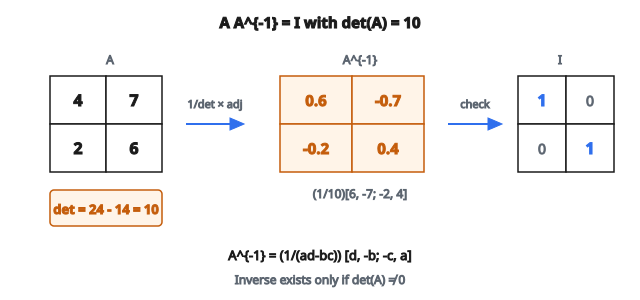

# Nghịch đảo ma trận

## Matrix inverse là gì?

Nghịch đảo của ma trận $A$ là một ma trận khác, ký hiệu $A^{-1}$, sao cho:

$$
A A^{-1} = A^{-1} A = I
$$

với $I$ là identity matrix (số 1 trên đường chéo, số 0 ở nơi khác).

Hãy nghĩ như phép chia cho ma trận. Nếu $Ax = b$, thì $x = A^{-1}b$. Nghịch đảo “hoàn tác” hiệu ứng của phép nhân với $A$.

## Khi nào nghịch đảo tồn tại?

Không phải ma trận nào cũng có nghịch đảo. Để nghịch đảo tồn tại, ma trận phải:

**Vuông:** Cùng số hàng và số cột ($n \times n$).

**Non-singular:** Determinant khác không: $\det(A) \neq 0$.

Ma trận không có nghịch đảo gọi là **singular** hoặc **non-invertible**. Ma trận singular có:

* Determinant bằng không
* Ít nhất một eigenvalue bằng không
* Các hàng (hoặc cột) phụ thuộc tuyến tính
* Null space lớn hơn chỉ vector không

## Trường hợp 2×2

Với ma trận $2 \times 2$, có công thức đơn giản:

$$
A = \begin{bmatrix} a & b \\ c & d \end{bmatrix}
$$

$$
A^{-1} = \frac{1}{ad - bc} \begin{bmatrix} d & -b \\ -c & a \end{bmatrix}
$$

Số hạng $ad - bc$ chính là determinant. Nếu bằng không, nghịch đảo không tồn tại.

**Ví dụ:**

$$
A = \begin{bmatrix} 4 & 7 \\ 2 & 6 \end{bmatrix}
$$

Determinant: $4(6) - 7(2) = 24 - 14 = 10$

$$
A^{-1} = \frac{1}{10} \begin{bmatrix} 6 & -7 \\ -2 & 4 \end{bmatrix} = \begin{bmatrix} 0.6 & -0.7 \\ -0.2 & 0.4 \end{bmatrix}
$$

::: {#fig-87-matrix-inverse-2x2 fig-cap="$A=[[4,7],[2,6]]$, $\det(A)=10$, và $A^{-1}=\frac{1}{10}[[6,-7],[-2,4]]=[[0.6,-0.7],[-0.2,0.4]]$." fig-alt="2x2 matrix A equals [[4,7],[2,6]] with det(A)=10 maps to A inverse equals [[0.6,-0.7],[-0.2,0.4]]."}
{fig-align="center"}
:::

**Kiểm chứng:**

$$
A A^{-1} = \begin{bmatrix} 4 & 7 \\ 2 & 6 \end{bmatrix} \begin{bmatrix} 0.6 & -0.7 \\ -0.2 & 0.4 \end{bmatrix} = \begin{bmatrix} 1 & 0 \\ 0 & 1 \end{bmatrix}
$$

## Vì sao nghịch đảo quan trọng

**Giải hệ tuyến tính:**

Hệ $Ax = b$ có nghiệm $x = A^{-1}b$ (khi $A$ khả nghịch). Tuy nhiên, tính nghịch đảo tường minh thường không phải cách tốt nhất về mặt số. Các solver trực tiếp như LU decomposition được ưu tiên hơn.

**Hiểu biến đổi tuyến tính:**

Nếu $A$ biểu diễn một biến đổi (rotation, scaling, shearing), thì $A^{-1}$ biểu diễn biến đổi ngược. Nếu $A$ xoay 30 độ, $A^{-1}$ xoay $-30$ độ.

**Đổi cơ sở:**

Nếu $P$ là ma trận đổi cơ sở, thì $P^{-1}$ đưa về cơ sở gốc. Công thức biến đổi ma trận sang cơ sở mới là $P^{-1}AP$.

## Tính chất của nghịch đảo

**Nghịch đảo của tích (thứ tự đảo ngược!):**

$$
(AB)^{-1} = B^{-1} A^{-1}
$$

Tương tự quy tắc với transpose. Để hoàn tác $AB$, trước hết hoàn tác $B$, rồi hoàn tác $A$.

**Nghịch đảo của transpose:**

$$
(A^T)^{-1} = (A^{-1})^T
$$

Bạn có thể transpose rồi invert, hoặc invert rồi transpose.

**Nghịch đảo của nghịch đảo:**

$$
(A^{-1})^{-1} = A
$$

**Determinant của nghịch đảo:**

$$
\det(A^{-1}) = \frac{1}{\det(A)}
$$

## Các trường hợp đặc biệt có nghịch đảo đơn giản

**Diagonal matrix:**

Nếu $D = \text{diag}(d_1, d_2, \ldots, d_n)$, thì:

$$
D^{-1} = \text{diag}(1/d_1, 1/d_2, \ldots, 1/d_n)
$$

Chỉ cần nghịch đảo từng phần tử đường chéo. Yêu cầu mọi $d_i \neq 0$.

**Orthogonal matrix:**

Nếu $Q$ orthogonal ($Q^T Q = I$), thì:

$$
Q^{-1} = Q^T
$$

Nghịch đảo chính là transpose! Rotation matrix là orthogonal, nên dễ nghịch đảo.

**Triangular matrix:**

Ma trận upper và lower triangular có thể nghịch đảo hiệu quả bằng back-substitution. Nghịch đảo của triangular matrix cũng là triangular.

## Công thức tổng quát (adjugate)

Với mọi ma trận khả nghịch $n \times n$:

$$
A^{-1} = \frac{1}{\det(A)} \text{adj}(A)
$$

với $\text{adj}(A)$ là ma trận adjugate (hay classical adjoint), được tạo bằng cách:

1. Tính cofactor của từng phần tử
2. Transpose kết quả

Công thức này thanh lịch nhưng tốn kém với ma trận lớn ($O(n!)$ nếu tính determinant ngây thơ). Thuật toán thực tế dùng Gaussian elimination hoặc các phương pháp phân tích.

## Cân nhắc số học

**Ma trận ill-conditioned:**

Ngay cả khi nghịch đảo tồn tại về mặt lý thuyết, nó có thể không ổn định số. Condition number $\kappa(A)$ đo mức độ này:

$$
\kappa(A) = ||A|| \cdot ||A^{-1}||
$$

Condition number lớn (ví dụ $10^{10}$) nghĩa là thay đổi nhỏ trên $A$ hoặc $b$ gây thay đổi khổng lồ ở $A^{-1}b$. Ma trận “gần singular.”

**Tránh nghịch đảo tường minh:**

Trong thực tế, bạn hiếm khi tính $A^{-1}$ tường minh. Thay vào đó:

* Để giải $Ax = b$, dùng LU decomposition hoặc QR decomposition
* Để tính $A^{-1}b$, giải hệ trực tiếp
* `np.linalg.solve(A, b)` của NumPy chính xác hơn `np.linalg.inv(A) @ b`

## Ma trận singular: chuyện gì xảy ra?

Khi $A$ singular:

* $\det(A) = 0$
* Hệ $Ax = b$ hoặc vô nghiệm hoặc vô số nghiệm
* $A$ ánh xạ một số vector khác không về không (null space không tầm thường)

Cố nghịch đảo ma trận singular trong code sẽ hoặc báo lỗi hoặc cho ra kết quả rác do chia cho không (hoặc giá trị gần không).

## Moore-Penrose pseudoinverse

Khi $A$ không khả nghịch (hoặc thậm chí không vuông), pseudoinverse $A^+$ cung cấp một nghịch đảo tổng quát:

* Với hệ overdetermined: $A^+ = (A^T A)^{-1} A^T$ (least squares)
* Với hệ underdetermined: $A^+ = A^T (A A^T)^{-1}$ (minimum norm)

Pseudoinverse luôn tồn tại và cho nghiệm “tốt nhất” theo nghĩa least-squares.
