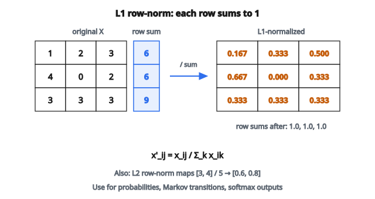

# Chuẩn hóa ma trận

## Matrix normalization là gì?

**Matrix normalization** biến đổi các giá trị trong ma trận sao cho hàng, cột, hoặc toàn bộ ma trận thỏa một tiêu chí nhất định — ví dụ tổng bằng một hoặc có độ dài đơn vị. Nó đảm bảo các mẫu hoặc đặc trưng khác nhau có thể so sánh được bất kể thang đo hoặc độ lớn ban đầu.

## Vì sao chuẩn hóa ma trận?

**Diễn giải xác suất**: Khi hàng (hoặc cột) tổng bằng 1, các phần tử có thể diễn giải như xác suất hoặc tỷ lệ.

**Loại bỏ hiệu ứng thang đo**: Các mẫu có giá trị tuyệt đối lớn không chiếm ưu thế trong so sánh hay tính khoảng cách.

**Yêu cầu thuật toán**: Nhiều thuật toán (softmax, attention mechanisms, Markov chains) đòi hỏi đầu vào đã chuẩn hóa.

**Ổn định số**: Chuẩn hóa giữ giá trị trong khoảng hợp lý, tránh overflow/underflow.

## Các kiểu chuẩn hóa ma trận

### Row normalization (L1 — tổng bằng một)

Mỗi hàng được chia cho tổng của nó để mọi phần tử trong hàng cộng lại bằng 1:

$$
x'_{ij} = \frac{x_{ij}}{\sum_{k} x_{ik}}
$$

**Ứng dụng**:

* Đổi count sang tỷ lệ
* Tạo phân phối xác suất trên các hạng mục
* Ma trận chuyển tiếp trong Markov chains

**Ví dụ**:

* Hàng gốc: $[2, 4, 4]$
* Tổng hàng: $2 + 4 + 4 = 10$
* Hàng đã chuẩn hóa: $[0.2, 0.4, 0.4]$

### Row normalization (L2 — độ dài đơn vị)

Mỗi hàng được chia cho Euclidean norm (L2 norm):

$$
x'_{ij} = \frac{x_{ij}}{\sqrt{\sum_{k} x_{ik}^2}}
$$

Sau chuẩn hóa, mỗi hàng có độ dài 1: $\sqrt{\sum_k (x'_{ik})^2} = 1$

**Ứng dụng**:

* Cosine similarity trở thành tích vô hướng
* Text embeddings (vector TF-IDF)
* Khởi tạo trọng số mạng nơ-ron

**Ví dụ**:

* Hàng gốc: $[3, 4]$
* L2 norm: $\sqrt{3^2 + 4^2} = \sqrt{25} = 5$
* Hàng đã chuẩn hóa: $[0.6, 0.8]$
* Kiểm chứng: $\sqrt{0.6^2 + 0.8^2} = \sqrt{1} = 1$

### Column normalization

Cùng các phép toán nhưng theo cột thay vì theo hàng:

**L1 (tổng bằng một)**:

$$
x'_{ij} = \frac{x_{ij}}{\sum_{k} x_{kj}}
$$

**L2 (độ dài đơn vị)**:

$$
x'_{ij} = \frac{x_{ij}}{\sqrt{\sum_{k} x_{kj}^2}}
$$

**Ứng dụng**:

* Chuẩn hóa đặc trưng khi đặc trưng nằm theo cột
* Ma trận doubly stochastic (cả hàng lẫn cột đều tổng bằng 1)

### Global normalization

Chuẩn hóa bằng thống kê tính trên toàn ma trận:

**Chia cho tổng toàn cục**:

$$
x'_{ij} = \frac{x_{ij}}{\sum_{m,n} x_{mn}}
$$

**Chia cho max toàn cục**:

$$
x'_{ij} = \frac{x_{ij}}{\max_{m,n}(x_{mn})}
$$

## Tính chất toán học

**L1 normalization bảo toàn**:

* Không âm (nếu giá trị gốc không âm)
* Tạo phân phối xác suất hợp lệ

**L2 normalization bảo toàn**:

* Hướng của vector (chỉ độ lớn đổi)
* Góc giữa các vector

**Không bảo toàn**:

* Độ lớn tuyệt đối
* Hiệu giữa các giá trị (tỷ lệ được giữ nhưng không giữ tuyệt đối)

## Ví dụ số: L1 row normalization

**Ma trận gốc**:

* Hàng 0: $[1, 2, 3]$
* Hàng 1: $[4, 0, 2]$
* Hàng 2: $[3, 3, 3]$

**Bước 1 — Tính tổng từng hàng**:

* Tổng hàng 0: $1 + 2 + 3 = 6$
* Tổng hàng 1: $4 + 0 + 2 = 6$
* Tổng hàng 2: $3 + 3 + 3 = 9$

**Bước 2 — Chia mỗi phần tử cho tổng hàng**:

* Hàng 0: $[1/6, 2/6, 3/6] = [0.167, 0.333, 0.500]$
* Hàng 1: $[4/6, 0/6, 2/6] = [0.667, 0.000, 0.333]$
* Hàng 2: $[3/9, 3/9, 3/9] = [0.333, 0.333, 0.333]$

**Kiểm chứng**: Mỗi hàng tổng bằng 1.0

::: {#fig-37-l1-row-normalize fig-cap="L1 row-norm: mỗi hàng chia cho tổng hàng; kết quả $[0.167, 0.333, 0.500]$, $\ldots$ và mỗi hàng tổng bằng 1." fig-alt="L1 row normalization: rows [1,2,3], [4,0,2], [3,3,3] become rows summing to one: [0.167,0.333,0.500], [0.667,0.000,0.333], [0.333,0.333,0.333]."}
{fig-align="center"}
:::

## Ví dụ số: L2 row normalization

**Ma trận gốc**:

* Hàng 0: $[3, 4]$
* Hàng 1: $[0, 5]$

**Bước 1 — Tính L2 norm**:

* Hàng 0: $\sqrt{3^2 + 4^2} = \sqrt{25} = 5$
* Hàng 1: $\sqrt{0^2 + 5^2} = \sqrt{25} = 5$

**Bước 2 — Chia mỗi phần tử cho norm hàng**:

* Hàng 0: $[3/5, 4/5] = [0.6, 0.8]$
* Hàng 1: $[0/5, 5/5] = [0.0, 1.0]$

**Kiểm chứng**: $\sqrt{0.6^2 + 0.8^2} = 1.0$ và $\sqrt{0^2 + 1^2} = 1.0$

## Xử lý trường hợp biên

**Hàng/cột không**: Nếu một hàng tổng bằng không (hoặc L2 norm bằng không), phép chia không xác định.

Các lựa chọn:

* Để nguyên toàn số 0 (phổ biến nhất)
* Thay bằng phân phối đều $[1/n, 1/n, \ldots, 1/n]$
* Báo lỗi

**Giá trị âm**: L1 normalization có thể tạo “xác suất âm” nếu đầu vào âm. Cân nhắc dùng trị tuyệt đối hoặc chỉ áp dụng trên dữ liệu không âm.

**Mẫu số rất nhỏ**: Có thể gây bất ổn số. Cộng thêm epsilon nhỏ: $x'_{ij} = \frac{x_{ij}}{\text{norm} + \epsilon}$

## Normalization so với standardization

**Normalization**: Scale giá trị về một khoảng hoặc ràng buộc cụ thể

* L1: hàng tổng bằng 1
* L2: hàng có độ dài đơn vị
* Min-max: giá trị trong $[0, 1]$

**Standardization**: Căn giữa và scale theo thống kê

* Z-score: mean 0, độ lệch chuẩn 1
* Không ràng buộc khoảng

Hai thuật ngữ đôi khi dùng lẫn, nhưng chúng chỉ các phép toán khác nhau.

## Chọn trục (axis)

Trong phép toán ma trận, “axis” quyết định hướng:

* **axis=0**: Thao tác dọc theo hàng (kết quả theo từng cột)
* **axis=1**: Thao tác dọc theo cột (kết quả theo từng hàng)

Với row normalization (mỗi mẫu chuẩn hóa độc lập):

* Tính norm theo axis=1
* Chia mỗi hàng cho norm của nó

Với column normalization (mỗi đặc trưng chuẩn hóa độc lập):

* Tính norm theo axis=0
* Chia mỗi cột cho norm của nó

## Matrix normalization xuất hiện ở đâu

* **Softmax Function**: Mũ hóa rồi L1-normalize để tạo phân phối xác suất
* **Attention Mechanisms**: Điểm query–key được chuẩn hóa thành trọng số attention
* **Markov Chains**: Ma trận xác suất chuyển tiếp có các hàng tổng bằng 1
* **PageRank**: Ma trận liên kết được L1 row-normalize
* **Information Retrieval**: Vector TF-IDF được L2-normalize cho cosine similarity
* **Neural Networks**: Batch normalization, layer normalization, weight normalization
* **Recommender Systems**: Ma trận tương tác user–item được chuẩn hóa để so sánh công bằng
* **Image Processing**: Chuẩn hóa cường độ pixel
* **Topic Modeling**: Phân phối document–topic và topic–word
* **Bioinformatics**: Ma trận biểu hiện gene được chuẩn hóa trên các mẫu

## Code
```python
import numpy as np

def matrix_normalization(matrix, axis=None, norm_type="l2"):
    """
    Normalize a 2D matrix along specified axis using specified norm.
    """
    matrix = np.asarray(matrix, dtype=float)
    if matrix.ndim != 2:
        return None
    if norm_type == "l1":
        norms = np.sum(np.abs(matrix), axis=axis, keepdims=True)
    elif norm_type == "l2":
        norms = np.sqrt(np.sum(matrix ** 2, axis=axis, keepdims=True))
    elif norm_type == "max":
        norms = np.max(np.abs(matrix), axis=axis, keepdims=True)
    else:
        return None
    norms = np.where(norms == 0, 1, norms)
    return matrix / norms

```

<!-- auto-self-check -->

::: {.callout-note}
## Kiểm tra nhanh
<details>
<summary>Ý chính của bài «Chuẩn hóa ma trận» là gì?</summary>
**Matrix normalization** biến đổi các giá trị trong ma trận sao cho hàng, cột, hoặc toàn bộ ma trận thỏa một tiêu chí nhất định — ví dụ tổng bằng một hoặc có độ dài đơn vị.
</details>
<details>
<summary>Công thức / quan hệ cốt lõi trong bài là gì?</summary>
$$x'_{ij} = \frac{x_{ij}}{\sum_{k} x_{ik}}$$
</details>
:::
