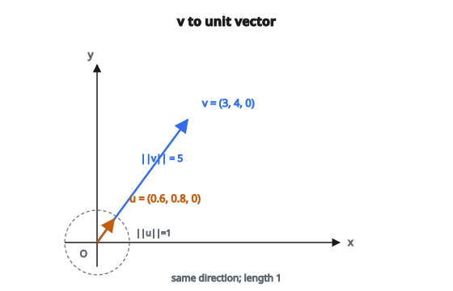

# Chuẩn hóa vector 3D

## Chuẩn hóa vector là gì

Chuẩn hóa vector là quá trình biến một vector thành **unit vector** (vector có độ dài 1) cùng hướng với vector gốc.

Vector đã chuẩn hóa còn được gọi là **unit vector** hoặc **direction vector**.

$$
\hat{\mathbf{v}} = \frac{\mathbf{v}}{\lVert\mathbf{v}\rVert}
$$

## Vì sao cần chuẩn hóa

**1. Hướng không kèm độ lớn:**

Khi chỉ quan tâm hướng, không quan tâm độ dài. Ví dụ: pháp tuyến bề mặt cho chiếu sáng.

**2. Đơn giản hóa tính toán:**

Nhiều công thức gọn hơn khi vector có độ dài đơn vị:

* Tích vô hướng chỉ còn $\cos(\theta)$
* Không cần chia lại cho độ lớn nhiều lần

**3. Ổn định số:**

Giữ vector đã chuẩn hóa giúp giá trị không phình ra không giới hạn.

**4. Biểu diễn chuẩn:**

Cho phép so sánh công bằng giữa các vector có độ lớn gốc khác nhau.

## Công thức chuẩn hóa

Với vector 3D $\mathbf{v} = (v_x, v_y, v_z)$:

**Bước 1:** Tính độ lớn (length):

$$
\lVert\mathbf{v}\rVert = \sqrt{v_x^2 + v_y^2 + v_z^2}
$$

**Bước 2:** Chia từng thành phần cho độ lớn:

$$
\hat{\mathbf{v}} = \left( \frac{v_x}{\lVert\mathbf{v}\rVert}, \frac{v_y}{\lVert\mathbf{v}\rVert}, \frac{v_z}{\lVert\mathbf{v}\rVert} \right)
$$

::: {#fig-96-normalize-unit fig-cap="$\mathbf{v} = (3, 4, 0)$ có $\lVert\mathbf{v}\rVert = 5$; chia cho 5 được unit vector $\hat{\mathbf{v}} = (0.6, 0.8, 0)$." fig-alt="Hai mui ten dong huong trong mat phang XY: v = (3, 4, 0) dai hon va unit vector (0.6, 0.8, 0) do dai 1."}
{fig-align="center"}
:::

## Tính chất của vector đã chuẩn hóa

**Độ dài đơn vị:**

$$
\lVert\hat{\mathbf{v}}\rVert = 1
$$

**Cùng hướng:**

$$
\hat{\mathbf{v}} \parallel \mathbf{v}
$$

**Quan hệ scale:**

$$
\mathbf{v} = \lVert\mathbf{v}\rVert \cdot \hat{\mathbf{v}}
$$

Mọi vector bằng độ lớn nhân với unit vector của nó.

## Ví dụ số

**Vector:** $\mathbf{v} = (3, 4, 0)$

**Bước 1: Tính độ lớn**

$$
\lVert\mathbf{v}\rVert = \sqrt{3^2 + 4^2 + 0^2} = \sqrt{9 + 16 + 0} = \sqrt{25} = 5
$$

**Bước 2: Chia các thành phần**

$$
\hat{\mathbf{v}} = \left( \frac{3}{5}, \frac{4}{5}, \frac{0}{5} \right) = (0.6, 0.8, 0)
$$

**Kiểm tra:**

$$
\lVert\hat{\mathbf{v}}\rVert = \sqrt{0.6^2 + 0.8^2 + 0^2} = \sqrt{0.36 + 0.64} = \sqrt{1} = 1
$$

## Ví dụ khác

**Vector:** $\mathbf{v} = (1, 2, 2)$

**Độ lớn:**

$$
\lVert\mathbf{v}\rVert = \sqrt{1^2 + 2^2 + 2^2} = \sqrt{1 + 4 + 4} = \sqrt{9} = 3
$$

**Vector đã chuẩn hóa:**

$$
\hat{\mathbf{v}} = \left( \frac{1}{3}, \frac{2}{3}, \frac{2}{3} \right) \approx (0.333, 0.667, 0.667)
$$

**Kiểm tra:**

$$
\lVert\hat{\mathbf{v}}\rVert = \sqrt{\frac{1}{9} + \frac{4}{9} + \frac{4}{9}} = \sqrt{\frac{9}{9}} = 1
$$

## Ví dụ với thành phần không nguyên

**Vector:** $\mathbf{v} = (1, 1, 1)$

**Độ lớn:**

$$
\lVert\mathbf{v}\rVert = \sqrt{1 + 1 + 1} = \sqrt{3} \approx 1.732
$$

**Vector đã chuẩn hóa:**

$$
\hat{\mathbf{v}} = \left( \frac{1}{\sqrt{3}}, \frac{1}{\sqrt{3}}, \frac{1}{\sqrt{3}} \right) \approx (0.577, 0.577, 0.577)
$$

Đây là unit vector hướng đều theo cả ba trục dương.

## Vấn đề vector không

**Vấn đề then chốt:** Vector không $\mathbf{0} = (0, 0, 0)$ không thể chuẩn hóa.

$$
\lVert\mathbf{0}\rVert = 0
$$

Chia cho không không xác định. Vector không không có “hướng”.

**Cách xử lý:**

* Kiểm tra $\lVert\mathbf{v}\rVert = 0$ (hoặc $\lVert\mathbf{v}\rVert < \epsilon$ với $\epsilon$ nhỏ)
* Trả về vector mặc định, báo lỗi, hoặc xử lý riêng

## Cân nhắc số học

**Vector rất nhỏ:**

Nếu $\lVert\mathbf{v}\rVert$ cực nhỏ (ví dụ $10^{-15}$), phép chia có thể không ổn định số.

**Cách xử lý:** Dùng ngưỡng:

$$
\text{nếu } \lVert\mathbf{v}\rVert < \epsilon:\ \text{xử lý riêng}
$$

$\epsilon$ điển hình: $10^{-8}$ đến $10^{-6}$

**Vector rất lớn:**

Tính $v_x^2 + v_y^2 + v_z^2$ có thể overflow với thành phần rất lớn.

**Cách xử lý:** Scale các thành phần trước, hoặc dùng cách tính norm ổn định số.

## Fast inverse square root

Trong ứng dụng đòi hỏi hiệu năng (game, đồ họa thời gian thực), thường cần nghịch đảo độ lớn:

$$
\frac{1}{\lVert\mathbf{v}\rVert} = \frac{1}{\sqrt{v_x^2 + v_y^2 + v_z^2}}
$$

Thuật toán nổi tiếng “fast inverse square root” (từ Quake III) xấp xỉ giá trị này rất nhanh. CPU hiện đại có lệnh reciprocal square root nhanh.

## Chuẩn hóa theo các norm khác

L2 (Euclidean) norm là phổ biến nhất, nhưng còn các norm khác:

**Chuẩn hóa L1:**

$$
\lVert\mathbf{v}\rVert_1 = |v_x| + |v_y| + |v_z|
$$

**Chuẩn hóa L$\infty$:**

$$
\lVert\mathbf{v}\rVert_\infty = \max(|v_x|, |v_y|, |v_z|)
$$

Mỗi norm cho một “unit” vector khác nhau. L2 là chuẩn cho ứng dụng hình học.

## Ứng dụng trong đồ họa 3D

**Pháp tuyến bề mặt:**

Pháp tuyến phải là unit vector để tính chiếu sáng đúng:

$$
\text{diffuse} = \max(0, \hat{\mathbf{n}} \cdot \hat{\mathbf{l}})
$$

**Direction vector:**

Hướng camera, hướng ánh sáng, hướng vận tốc đều được lợi từ chuẩn hóa.

**Chuẩn hóa quaternion:**

Unit quaternion biểu diễn phép quay. Quaternion không đơn vị gây artifact scale.

## Ứng dụng trong vật lý

**Hướng lực:**

Tách độ lớn và hướng:

$$
\mathbf{F} = F \cdot \hat{\mathbf{d}}
$$

với $F$ là độ lớn lực và $\hat{\mathbf{d}}$ là hướng.

**Hướng vận tốc:**

Tốc độ so với hướng vận tốc:

$$
\mathbf{v} = |\mathbf{v}| \cdot \hat{\mathbf{v}}
$$

## Ứng dụng trong machine learning

**Chuẩn hóa đặc trưng:**

Chuẩn hóa vector đặc trưng về độ dài đơn vị cho:

* Cosine similarity
* Spherical k-means
* Một số kiến trúc mạng nơ-ron

**Embedding:**

Word embedding, sentence embedding thường được chuẩn hóa trước khi so sánh.

**Chuẩn hóa gradient:**

Gradient clipping theo norm ngăn gradient bùng nổ.

## Chuẩn hóa theo batch

Để hiệu quả, chuẩn hóa nhiều vector cùng lúc:

**Cho trước:** Ma trận $V$ shape $(n, 3)$, mỗi hàng là một vector

**Tính norm:** $\lVert V_i\rVert$ cho mỗi hàng

**Chuẩn hóa:** Chia mỗi hàng cho norm của nó

Phép toán vector hóa nhanh hơn nhiều so với vòng lặp.

## Chuẩn hóa lại

Sau nhiều phép toán, sai số dấu phẩy động tích lũy gây “trôi”:

$$
\lVert\hat{\mathbf{v}}\rVert \neq 1 \quad \text{(lệch nhẹ)}
$$

**Cách xử lý:** Định kỳ chuẩn hóa lại:

$$
\hat{\mathbf{v}} \leftarrow \frac{\hat{\mathbf{v}}}{\lVert\hat{\mathbf{v}}\rVert}
$$

Phổ biến với biểu diễn phép quay (quaternion, ma trận quay).

## Quan hệ với phép chiếu

Chiếu $\mathbf{a}$ lên $\mathbf{b}$ dùng unit vector của $\mathbf{b}$:

$$
\operatorname{proj}_{\mathbf{b}} \mathbf{a} = (\mathbf{a} \cdot \hat{\mathbf{b}}) \hat{\mathbf{b}}
$$

Chiếu vô hướng (thành phần theo $\mathbf{b}$):

$$
\operatorname{comp}_{\mathbf{b}} \mathbf{a} = \mathbf{a} \cdot \hat{\mathbf{b}}
$$

## Mở rộng sang n chiều

Cùng công thức áp dụng cho mọi số chiều:

$$
\hat{\mathbf{v}} = \frac{\mathbf{v}}{\lVert\mathbf{v}\rVert} = \frac{\mathbf{v}}{\sqrt{\sum_{i=1}^{n} v_i^2}}
$$

Unit vector chiều cao nằm trên mặt hypersphere $n$ chiều.

## Các lỗi thường gặp

**1. Quên kiểm tra vector không:**

Luôn kiểm tra $\lVert\mathbf{v}\rVert > \epsilon$ trước khi chia.

**2. Chuẩn hóa tại chỗ sai:**

Phải tính độ lớn trước, rồi mới chia mọi thành phần. Không chia $v_x$ rồi dùng $v_x$ đã đổi để tính độ lớn.

**3. Giả định đã chuẩn hóa:**

Không giả định vector đầu vào đã chuẩn hóa trừ khi tài liệu nói rõ.

**4. Tích lũy sai số số học:**

Chuẩn hóa lại định kỳ trong thuật toán lặp.

## Code
```python
import numpy as np

def normalize_3d(v):
    """
    Normalize 3D vector(s) to unit length.
    """
    v = np.asarray(v, dtype=float)
    if v.ndim == 1:
        norm = np.sqrt(np.sum(v**2))
        if norm < 1e-10:
            return v.copy()
        return v / norm
    else:
        norms = np.sqrt(np.sum(v**2, axis=1, keepdims=True))
        result = v.copy()
        mask = (norms.flatten() > 1e-10)
        result[mask] = v[mask] / norms[mask]
        return result

```

<!-- auto-self-check -->

::: {.callout-note}
## Kiểm tra nhanh
<details>
<summary>Ý chính của bài «Chuẩn hóa vector 3D» là gì?</summary>
Chuẩn hóa vector là quá trình biến một vector thành **unit vector** (vector có độ dài 1) cùng hướng với vector gốc.
</details>
<details>
<summary>Công thức / quan hệ cốt lõi trong bài là gì?</summary>
$$\hat{\mathbf{v}} = \frac{\mathbf{v}}{\lVert\mathbf{v}\rVert}$$
</details>
:::
