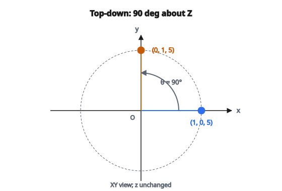

# Quay điểm 3D quanh trục Z

## Quay quanh trục Z là gì

Quay quanh trục Z xoay một điểm hoặc vector trong mặt phẳng XY, giữ nguyên tọa độ Z. Nhìn xuống theo chiều dương của trục Z (hướng về Z âm), góc dương quay ngược chiều kim đồng hồ.

Đây là một trong ba phép quay cơ bản trong không gian 3D, cùng với quay quanh trục X và Y.

## Ma trận quay

Ma trận quay $3 \times 3$ theo góc $\theta$ quanh trục Z là:

$$
R_z(\theta) = \begin{pmatrix} \cos\theta & -\sin\theta & 0 \\ \sin\theta & \cos\theta & 0 \\ 0 & 0 & 1 \end{pmatrix}
$$

Để quay điểm $\mathbf{p} = (x, y, z)^T$:

$$
\mathbf{p}' = R_z(\theta) \mathbf{p}
$$

::: {#fig-98-rotate-z-90 fig-cap="Quay $90^\circ$ quanh Z: $(1, 0, 5) \to (0, 1, 5)$. Nhìn từ trên xuống mặt phẳng XY; $z$ không đổi." fig-alt="Nhin xuong mat phang XY: diem (1,0) quay 90 do quanh Z thanh (0,1); z = 5 khong doi."}
{fig-align="center"}
:::

## Suy ra công thức

Xét điểm $(x, y)$ trong mặt phẳng XY. Trong tọa độ cực:

$$
x = r\cos\phi, \quad y = r\sin\phi
$$

với $r$ là khoảng cách từ gốc và $\phi$ là góc hiện tại.

Sau khi quay thêm $\theta$, góc mới là $\phi + \theta$:

$$
\begin{aligned}
x' &= r\cos(\phi + \theta) = r(\cos\phi\cos\theta - \sin\phi\sin\theta) = x\cos\theta - y\sin\theta \\
y' &= r\sin(\phi + \theta) = r(\sin\phi\cos\theta + \cos\phi\sin\theta) = x\sin\theta + y\cos\theta
\end{aligned}
$$

Tọa độ Z không đổi: $z' = z$

## Các phương trình mở rộng

Với điểm $(x, y, z)$ quay góc $\theta$ quanh Z:

$$
x' = x\cos\theta - y\sin\theta
$$

$$
y' = x\sin\theta + y\cos\theta
$$

$$
z' = z
$$

Hoặc dạng ma trận:

$$
\begin{pmatrix} x' \\ y' \\ z' \end{pmatrix} = \begin{pmatrix} \cos\theta & -\sin\theta & 0 \\ \sin\theta & \cos\theta & 0 \\ 0 & 0 & 1 \end{pmatrix} \begin{pmatrix} x \\ y \\ z \end{pmatrix}
$$

## Ví dụ số: quay 90 độ

**Điểm:** $(1, 0, 5)$

**Góc:** $\theta = 90^\circ = \frac{\pi}{2}$

**Giá trị lượng giác:**

* $\cos(90^\circ) = 0$
* $\sin(90^\circ) = 1$

**Tính:**

$$
x' = 1 \cdot 0 - 0 \cdot 1 = 0
$$

$$
y' = 1 \cdot 1 + 0 \cdot 0 = 1
$$

$$
z' = 5
$$

**Kết quả:** $(0, 1, 5)$

Điểm chuyển từ trục X dương sang trục Y dương.

## Ví dụ số: quay 45 độ

**Điểm:** $(2, 0, 3)$

**Góc:** $\theta = 45^\circ = \frac{\pi}{4}$

**Giá trị lượng giác:**

* $\cos(45^\circ) = \frac{\sqrt{2}}{2} \approx 0.707$
* $\sin(45^\circ) = \frac{\sqrt{2}}{2} \approx 0.707$

**Tính:**

$$
x' = 2 \cdot 0.707 - 0 \cdot 0.707 = 1.414
$$

$$
y' = 2 \cdot 0.707 + 0 \cdot 0.707 = 1.414
$$

$$
z' = 3
$$

**Kết quả:** $(1.414, 1.414, 3)$

## Ví dụ số: điểm tổng quát

**Điểm:** $(3, 4, 2)$

**Góc:** $\theta = 30^\circ = \frac{\pi}{6}$

**Giá trị lượng giác:**

* $\cos(30^\circ) = \frac{\sqrt{3}}{2} \approx 0.866$
* $\sin(30^\circ) = 0.5$

**Tính:**

$$
x' = 3 \cdot 0.866 - 4 \cdot 0.5 = 2.598 - 2 = 0.598
$$

$$
y' = 3 \cdot 0.5 + 4 \cdot 0.866 = 1.5 + 3.464 = 4.964
$$

$$
z' = 2
$$

**Kết quả:** $(0.598, 4.964, 2)$

## Quy ước dấu

**Góc dương (ngược chiều kim đồng hồ):**

Nhìn xuống trục Z (từ Z dương về gốc):

* X dương quay về phía Y dương
* Y dương quay về phía X âm

**Góc âm (theo chiều kim đồng hồ):**

Chiều ngược lại. Tương đương quay $-\theta$.

## Các góc đặc biệt

**$\theta = 0^\circ$:** Không quay, ma trận đơn vị

**$\theta = 90^\circ$:** $(x, y, z) \to (-y, x, z)$

**$\theta = 180^\circ$:** $(x, y, z) \to (-x, -y, z)$

**$\theta = 270^\circ$ hoặc $-90^\circ$:** $(x, y, z) \to (y, -x, z)$

**$\theta = 360^\circ$:** Về vị trí cũ, ma trận đơn vị

## Tính chất của ma trận quay

**Trực giao:**

$$
R_z^T R_z = I
$$

**Định thức bằng 1:**

$$
\det(R_z) = \cos^2\theta + \sin^2\theta = 1
$$

**Nghịch đảo là chuyển vị:**

$$
R_z^{-1}(\theta) = R_z^T(\theta) = R_z(-\theta)
$$

**Bảo toàn độ dài:**

$$
\lVert R_z \mathbf{v}\rVert = \lVert\mathbf{v}\rVert
$$

## Ghép các phép quay

Quay $\theta_1$ rồi $\theta_2$ quanh Z:

$$
R_z(\theta_1 + \theta_2) = R_z(\theta_2) R_z(\theta_1)
$$

Lưu ý: nhân ma trận từ phải sang trái, nhưng các góc cộng lại.

Với quay quanh Z, thứ tự không quan trọng vì mọi phép quay cùng một trục.

## Quay quanh các trục khác

**Quanh trục X:**

$$
R_x(\theta) = \begin{pmatrix} 1 & 0 & 0 \\ 0 & \cos\theta & -\sin\theta \\ 0 & \sin\theta & \cos\theta \end{pmatrix}
$$

**Quanh trục Y:**

$$
R_y(\theta) = \begin{pmatrix} \cos\theta & 0 & \sin\theta \\ 0 & 1 & 0 \\ -\sin\theta & 0 & \cos\theta \end{pmatrix}
$$

Lưu ý: $R_y$ có mẫu dấu ngược do tính chất cyclic của cross product.

## Euler angles

Mọi phép quay 3D có thể phân tích thành ba phép quay quanh các trục tọa độ.

**ZYX (aerospace):**

$$
R = R_z(\psi) R_y(\theta) R_x(\phi)
$$

**XYZ (phổ biến trong đồ họa):**

$$
R = R_x(\phi) R_y(\theta) R_z(\psi)
$$

Thứ tự quan trọng! Thứ tự khác cho phép quay khác.

## Từ axis-angle sang ma trận

Với quay góc $\theta$ quanh đúng trục Z, dùng ma trận ở trên.

Với trục tùy ý $\hat{\mathbf{k}}$, dùng công thức Rodrigues:

$$
R = I + (\sin\theta)K + (1 - \cos\theta)K^2
$$

với $K$ là ma trận phản đối xứng của $\hat{\mathbf{k}}$.

## Quay nhiều điểm

Để quay nhiều điểm hiệu quả:

1. Tính trước $\cos\theta$ và $\sin\theta$ một lần
2. Áp dụng công thức cho từng điểm
3. Hoặc dùng nhân ma trận–vector theo batch

Với $n$ điểm, độ phức tạp $O(n)$ sau bước setup thời gian hằng số.

## Tọa độ homogeneous

Dạng homogeneous $4 \times 4$ (để ghép với tịnh tiến):

$$
R_z^{4\times 4}(\theta) = \begin{pmatrix} \cos\theta & -\sin\theta & 0 & 0 \\ \sin\theta & \cos\theta & 0 & 0 \\ 0 & 0 & 1 & 0 \\ 0 & 0 & 0 & 1 \end{pmatrix}
$$

Có thể ghép với các ma trận tịnh tiến.

## Ổn định số

**Góc gần không:**

Khi $\theta \approx 0$:

* $\cos\theta \approx 1$
* $\sin\theta \approx \theta$

Dùng khai triển Taylor nếu cần độ chính xác cao hơn.

**Phép quay tích lũy:**

Sau nhiều phép quay nhỏ, ma trận có thể lệch khỏi tính trực giao hoàn hảo. Trực giao hóa lại định kỳ.

## Ứng dụng

**Đồ họa 3D:**

* Quay camera
* Biến đổi đối tượng
* Hệ thống animation

**Robotics:**

* Quay khớp
* Hướng end-effector
* Lập kế hoạch đường đi

**Computer vision:**

* Quay ảnh
* Hiệu chỉnh camera
* Tái dựng 3D

**Mô phỏng vật lý:**

* Động lực học vật rắn
* Moment động lượng

## Phương án quaternion

Phép quay cũng có thể biểu diễn bằng quaternion:

$$
q = \cos\frac{\theta}{2} + \sin\frac{\theta}{2}(0\,i + 0\,j + 1\,k)
$$

Với quay quanh trục Z, chỉ thành phần vô hướng và $k$ khác không.

Quaternion tránh gimbal lock và nội suy mượt.

## Code
```python
import numpy as np

def rotate_around_z(points, theta):
    """
    Rotate 3D point(s) around the Z-axis by angle theta (radians).
    """
    points = np.asarray(points, dtype=float)
    single = (points.ndim == 1)
    if single:
        points = points.reshape(1, 3)
    cos_t = np.cos(theta)
    sin_t = np.sin(theta)
    x = points[:, 0]
    y = points[:, 1]
    z = points[:, 2]
    x_new = x * cos_t - y * sin_t
    y_new = x * sin_t + y * cos_t
    result = np.column_stack([x_new, y_new, z])
    if single:
        return result[0]
    return result

```
