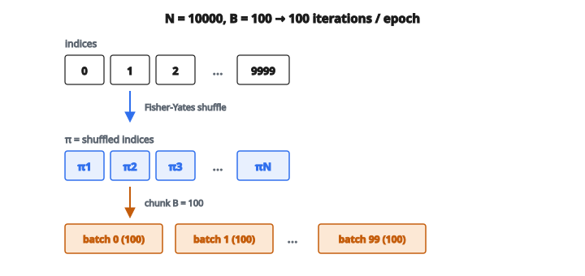

# Batch Shuffling & Mini-Batch Generator

## Mini-batch training là gì

Trong machine learning, huấn luyện trên toàn bộ tập dữ liệu cùng lúc thường không thực tế vì giới hạn bộ nhớ. Mini-batch training xử lý dữ liệu theo từng khối nhỏ, gọi là **batch**. Một batch generator tạo các batch ngay khi cần, giúp huấn luyện mô hình quy mô lớn hiệu quả.

## Vì sao batch training quan trọng

Khi huấn luyện mạng nơ-ron, lựa chọn batch size ảnh hưởng ba yếu tố then chốt:

* **Hiệu quả bộ nhớ**: Không thể nạp 1 triệu mẫu vào bộ nhớ GPU cùng lúc. Batch 32-256 mẫu vừa với giới hạn phần cứng điển hình.
* **Chất lượng gradient**: Gradient tính từ một batch xấp xỉ gradient thật trên toàn tập. Chất lượng xấp xỉ phụ thuộc batch size và độ đa dạng dữ liệu.

$$
\nabla_{\theta} L_{\text{batch}} \approx \nabla_{\theta} L_{\text{full}}
$$

* **Động lực huấn luyện**: Batch nhỏ hơn đưa nhiễu, có thể giúp thoát cực tiểu địa phương; batch lớn hơn cho ước lượng gradient ổn định hơn nhưng có thể hội tụ tới cực tiểu nhọn hơn.
* **Throughput tính toán**: GPU được tối ưu cho phép toán song song trên tensor kích thước cố định. Batching cho phép tính vector hóa hiệu quả.

## Toán của batching

Cho tập $N$ mẫu và batch size $B$:

* **Số batch đầy đủ**: $\lfloor N / B \rfloor$
* **Số mẫu còn lại**: $N \bmod B$
* **Tổng số batch kể cả batch dở**: $\lceil N / B \rceil$

Tham số **drop_last** quyết định có bỏ batch cuối chưa đủ size hay không:

* drop_last=True: Đúng $\lfloor N / B \rfloor$ batch, mỗi batch $B$ mẫu
* drop_last=False: Có thể còn một batch nhỏ hơn ở cuối

## Shuffling và ngẫu nhiên hóa

Xáo dữ liệu giữa các epoch ngăn mô hình học pattern phụ thuộc thứ tự:

* **Vì sao shuffle?** Nếu dữ liệu có thứ tự (ví dụ mọi mẫu lớp A trước, rồi lớp B), mô hình thấy batch lệch và học tương quan giả.
* **Index shuffling**: Tạo hoán vị ngẫu nhiên các chỉ số $\pi = [\pi_1, \pi_2, \ldots, \pi_N]$ rồi truy cập dữ liệu qua $X[\pi]$. Tiết kiệm bộ nhớ vì chỉ lưu và xáo chỉ số.
* **Full shuffle**: Sắp xếp lại vật lý mảng dữ liệu. Tốn hơn nhưng có thể cải thiện cache locality khi duyệt.
* **Thuật toán Fisher-Yates**: Thuật toán chuẩn sinh hoán vị đều trong thời gian $O(N)$, lần lượt đổi chỗ mỗi vị trí với một vị trí ngẫu nhiên đứng trước.

## Xử lý dữ liệu ghép cặp

Khi feature $X$ và nhãn $y$ phải thẳng hàng, shuffling phải giữ tương ứng:

* **Cách đúng**: Shuffle chỉ số một lần, rồi áp cùng hoán vị chỉ số cho cả $X$ và $y$. Cách này giữ cặp feature–nhãn.
* **Cách sai**: Shuffle $X$ và $y$ độc lập phá cặp và gán nhãn ngẫu nhiên.
* **Cân nhắc thực tế**: Lưu dữ liệu ghép cặp cùng nhau, hoặc dùng một mảng chỉ số tham chiếu cả hai.

## Epoch và iteration

* **Iteration**: Xử lý một batch qua mạng (một forward pass + một backward pass + một lần cập nhật tham số)
* **Epoch**: Duyệt hết toàn bộ tập dữ liệu một lần
* **Quan hệ**: Với $N = 10000$ mẫu và $B = 100$, một epoch gồm 100 iteration
* **Thời lượng huấn luyện**: Thường ghi theo epoch (ví dụ “train 50 epoch”), tương đương $\text{epochs} \times \text{iterations\_per\_epoch}$ lần cập nhật

::: {#fig-69-minibatch-shuffle fig-cap="N = 10000 và B = 100 chia hết: shuffle chỉ số rồi cắt thành 100 mini-batch, tức 100 iteration mỗi epoch." fig-alt="Chỉ số 0 đến 9999 được Fisher-Yates shuffle thành hoán vị π rồi cắt thành 100 mini-batch, mỗi batch B=100."}
{fig-align="center"}
:::

## Stratified batching

Với phân loại mất cân bằng, batching ngẫu nhiên có thể tạo batch lệch phân phối lớp:

* **Vấn đề**: Nếu tập có 99% lớp A và 1% lớp B, một số batch có thể không chứa mẫu lớp B nào, không có tín hiệu học cho lớp thiểu số.
* **Giải pháp**: Stratified batching đảm bảo mỗi batch xấp xỉ phản ánh phân phối lớp tổng thể.
* **Ý tưởng cài đặt**: Lấy mẫu tỷ lệ từ mỗi lớp khi dựng batch, hoặc oversample lớp thiểu số.

## Lợi ích của generator

Generator sinh batch lười (lazy) thay vì tạo mọi batch trước:

* **Hiệu quả bộ nhớ**: Chỉ batch hiện tại chiếm bộ nhớ, không phải toàn bộ tập đã batch
* **Duyệt vô hạn**: Generator có thể vòng qua dữ liệu mãi để huấn luyện
* **Xử lý on-the-fly**: Data augmentation, normalization, hay biến đổi khác có thể áp theo từng batch
* **Tập lớn hơn RAM**: Cho phép huấn luyện trên tập lớn hơn RAM bằng cách nạp batch từ đĩa

## Cân nhắc thực tế

* **Chọn batch size**: Lũy thừa của 2 (32, 64, 128, 256) thường chạy tốt nhờ căn chỉnh bộ nhớ GPU
* **Reproducibility**: Đặt random seed trước khi shuffle để thành phần batch lặp lại được
* **Batch cuối**: Batch cuối chưa đủ size có thể gây vấn đề với lớp batch normalization cần batch size nhất quán
* **Nhiều epoch**: Shuffle lại đầu mỗi epoch để thành phần batch khác nhau

## Batch generator xuất hiện ở đâu

* **Framework deep learning**: PyTorch DataLoader, TensorFlow tf.data.Dataset, Keras Sequence đều cài batch generation kèm prefetch và nạp song song
* **Huấn luyện quy mô lớn**: Huấn luyện mô hình kiểu GPT trên terabyte văn bản cần stream batch từ lưu trữ phân tán
* **Online learning**: Hệ thống xử lý luồng dữ liệu liên tục gom mẫu thành batch trước khi cập nhật mô hình
* **Pipeline data augmentation**: Batch generator áp biến đổi ngẫu nhiên (xoay, lật, nhiễu) lên mỗi batch, tạo hiệu ứng dữ liệu huấn luyện vô hạn
* **Distributed training**: Cấu hình multi-GPU cần generator chia dữ liệu giữa worker mà không trùng mẫu trong một epoch
* **Transfer learning**: Fine-tune mô hình pretrained trên tập mới bằng hạ gradient theo batch
* **Tìm hyperparameter**: Thử nhiều batch size khi tối ưu hyperparameter để tìm cấu hình huấn luyện phù hợp

## Code
```python
import numpy as np

def batch_generator(X, y, batch_size, rng=None, drop_last=False):
    """
    Randomly shuffle a dataset and yield mini-batches (X_batch, y_batch).
    """
    X = np.asarray(X)
    y = np.asarray(y)
    n = len(X)
    indices = np.arange(n)
    if rng is not None:
        rng.shuffle(indices)
    else:
        np.random.shuffle(indices)
    for start in range(0, n, batch_size):
        end = min(start + batch_size, n)
        if drop_last and end - start < batch_size:
            break
        batch_indices = indices[start:end]
        yield X[batch_indices], y[batch_indices]

```
