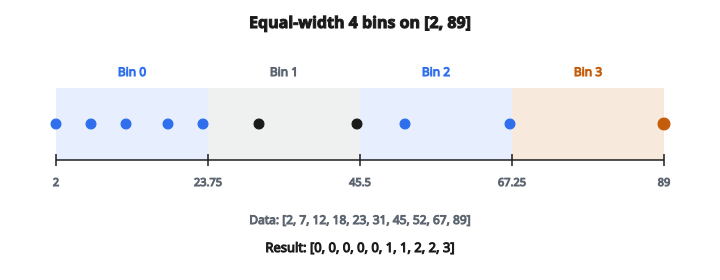

# Binning

## Binning là gì

**Binning**, còn gọi là discretization hoặc bucketing, biến biến số liên tục thành biến categorical rời rạc bằng cách nhóm giá trị vào các khoảng (bin). Kỹ thuật này chuyển một feature liên tục như tuổi (0–100) thành các nhóm như “young”, “middle-aged”, và “senior”.

## Vì sao rời rạc hóa dữ liệu liên tục

* **Bắt quan hệ phi tuyến.** Mô hình tuyến tính giả định quan hệ tuyến tính. Binning bắt được pattern phi tuyến — ví dụ rủi ro bảo hiểm có thể tăng đột ngột sau tuổi 65 chứ không tăng tuyến tính theo tuổi.
* **Giảm nhiễu.** Biến thiên đo nhỏ trở nên không còn ý nghĩa khi đã nhóm. Nhiệt độ 36.7°C và 36.8°C nhiều khả năng cùng một trạng thái sức khỏe.
* **Yêu cầu thuật toán.** Một số thuật toán như Naive Bayes làm việc tốt hơn với dữ liệu categorical. Cây quyết định có thể hưởng lợi từ feature đã bin sẵn.
* **Khả năng diễn giải.** “High income” dễ hiểu hơn “$127,453.21” với stakeholder nghiệp vụ.
* **Xử lý outlier.** Giá trị cực đoan bị nhóm vào bin đầu/cuối thay vì chiếm toàn bộ dải feature.

## Các kiểu binning

### Equal-width binning

Chia dải giá trị thành các khoảng cùng độ rộng.

**Công thức:** Cho giá trị nhỏ nhất $x_{\min}$, lớn nhất $x_{\max}$, và $k$ bin:

$$
\text{bin\_width} = \frac{x_{\max} - x_{\min}}{k}
$$

**Gán bin:** Với giá trị $x$, chỉ số bin là:

$$
\text{bin}(x) = \left\lfloor \frac{x - x_{\min}}{\text{bin\_width}} \right\rfloor
$$

**Đặc điểm:**

* Biên bin đơn giản, đoán trước được
* Dễ giải thích và cài đặt
* Kém trên phân phối lệch (một số bin có thể rỗng, bin khác quá đầy)

**Ví dụ:** Tuổi 0–100 với 5 equal-width bin tạo biên tại 0, 20, 40, 60, 80, 100.

### Equal-frequency binning (quantile binning)

Mỗi bin chứa xấp xỉ cùng số mẫu.

**Cách làm:** Với $N$ mẫu và $k$ bin, mỗi bin nhận khoảng $N/k$ mẫu. Biên bin xác định bởi quantile (percentile).

**Đặc điểm:**

* Phân bố mẫu cân bằng giữa các bin
* Xử lý tốt dữ liệu lệch
* Độ rộng bin thay đổi — hẹp nơi dữ liệu dày, rộng nơi thưa
* Tốt hơn khi tạo feature categorical cho machine learning

**Ví dụ:** Với 4 bin, dùng percentile thứ 25, 50 và 75 làm biên (quartile binning).

### Custom binning

Domain knowledge định nghĩa biên có nghĩa.

**Ví dụ:**

* Nhóm tuổi marketing: $[0, 18)$, $[18, 35)$, $[35, 55)$, $[55, +\infty)$
* Nhóm BMI: underweight ($< 18.5$), normal ($18.5$–$25$), overweight ($25$–$30$), obese ($30+$)
* Nhiệt độ: freezing ($< 0^\circ\mathrm{C}$), cold ($0$–$15^\circ\mathrm{C}$), mild ($15$–$25^\circ\mathrm{C}$), hot ($> 25^\circ\mathrm{C}$)

**Ưu điểm:** Bin có nghĩa ngữ nghĩa, khớp chuyên môn domain.

## Công thức toán

Với equal-width binning, $k$ bin:

**Biên bin:** $e_i = x_{\min} + i \cdot \dfrac{x_{\max} - x_{\min}}{k}$ với $i = 0, 1, \ldots, k$

**Hàm gán bin:**

$$
b(x) = \min\left(\left\lfloor \frac{x - x_{\min}}{\text{width}} \right\rfloor,\, k-1\right)
$$

Phép $\min$ đảm bảo giá trị lớn nhất rơi vào bin cuối, không tạo chỉ số vượt biên.

## Trường hợp biên và xử lý biên

* **Gồm cạnh phải.** Giá trị lớn nhất phải nằm trong bin cuối. Quy ước thường gặp: bin dạng $[\text{left}, \text{right})$ trừ bin cuối là $[\text{left}, \text{right}]$.
* **Giá trị ngoài dải.** Dữ liệu mới nằm ngoài dải huấn luyện cần chiến lược:

  * Clip vào bin gần nhất (phổ biến nhất)
  * Gán vào bin “outlier” đặc biệt
  * Trả về NaN hoặc báo lỗi
* **Giá trị trùng.** Nếu nhiều mẫu cùng một giá trị, chúng phải cùng bin bất kể mục tiêu tần suất. Equal-frequency binning khi đó có thể không đạt đúng số lượng.
* **Bin rỗng.** Equal-width binning trên dữ liệu lệch có thể tạo bin rỗng ở vùng thưa.

## Ví dụ số: equal-width binning

**Dữ liệu:** $[2, 7, 12, 18, 23, 31, 45, 52, 67, 89]$

**Bước 1** — Tính range:

* $\min = 2$, $\max = 89$, range $= 87$

**Bước 2** — Độ rộng bin với 4 bin:

* $\text{width} = 87 / 4 = 21.75$

**Bước 3** — Biên bin:

* $[2,\ 23.75,\ 45.5,\ 67.25,\ 89]$

**Bước 4** — Gán giá trị:

* Giá trị $2, 7, 12, 18, 23$ → Bin $0$ (khoảng $[2, 23.75)$)
* Giá trị $31, 45$ → Bin $1$ (khoảng $[23.75, 45.5)$)
* Giá trị $52, 67$ → Bin $2$ (khoảng $[45.5, 67.25)$)
* Giá trị $89$ → Bin $3$ (khoảng $[67.25, 89]$)

**Kết quả:** $[0, 0, 0, 0, 0, 1, 1, 2, 2, 3]$

::: {#fig-172-equal-width-bins fig-cap="Equal-width 4 bin trên $[2, 89]$: biên $[2, 23.75, 45.5, 67.25, 89]$, gán $[0,0,0,0,0,1,1,2,2,3]$. Bin 0 có 5 mẫu, bin 3 chỉ có 1." fig-alt="Truc so equal-width 4 bin tren [2, 89]; bien [2, 23.75, 45.5, 67.25, 89]; 10 diem duoc gan [0,0,0,0,0,1,1,2,2,3]."}
{fig-align="center"}
:::

**Nhận xét:** Phân bố không đều — 5 mẫu ở Bin 0 nhưng chỉ 1 mẫu ở Bin 3.

## Ví dụ số: quantile binning

**Dữ liệu:** $[1, 2, 3, 4, 5, 6, 7, 8, 9, 100]$ (lưu ý outlier)

**Với 4 bin**, tính biên quartile:

* Percentile thứ 25: $\approx 3.25$
* Percentile thứ 50: $\approx 5.5$
* Percentile thứ 75: $\approx 7.75$

**Gán bin:**

* Bin 0: $[1, 2, 3]$ — giá trị dưới percentile thứ 25
* Bin 1: $[4, 5]$ — giữa percentile 25 và 50
* Bin 2: $[6, 7]$ — giữa percentile 50 và 75
* Bin 3: $[8, 9, 100]$ — trên percentile thứ 75

**Nhận xét:** Outlier ($100$) được nhóm với các giá trị cao bình thường, tránh một bin outlier thưa. Mỗi bin có số lượng xấp xỉ bằng nhau dù dữ liệu lệch mạnh.

## Mất thông tin

Binning đánh đổi độ mịn lấy sự đơn giản:

* Hai mẫu $20.1$ và $39.9$ cùng bin trở nên không phân biệt được
* Mất thông tin tăng khi số bin giảm
* Biến liên tục gốc có độ chính xác lý thuyết vô hạn
* Với $k$ bin, thông tin biểu diễn tối đa là $\log_2(k)$ bit

**Tradeoff:** Ít bin hơn = tổng quát hóa mạnh hơn, ít overfitting hơn, nhưng có thể underfitting. Nhiều bin hơn = độ mịn cao hơn nhưng tiến gần feature liên tục gốc.

## Nơi binning xuất hiện

* **Chấm điểm tín dụng:** Điểm FICO được bin thành “Poor” (300–579), “Fair” (580–669), “Good” (670–739), “Very Good” (740–799), “Excellent” (800–850)
* **Vẽ histogram:** Trực quan hóa phân phối đòi hỏi binning dữ liệu liên tục thành độ rộng cột
* **Feature engineering:** Chuyển feature liên tục thành categorical cho mô hình xử lý category tốt hơn, hoặc để tạo interaction feature có nghĩa
* **Bảo vệ dữ liệu:** Binning tuổi thành khoảng (18–25, 26–35) che tuổi chính xác nhưng vẫn giữ ích lợi phân tích
* **Chẩn đoán y khoa:** Huyết áp được xếp “normal”, “elevated”, “high stage 1”, “high stage 2”, “hypertensive crisis”
* **Thiết kế khảo sát:** Đổi phép đo chính xác thành nhóm trả lời để con người dễ diễn giải
* **Hệ khuyến nghị:** Mức hoạt động người dùng được bin thành “casual”, “regular”, “power user” cho khuyến nghị theo segment
* **Đánh giá rủi ro:** Phí bảo hiểm dựa trên nhóm tuổi, thu nhập, hoặc lịch sử lái xe đã bin

## Code
```python
def binning(values, num_bins):
    """
    Assign each value to an equal-width bin.
    """
    min_val = min(values)
    max_val = max(values)
    if min_val == max_val:
        return [0] * len(values)
    bin_width = (max_val - min_val) / num_bins
    result = []
    for v in values:
        bin_idx = int((v - min_val) / bin_width)
        bin_idx = min(bin_idx, num_bins - 1)
        result.append(bin_idx)
    return result

```

<!-- auto-self-check -->

::: {.callout-note}
## Kiểm tra nhanh
<details>
<summary>Ý chính của bài «Binning» là gì?</summary>
**Binning**, còn gọi là discretization hoặc bucketing, biến biến số liên tục thành biến categorical rời rạc bằng cách nhóm giá trị vào các khoảng (bin).
</details>
<details>
<summary>Công thức / quan hệ cốt lõi trong bài là gì?</summary>
$$\text{bin\_width} = \frac{x_{\max} - x_{\min}}{k}$$
</details>
:::
