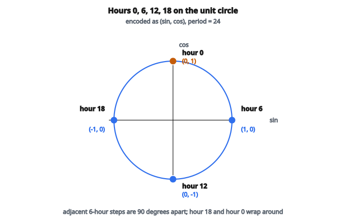

# Cyclic Encoding

## Cyclic encoding là gì

**Cyclic encoding** (còn gọi là circular encoding hoặc trigonometric encoding) là kỹ thuật biểu diễn feature có bản chất tuần hoàn hoặc tuần hoàn theo chu kỳ. Nó biến một feature cyclic thành hai feature bằng hàm sine và cosine, giữ quan hệ vòng tròn giữa các giá trị.

Kỹ thuật này cần thiết với feature như giờ trong ngày, thứ trong tuần, tháng trong năm, hoặc góc.

## Vấn đề của encoding tuyến tính

Xét giờ trong ngày $(0$–$23)$:

**Với integer encoding đơn giản:**

* Giờ $23$ được encode thành $23$
* Giờ $0$ được encode thành $0$

Hiệu số số học là $23$, nhưng hai giờ này thực ra kề nhau (cách đúng 1 giờ).

**Vấn đề:** encoding tuyến tính không bắt được việc feature quấn vòng. Mô hình thấy $23$ và $0$ rất khác nhau, trong khi chúng phải rất giống nhau.

## Cách giải: sine và cosine

Biến đổi feature cyclic bằng hàm lượng giác:

$$
x_{\sin} = \sin\left(\frac{2\pi \cdot x}{\mathrm{period}}\right)
$$

$$
x_{\cos} = \cos\left(\frac{2\pi \cdot x}{\mathrm{period}}\right)
$$

với:

* $x$ là giá trị gốc
* period là độ dài một chu kỳ đầy đủ

## Vì sao cần cả sine VÀ cosine?

Chỉ dùng sine sẽ gây nhập nhằng:

$$
\sin(30^\circ) = \sin(150^\circ) = 0.5
$$

Hai giá trị khác nhau ánh xạ cùng một giá trị sine.

**Kết hợp cả hai giải nhập nhằng:**

* $\sin(30^\circ) = 0.5$, $\cos(30^\circ) = 0.866$
* $\sin(150^\circ) = 0.5$, $\cos(150^\circ) = -0.866$

Cặp $(\sin, \cos)$ định danh duy nhất mọi điểm trên chu kỳ.

## Diễn giải hình học

Phép biến đổi ánh xạ mỗi giá trị thành một điểm trên đường tròn đơn vị:

$$
(x_{\cos}, x_{\sin}) = \bigl(\cos(\theta), \sin(\theta)\bigr)
$$

với $\theta = \dfrac{2\pi \cdot x}{\mathrm{period}}$.

**Tính chất của điểm trên đường tròn đơn vị:**

* Mọi điểm cách gốc một khoảng $1$
* Giá trị cyclic kề nhau ánh xạ thành điểm kề nhau trên đường tròn
* Giá trị quấn vòng (như giờ $23$ và giờ $0$) nằm gần nhau trên đường tròn

## Ví dụ giờ trong ngày

**Feature:** Hour $(0$–$23)$

**Period:** $24$ giờ

**Công thức:**

$$
\mathrm{hour}_{\sin} = \sin\left(\frac{2\pi \cdot \mathrm{hour}}{24}\right)
$$

$$
\mathrm{hour}_{\cos} = \cos\left(\frac{2\pi \cdot \mathrm{hour}}{24}\right)
$$

**Tính cho một số giờ:**

Giờ $0$:

* $\sin(0) = 0$
* $\cos(0) = 1$
* Encoded: $(0, 1)$

Giờ $6$:

* $\sin(\pi/2) = 1$
* $\cos(\pi/2) = 0$
* Encoded: $(1, 0)$

Giờ $12$:

* $\sin(\pi) = 0$
* $\cos(\pi) = -1$
* Encoded: $(0, -1)$

Giờ $18$:

* $\sin(3\pi/2) = -1$
* $\cos(3\pi/2) = 0$
* Encoded: $(-1, 0)$

::: {#fig-186-cyclic-hours fig-cap="Cặp (sin, cos) trên đường tròn đơn vị: giờ 0 → (0, 1), giờ 6 → (1, 0), giờ 12 → (0, −1), giờ 18 → (−1, 0). Period = 24." fig-alt="Đường tròn đơn vị với bốn giờ: 0 tại (0,1), 6 tại (1,0), 12 tại (0,-1), 18 tại (-1,0)."}
{fig-align="center"}
:::

## Kiểm tra tính kề nhau được giữ

**Giờ $23$ so với giờ $0$:**

Giờ $23$:

* $\sin(2\pi \cdot 23/24) = \sin(23\pi/12) \approx -0.259$
* $\cos(2\pi \cdot 23/24) = \cos(23\pi/12) \approx 0.966$

Giờ $0$:

* $\sin(0) = 0$
* $\cos(0) = 1$

**Khoảng cách Euclid:**

$$
d = \sqrt{\bigl(0 - (-0.259)\bigr)^{2} + (1 - 0.966)^{2}} = \sqrt{0.067 + 0.001} \approx 0.261
$$

Đây đúng bằng khoảng cách giữa mọi cặp giờ kề nhau, xác nhận quan hệ cyclic được giữ.

## Ví dụ thứ trong tuần

**Feature:** Day $(0$–$6$, với $0 =$ Sunday)

**Period:** $7$ ngày

**Công thức:**

$$
\mathrm{day}_{\sin} = \sin\left(\frac{2\pi \cdot \mathrm{day}}{7}\right)
$$

$$
\mathrm{day}_{\cos} = \cos\left(\frac{2\pi \cdot \mathrm{day}}{7}\right)
$$

**Giá trị mẫu:**

* Sunday $(0)$: $(0, 1)$
* Monday $(1)$: $(0.782, 0.623)$
* Tuesday $(2)$: $(0.975, -0.223)$
* Wednesday $(3)$: $(0.434, -0.901)$
* Thursday $(4)$: $(-0.434, -0.901)$
* Friday $(5)$: $(-0.975, -0.223)$
* Saturday $(6)$: $(-0.782, 0.623)$

## Ví dụ tháng trong năm

**Feature:** Month $(1$–$12$ hoặc $0$–$11)$

**Period:** $12$ tháng

**Công thức (nếu tháng là $1$–$12$):**

$$
\mathrm{month}_{\sin} = \sin\left(\frac{2\pi \cdot (\mathrm{month} - 1)}{12}\right)
$$

$$
\mathrm{month}_{\cos} = \cos\left(\frac{2\pi \cdot (\mathrm{month} - 1)}{12}\right)
$$

Lưu ý: trừ $1$ nếu tháng bắt đầu từ $1$ để đưa về khoảng $0$–$11$.

**Ý chính:** December $(12)$ và January $(1)$ sẽ nằm gần nhau trong không gian đã encode.

## Encoding góc

**Feature:** góc theo độ $(0$–$360)$

**Period:** $360$ độ

**Công thức:**

$$
\mathrm{angle}_{\sin} = \sin\left(\frac{2\pi \cdot \mathrm{angle}}{360}\right) = \sin(\text{góc tính bằng radian})
$$

$$
\mathrm{angle}_{\cos} = \cos\left(\frac{2\pi \cdot \mathrm{angle}}{360}\right) = \cos(\text{góc tính bằng radian})
$$

**Với radian $(0$ đến $2\pi)$:**

Dùng trực tiếp $\sin(\text{góc})$ và $\cos(\text{góc})$.

## Ví dụ hướng gió

**Feature:** hướng gió $(0$–$359$ độ, với $0 =$ North)

**Period:** $360$ độ

**Encoding mẫu:**

* North $(0^\circ)$: $(0, 1)$
* East $(90^\circ)$: $(1, 0)$
* South $(180^\circ)$: $(0, -1)$
* West $(270^\circ)$: $(-1, 0)$
* North-East $(45^\circ)$: $(0.707, 0.707)$

**Lợi ích:** hướng $359^\circ$ và $1^\circ$ được nhận đúng là gần nhau (cả hai gần North).

## Tính chất toán học

**1. Đầu ra bị chặn:**

Cả sine và cosine đều nằm trong $[-1, 1]$.

**2. Liên tục:**

Thay đổi nhỏ ở đầu vào tạo thay đổi nhỏ ở đầu ra.

**3. Tuần hoàn:**

Giá trị lệch đúng một chu kỳ ánh xạ cùng một điểm.

**4. Đồng nhất thức Pythagore:**

$$
\sin^{2}(\theta) + \cos^{2}(\theta) = 1
$$

Mọi điểm đã encode nằm trên đường tròn đơn vị.

## Khoảng cách giữa các giá trị cyclic

Khoảng cách Euclid trong không gian đã encode phản ánh khoảng cách cyclic thật:

$$
d = \sqrt{\bigl(\sin(\theta_1) - \sin(\theta_2)\bigr)^{2} + \bigl(\cos(\theta_1) - \cos(\theta_2)\bigr)^{2}}
$$

Có thể rút gọn bằng đồng nhất thức lượng giác:

$$
d = 2\sin\left(\frac{|\theta_1 - \theta_2|}{2}\right)
$$

Khoảng cách lớn nhất là $2$ (với giá trị cách nửa chu kỳ).

## So sánh với one-hot encoding

**One-hot encoding cho giờ (24 feature):**

* Giờ $0$: $[1, 0, 0, \ldots, 0]$
* Giờ $1$: $[0, 1, 0, \ldots, 0]$
* $\ldots$
* Giờ $23$: $[0, 0, 0, \ldots, 1]$

**Vấn đề:**

* Dimensionality cao ($24$ feature so với $2$)
* Không bắt được giờ $23$ và $0$ kề nhau
* Coi mọi giờ không khớp là khác nhau như nhau

**Ưu điểm cyclic encoding:**

* Chỉ $2$ feature
* Giữ quan hệ cyclic
* Biểu diễn gọn hơn

## So sánh với ordinal encoding

**Ordinal encoding:** Hour $= 0, 1, 2, \ldots, 23$

**Vấn đề:**

* Giờ $23$ và $0$ trông khác nhau tối đa (hiệu số $23$)
* Mô hình có thể học sai rằng giờ $23 >$ giờ $0$ theo nghĩa có ý nghĩa

**Cyclic encoding sửa điều này** bằng cách đưa giờ $23$ và giờ $0$ gần nhau trong không gian feature.

## Khi nào dùng cyclic encoding

**Use case phù hợp:**

* Feature thời gian: hour, minute, second
* Feature lịch: thứ trong tuần, tháng, ngày trong năm
* Góc: hướng gió, hướng la bàn, góc quay
* Đo tuần hoàn: pha của sóng, mẫu mùa vụ

**Không phù hợp cho:**

* Feature thứ tự không cyclic (trình độ học vấn, xếp hạng)
* Feature categorical không có thứ tự tự nhiên
* Feature mà chu kỳ không có nghĩa

## Xử lý các khoảng khác nhau

**Công thức tổng quát cho khoảng $[a, b]$ với period $= b - a$:**

$$
x_{\sin} = \sin\left(\frac{2\pi \cdot (x - a)}{b - a}\right)
$$

$$
x_{\cos} = \cos\left(\frac{2\pi \cdot (x - a)}{b - a}\right)
$$

Cách này dịch khoảng về bắt đầu tại $0$ trước khi biến đổi.

## Nhiều feature cyclic

Khi có nhiều feature cyclic, encode từng cái riêng:

**Ví dụ: timestamp gồm hour và day of week**

* hour_sin, hour_cos (từ hour)
* dow_sin, dow_cos (từ day of week)

Tổng: $4$ feature đã encode từ $2$ feature gốc.

## Cyclic encoding trong time series

Với time series có nhiều mẫu mùa vụ:

**Mùa vụ ngày:** encode hour of day

**Mùa vụ tuần:** encode day of week

**Mùa vụ năm:** encode day of year (period $= 365$ hoặc $366$)

Nhiều encoding có thể bắt nhiều chu kỳ chồng lên nhau.

## Kết hợp với feature khác

Feature đã cyclic encode có thể:

* Dùng trực tiếp trong mọi mô hình
* Kết hợp với feature số khác
* Dùng để tạo feature tương tác

**Ví dụ:** hour_sin $\times$ temperature có thể bắt hiệu ứng nhiệt độ thay đổi theo giờ trong ngày.

## Độ chính xác số

**Gần biên:**

Đúng tại $0$ và $2\pi$:

* $\sin(0) = 0$, nhưng $\sin(2\pi) \approx 0$ (sai số số nhỏ)
* $\cos(0) = 1 = \cos(2\pi)$

**Cách giảm:** sai số thường không đáng kể cho machine learning.

## Phương án khác: radial basis function

Một cách khác cho feature cyclic:

Tạo các bump Gaussian tại khoảng đều quanh chu kỳ:

$$
f_i(x) = \exp\left(-\frac{(x - c_i)^{2}}{2\sigma^{2}}\right)
$$

với $c_i$ là các tâm và khoảng cách được đo theo cyclic.

Cách này tạo nhiều feature hơn nhưng có thể bắt mẫu phức tạp hơn.

## Các lỗi thường gặp

**1. Quên dùng cả sine và cosine:**

Chỉ dùng sine mất thông tin và gây nhập nhằng.

**2. Sai period:**

Dùng period $= 23$ cho giờ thay vì $24$ (giờ chạy $0$–$23$ nhưng period là $24$).

**3. Không xử lý khoảng đúng:**

Nếu tháng là $1$–$12$, cần đưa về $0$–$11$ trước khi encode.

**4. Dùng cyclic encoding cho feature không cyclic:**

Tuổi không cyclic ($90$ không nên gần $0$).

## Tóm tắt lợi ích

**1. Biểu diễn gọn:** $2$ feature thay vì nhiều cột one-hot

**2. Giữ bản chất cyclic:** giá trị kề nhau vẫn kề nhau sau encoding

**3. Liên tục:** làm việc tốt với tối ưu dựa trên gradient

**4. Bất biến tỷ lệ:** đầu ra luôn trong $[-1, 1]$

**5. Dùng được với mọi mô hình:** mô hình tuyến tính, cây, neural network đều hưởng lợi

## Code
```python
```

<!-- auto-self-check -->

::: {.callout-note}
## Kiểm tra nhanh
<details>
<summary>Ý chính của bài «Cyclic Encoding» là gì?</summary>
**Cyclic encoding** (còn gọi là circular encoding hoặc trigonometric encoding) là kỹ thuật biểu diễn feature có bản chất tuần hoàn hoặc tuần hoàn theo chu kỳ.
</details>
<details>
<summary>Công thức / quan hệ cốt lõi trong bài là gì?</summary>
$$x_{\sin} = \sin\left(\frac{2\pi \cdot x}{\mathrm{period}}\right)$$
</details>
:::
