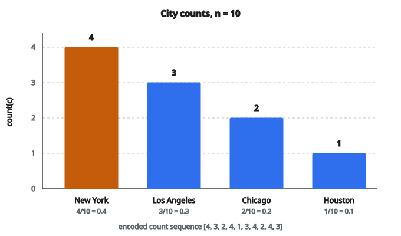

# Frequency Encoding

## Frequency encoding là gì

**Frequency encoding** (còn gọi là count encoding) là kỹ thuật đổi feature categorical thành feature số bằng cách thay mỗi category bằng tần suất xuất hiện của nó trong dataset.

Thay vì tạo nhiều cột nhị phân (one-hot encoding), frequency encoding tạo một cột số duy nhất, biểu diễn mức độ phổ biến của mỗi category.

## Ý tưởng cốt lõi

Mỗi category được thay bằng số lần hoặc tỷ lệ nó xuất hiện trong dữ liệu huấn luyện:

**Theo count:**

$$
\mathrm{encoded}(c) = \mathrm{count}(c)
$$

**Theo tỷ lệ:**

$$
\mathrm{encoded}(c) = \frac{\mathrm{count}(c)}{n}
$$

với $n$ là tổng số mẫu.

## Vì sao dùng frequency encoding

**1. Giảm dimensionality:**

Feature categorical cardinality cao (nhiều giá trị phân biệt) sẽ tạo quá nhiều cột one-hot. Frequency encoding chỉ tạo một cột.

**2. Bắt tầm quan trọng của category:**

Category hiếm nhận giá trị thấp, category phổ biến nhận giá trị cao. Điều này có thể mang tính dự đoán trong nhiều tình huống.

**3. Xử lý category chưa thấy:**

Category mới có thể được gán tần suất $0$ hoặc một giá trị mặc định nhỏ.

**4. Không tăng số feature:**

Khác one-hot encoding, số feature giữ nguyên.

## Quy trình từng bước

**Bước 1:** Đếm số lần xuất hiện của mỗi category trên dữ liệu huấn luyện

**Bước 2:** Tạo mapping từ category sang count (hoặc tỷ lệ)

**Bước 3:** Thay mỗi category bằng giá trị tần suất tương ứng

**Bước 4:** Với dữ liệu mới, dùng cùng mapping đã học từ train

## Ví dụ số: theo count

**Dữ liệu huấn luyện:** cột City

* New York (xuất hiện 4 lần)
* Los Angeles (xuất hiện 3 lần)
* Chicago (xuất hiện 2 lần)
* Houston (xuất hiện 1 lần)

Tổng: $10$ mẫu

**Mapping tần suất:**

* New York: $4$
* Los Angeles: $3$
* Chicago: $2$
* Houston: $1$

**Dữ liệu gốc:**

[New York, Los Angeles, Chicago, New York, Houston, Los Angeles, New York, Chicago, New York, Los Angeles]

**Dữ liệu đã encode:**

$[4, 3, 2, 4, 1, 3, 4, 2, 4, 3]$

::: {#fig-183-frequency-counts fig-cap="Count trên n = 10: New York = 4, Los Angeles = 3, Chicago = 2, Houston = 1. Tỷ lệ tương ứng 0.4, 0.3, 0.2, 0.1." fig-alt="Bốn cột count: New York 4, Los Angeles 3, Chicago 2, Houston 1 trên n = 10 mẫu."}
{fig-align="center"}
:::

## Ví dụ số: theo tỷ lệ

Cùng dữ liệu với $n = 10$:

**Mapping tần suất (tỷ lệ):**

* New York: $4/10 = 0.4$
* Los Angeles: $3/10 = 0.3$
* Chicago: $2/10 = 0.2$
* Houston: $1/10 = 0.1$

**Dữ liệu đã encode:**

$[0.4, 0.3, 0.2, 0.4, 0.1, 0.3, 0.4, 0.2, 0.4, 0.3]$

## Công thức toán học

Cho feature categorical $X$ với các category $\{c_1, c_2, \ldots, c_k\}$:

**Count encoding:**

$$
f(x_i) = \sum_{j=1}^{n} \mathbb{1}[x_j = x_i]
$$

với $\mathbb{1}[\cdot]$ là hàm chỉ báo.

**Proportion encoding:**

$$
f(x_i) = \frac{1}{n} \sum_{j=1}^{n} \mathbb{1}[x_j = x_i]
$$

## Xử lý feature cardinality cao

Frequency encoding đặc biệt hữu ích với feature có nhiều giá trị phân biệt:

**Ví dụ: Product ID**

* $10{,}000$ sản phẩm phân biệt
* One-hot encoding: $10{,}000$ cột
* Frequency encoding: $1$ cột

Tần suất phản ánh độ phổ biến của sản phẩm, thường mang tính dự đoán.

**Ví dụ: mã ZIP**

* Hàng nghìn mã phân biệt
* Tần suất phản ánh mật độ dân số hoặc kiểu thu thập dữ liệu

## Khi các category có cùng tần suất

Nếu nhiều category có cùng tần suất, chúng sẽ nhận cùng giá trị encode:

**Ví dụ:**

* Category A: $5$ lần
* Category B: $5$ lần
* Category C: $3$ lần

**Đã encode:**

* A và B đều thành $5$
* C thành $3$

**Hệ quả:** mô hình không phân biệt A và B chỉ dựa trên tần suất. Điều này có thể chấp nhận được hoặc không, tùy use case.

## Xử lý category chưa thấy

Khi một category xuất hiện ở test nhưng không có trong train:

**Phương án 1: gán 0**

$$
\mathrm{encoded}(c_{\mathrm{new}}) = 0
$$

**Phương án 2: gán tần suất nhỏ nhất**

$$
\mathrm{encoded}(c_{\mathrm{new}}) = \min(\text{frequencies})
$$

**Phương án 3: gán một hằng số nhỏ**

$$
\mathrm{encoded}(c_{\mathrm{new}}) = \varepsilon
$$

Chọn tùy việc muốn nhấn mạnh độ hiếm hay tính mới.

## So sánh với one-hot encoding

**One-hot encoding:**

* Tạo $k$ cột nhị phân cho $k$ category
* Không thông tin về tần suất category
* Coi mọi category khác nhau như nhau
* Dimensionality cao khi cardinality cao

**Frequency encoding:**

* Tạo 1 cột số
* Encode mức độ phổ biến của mỗi category
* Category cùng tần suất trở nên giống nhau
* Dimensionality thấp bất kể cardinality

## So sánh với label encoding

**Label encoding:** gán số nguyên tùy ý $(0, 1, 2, \ldots)$

**Frequency encoding:** gán count hoặc tỷ lệ

**Khác biệt then chốt:** frequency encoding có nghĩa ngữ nghĩa (độ phổ biến), còn label encoding thì tùy ý.

Label encoding tạo thứ tự nhân tạo ($2 > 1$) có thể không có nghĩa. Thứ tự của frequency encoding (phổ biến hơn $>$ ít phổ biến hơn) thường có nghĩa.

## Use case khi tần suất quan trọng

**Thương mại điện tử:**

* Sản phẩm phổ biến có thể có kiểu hành vi khác
* Mặt hàng mua thường xuyên có thể có tỷ lệ trả hàng thấp hơn

**Phát hiện gian lận:**

* Category merchant hiếm có thể báo giao dịch bất thường
* Tần suất địa điểm dùng thẻ có ý nghĩa

**Phân khúc khách hàng:**

* Kiểu khách hàng phổ biến so với hiếm
* Người mua thường xuyên so với thỉnh thoảng

**Xử lý ngôn ngữ tự nhiên:**

* Tần suất từ (term frequency) rất giàu tính dự đoán
* Từ hiếm thường mang nghĩa cụ thể hơn

## Frequency encoding logarit

Với phân phối tần suất lệch mạnh, áp biến đổi log:

$$
f(x) = \log\bigl(1 + \mathrm{count}(x)\bigr)
$$

**Lợi ích:**

* Nén dải giá trị
* Giảm ảnh hưởng của category cực kỳ phổ biến
* Thường cải thiện hiệu năng mô hình

**Ví dụ:**

* Category count $1000$ thành $\log(1001) \approx 6.91$
* Category count $10$ thành $\log(11) \approx 2.40$
* Tỷ số bị nén từ $100:1$ xuống khoảng $2.9:1$

## Frequency encoding đã chuẩn hóa

Đưa tần suất về một khoảng cụ thể:

**Min-max:**

$$
f_{\mathrm{norm}}(x) = \frac{\mathrm{count}(x) - \min}{\max - \min}
$$

**Z-score:**

$$
f_{\mathrm{norm}}(x) = \frac{\mathrm{count}(x) - \mu}{\sigma}
$$

với $\mu$ và $\sigma$ là mean và độ lệch chuẩn của các count.

## Frequency encoding so với target encoding

**Frequency encoding:**

* Chỉ dùng chính feature (count của category)
* Không thông tin về biến target
* Không rủi ro target leakage

**Target encoding:**

* Dùng quan hệ với biến target
* Dự đoán mạnh hơn nhưng có rủi ro overfitting
* Cần regularization cẩn thận

Frequency encoding đơn giản và an toàn hơn nhưng có thể kém tính dự đoán.

## Kết hợp frequency với encoding khác

Có thể dùng frequency encoding cùng kỹ thuật khác:

**Frequency + one-hot:**

Với cardinality vừa, dùng cả hai:

* One-hot bắt danh tính category
* Frequency bắt mức độ phổ biến

**Frequency + target encoding:**

* Frequency làm baseline
* Target encoding cho category có quan hệ với target

## Frequency encoding theo nhóm

Với category phân cấp, tính tần suất ở nhiều cấp:

**Ví dụ: cây danh mục sản phẩm**

* Electronics $>$ Phones $>$ Smartphones

Encode:

* Tần suất Smartphone
* Tần suất nhóm Phones
* Tần suất nhóm Electronics

Bắt thông tin ở nhiều độ mịn.

## Frequency encoding theo thời gian

Trong ngữ cảnh time series, tính tần suất chỉ từ dữ liệu quá khứ:

**Cửa sổ mở rộng:**

Tại mỗi thời điểm, chỉ đếm các lần xuất hiện đến thời điểm đó.

**Cửa sổ trượt:**

Đếm các lần xuất hiện trong $w$ khoảng thời gian gần nhất.

Cách này ngăn look-ahead bias và data leakage.

## Xử lý category hiếm

Category hiếm với tần suất $1$ hoặc count rất thấp có thể gây vấn đề:

**Phương án 1: gộp category hiếm**

Gộp mọi category có count $<$ ngưỡng thành “Other”

**Phương án 2: smoothing**

$$
f_{\mathrm{smooth}}(x) = \frac{\mathrm{count}(x) + \alpha}{n + \alpha \cdot k}
$$

với $\alpha$ là tham số smoothing và $k$ là số category.

## Ưu điểm của frequency encoding

**1. Đơn giản và diễn giải được:**

Giá trị encode chính là mức độ phổ biến của category.

**2. Dimensionality thấp:**

Luôn tạo một feature, bất kể số category.

**3. Xử lý cardinality cao:**

Làm việc tốt khi có hàng nghìn giá trị phân biệt.

**4. Không target leakage:**

Không dùng biến target khi encode.

**5. Tính toán nhanh:**

Chỉ cần đếm, không tính toán phức tạp.

## Nhược điểm của frequency encoding

**1. Mất danh tính category:**

Category cùng tần suất trở nên không phân biệt.

**2. Có thể không mang tính dự đoán:**

Tần suất có thể không tương quan với biến target.

**3. Nhạy với cỡ dữ liệu:**

Tần suất đổi theo cỡ mẫu, có thể ảnh hưởng độ ổn định mô hình.

**4. Cùng giá trị cho category khác nhau:**

Nếu A và B đều xuất hiện $100$ lần, chúng nhận cùng encoding.

## Thực hành tốt

**1. Ưu tiên tỷ lệ hơn count:**

Tỷ lệ ổn định hơn và so sánh được giữa các dataset.

**2. Cân nhắc biến đổi log:**

Đặc biệt với category phân phối theo luật lũy thừa.

**3. Lưu mapping:**

Giữ dictionary tần suất để encode dữ liệu mới cho nhất quán.

**4. Validate trên holdout:**

Đảm bảo frequency encoding cải thiện hiệu năng trên dữ liệu chưa thấy.

**5. Kết hợp feature khác:**

Không dựa một mình vào tần suất cho các feature categorical quan trọng.

## Khi nào tránh frequency encoding

**Khi danh tính category quan trọng:**

Nếu mỗi category có hành vi riêng, không liên quan tần suất.

**Khi các category cân bằng:**

Nếu mọi category có tần suất gần nhau, encoding mang ít thông tin.

**Khi thứ tự quan trọng:**

Với category thứ tự mà hạng mới là điều quan trọng, ordinal encoding phù hợp hơn.

## Code
```python
```

<!-- auto-self-check -->

::: {.callout-note}
## Kiểm tra nhanh
<details>
<summary>Ý chính của bài «Frequency Encoding» là gì?</summary>
**Frequency encoding** (còn gọi là count encoding) là kỹ thuật đổi feature categorical thành feature số bằng cách thay mỗi category bằng tần suất xuất hiện của nó trong dataset.
</details>
<details>
<summary>Công thức / quan hệ cốt lõi trong bài là gì?</summary>
$$\mathrm{encoded}(c) = \mathrm{count}(c)$$
</details>
:::
