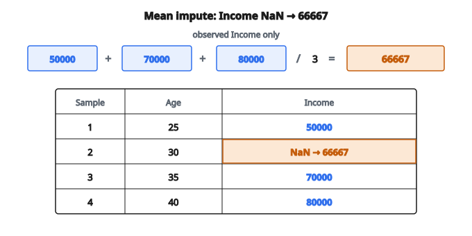

# Impute Missing Values (mean/median)

## Imputation dữ liệu thiếu là gì

**Missing data imputation** là quá trình thay các giá trị missing hoặc null trong tập dữ liệu bằng giá trị thay thế. Tập dữ liệu thực tế gần như luôn có ô trống do cảm biến hỏng, người trả lời bỏ câu hỏi, lỗi nhập liệu, hoặc cố ý không điền. Imputation cho phép phân tích tiếp trên tập đầy đủ, đồng thời giữ càng nhiều thông tin càng tốt.

## Vì sao dữ liệu thiếu gây vấn đề

**Yêu cầu thuật toán**: Nhiều thuật toán machine learning không xử lý được giá trị missing và sẽ thất bại hoặc báo lỗi.

**Cỡ mẫu giảm**: Xóa hàng có giá trị missing (listwise deletion) có thể cắt mạnh tập dữ liệu, mất thông tin quý.

**Kết quả lệch**: Nếu dữ liệu không missing ngẫu nhiên, xóa hàng có thể đưa bias hệ thống.

**Mất feature**: Xóa cột có giá trị missing làm mất cả feature, dù feature đó có thể có sức dự đoán.

## Các cơ chế missing data

Hiểu vì sao dữ liệu missing quyết định chiến lược imputation phù hợp:

**Missing Completely at Random (MCAR)**:

* Việc missing không liên quan bất kỳ biến nào
* Ví dụ: Cảm biến hỏng ngẫu nhiên vì dao động nguồn
* An toàn khi xóa hoặc impute bằng phương pháp đơn giản
* Hiếm gặp nhất trong thực tế

**Missing at Random (MAR)**:

* Việc missing phụ thuộc biến đã quan sát, nhưng không phụ thuộc chính giá trị đang missing
* Ví dụ: Người trẻ ít khai thu nhập hơn (tuổi quan sát được, thu nhập missing)
* Có thể xử lý bằng phương pháp dùng feature khác để dự đoán giá trị missing

**Missing Not at Random (MNAR)**:

* Việc missing phụ thuộc chính giá trị đang missing
* Ví dụ: Người thu nhập cao từ chối khai thu nhập đúng vì thu nhập cao
* Khó nhất — cần tri thức miền hoặc mô hình chuyên biệt

## Phương pháp imputation đơn giản

### Mean imputation

Thay giá trị missing bằng mean của các giá trị đã quan sát trên feature đó.

$$
x_{\text{imputed}} = \bar{x} = \frac{1}{n_{\text{observed}}} \sum_{i \in \text{observed}} x_i
$$

**Ưu điểm**:

* Đơn giản và nhanh
* Giữ mean của feature

**Nhược điểm**:

* Giảm phương sai (giá trị imputed tụ tại mean)
* Làm méo phân phối và tương quan
* Bỏ qua quan hệ giữa các feature

### Median imputation

Thay giá trị missing bằng median của các giá trị đã quan sát.

**Ưu điểm**:

* Bền vững với outlier (khác mean)
* Phù hợp phân phối lệch

**Nhược điểm**:

* Cùng vấn đề giảm phương sai như mean imputation
* Không dùng thông tin từ feature khác

### Mode imputation

Thay giá trị categorical missing bằng category xuất hiện nhiều nhất.

**Ưu điểm**:

* Cách đơn giản cho dữ liệu categorical
* Giữ category phổ biến nhất

**Nhược điểm**:

* Có thể làm category trội bị đại diện quá mức
* Bỏ qua phân phối category và các quan hệ

### Constant imputation

Thay giá trị missing bằng một hằng số cố định (ví dụ 0, -1, hoặc một marker đặc biệt).

**Khi dùng**:

* Khi bản thân việc missing đã mang thông tin
* Tạo category “missing” cho biến categorical
* Khi tri thức miền gợi ý một mặc định tự nhiên

**Cân nhắc**:

* Hằng số không được nhầm với giá trị dữ liệu thật
* Thường kết hợp với một feature missingness indicator

## Phương pháp imputation nâng cao

### K-Nearest Neighbors (KNN) imputation

Tìm $k$ mẫu giống nhất (dựa trên feature đã quan sát) rồi impute từ giá trị của chúng.

Với feature số:

$$
x_{\text{imputed}} = \frac{1}{k} \sum_{j \in \text{neighbors}} x_j
$$

Với feature categorical, dùng mode (giá trị phổ biến nhất) trong các neighbor.

**Ưu điểm**:

* Dùng quan hệ giữa các mẫu
* Không giả định tham số

**Nhược điểm**:

* Tốn tính toán trên tập lớn
* Nhạy với lựa chọn $k$ và metric khoảng cách

### Multiple imputation

Sinh nhiều tập đầy đủ, mỗi tập với giá trị imputed khác nhau, phân tích từng tập, rồi gộp kết quả.

**Quy trình**:

1. Tạo $m$ tập đã impute (thường 5-20)
2. Chạy phân tích trên từng tập
3. Gộp kết quả theo Rubin's rules để tính đến độ bất định của imputation

**Ưu điểm**:

* Tính đúng độ bất định của giá trị imputed
* Chuẩn vàng cho suy diễn thống kê

**Nhược điểm**:

* Phức tạp hơn khi cài đặt
* Phải chạy phân tích nhiều lần

### Regression imputation

Dự đoán giá trị missing bằng mô hình hồi quy huấn luyện trên các trường hợp đầy đủ.

$$
\hat{x}_{\text{missing}} = \beta_0 + \beta_1 z_1 + \beta_2 z_2 + \cdots + \beta_p z_p
$$

với $z_1, \ldots, z_p$ là các feature khác đã quan sát.

**Ưu điểm**:

* Dùng thông tin từ feature tương quan
* Có thể bắt quan hệ phức tạp nếu dùng mô hình phi tuyến

**Nhược điểm**:

* Giá trị imputed không có phương sai phần dư (quá “chính xác”)
* Sai đặc tả mô hình ảnh hưởng chất lượng imputation

## Ví dụ số: mean imputation

**Tập dữ liệu** (giá trị feature, có ô missing):

Sample 1: Age=25, Income=50000
Sample 2: Age=30, Income=NaN (missing)
Sample 3: Age=35, Income=70000
Sample 4: Age=40, Income=80000

**Bước 1 — Tính mean các giá trị Income đã quan sát**:

$$
\overline{\text{Income}} = \frac{50000 + 70000 + 80000}{3} = 66667
$$

**Bước 2 — Thay giá trị missing**:
Income của Sample 2 thành 66667

**Kết quả**:
Sample 1: Age=25, Income=50000
Sample 2: Age=30, Income=66667
Sample 3: Age=35, Income=70000
Sample 4: Age=40, Income=80000

::: {#fig-70-mean-impute fig-cap="Mean imputation: (50000 + 70000 + 80000) / 3 = 66667 thay Income NaN của sample Age = 30." fig-alt="Ba giá trị Income 50000, 70000, 80000 trung bình thành 66667, thay cho Income NaN của sample Age=30."}
{fig-align="center"}
:::

## Ví dụ số: KNN imputation

**Cùng tập, dùng k=2 nearest neighbor theo Age**:

**Bước 1 — Tìm 2 neighbor gần nhất của Sample 2 (Age=30)**:

* Sample 1: Age=25, khoảng cách $= |30-25| = 5$
* Sample 3: Age=35, khoảng cách $= |30-35| = 5$
* Sample 4: Age=40, khoảng cách $= |30-40| = 10$

Nearest neighbor: Sample 1 và 3 (cả hai có khoảng cách 5)

**Bước 2 — Impute bằng Income của các neighbor**:

$$
\text{Income}_{\text{imputed}} = \frac{50000 + 70000}{2} = 60000
$$

**Kết quả**: Khác mean imputation vì dùng thông tin cục bộ từ các mẫu giống nhau.

## Xử lý nhiều feature thiếu

Khi một mẫu thiếu nhiều giá trị, các chiến lược gồm:

* **Sequential imputation**: Impute lần lượt từng feature, dùng các giá trị vừa imputed
* **Joint imputation**: Mô hình mọi giá trị missing đồng thời
* **Iterative imputation**: Lặp qua các feature nhiều vòng đến hội tụ (thuật toán MICE)

## Tạo missingness indicator

Ngoài imputation, tạo feature nhị phân cho biết giá trị vốn dĩ có missing hay không:

$$
\text{Income\_missing} = \begin{cases}
1 & \text{nếu Income là NaN} \\
0 & \text{nếu không}
\end{cases}
$$

**Vì sao hữu ích**:

* Bản thân việc missing có thể có sức dự đoán (informative missingness)
* Cho mô hình học pattern khác nhau giữa giá trị imputed và giá trị quan sát
* Giữ thông tin vốn sẽ mất nếu chỉ điền số

## Imputation dữ liệu thiếu xuất hiện ở đâu

* **Dữ liệu lâm sàng**: Hồ sơ bệnh nhân thiếu xét nghiệm, thuốc, hoặc outcome
* **Phân tích khảo sát**: Không trả lời câu hỏi nhạy về thu nhập, sức khỏe, hoặc hành vi
* **Mạng cảm biến**: Thiết bị IoT mất kết nối hoặc hỏng từng lúc
* **Dữ liệu tài chính**: Thiếu giá lịch sử, giao dịch không được báo
* **Hệ gợi ý**: Ma trận user–item thưa, hầu hết ô missing
* **Time series**: Thiếu quan sát vì máy dừng hoặc báo cáo trễ
* **Natural language processing**: Metadata không đầy đủ, thiếu nhãn cho học bán giám sát
* **Xử lý ảnh**: Pixel missing, vùng hỏng, bản scan không đầy đủ
* **Genomics**: Thiếu genotype vì chất lượng giải trình tự
* **Phân tích mạng xã hội**: Thiếu cạnh hoặc thuộc tính nút

## Code
```python
import numpy as np

def impute_missing(X, strategy="mean"):
    """
    Fill NaN values in each feature column using column mean or median.
    """
    X = np.asarray(X, dtype=float)
    X_imputed = X.copy()
    if X.ndim == 1:
        nan_mask = np.isnan(X)
        valid = X[~nan_mask]
        fill = np.mean(valid) if strategy == "mean" else np.median(valid)
        X_imputed[nan_mask] = fill if len(valid) > 0 else 0.0
    else:
        for col in range(X.shape[1]):
            column = X[:, col]
            nan_mask = np.isnan(column)
            valid = column[~nan_mask]
            fill = (np.mean(valid) if strategy == "mean" else np.median(valid)) if len(valid) > 0 else 0.0
            X_imputed[nan_mask, col] = fill
    return X_imputed

```
