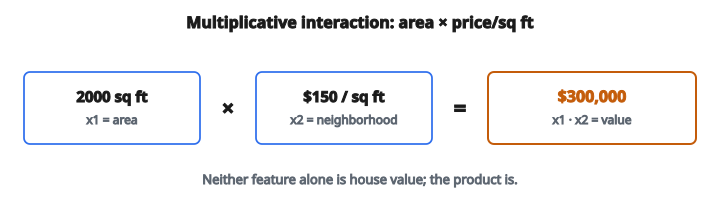

# Interaction Features

## Interaction features là gì

**Interaction features** là feature mới tạo bằng cách kết hợp hai hay nhiều feature hiện có, bắt các quan hệ mà từng feature riêng không biểu diễn được. Chúng cho phép mô hình học cách hiệu ứng của một feature phụ thuộc vào giá trị của feature khác.

Dạng phổ biến nhất là tích của hai feature, nhưng interaction cũng có thể là tỉ số, tổng, hiệu, hoặc tổ hợp phức tạp hơn.

## Vì sao tạo interaction features

**1. Bắt hiệu ứng không cộng tính:**

Đôi khi hiệu ứng kết hợp của hai feature không bằng tổng hiệu ứng riêng.

**Ví dụ:** Price một mình và Quality một mình có thể yếu, nhưng $\mathrm{Price} \times \mathrm{Quality}$ (value for money) có thể rất có sức dự đoán.

**2. Giúp mô hình tuyến tính:**

Mô hình tuyến tính giả định các feature tác động độc lập lên target. Interaction features cho phép chúng mô hình phụ thuộc.

**3. Mã hóa domain knowledge:**

Quan hệ đã biết giữa các feature có thể được mô hình tường minh.

## Động lực toán

Xét mô hình tuyến tính:

$$
y = \beta_0 + \beta_1 x_1 + \beta_2 x_2
$$

Mô hình này giả định $x_1$ và $x_2$ tác động độc lập lên $y$.

Với hạng tử interaction:

$$
y = \beta_0 + \beta_1 x_1 + \beta_2 x_2 + \beta_3 (x_1 \cdot x_2)
$$

Giờ hiệu ứng của $x_1$ lên $y$ phụ thuộc giá trị của $x_2$:

$$
\frac{\partial y}{\partial x_1} = \beta_1 + \beta_3 x_2
$$

## Các kiểu interaction features

**1. Nhân (tích):**

$$
x_{\mathrm{new}} = x_1 \cdot x_2
$$

Kiểu phổ biến nhất, bắt cách các feature scale cùng nhau.

**2. Chia (tỉ số):**

$$
x_{\mathrm{new}} = \frac{x_1}{x_2}
$$

Hữu ích cho feature dạng rate.

**3. Cộng:**

$$
x_{\mathrm{new}} = x_1 + x_2
$$

Hữu ích khi độ lớn kết hợp quan trọng.

**4. Hiệu:**

$$
x_{\mathrm{new}} = x_1 - x_2
$$

Bắt vị trí tương đối hoặc thay đổi.

## Ví dụ interaction nhân

**Feature:**

* $x_1$: Diện tích nhà (square footage)
* $x_2$: Giá mỗi square foot trong khu phố

**Interaction:**

$$
x_{\mathrm{new}} = x_1 \cdot x_2 = \text{giá nhà ước lượng}
$$

**Tính mẫu:**

* Nhà: $2000$ sq ft
* Khu phố: $\$150$/sq ft
* Interaction: $2000 \times 150 = \$300{,}000$

::: {#fig-173-multiplicative-interaction fig-cap="Interaction nhân: $2000$ sq ft $\times$ $\$150$/sq ft $= \$300{,}000$. Tích này là giá nhà ước lượng — không feature nào một mình cho được." fig-alt="Tich multiplicative: 2000 sq ft nhan 150 USD/sq ft bang 300000 USD."}
{fig-align="center"}
:::

Interaction này cho trực tiếp giá nhà, điều mà không feature nào một mình cung cấp.

## Ví dụ interaction tỉ số

**Feature:**

* $x_1$: Số nợ (debt)
* $x_2$: Thu nhập (income)

**Interaction:**

$$
x_{\mathrm{new}} = \frac{x_1}{x_2} = \text{debt-to-income ratio}
$$

**Tính mẫu:**

* Nợ: $\$50{,}000$
* Thu nhập: $\$100{,}000$
* Tỉ số: $0.5$

Tỉ số này là chỉ báo then chốt trong chấm điểm tín dụng, có sức dự đoán hơn từng giá trị riêng.

## Ví dụ interaction hiệu

**Feature:**

* $x_1$: Nhiệt độ hiện tại
* $x_2$: Nhiệt độ trung bình lịch sử

**Interaction:**

$$
x_{\mathrm{new}} = x_1 - x_2 = \text{temperature anomaly}
$$

**Tính mẫu:**

* Hiện tại: $85^\circ\mathrm{F}$
* Trung bình lịch sử: $75^\circ\mathrm{F}$
* Anomaly: $+10^\circ\mathrm{F}$

Đại lượng này bắt liệu điều kiện hiện tại có bất thường hay không.

## Interaction categorical

Với feature categorical, interaction nghĩa là kết hợp các category:

**Feature:**

* Color: $\{\mathrm{Red},\ \mathrm{Blue},\ \mathrm{Green}\}$
* Size: $\{\mathrm{Small},\ \mathrm{Medium},\ \mathrm{Large}\}$

**Interaction:** Color_Size

* Red_Small, Red_Medium, Red_Large
* Blue_Small, Blue_Medium, Blue_Large
* Green_Small, Green_Medium, Green_Large

Tạo 9 category kết hợp từ $3 + 3$ category gốc.

## Interaction hỗn hợp: categorical và numerical

**Feature:**

* $x_1$: Region (categorical: North, South, East, West)
* $x_2$: Temperature (numerical)

**Interaction:** Tạo feature nhiệt độ riêng cho từng vùng:

* Temperature_North
* Temperature_South
* Temperature_East
* Temperature_West

Nhờ đó hiệu ứng nhiệt độ có thể khác nhau theo vùng.

## Interaction từng cặp

Cho $n$ feature, tạo mọi tích từng cặp:

**Feature:** $x_1$, $x_2$, $x_3$

**Interaction từng cặp:**

* $x_1 \cdot x_2$
* $x_1 \cdot x_3$
* $x_2 \cdot x_3$

**Số interaction từng cặp:**

$$
\binom{n}{2} = \frac{n(n-1)}{2}
$$

Với 10 feature: $\dfrac{10 \cdot 9}{2} = 45$ interaction features.

## Interaction bậc cao

Interaction có thể gồm hơn hai feature:

**Interaction ba ngôi:**

$$
x_{\mathrm{new}} = x_1 \cdot x_2 \cdot x_3
$$

**Ví dụ:** Hiệu ứng của price lên sales phụ thuộc cả advertising spend và season.

**Thận trọng:** Interaction bậc cao tăng tổ hợp và có thể dẫn tới overfitting.

Số interaction $k$ ngôi từ $n$ feature:

$$
\binom{n}{k} = \frac{n!}{k!(n-k)!}
$$

## Vấn đề feature explosion

Tạo mọi interaction có thể dẫn tới quá nhiều feature:

**10 feature với mọi cặp:** 45 feature mới

**10 feature với mọi interaction đến 3 ngôi:**

$$
\binom{10}{2} + \binom{10}{3} = 45 + 120 = 165 \text{ feature mới}
$$

**Chiến lược giảm:**

1. Dùng domain knowledge để chọn interaction quan trọng
2. Áp dụng feature selection sau khi tạo interaction
3. Dùng regularization (Lasso) để loại interaction không hữu ích
4. Dùng mô hình cây, chúng học interaction tự động

## Interaction theo domain

Dùng hiểu biết bài toán để tạo interaction có nghĩa:

**Thương mại điện tử:**

* $\mathrm{Items\_in\_cart} \times \mathrm{Avg\_item\_price} = \mathrm{Cart\_value}$
* $\mathrm{Visits} \times \mathrm{Conversion\_rate} = \mathrm{Expected\_purchases}$

**Y tế:**

* $\mathrm{Weight} / \mathrm{Height}^2 = \mathrm{BMI}$
* $\mathrm{Systolic} - \mathrm{Diastolic} = \mathrm{Pulse\_pressure}$

**Tài chính:**

* $\mathrm{Principal} \times \mathrm{Rate} \times \mathrm{Time} = \mathrm{Interest}$
* $\mathrm{Revenue} - \mathrm{Expenses} = \mathrm{Profit}$

## Ví dụ số: quy trình đầy đủ

**Feature gốc:**

* Age: $35$
* Income: $\$80{,}000$
* Education_years: $16$

**Interaction được tạo:**

1. $\mathrm{Age} \times \mathrm{Income} = 35 \times 80000 = 2{,}800{,}000$
2. $\mathrm{Age} \times \mathrm{Education} = 35 \times 16 = 560$
3. $\mathrm{Income} \times \mathrm{Education} = 80000 \times 16 = 1{,}280{,}000$
4. $\mathrm{Income} / \mathrm{Age} = 80000 / 35 = 2{,}286$ (thu nhập trên mỗi năm tuổi)
5. $\mathrm{Income} / \mathrm{Education} = 80000 / 16 = 5{,}000$ (thu nhập trên mỗi năm học)

**Kết quả:** 3 feature gốc trở thành 8 feature (3 gốc + 5 interaction)

## Cân nhắc scale

Interaction features có thể có scale rất khác nhau:

**Ví dụ:**

* $x_1$ trong $[0, 100]$
* $x_2$ trong $[0, 100]$
* $x_1 \cdot x_2$ trong $[0, 10{,}000]$

**Cách xử lý:**

1. Scale feature gốc trước khi tạo interaction
2. Scale interaction features sau khi tạo
3. Dùng mô hình bền với scale khác nhau (cây)

## Polynomial features

Một trường hợp đặc biệt: interaction cộng lũy thừa:

**Polynomial bậc 2 cho feature $x_1$, $x_2$:**

* Gốc: $x_1$, $x_2$
* Bình phương: $x_1^2$, $x_2^2$
* Interaction: $x_1 \cdot x_2$

Mô hình có thể khớp:

$$
y = \beta_0 + \beta_1 x_1 + \beta_2 x_2 + \beta_3 x_1^2 + \beta_4 x_2^2 + \beta_5 x_1 x_2
$$

## Interaction features trong mô hình cây

Mô hình cây (Random Forest, XGBoost) học interaction tự động:

**Cách cây bắt interaction:**

Cây tách trên $x_1$, rồi trong mỗi nhánh tách trên $x_2$. Điều này tự nhiên mô hình interaction $x_1 \cdot x_2$.

**Khi nào vẫn nên tạo interaction:**

* Cây nông có thể bỏ sót interaction phức tạp
* Interaction tường minh có thể tăng tốc học
* Interaction theo domain mã hóa prior knowledge

## Interaction features trong neural network

Neural network học interaction ở các hidden layer:

$$
h = \sigma(W_1 x_1 + W_2 x_2 + b)
$$

Hàm kích hoạt phi tuyến cho phép học hiệu ứng interaction.

**Khi nào vẫn nên tạo interaction:**

* Mạng nhỏ có thể không bắt được interaction phức tạp
* Interaction tường minh giúp khi dữ liệu hạn chế
* Có thể tăng tốc huấn luyện

## Feature selection cho interaction

Không phải mọi interaction đều hữu ích. Phương pháp chọn:

**1. Lọc tương quan:**

Giữ interaction có tương quan cao với target.

**2. Kiểm định thống kê:**

Kiểm tra hệ số interaction có khác không một cách có ý nghĩa hay không.

**3. Regularization:**

Dùng L1 (Lasso) để tự đưa interaction không hữu ích về không.

**4. Importance từ cây:**

Dùng feature importance của cây để xếp hạng interaction.

## Tự động tìm interaction

Để thuật toán tìm interaction quan trọng:

**1. Factorization Machines:**

Mô hình interaction từng cặp hiệu quả nhờ latent factor.

**2. Deep and Cross Networks:**

Kiến trúc neural mô hình tường minh các feature cross.

**3. Gradient Boosting:**

Xây cây tuần tự tự nhiên phát hiện interaction.

**4. Genetic Algorithms:**

Tìm kiếm trên các tổ hợp feature có thể.

## Các pattern interaction thường gặp

**Synergy:** Hiệu ứng kết hợp lớn hơn tổng

$$
\begin{aligned}
\mathrm{Sales}
&= \beta_1 \cdot \mathrm{Price} + \beta_2 \cdot \mathrm{Advertising} \\
&\quad + \beta_3 \cdot \mathrm{Price} \cdot \mathrm{Advertising}
\end{aligned}
$$

Nếu $\beta_3 > 0$, quảng cáo hiệu quả hơn khi giá thấp hơn.

**Substitution:** Hiệu ứng kết hợp nhỏ hơn tổng

Nếu $\beta_3 < 0$, các feature thay thế một phần cho nhau.

## Interaction trong linear regression

**Không có interaction:**

$$
y = \beta_0 + \beta_1 x_1 + \beta_2 x_2
$$

Hiệu ứng của $x_1$ là hằng: $\dfrac{\partial y}{\partial x_1} = \beta_1$

**Có interaction:**

$$
y = \beta_0 + \beta_1 x_1 + \beta_2 x_2 + \beta_3 x_1 x_2
$$

Hiệu ứng của $x_1$ phụ thuộc $x_2$: $\dfrac{\partial y}{\partial x_1} = \beta_1 + \beta_3 x_2$

## Center trước khi tạo interaction

Để giảm tương quan giữa main effect và interaction:

**1. Center feature:**

$$
x_1' = x_1 - \bar{x}_1, \quad x_2' = x_2 - \bar{x}_2
$$

**2. Tạo interaction từ feature đã center:**

$$
x_{\mathrm{int}} = x_1' \cdot x_2'
$$

Hệ số dễ diễn giải hơn và giảm đa cộng tuyến.

## Xử lý giá trị không

Interaction dạng chia có trường hợp đặc biệt:

**Vấn đề:** $x_{\mathrm{new}} = \dfrac{x_1}{x_2}$ không xác định khi $x_2 = 0$

**Cách xử lý:**

1. Cộng hằng nhỏ: $x_{\mathrm{new}} = \dfrac{x_1}{x_2 + \epsilon}$
2. Dùng indicator: Tạo feature riêng cho trường hợp $x_2 = 0$
3. Clip mẫu số: $x_{\mathrm{new}} = \dfrac{x_1}{\max(x_2, \epsilon)}$

## Thực hành tốt

**1. Bắt đầu từ domain knowledge:**

Tạo interaction có nghĩa nghiệp vụ trước.

**2. Kiểm chứng bằng dữ liệu:**

Đảm bảo interaction cải thiện hiệu năng trên dữ liệu holdout.

**3. Chú ý chiều:**

Không tạo nhiều feature hơn số mẫu.

**4. Ghi chép interaction:**

Theo dõi mỗi interaction biểu diễn cái gì.

**5. Cân nhắc khả năng diễn giải:**

Interaction đơn giản (tỉ số, tích) dễ giải thích hơn.

## Các lỗi thường gặp

**1. Tạo quá nhiều interaction:**

Dẫn tới overfitting và huấn luyện chậm.

**2. Không xử lý trường hợp biên:**

Chia cho không, log của số âm.

**3. Đưa interaction trùng:**

$x_1 \cdot x_2$ và $x_2 \cdot x_1$ là một.

**4. Bỏ qua scale:**

Interaction lớn có thể chiếm trội khi huấn luyện.

**5. Không kiểm chứng:**

Giả định interaction giúp ích mà không test.

## Code
```python
def interaction_features(X):
    """
    Generate pairwise interaction features and append them to the original features.
    """
    result = []
    for row in X:
        d = len(row)
        interactions = []
        for i in range(d):
            for j in range(i + 1, d):
                interactions.append(row[i] * row[j])
        result.append(list(row) + interactions)
    return result
```
