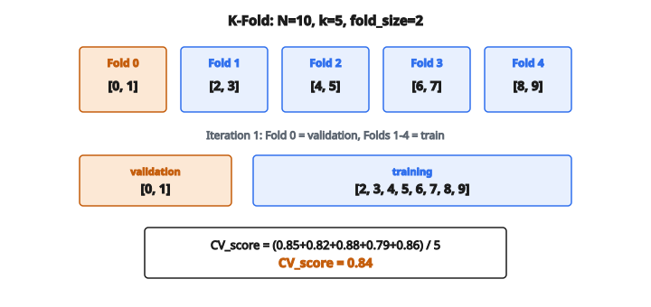

# K-Fold Split (chỉ chỉ số)

## K-Fold Cross-Validation là gì

**K-Fold Cross-Validation** là kỹ thuật resampling dùng để đánh giá mô hình machine learning khi dữ liệu hạn chế. Thay vì một lần train-test split, dữ liệu được chia thành $k$ phần bằng nhau (fold); mô hình được huấn luyện và đánh giá $k$ lần, mỗi lần một fold khác làm tập test và các fold còn lại làm dữ liệu huấn luyện.

## Vì sao dùng K-Fold Cross-Validation

**Dùng dữ liệu tốt hơn**: Với một lần train-test split, một phần dữ liệu không bao giờ được dùng để huấn luyện. K-Fold dùng mọi dữ liệu cho cả huấn luyện và kiểm tra qua các vòng khác nhau.

**Ước lượng đáng tin cậy hơn**: Một lần split có thể may hoặc rủi tùy mẫu nào rơi vào tập test. K-Fold lấy trung bình trên nhiều lần chia để ước lượng hiệu năng ổn định hơn.

**Phát hiện overfitting**: Nếu điểm huấn luyện cao nhưng điểm cross-validation thấp, mô hình đang overfitting.

**Model selection**: So sánh mô hình hoặc hyperparameter bằng điểm cross-validation thay vì một tập test duy nhất.

## Quy trình K-Fold

Cho tập $N$ mẫu và giá trị $k$ đã chọn:

**Bước 1 — Chia dữ liệu thành k fold**:

$$
\text{fold\_size} = \lfloor N / k \rfloor
$$

Mỗi fold chứa khoảng $N/k$ mẫu. Nếu $N$ không chia hết cho $k$, một số fold sẽ có thêm một mẫu.

**Bước 2 — Lặp k lần**:

* Ở vòng $i$, fold $i$ trở thành tập validation
* $k-1$ fold còn lại tạo tập huấn luyện
* Huấn luyện mô hình trên tập huấn luyện, đánh giá trên tập validation
* Ghi metric hiệu năng

**Bước 3 — Gộp kết quả**:

$$
\text{CV\_score} = \frac{1}{k} \sum_{i=1}^{k} \text{score}_i
$$

Điểm cross-validation cuối là trung bình trên mọi fold.

## Chọn số fold

**Lựa chọn phổ biến**:

* **k=5**: Cân bằng tốt giữa bias và phương sai, chi phí tính toán hợp lý
* **k=10**: Lựa chọn chuẩn, bias hơi thấp hơn k=5
* **k=N** (Leave-One-Out): Mỗi mẫu là một fold; bias thấp nhất nhưng phương sai và chi phí tính toán cao nhất

**Đánh đổi**:

*k nhỏ (ví dụ k=2 hoặc k=3)*:

* Ít mẫu huấn luyện mỗi vòng (bias cao hơn)
* Tính nhanh hơn
* Phương sai ước lượng cao hơn

*k lớn (ví dụ k=10 hoặc k=20)*:

* Nhiều mẫu huấn luyện mỗi vòng (bias thấp hơn)
* Cần nhiều tính toán hơn
* Các tập huấn luyện chồng nhau nhiều hơn, có thể tăng phương sai

## Ví dụ số

**Tập dữ liệu**: 10 mẫu với chỉ số [0, 1, 2, 3, 4, 5, 6, 7, 8, 9]

**k=5 fold** (fold_size = 10/5 = 2):

Fold 0: mẫu [0, 1]
Fold 1: mẫu [2, 3]
Fold 2: mẫu [4, 5]
Fold 3: mẫu [6, 7]
Fold 4: mẫu [8, 9]

::: {#fig-85-kfold-indices fig-cap="N = 10, k = 5, fold_size = 2: fold [0,1], [2,3], [4,5], [6,7], [8,9]; CV_score = 0.84." fig-alt="N=10 chỉ số 0-9 chia thành 5 fold, mỗi fold 2 mẫu; vòng 1 dùng fold 0 làm validation [0,1] và các fold còn lại làm train."}
{fig-align="center"}
:::

**Vòng 1**:

* Validation: Fold 0 → [0, 1]
* Huấn luyện: Fold 1,2,3,4 → [2, 3, 4, 5, 6, 7, 8, 9]
* Score: 0.85

**Vòng 2**:

* Validation: Fold 1 → [2, 3]
* Huấn luyện: Fold 0,2,3,4 → [0, 1, 4, 5, 6, 7, 8, 9]
* Score: 0.82

**Vòng 3**:

* Validation: Fold 2 → [4, 5]
* Huấn luyện: Fold 0,1,3,4 → [0, 1, 2, 3, 6, 7, 8, 9]
* Score: 0.88

**Vòng 4**:

* Validation: Fold 3 → [6, 7]
* Huấn luyện: Fold 0,1,2,4 → [0, 1, 2, 3, 4, 5, 8, 9]
* Score: 0.79

**Vòng 5**:

* Validation: Fold 4 → [8, 9]
* Huấn luyện: Fold 0,1,2,3 → [0, 1, 2, 3, 4, 5, 6, 7]
* Score: 0.86

**CV score cuối**:

$$
\text{CV\_score} = \frac{0.85 + 0.82 + 0.88 + 0.79 + 0.86}{5} = 0.84
$$

**Độ lệch chuẩn** của điểm theo fold cho ước lượng bất định: std = 0.034

## Xử lý chia không đều

Khi $N$ không chia hết cho $k$, các mẫu dư phải được phân bổ:

**Ví dụ**: N=23 mẫu, k=5

$$
\text{base\_size} = \lfloor 23/5 \rfloor = 4
$$

$$
\text{remainder} = 23 \bmod 5 = 3
$$

Phân bổ: 3 fold đầu nhận 5 mẫu, 2 fold sau nhận 4 mẫu

* Fold 0: 5 mẫu
* Fold 1: 5 mẫu
* Fold 2: 5 mẫu
* Fold 3: 4 mẫu
* Fold 4: 4 mẫu

Tổng: $5 + 5 + 5 + 4 + 4 = 23$ mẫu

## Shuffle trước khi chia

**Vì sao shuffle?**
Nếu dữ liệu có thứ tự (ví dụ sắp theo nhãn lớp hoặc thời gian), các mẫu liên tiếp có thể giống nhau. Không shuffle, fold có thể chứa tập con lệch.

**Cân nhắc cài đặt**:
Shuffle chỉ số trước khi gán vào fold, không shuffle chính dữ liệu. Cách này giữ thứ tự gốc của dữ liệu nhưng gán fold ngẫu nhiên.

**Reproducibility**: Đặt random seed trước khi shuffle để cùng phép gán fold giữa các lần chạy.

## Cân nhắc quan trọng

**Data leakage**: Mọi tiền xử lý dùng thông tin của cả tập (ví dụ scaling, chọn feature) phải nằm trong từng fold để tránh leakage. Fold test không được ảnh hưởng huấn luyện.

**Chi phí tính toán**: Huấn luyện $k$ mô hình mất gấp $k$ lần so với một lần train-test split. Với mô hình đắt, k=5 có thể được ưu tiên hơn k=10.

**Phương sai ước lượng**: Báo cả mean CV score và độ lệch chuẩn giữa các fold. Phương sai cao gợi ý mô hình nhạy với dữ liệu huấn luyện cụ thể.

**Nested cross-validation**: Khi tinh chỉnh hyperparameter, dùng vòng CV trong để chọn hyperparameter và vòng CV ngoài để ước lượng hiệu năng không chệch.

## Leave-One-Out Cross-Validation (LOOCV)

Trường hợp đặc biệt k=N:

* Mỗi mẫu là tập validation riêng
* Huấn luyện trên N-1 mẫu, kiểm tra trên 1 mẫu
* Lặp N lần

**Ưu điểm**:

* Dùng tối đa dữ liệu huấn luyện
* Deterministic (không chia ngẫu nhiên)

**Nhược điểm**:

* Tốn tính toán khi N lớn
* Phương sai ước lượng lỗi cao
* Các tập huấn luyện gần như giống nhau (tương quan cao)

## K-Fold Cross-Validation xuất hiện ở đâu

* **Đánh giá mô hình**: So sánh công bằng các thuật toán (Random Forest vs SVM vs Neural Network)
* **Tinh chỉnh hyperparameter**: Grid search hoặc random search dùng CV để đánh giá mỗi cấu hình hyperparameter
* **Chọn feature**: Đánh giá feature nào cải thiện hoặc làm hại hiệu năng mô hình
* **Ensemble**: Một số kỹ thuật ensemble dùng kiểu chia CV để sinh các mô hình cơ sở đa dạng
* **Nghiên cứu y khoa**: Dữ liệu bệnh nhân hạn chế cần dùng hiệu quả qua cross-validation
* **Cuộc thi Kaggle**: Điểm cross-validation thường tương quan với leaderboard tốt hơn một lần split
* **Time series**: Biến thể (TimeSeriesSplit) tôn trọng thứ tự thời gian
* **Mất cân bằng lớp**: Stratified K-Fold giữ tỷ lệ lớp trong mỗi fold

## Code
```python
import numpy as np

def kfold_split(N, k, shuffle=True, rng=None):
    """
    Returns: list of length k with tuples (train_idx, val_idx)
    """
    indices = np.arange(N)
    if shuffle:
        if rng is not None:
            indices = rng.permutation(indices)
        else:
            np.random.shuffle(indices)
    fold_sizes = [N // k + (1 if i < N % k else 0) for i in range(k)]
    current = 0
    fold_indices = []
    for size in fold_sizes:
        fold_indices.append(indices[current:current + size])
        current += size
    result = []
    for i in range(k):
        val_idx = fold_indices[i]
        train_idx = np.concatenate([fold_indices[j] for j in range(k) if j != i])
        result.append((train_idx, val_idx))
    return result

```
