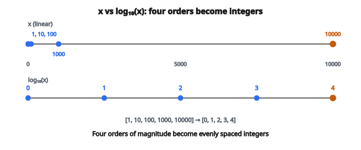

# Log Transform

## Log transform là gì

**Log transform** áp dụng hàm logarithm lên các giá trị dữ liệu, chuyển quan hệ nhân thành quan hệ cộng. Đây là một trong những biến đổi dữ liệu phổ biến nhất trong thống kê và machine learning, đặc biệt hữu ích với phân phối lệch phải và dữ liệu trải nhiều bậc độ lớn.

## Vì sao dùng log transform

**Giảm độ lệch:** Nhiều phân phối thực tế (thu nhập, dân số, giá) lệch phải mạnh với đuôi dài. Log transform nén đuôi phải và giãn phía trái, thường cho phân phối xấp xỉ chuẩn.

**Ổn định phương sai:** Khi phương sai tăng theo mean (heteroscedasticity), log transform có thể tạo phương sai ổn định hơn trên toàn dải giá trị.

**Xử lý hiệu ứng nhân:** Khi feature tác động nhân (chứ không cộng) lên đầu ra, log transform chuyển chúng thành hiệu ứng cộng, phù hợp với mô hình tuyến tính.

**Trải nhiều bậc độ lớn:** Dữ liệu từ 1 đến $1{,}000{,}000$ trở thành 0 đến 6 sau $\log_{10}$, dễ trực quan hóa và xử lý hơn.

## Định nghĩa toán

Logarithm tự nhiên (cơ số $e$) là phổ biến nhất:

$$
y = \ln(x) = \log_e(x)
$$

Các cơ số khác cũng được dùng:

$$
\log_{10}(x) = \frac{\ln(x)}{\ln(10)} \approx \frac{\ln(x)}{2.303}
$$

$$
\log_2(x) = \frac{\ln(x)}{\ln(2)} \approx \frac{\ln(x)}{0.693}
$$

**Tính chất then chốt:** Chọn cơ số chỉ đổi scale bằng một hệ số hằng. Hình dạng phân phối đã biến đổi giống nhau bất kể cơ số.

## Transform log1p

Với dữ liệu có số không hoặc giá trị gần không, log chuẩn không xác định hoặc cho giá trị âm cực lớn. Transform **log1p** xử lý việc này:

$$
y = \log(1 + x)
$$

**Tính chất:**

* Xác định với $x \geq 0$
* $\log(1 + 0) = 0$ (không ánh xạ thành không)
* Với $x$ nhỏ, $\log(1 + x) \approx x$
* Với $x$ lớn, hành vi tiến tới log chuẩn

**Ổn định số:** Với $x$ rất nhỏ, tính $1 + x$ có thể mất độ chính xác. Các cài đặt thường dùng thuật toán chuyên biệt để giữ độ chính xác.

## Transform ngược

Để về lại thang gốc:

$$
x = e^y \quad \text{(nghịch đảo của log tự nhiên)}
$$

$$
x = 10^y \quad \text{(nghịch đảo của log cơ số 10)}
$$

Với log1p:

$$
x = e^y - 1 \quad \text{(hàm expm1)}
$$

**Quan trọng:** Sau khi mô hình hóa trên không gian log, dự đoán phải được biến đổi ngược để diễn giải. Nghịch đảo của $\mathrm{mean}(\log(x))$ **không** phải $\mathrm{mean}(x)$.

## Ảnh hưởng lên hình dạng phân phối

**Trước log transform** (lệch phải):

* Đuôi phải dài với outlier cực đoan
* Mean bị kéo lên trên median
* Phần lớn giá trị dồn ở đầu thấp

**Sau log transform:**

* Đối xứng hơn, thường xấp xỉ chuẩn
* Giá trị cực đoan bị nén
* Giá trị trải đều hơn trên dải

**Ví dụ:** Dữ liệu thu nhập

* Thô: Phần lớn người kiếm khoảng $30K–$80K, ít người kiếm $1M+
* Đã log: Xấp xỉ chuẩn, tỷ phú không còn chiếm trội

## Ví dụ số

**Dữ liệu gốc:** $[1, 10, 100, 1000, 10000]$

**Log cơ số 10:**

* $\log_{10}(1) = 0$
* $\log_{10}(10) = 1$
* $\log_{10}(100) = 2$
* $\log_{10}(1000) = 3$
* $\log_{10}(10000) = 4$

**Kết quả:** $[0, 1, 2, 3, 4]$

Dữ liệu trải 4 bậc độ lớn giờ là các số nguyên cách đều.

::: {#fig-184-log-compress fig-cap="$\log_{10}$ nén $[1, 10, 100, 1000, 10000]$ thành $[0, 1, 2, 3, 4]$ cách đều. Bốn bậc độ lớn trở thành các số nguyên liên tiếp." fig-alt="Hai truc so: x = [1, 10, 100, 1000, 10000] don ve ben trai tren thang tuyen tinh; log10(x) = [0, 1, 2, 3, 4] cach deu."}
{fig-align="center"}
:::

## Khi nào áp dụng log transform

**Ứng viên tốt:**

* Dữ liệu строго dương (hoặc dùng log1p nếu không âm)
* Phân phối lệch phải
* Dữ liệu có pattern tăng trưởng mũ
* Tỉ số và tỉ lệ
* Dữ liệu đếm với phương sai cao
* Lợi suất tài chính, giá, khối lượng

**Ứng viên kém:**

* Dữ liệu có số không (dùng log1p) hoặc số âm
* Dữ liệu đã gần phân phối chuẩn
* Dữ liệu mà quan hệ tuyến tính đã phù hợp
* Dữ liệu categorical hoặc thứ tự

## Nhận biết khi log transform hữu ích

**Quan sát trực quan:**

* Histogram lệch phải trước, đối xứng sau
* Q-Q plot thẳng hơn sau biến đổi

**Kiểm định thống kê:**

* So sánh độ lệch trước và sau (nên tiến tới 0)
* Kiểm định Shapiro–Wilk xem tính chuẩn có cải thiện không

**Hiệu năng mô hình:**

* So sánh $R^2$ hoặc lỗi dự đoán có và không có transform

## Xử lý số không và số âm

**Số không:** Dùng log1p: $\log(1 + x)$

**Hằng dương nhỏ:** Cộng một lượng nhỏ trước log: $\log(x + \epsilon)$ với $\epsilon$ có thể là 1 hoặc giá trị dương nhỏ nhất trong dữ liệu

**Số âm:** Không phù hợp với log chuẩn. Cân nhắc:

* Signed log: $\mathrm{sign}(x) \cdot \log(1 + |x|)$
* Box–Cox (tổng quát hơn)
* Yeo–Johnson (xử lý được số âm)

## Log transform trong linear regression

**Biến phụ thuộc đã log:**

$$
\log(y) = \beta_0 + \beta_1 x
$$

Diễn giải: Tăng $x$ thêm một đơn vị tương ứng với thay đổi nhân $e^{\beta_1}$ trên $y$.

**Biến độc lập đã log:**

$$
y = \beta_0 + \beta_1 \log(x)
$$

Diễn giải: Tăng $x$ thêm $1\%$ tương ứng với thay đổi cộng $\beta_1 / 100$ trên $y$.

**Mô hình log–log:**

$$
\log(y) = \beta_0 + \beta_1 \log(x)
$$

Diễn giải: $\beta_1$ là elasticity — tăng $x$ thêm $1\%$ tương ứng với thay đổi $\beta_1\%$ trên $y$.

## Các lỗi thường gặp

**Quên biến đổi ngược:** Dự đoán trên không gian log phải được chuyển về để diễn giải.

**Bất đẳng thức Jensen:** Mean của giá trị đã log **không** phải log của mean. $E[\log(X)] \neq \log(E[X])$

**Sai diễn giải:** Hệ số trong mô hình đã log biểu diễn hiệu ứng nhân, không phải cộng.

**Áp dụng quá đà:** Không phải mọi dữ liệu lệch đều hưởng lợi từ log transform. Luôn so sánh hiệu năng mô hình.

## Nơi log transform xuất hiện

* **Kinh tế:** GDP, thu nhập, giá, lợi suất cổ phiếu thường được mô hình trên thang log
* **Sinh học:** Tăng trưởng quần thể, động học enzyme, quan hệ liều–đáp ứng
* **Lý thuyết thông tin:** Tính entropy, information gain
* **Xử lý tín hiệu:** Thang decibel, cảm nhận độ lớn/độ sáng
* **Machine learning:** Feature engineering cho mô hình cây, đầu vào neural network
* **Xử lý ngôn ngữ tự nhiên:** Tần suất từ tuân luật Zipf (log-linear)
* **Phân tích mạng:** Phân phối bậc đỉnh thường log-normal
* **Dịch tễ:** Lây bệnh thường mũ, log transform tuyến tính hóa
* **Hóa học:** Thang pH, tốc độ phản ứng
* **Thiên văn:** Thang magnitude cho độ sáng sao

## Code
```python
import numpy as np

def log_transform(values):
    """
    Apply the log1p transformation to each value.
    """
    return [round(float(np.log1p(v)), 4) for v in values]

```
