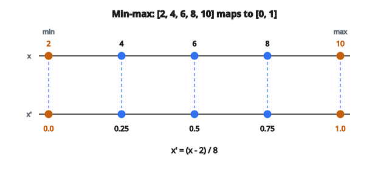

# Min-Max Normalization

## Min-max normalization là gì

**Min-max normalization** đưa dữ liệu về một khoảng chỉ định, phổ biến nhất là $[0, 1]$. Với mỗi đặc trưng, phép biến đổi ánh xạ giá trị nhỏ nhất thành 0 và giá trị lớn nhất thành 1; mọi giá trị còn lại được phân bố tuyến tính giữa hai mốc đó. Đây là kỹ thuật tiền xử lý nền tảng để các đặc trưng so sánh được với nhau.

## Công thức chính

Với một giá trị $x$ trong đặc trưng có minimum $x_{\min}$ và maximum $x_{\max}$:

$$
x_{\text{normalized}} = \frac{x - x_{\min}}{x_{\max} - x_{\min}}
$$

Có thể hiểu thành hai thao tác:

1. **Shift:** Trừ minimum để khoảng bắt đầu tại 0
2. **Scale:** Chia cho range để maximum bằng 1

## Vì sao normalization quan trọng

* **Đóng góp ngang nhau:** Không chuẩn hóa thì đặc trưng có giá trị lớn lấn át tính khoảng cách và cập nhật gradient.
* **Tốc độ hội tụ:** Thuật toán tối ưu hội tụ nhanh hơn khi các đặc trưng cùng thang.
* **Ổn định số:** Giá trị quá lớn hoặc quá nhỏ có thể gây overflow hoặc underflow.
* **Yêu cầu thuật toán:** Nhiều thuật toán giả định hoặc làm việc tốt hơn với đầu vào đã chuẩn hóa.

## Xử lý mảng 1D và 2D

**Mảng 1D** (một đặc trưng):

* Áp normalization trên toàn bộ mảng
* min và max tính từ mọi phần tử

**Mảng 2D** (nhiều đặc trưng):

* Áp normalization độc lập từng cột (đặc trưng)
* Mỗi cột có min và max riêng
* Hàng là mẫu, cột là đặc trưng

**Điểm then chốt:** Trục normalization quan trọng. Với mảng 2D shape $(n_{\text{samples}}, n_{\text{features}})$:

* Tính min/max theo axis 0 (qua các mẫu)
* Mỗi đặc trưng (cột) có bộ tham số normalization riêng

## Ý tưởng cài đặt vector hóa

Thay vì lặp từng cột:

1. Tính mọi minimum theo cột trong một phép
2. Tính mọi maximum theo cột trong một phép
3. Broadcast rồi chia trong một phép

**Các bước khái niệm cho mảng 2D:**

* mins = minimum mỗi cột (shape: $1 \times n_{\text{features}}$)
* maxs = maximum mỗi cột (shape: $1 \times n_{\text{features}}$)
* ranges = maxs - mins (shape: $1 \times n_{\text{features}}$)
* normalized = $(X - \text{mins}) / \text{ranges}$ (broadcasting lo phần còn lại)

## Tham số epsilon

Khi range bằng không (mọi giá trị giống nhau), phép chia cho không xảy ra:

$$
\frac{x - x_{\min}}{0} = \text{undefined}
$$

**Cách xử lý:** Cộng một epsilon nhỏ vào mẫu số:

$$
x_{\text{normalized}} = \frac{x - x_{\min}}{x_{\max} - x_{\min} + \epsilon}
$$

**Chọn epsilon:**

* Giá trị phổ biến: $10^{-8}$, $10^{-10}$
* Phải đủ nhỏ để không làm lệch tính toán bình thường
* Phải đủ lớn để tránh vấn đề số học

**Kết quả khi range bằng không:** Với epsilon, mọi giá trị giống nhau chuẩn hóa về xấp xỉ 0 (tử số bằng 0).

## Ví dụ số: mảng 1D

**Dữ liệu gốc:** $[2, 4, 6, 8, 10]$

**Bước 1 — Tính min và max:**

* $x_{\min} = 2$
* $x_{\max} = 10$
* Range $= 10 - 2 = 8$

**Bước 2 — Áp công thức:**

* $(2 - 2) / 8 = 0.0$
* $(4 - 2) / 8 = 0.25$
* $(6 - 2) / 8 = 0.5$
* $(8 - 2) / 8 = 0.75$
* $(10 - 2) / 8 = 1.0$

**Kết quả:** $[0.0, 0.25, 0.5, 0.75, 1.0]$

::: {#fig-27-minmax-1d fig-cap="Min-max đưa [2, 4, 6, 8, 10] thành [0.0, 0.25, 0.5, 0.75, 1.0]: $x_{\min}=2$ ánh xạ 0, $x_{\max}=10$ ánh xạ 1, range $=8$." fig-alt="Hai trục số: gốc [2, 4, 6, 8, 10] ánh xạ tuyến tính thành [0.0, 0.25, 0.5, 0.75, 1.0]; min=2 thành 0 và max=10 thành 1."}
{fig-align="center"}
:::

## Ví dụ số: mảng 2D

**Dữ liệu gốc** (3 mẫu, 2 đặc trưng):

* Mẫu 0: $[100, 0.1]$
* Mẫu 1: $[200, 0.2]$
* Mẫu 2: $[300, 0.5]$

**Bước 1 — Tính thống kê theo cột:**

Cột 0: min $=100$, max $=300$, range $=200$
Cột 1: min $=0.1$, max $=0.5$, range $=0.4$

**Bước 2 — Normalize từng cột:**

Cột 0:

* $(100 - 100) / 200 = 0.0$
* $(200 - 100) / 200 = 0.5$
* $(300 - 100) / 200 = 1.0$

Cột 1:

* $(0.1 - 0.1) / 0.4 = 0.0$
* $(0.2 - 0.1) / 0.4 = 0.25$
* $(0.5 - 0.1) / 0.4 = 1.0$

**Kết quả đã normalize:**

* Mẫu 0: $[0.0, 0.0]$
* Mẫu 1: $[0.5, 0.25]$
* Mẫu 2: $[1.0, 1.0]$

## Ví dụ số: cột có range bằng không

**Dữ liệu gốc** (3 mẫu, 2 đặc trưng):

* Mẫu 0: $[100, 5]$
* Mẫu 1: $[200, 5]$
* Mẫu 2: $[300, 5]$

Cột 1 có mọi giá trị giống nhau (range $= 0$).

**Với epsilon $= 10^{-8}$:**

Normalization cột 1:

* Range $= 5 - 5 + 10^{-8} = 10^{-8}$
* $(5 - 5) / 10^{-8} = 0$

Mọi giá trị ở cột 1 thành 0.

## Tính chất của min-max normalization

**Bảo toàn quan hệ tỷ lệ:** Nếu $a$ cách minimum gấp đôi $b$, quan hệ đó vẫn giữ sau khi normalize.

**Không căn giữa dữ liệu:** Khác z-score standardization, mean của dữ liệu đã normalize không nhất thiết bằng 0 hay 0.5.

**Đầu ra bị chặn:** Với dữ liệu huấn luyện, giá trị chắc chắn nằm trong $[0, 1]$. Dữ liệu test có thể vượt khoảng này nếu có giá trị ngoài min/max của tập huấn luyện.

**Khả nghịch:** Có thể khôi phục giá trị gốc khi biết min và max:

$$
x = x_{\text{normalized}} \cdot (x_{\max} - x_{\min}) + x_{\min}
$$

## Các lỗi thường gặp

**Quên axis:** Normalize theo trục sai cho kết quả sai.

**Chia nguyên:** Ở một số ngôn ngữ, chia số nguyên bị cắt phần thập phân. Cần dùng số thực.

**Lưu tham số:** Phải lưu min và max từ dữ liệu huấn luyện để áp cùng phép biến đổi lên dữ liệu test.

**Giả định đầu ra $[0,1]$:** Dữ liệu test có thể cho giá trị ngoài $[0, 1]$ nếu vượt range của tập huấn luyện.

## Min-max normalization xuất hiện ở đâu

* **Xử lý ảnh:** Đưa pixel từ $[0, 255]$ về $[0, 1]$
* **Mạng nơ-ron:** Normalization đầu vào cho hàm kích hoạt sigmoid và tanh
* **Trực quan hóa dữ liệu:** Chuẩn hóa giá trị để ánh xạ màu
* **Độ đo tương đồng:** Chuẩn bị đặc trưng trước khi tính khoảng cách
* **Gộp đặc trưng:** Kết hợp đặc trưng từ nhiều nguồn
* **Chuỗi thời gian:** Normalize nhiều chuỗi để so sánh
* **Xử lý tín hiệu:** Normalization biên độ
* **Pipeline tiền xử lý:** Bước chuẩn trước nhiều thuật toán ML

## Code
```python
import numpy as np

def minmax_scale(X, axis=0, eps=1e-12):
    """
    Scale X to [0,1]. If 2D and axis=0 (default), scale per column.
    Return np.ndarray (float).
    """
    X = np.array(X, dtype=float)
    mn = X.min(axis=axis, keepdims=True)
    mx = X.max(axis=axis, keepdims=True)
    return ((X - mn) / (mx - mn + eps)).tolist()

```
