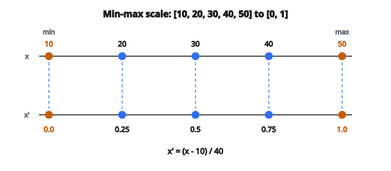

# Min-Max Scaling

::: {.callout-tip icon=false}
## Cùng công thức với bài cạnh
Bài [Min-Max Normalization](min-max-normalization.qmd) (`order: 1`) dùng cùng phép biến đổi về $[0,1]$. Bài này nhấn **vì sao** cần scale và khi nào dùng trong ML.
:::

## Min-max scaling là gì

**Min-max scaling**, còn gọi là normalization, biến đổi đặc trưng về một khoảng cố định, thường là $[0, 1]$. Giá trị nhỏ nhất thành 0, giá trị lớn nhất thành 1, và mọi giá trị còn lại được scale tuyến tính giữa hai mốc đó. Nhờ vậy mọi đặc trưng cùng thang, điều then chốt với nhiều thuật toán machine learning.

## Vì sao cần scale đặc trưng

**Thuật toán dựa trên khoảng cách:** KNN, K-means và SVM với kernel RBF tính khoảng cách giữa các mẫu. Một đặc trưng đo bằng nghìn (ví dụ lương) sẽ lấn át đặc trưng đo bằng đơn vị (ví dụ số năm kinh nghiệm).

**Tối ưu hạ gradient:** Mạng nơ-ron và logistic regression hội tụ nhanh hơn khi các đặc trưng cùng thang. Đặc trưng thang lớn gây gradient lớn, huấn luyện không ổn định.

**Công bằng regularization:** Phạt L1 và L2 chỉ đối xử đều các đặc trưng khi chúng cùng thang.

**Khả năng diễn giải:** Sau khi scale, giá trị 0.7 nghĩa là “đã đi 70% quãng từ minimum tới maximum”, bất kể đơn vị gốc.

## Công thức min-max scaling

Với cột đặc trưng $X$, mỗi giá trị $x$ được biến đổi thành:

$$
x' = \frac{x - x_{\min}}{x_{\max} - x_{\min}}
$$

Trong đó:

* $x_{\min}$ = giá trị nhỏ nhất trong cột đặc trưng
* $x_{\max}$ = giá trị lớn nhất trong cột đặc trưng
* $x'$ = giá trị đã scale trong $[0, 1]$

**Tính chất:**

* Khi $x = x_{\min}$: $x' = 0$
* Khi $x = x_{\max}$: $x' = 1$
* Biến đổi tuyến tính, bảo toàn khoảng cách tương đối

## Scale về khoảng tùy ý

Để scale về khoảng $[a, b]$ thay vì $[0, 1]$:

$$
x' = a + (b - a) \cdot \frac{x - x_{\min}}{x_{\max} - x_{\min}}
$$

**Các khoảng thay thế phổ biến:**

* $[-1, 1]$: Căn giữa tại 0, hữu ích với thuật toán kỳ vọng đầu vào đối xứng
* $[0, 255]$: Giá trị pixel ảnh
* Khoảng tùy chỉnh theo yêu cầu miền

## Áp dụng theo cột

Min-max scaling được áp độc lập cho từng đặc trưng (cột):

**Dữ liệu gốc:**

* Đặc trưng A: $[100, 200, 300, 400, 500]$
* Đặc trưng B: $[2, 4, 6, 8, 10]$

**Tính min/max từng cột:**

* Đặc trưng A: min $=100$, max $=500$, range $=400$
* Đặc trưng B: min $=2$, max $=10$, range $=8$

**Scale từng cột:**

* Đặc trưng A: $[(100-100)/400, (200-100)/400, \ldots] = [0, 0.25, 0.5, 0.75, 1.0]$
* Đặc trưng B: $[(2-2)/8, (4-2)/8, \ldots] = [0, 0.25, 0.5, 0.75, 1.0]$

Giờ cả hai đặc trưng đều chạy từ 0 đến 1.

## Ví dụ số

**Giá trị đặc trưng gốc:** $[10, 20, 30, 40, 50]$

**Bước 1 — Tìm min và max:**

* $x_{\min} = 10$
* $x_{\max} = 50$
* Range $= 50 - 10 = 40$

**Bước 2 — Áp công thức cho từng giá trị:**

$$
x'_1 = \frac{10 - 10}{40} = 0.0
$$

$$
x'_2 = \frac{20 - 10}{40} = 0.25
$$

$$
x'_3 = \frac{30 - 10}{40} = 0.5
$$

$$
x'_4 = \frac{40 - 10}{40} = 0.75
$$

$$
x'_5 = \frac{50 - 10}{40} = 1.0
$$

**Kết quả:** $[0.0, 0.25, 0.5, 0.75, 1.0]$

::: {#fig-185-minmax-scale fig-cap="Min-max scale $[10, 20, 30, 40, 50]$ thành $[0.0, 0.25, 0.5, 0.75, 1.0]$ với $x_{\min}=10$, $x_{\max}=50$, range $=40$." fig-alt="Hai trục số: gốc [10, 20, 30, 40, 50] ánh xạ tuyến tính thành [0.0, 0.25, 0.5, 0.75, 1.0]; min=10 thành 0 và max=50 thành 1."}
{fig-align="center"}
:::

## Xử lý range bằng không

Khi mọi giá trị trong một đặc trưng giống nhau ($x_{\max} = x_{\min}$), mẫu số bằng không:

$$
x' = \frac{x - x_{\min}}{0} = \text{undefined}
$$

**Cách xử lý:**

* Gán mọi giá trị đã scale bằng 0 (phổ biến nhất)
* Gán mọi giá trị đã scale bằng 0.5 (trung điểm khoảng)
* Bỏ đặc trưng (đặc trưng hằng không có giá trị dự đoán)

## Cân nhắc train-test

**Quy tắc then chốt:** Tính $x_{\min}$ và $x_{\max}$ chỉ từ dữ liệu huấn luyện.

**Vì sao?** Dùng thống kê tập test gây data leakage. Mô hình sẽ có thông tin gián tiếp về phân phối test, dẫn tới ước lượng hiệu năng quá lạc quan.

**Áp lên dữ liệu test:**

$$
x'_{\text{test}} = \frac{x_{\text{test}} - x_{\min,\text{train}}}{x_{\max,\text{train}} - x_{\min,\text{train}}}
$$

**Hệ quả:** Giá trị test có thể rơi ngoài $[0, 1]$ nếu tập test có giá trị vượt range huấn luyện.

## Biến đổi ngược

Để đưa giá trị đã scale về thang gốc:

$$
x = x' \cdot (x_{\max} - x_{\min}) + x_{\min}
$$

**Khi dùng:**

* Diễn giải dự đoán của mô hình theo đơn vị gốc
* Hậu xử lý đầu ra cho người đọc
* Đảo tiền xử lý khi triển khai

## Độ nhạy với outlier

Min-max scaling rất nhạy với outlier:

**Ví dụ không có outlier:** $[10, 20, 30, 40, 50]$

* Đã scale: $[0, 0.25, 0.5, 0.75, 1.0]$

**Ví dụ có outlier:** $[10, 20, 30, 40, 1000]$

* min $=10$, max $=1000$, range $=990$
* Đã scale: $[0, 0.01, 0.02, 0.03, 1.0]$

Một outlier nén mọi giá trị bình thường sát 0. Cân nhắc:

* Loại outlier trước khi scale
* Dùng Robust Scaling (dựa trên percentile)
* Winsorization (cắt trần outlier)

## Min-max so với z-score standardization

**Min-max scaling:**

* Khoảng bị chặn $[0, 1]$
* Bảo toàn giá trị không (nếu min bằng 0)
* Nhạy với outlier
* Phù hợp: mạng nơ-ron, dữ liệu ảnh, thuật toán bị chặn

**z-Score standardization:**

* Khoảng không bị chặn (mọi số thực)
* Căn giữa dữ liệu tại mean 0
* Ít nhạy với outlier hơn
* Phù hợp: PCA, hồi quy tuyến tính, SVM

## Min-max scaling xuất hiện ở đâu

* **Mạng nơ-ron:** Normalization đầu vào để huấn luyện ổn định
* **Xử lý ảnh:** Pixel scale từ $[0, 255]$ về $[0, 1]$
* **K-Nearest Neighbors:** Tính khoảng cách cần thang so sánh được
* **Support Vector Machines:** Phương pháp kernel nhạy với độ lớn đặc trưng
* **Trực quan hóa:** Heatmap và thang màu có khoảng cố định
* **Feature engineering:** Kết hợp đặc trưng từ nhiều nguồn
* **Chuỗi thời gian:** Normalize các chuỗi khác nhau để so sánh
* **Phân cụm:** K-means và phân cụm phân cấp dùng khoảng cách
* **Phát hiện bất thường:** Isolation Forest và LOF hưởng lợi từ đặc trưng đã scale
* **Gradient boosting:** Mô hình cây bất biến theo thang, nhưng scaling vẫn có thể giúp hội tụ

## Code
```python
def min_max_scaling(data):
    """
    Scale each column of the data matrix to the [0, 1] range.
    """
    n_rows = len(data)
    n_cols = len(data[0])
    result = [[0.0] * n_cols for _ in range(n_rows)]
    for j in range(n_cols):
        col = [data[i][j] for i in range(n_rows)]
        col_min, col_max = min(col), max(col)
        rng = col_max - col_min
        for i in range(n_rows):
            result[i][j] = (data[i][j] - col_min) / rng if rng != 0 else 0.0
    return result

```

<!-- auto-self-check -->

::: {.callout-note}
## Kiểm tra nhanh
<details>
<summary>Ý chính của bài «Min-Max Scaling» là gì?</summary>
**Min-max scaling**, còn gọi là normalization, biến đổi đặc trưng về một khoảng cố định, thường là $[0, 1]$.
</details>
<details>
<summary>Công thức / quan hệ cốt lõi trong bài là gì?</summary>
$$x' = \frac{x - x_{\min}}{x_{\max} - x_{\min}}$$
</details>
:::
