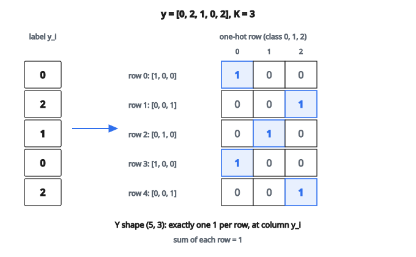

# One-Hot Encoding (đa lớp)

## One-hot encoding là gì

**One-hot encoding** biến nhãn categorical thành vector nhị phân, mỗi category chiếm một vị trí riêng. Với mẫu có nhãn lớp $k$ trong $K$ lớp có thể, vector one-hot có 1 tại vị trí $k$ và 0 mọi chỗ còn lại. Biểu diễn này cần thiết khi đưa dữ liệu categorical vào mô hình machine learning.

## Vì sao dùng one-hot encoding

**Không giả định thứ tự.** Integer encoding $(0, 1, 2, 3)$ gợi một thứ tự có thể không tồn tại. “Red” có nhỏ hơn “green” nhỏ hơn “blue” không? One-hot encoding coi mọi category khác nhau như nhau.

**Tương thích thuật toán.** Nhiều thuật toán (neural network, logistic regression) cần đầu vào số và diễn giải số nguyên như giá trị liên tục. One-hot cho một biểu diễn số đúng nghĩa.

**Bảo toàn khoảng cách.** Trong không gian one-hot, mọi cặp category khác nhau cách đều nhau (Hamming distance $= 2$), phản ánh việc đổi từ “cat” sang “dog” không khác hơn đổi từ “cat” sang “bird”.

## Vector one-hot

Với $K$ lớp và một mẫu có nhãn $y \in \{0, 1, \ldots, K-1\}$:

$$
\mathrm{onehot}(y) = [0, 0, \ldots, 0, 1, 0, \ldots, 0]
$$

Số 1 nằm tại vị trí $y$.

**Tính chất:**

* **Độ dài vector:** $K$
* **Tổng các phần tử:** $1$
* **Đúng một phần tử khác 0**
* **dtype:** thường là float để tương thích với phép toán neural network

## Biểu diễn ma trận

Với $N$ mẫu có nhãn $y = [y_1, y_2, \ldots, y_N]$, ma trận one-hot $Y$ có shape $(N, K)$:

$$
Y_{ij} = \begin{cases}
1 & \text{nếu } y_i = j \\
0 & \text{ngược lại}
\end{cases}
$$

Mỗi hàng là vector one-hot của một mẫu.

## Ví dụ số

**Nhãn:** $[0, 2, 1, 0, 2]$ với $K = 3$ lớp

**Ma trận one-hot:**

* Nhãn $0$ $\to$ $[1, 0, 0]$
* Nhãn $2$ $\to$ $[0, 0, 1]$
* Nhãn $1$ $\to$ $[0, 1, 0]$
* Nhãn $0$ $\to$ $[1, 0, 0]$
* Nhãn $2$ $\to$ $[0, 0, 1]$

**Kết quả** (ma trận $5 \times 3$):

* Hàng 0: $[1, 0, 0]$
* Hàng 1: $[0, 0, 1]$
* Hàng 2: $[0, 1, 0]$
* Hàng 3: $[1, 0, 0]$
* Hàng 4: $[0, 0, 1]$

::: {#fig-71-onehot-matrix fig-cap="Với K = 3, mỗi hàng có đúng một số 1 tại cột y_i: [1,0,0], [0,0,1], [0,1,0], [1,0,0], [0,0,1]." fig-alt="Nhãn y = [0, 2, 1, 0, 2] ánh xạ sang ma trận one-hot 5 hàng 3 cột; các ô 1 nằm đúng cột lớp 0, 2, 1, 0, 2."}
{fig-align="center"}
:::

## Tham số num_classes

**Khi không chỉ định num_classes:** dùng $K = \max(y) + 1$.

Ví dụ: labels $= [0, 1, 3]$ $\to$ $K = 4$ (không phải 3!).

**Khi có chỉ định num_classes:** dùng giá trị được cung cấp.

Ví dụ: labels $= [0, 1, 2]$ với num_classes $= 5$ $\to$ $K = 5$.

Cách này tạo thêm cột “thừa” toàn 0. Hữu ích khi:

* Dữ liệu huấn luyện không chứa đủ mọi lớp có thể
* Cần giữ dimensionality nhất quán giữa các dataset

## Ví dụ số với lớp thừa

**Nhãn:** $[0, 1, 2]$ với num_classes $= 5$

**Ma trận one-hot** ($3 \times 5$):

* Nhãn $0$ $\to$ $[1, 0, 0, 0, 0]$
* Nhãn $1$ $\to$ $[0, 1, 0, 0, 0]$
* Nhãn $2$ $\to$ $[0, 0, 1, 0, 0]$

Cột 3 và 4 toàn 0 vì không mẫu nào mang nhãn đó.

## Gán chỉ số vector hóa

Cách naive duyệt từng mẫu. Cách vector hóa:

1. Tạo ma trận 0 shape $(N, K)$
2. Dùng advanced indexing: `matrix[row_indices, column_indices] = 1`

với

* row_indices $= [0, 1, 2, \ldots, N-1]$ (chỉ số mẫu)
* column_indices $= y$ (giá trị nhãn)

Thao tác này gán đúng một phần tử mỗi hàng trong một phép gán.

## Kiểm tra nhãn

**Điều kiện:** mọi nhãn phải nhỏ hơn num_classes.

Nếu $y_i \geq K$, nhãn không hợp lệ và sẽ gây lỗi chỉ số hoặc kết quả sai.

**Các kiểm tra thường dùng:**

* Mọi nhãn là số nguyên không âm
* Mọi nhãn nhỏ hơn num_classes
* Không có NaN hay missing value

## Phép nghịch đảo

Đổi one-hot về nhãn nguyên:

$$
y_i = \arg\max_j(Y_{ij})
$$

Chỉ số của phần tử lớn nhất (số 1) trên mỗi hàng chính là nhãn gốc.

**Soft label:** nếu là xác suất thay vì one-hot cứng (ví dụ $[0.1, 0.7, 0.2]$), argmax vẫn cho lớp dự đoán.

## Cân nhắc bộ nhớ

Với $N$ mẫu và $K$ lớp:

* Nhãn nguyên: $N$ số nguyên
* Ma trận one-hot: $N \times K$ số float

**Vấn đề cardinality cao:** nếu $K = 10{,}000$ category, one-hot tạo $10{,}000$ cột. Cân nhắc:

* Embedding layer (học biểu diễn dày)
* Hashing (đầu ra kích thước cố định)
* Target encoding (thay bằng thống kê)

## One-hot trong neural network

**Lớp đầu ra:** mạng phân loại sinh logit $\to$ softmax $\to$ xác suất dạng one-hot.

**Hàm mất mát:** cross-entropy so sánh xác suất dự đoán với vector one-hot thật:

$$
\mathrm{CrossEntropy} = -\sum_{j} Y_{ij} \log(\hat{Y}_{ij})
$$

Vì $Y_{ij}$ là one-hot, chỉ lớp đúng đóng góp vào loss.

**Thay bằng embedding:** với feature cardinality cao, embedding layer học biểu diễn dày thay vì vector one-hot thưa.

## One-hot so với label encoding

**Label encoding:** category ánh xạ sang số nguyên $[0, 1, 2, \ldots]$

* Biểu diễn gọn
* Ngầm giả định quan hệ thứ tự
* Dùng được với mô hình cây, vốn xử lý được kiểu này

**One-hot encoding:** category ánh xạ sang vector nhị phân

* Biểu diễn lớn hơn
* Không giả định thứ tự
* Bắt buộc với mô hình tuyến tính và neural network

## One-hot encoding xuất hiện ở đâu

* **Target phân loại:** đổi nhãn lớp thành vector đích khi huấn luyện
* **Feature categorical:** mã hóa biến danh định như màu, quốc gia, loại sản phẩm
* **Đầu ra neural network:** softmax so với target one-hot
* **Ma trận thưa:** lưu hiệu quả khi hầu hết phần tử bằng 0
* **Cơ chế attention:** hard attention dùng one-hot để chọn
* **Mô hình sequence-to-sequence:** token đích được one-hot encode
* **Phân loại đa nhãn:** mở rộng cho phép nhiều vị trí bằng 1
* **Feature engineering:** tạo biến chỉ báo cho thuộc tính categorical

## Code
```python
import numpy as np

def one_hot(y, num_classes=None):
    """
    Convert integer labels y ∈ {0,...,K-1} into one-hot matrix of shape (N, K).
    """
    y = list(y)
    if num_classes is None:
        num_classes = max(y) + 1
    result = []
    for label in y:
        row = [0] * num_classes
        row[label] = 1
        result.append(row)
    return result

```

<!-- auto-self-check -->

::: {.callout-note}
## Kiểm tra nhanh
<details>
<summary>Ý chính của bài «One-Hot Encoding (đa lớp)» là gì?</summary>
**One-hot encoding** biến nhãn categorical thành vector nhị phân, mỗi category chiếm một vị trí riêng.
</details>
<details>
<summary>Công thức / quan hệ cốt lõi trong bài là gì?</summary>
$$\mathrm{onehot}(y) = [0, 0, \ldots, 0, 1, 0, \ldots, 0]$$
</details>
:::
