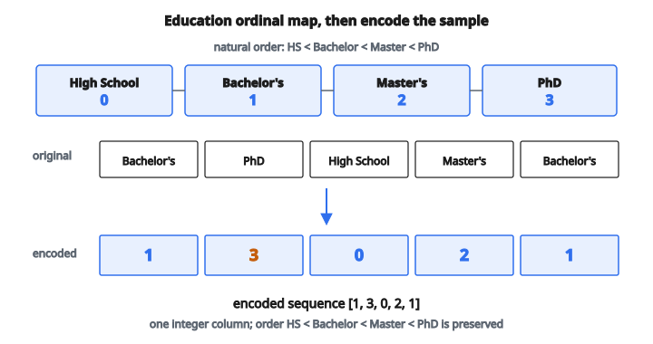

# Ordinal Encoding

## Ordinal encoding là gì

**Ordinal encoding** là kỹ thuật đổi feature categorical thành giá trị số bằng cách gán số nguyên cho category theo thứ tự hoặc hạng vốn có. Khác one-hot encoding, nó tạo một cột duy nhất với số nguyên đã sắp thứ tự.

Với category có thứ tự tự nhiên (như trình độ học vấn hoặc size), ordinal encoding giữ hạng có nghĩa này trong biểu diễn số.

## Khi nào dùng ordinal encoding

**Ordinal encoding phù hợp khi:**

* Category có thứ tự tự nhiên, có nghĩa
* Quan hệ thứ tự cần được giữ
* Muốn giảm dimensionality so với one-hot encoding
* Thuật toán có thể dùng feature số đã sắp thứ tự

**Ví dụ feature thứ tự:**

* Education: High School $<$ Bachelor's $<$ Master's $<$ PhD
* Size: Small $<$ Medium $<$ Large $<$ Extra Large
* Rating: Poor $<$ Fair $<$ Good $<$ Excellent
* Priority: Low $<$ Medium $<$ High $<$ Critical

## Quy trình cơ bản

**Bước 1:** Xác định thứ tự tự nhiên của các category

**Bước 2:** Gán số nguyên bắt đầu từ 0 (hoặc 1) theo thứ tự đó

**Bước 3:** Thay mỗi category bằng số nguyên đã gán

**Bước 4:** Lưu mapping để encode dữ liệu mới cho nhất quán

## Ví dụ số: trình độ học vấn

**Category (đã sắp thứ tự):**

1. High School
2. Bachelor's
3. Master's
4. PhD

**Mapping:**

* High School: $0$
* Bachelor's: $1$
* Master's: $2$
* PhD: $3$

**Dữ liệu gốc:**

[Bachelor's, PhD, High School, Master's, Bachelor's]

**Dữ liệu đã encode:**

$[1, 3, 0, 2, 1]$

::: {#fig-182-ordinal-education fig-cap="Education: High School = 0, Bachelor's = 1, Master's = 2, PhD = 3. Dữ liệu [Bachelor's, PhD, High School, Master's, Bachelor's] thành [1, 3, 0, 2, 1]." fig-alt="Thang thứ tự High School=0, Bachelor=1, Master=2, PhD=3 và chuỗi dữ liệu [1, 3, 0, 2, 1]."}
{fig-align="center"}
:::

## Ví dụ số: size áo

**Category (đã sắp thứ tự):**

* XS (Extra Small)
* S (Small)
* M (Medium)
* L (Large)
* XL (Extra Large)
* XXL (Double Extra Large)

**Mapping:**

* XS: $0$
* S: $1$
* M: $2$
* L: $3$
* XL: $4$
* XXL: $5$

**Gốc:** [M, L, S, XL, M, XXL]

**Đã encode:** $[2, 3, 1, 4, 2, 5]$

## Ordinal so với label encoding

**Ordinal encoding:**

* Thứ tự có nghĩa và có chủ đích
* Category có hạng vốn có
* Số nguyên được gán phản ánh quan hệ thật

**Label encoding:**

* Thứ tự tùy ý (thường theo alphabet hoặc thứ tự xuất hiện)
* Category không có hạng vốn có
* Số nguyên được gán không phản ánh quan hệ có nghĩa

**Ví dụ:**

* Colors: Red $= 0$, Blue $= 1$, Green $= 2$ (tùy ý, nên dùng one-hot)
* Sizes: Small $= 0$, Medium $= 1$, Large $= 2$ (thứ tự có nghĩa, dùng ordinal)

## Ordinal so với one-hot encoding

**Ordinal encoding:**

* Tạo 1 cột
* Giả định quan hệ thứ tự
* Biểu diễn gọn

**One-hot encoding:**

* Tạo $k$ cột cho $k$ category
* Không giả định thứ tự
* Mỗi category cách đều các category khác

**Trade-off:** ordinal gọn hơn nhưng áp một thứ tự có thể phù hợp hoặc không.

## Biểu diễn toán học

Cho các category $C = \{c_1, c_2, \ldots, c_k\}$ với thứ tự $c_1 < c_2 < \cdots < c_k$:

$$
f(c_i) = i - 1
$$

Ánh xạ này:

* Category đầu tiên thành $0$
* Category thứ hai thành $1$
* Category thứ $k$ thành $k-1$

Hoặc bắt đầu từ 1:

$$
f(c_i) = i
$$

## Điểm bắt đầu tùy chọn

Có thể bắt đầu từ số nguyên bất kỳ:

**Bắt đầu từ 1:**

* High School: $1$
* Bachelor's: $2$
* Master's: $3$
* PhD: $4$

**Bắt đầu từ 0 (phổ biến hơn trong lập trình):**

* High School: $0$
* Bachelor's: $1$
* Master's: $2$
* PhD: $3$

Chọn theo yêu cầu mô hình hoặc quy ước.

## Khoảng cách không đều

Đôi khi khoảng giữa các category không bằng nhau:

**Ví dụ: thang đau**

* No pain: $0$
* Mild: $1$
* Moderate: $3$
* Severe: $6$
* Unbearable: $10$

Cách gán này phản ánh bước từ Mild sang Moderate lớn hơn bước từ No pain sang Mild.

**Dùng thận trọng:** chỉ khi có tri thức miền hỗ trợ khoảng cách đó.

## Xử lý category chưa thấy

Khi dữ liệu mới chứa category chưa gặp:

**Phương án 1: gán giá trị đặc biệt**

$$
f(c_{\mathrm{unknown}}) = -1 \quad \text{hoặc} \quad k
$$

**Phương án 2: báo lỗi**

Ép xử lý tường minh các category bất ngờ.

**Phương án 3: ánh xạ sang category xuất hiện nhiều nhất**

Dùng mode của dữ liệu huấn luyện.

**Phương án 4: ánh xạ sang category giữa**

Giả định trung tính khi không biết thứ tự.

## Xử lý missing value

**Phương án 1: encoding riêng**

$$
f(\mathrm{NaN}) = -1 \quad \text{hoặc} \quad k
$$

**Phương án 2: impute trước khi encode**

Điền bằng mode, category trung vị, hoặc mặc định theo miền.

**Phương án 3: giữ NaN**

Để mô hình xử lý missing value trực tiếp.

## Ordinal encoding cho mô hình cây

Decision tree và random forest xử lý tự nhiên feature thứ tự:

**Lợi ích:** cây tìm được điểm tách tối ưu trên các giá trị đã sắp.

**Ví dụ:**

Nếu Education được encode thành $[0, 1, 2, 3]$, cây có thể tách tại Education $< 2$ (tách High School/Bachelor's khỏi Master's/PhD).

## Ordinal encoding cho mô hình tuyến tính

Mô hình tuyến tính coi ordinal encoding như biến số:

$$
y = \beta_0 + \beta_1 \cdot \mathrm{Education}
$$

**Giả định:** khoảng cách đều là có nghĩa.

Nếu Education tăng 1 (ví dụ từ Bachelor's sang Master's), $y$ đổi một lượng $\beta_1$.

**Vấn đề:** hiệu ứng từ Bachelor's sang Master's có bằng High School sang Bachelor's không?

Nếu không, cân nhắc one-hot encoding hoặc hạng tử đa thức.

## Feature thứ tự thường gặp

**Mức hài lòng khách hàng:**

* Very Dissatisfied ($0$)
* Dissatisfied ($1$)
* Neutral ($2$)
* Satisfied ($3$)
* Very Satisfied ($4$)

**Mức rủi ro:**

* Low ($0$)
* Medium ($1$)
* High ($2$)
* Critical ($3$)

**Nhóm tuổi:**

* Child ($0$)
* Teenager ($1$)
* Adult ($2$)
* Senior ($3$)

## Ordinal encoding trong khảo sát

Câu trả lời khảo sát thường dùng thang Likert:

**Thang đồng ý:**

* Strongly Disagree: $1$
* Disagree: $2$
* Neutral: $3$
* Agree: $4$
* Strongly Agree: $5$

**Thang tần suất:**

* Never: $0$
* Rarely: $1$
* Sometimes: $2$
* Often: $3$
* Always: $4$

## Kiểm tra thứ tự đúng

Trước khi áp ordinal encoding, kiểm tra thứ tự có hợp lý:

**Câu hỏi cần đặt:**

1. Có quan hệ lớn hơn / nhỏ hơn rõ ràng không?
2. Chuyên gia miền có đồng ý thứ tự đó không?
3. Thứ tự có ý nghĩa dự đoán với target không?

**Nếu không có thứ tự rõ:** dùng one-hot encoding.

## Ordinal encoding với Pandas: ý niệm

**Quy trình khái niệm:**

1. Định nghĩa thứ tự category một cách tường minh
2. Tạo dictionary mapping
3. Áp mapping lên dữ liệu

**Quan trọng:** luôn định nghĩa thứ tự tường minh, không dựa vào thứ tự alphabet hay thứ tự xuất hiện.

## Feature thứ tự nhiều cấp

Một số feature thứ tự có cấp bậc phân cấp:

**Ví dụ: quân hàm**

Enlisted (E1–E9) $<$ Warrant officers (W1–W5) $<$ Commissioned officers (O1–O10)

**Cách 1:** một ordinal encoding xuyên suốt mọi cấp

**Cách 2:** ordinal encoding riêng cho từng cấp, cộng thêm biến chỉ báo cấp

## Ordinal encoding và tương tác feature

Feature thứ tự có thể dùng trong tương tác:

**Ví dụ:**

* Education level (ordinal)
* Years of experience (số)

Tương tác: Education_level $\times$ Experience

Cho phép hiệu ứng của experience thay đổi theo trình độ học vấn.

## Kiểm tra giả định thứ tự

**Kiểm tra xem tính thứ tự có giúp không:**

1. Khớp mô hình với ordinal encoding
2. Khớp mô hình với one-hot encoding
3. So sánh hiệu năng trên dữ liệu validation

**Nếu one-hot vượt trội rõ:** giả định thứ tự có thể không đúng.

## Ordinal encoding trong ensemble

**Random Forest:**

Ordinal encoding làm việc tốt vì cây tách tại ngưỡng bất kỳ.

**Gradient boosting (XGBoost, LightGBM):**

Cũng xử lý tốt feature thứ tự. LightGBM có hỗ trợ native cho feature categorical.

**Neural network:**

Có thể dùng ordinal encoding, nhưng embedding có thể bắt quan hệ giàu hơn.

## Các vấn đề tiềm ẩn

**1. Ngầm giả định khoảng cách đều:**

Ordinal encoding ngầm coi khoảng giữa các category bằng nhau, điều có thể không đúng.

**2. Phép toán số:**

Một số mô hình có thể tính mean hay phép toán khác vốn vô nghĩa với dữ liệu thứ tự. Mean của [Master's, Bachelor's] không có nghĩa khi $(2 + 1) / 2 = 1.5$.

**3. Sai thứ tự:**

Thứ tự sai có thể làm giảm hiệu năng mô hình rõ rệt.

## Ordinal so với numeric

Đôi khi dữ liệu thứ tự trông như số:

**Ví dụ:** đánh giá sao $1$–$5$

Đây là thứ tự, không phải số thực sự, vì:

* Chênh giữa 1 sao và 2 sao có thể không bằng chênh giữa 4 sao và 5 sao
* Không có điểm 0 thật
* Tỷ số không có nghĩa (4 sao không gấp đôi 2 sao)

Tuy vậy, coi như số thường vẫn làm việc tốt trong thực tế.

## Quan hệ đơn điệu

Ordinal encoding giả định quan hệ đơn điệu với target:

**Đơn điệu tăng:**

Giá trị category cao hơn tương ứng target cao hơn (hoặc thấp hơn) một cách nhất quán.

**Không đơn điệu:**

Quan hệ không nhất quán. Category ở giữa có thể hành xử khác.

Nếu quan hệ không đơn điệu, one-hot encoding có thể tốt hơn.

## Thực hành tốt

**1. Kiểm tra thứ tự tự nhiên:**

Đảm bảo các category thật sự có quan hệ thứ tự.

**2. Ghi lại mapping:**

Giữ hồ sơ rõ số nguyên nào ánh xạ sang category nào.

**3. Nhất quán:**

Dùng cùng mapping lúc huấn luyện và lúc suy luận.

**4. Cân nhắc phương án khác:**

Nếu hiệu năng kém, thử one-hot encoding.

**5. Xử lý unknown:**

Lên kế hoạch xử lý category mới khi đưa lên production.

## Các lỗi thường gặp

**1. Coi mọi feature categorical là thứ tự:**

Màu, tên, và ID không phải thứ tự.

**2. Dùng sai thứ tự:**

Gán số nguyên mà không xét hạng thật.

**3. Dựa vào thứ tự alphabet mặc định:**

Thứ tự alphabet hiếm khi khớp thứ tự có nghĩa.

**4. Quên lưu mapping:**

Không encode được dữ liệu mới cho nhất quán.

**5. Coi như liên tục:**

Tính thống kê như mean và độ lệch chuẩn trên dữ liệu thứ tự.

## Code
```python
```

<!-- auto-self-check -->

::: {.callout-note}
## Kiểm tra nhanh
<details>
<summary>Ý chính của bài «Ordinal Encoding» là gì?</summary>
**Ordinal encoding** là kỹ thuật đổi feature categorical thành giá trị số bằng cách gán số nguyên cho category theo thứ tự hoặc hạng vốn có.
</details>
<details>
<summary>Công thức / quan hệ cốt lõi trong bài là gì?</summary>
$$f(c_i) = i - 1$$
</details>
:::
