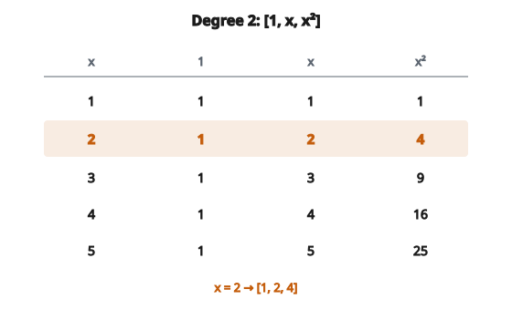

# Polynomial Features

## Polynomial features là gì

**Polynomial features** là các feature mới tạo bằng cách nâng feature hiện có lên lũy thừa và tính mọi tích chéo (cross-product) đến một bậc cho trước. Nhờ đó mô hình tuyến tính học được quan hệ phi tuyến bằng cách khớp một hàm đa thức vào dữ liệu.

Với một feature $x$, polynomial features bậc 2 là: $1$, $x$, $x^2$.

Với hai feature $x_1$, $x_2$, polynomial features bậc 2 là: $1$, $x_1$, $x_2$, $x_1^2$, $x_1 x_2$, $x_2^2$.

## Vì sao dùng polynomial features

**1. Bắt quan hệ phi tuyến:**

Quan hệ thực tế thường phi tuyến. Polynomial features cho phép mô hình tuyến tính khớp đường cong.

**2. Mô hình interaction:**

Các hạng tử tích chéo ($x_1 x_2$) bắt cách các feature tương tác với nhau.

**3. Tăng độ linh hoạt của mô hình:**

Thêm polynomial features mở rộng không gian giả thuyết.

**4. Cài đặt đơn giản:**

Feature engineering không đòi hỏi chuyên môn domain.

## Nền tảng toán

Đa thức bậc $d$ một biến:

$$
f(x) = \beta_0 + \beta_1 x + \beta_2 x^2 + \cdots + \beta_d x^d
$$

Hàm này tuyến tính theo hệ số $\beta_i$ nhưng phi tuyến theo $x$.

Nếu coi mỗi $x^k$ là một feature riêng, ta dùng linear regression để khớp đường cong đa thức.

## Ví dụ một biến

**Feature gốc:** $x$

**Polynomial features bậc 2:**

$$
[1,\ x,\ x^2]
$$

**Polynomial features bậc 3:**

$$
[1,\ x,\ x^2,\ x^3]
$$

**Polynomial features bậc $d$:**

$$
[1,\ x,\ x^2,\ \ldots,\ x^d]
$$

## Ví dụ số: một biến

**Dữ liệu gốc:** $x = [1, 2, 3, 4, 5]$

**Biến đổi bậc 2:**

Với $x = 2$:

* $x^0 = 1$ (hạng tử bias)
* $x^1 = 2$
* $x^2 = 4$

::: {#fig-171-poly-degree2 fig-cap="Bậc 2 ánh xạ mỗi $x$ thành $[1, x, x^2]$. Với $x = 2$ ta được $[1, 2, 4]$." fig-alt="Bang polynomial bac 2 cho x = [1, 2, 3, 4, 5]; hang x = 2 duoc to dam thanh [1, 2, 4]."}
{fig-align="center"}
:::

**Biến đổi đầy đủ:**

* $x = 1$: $[1, 1, 1]$
* $x = 2$: $[1, 2, 4]$
* $x = 3$: $[1, 3, 9]$
* $x = 4$: $[1, 4, 16]$
* $x = 5$: $[1, 5, 25]$

## Hai biến: bậc 2

**Feature gốc:** $x_1$, $x_2$

**Polynomial features bậc 2:**

$$
[1,\ x_1,\ x_2,\ x_1^2,\ x_1 x_2,\ x_2^2]
$$

**Các thành phần:**

* $1$: Bias (hạng tử hằng)
* $x_1$, $x_2$: Feature gốc (bậc 1)
* $x_1^2$, $x_2^2$: Hạng tử bình phương (bậc 2)
* $x_1 x_2$: Hạng tử interaction (bậc 2)

## Ví dụ số: hai biến

**Feature gốc:** $x_1 = 2$, $x_2 = 3$

**Polynomial features bậc 2:**

* $1 = 1$
* $x_1 = 2$
* $x_2 = 3$
* $x_1^2 = 4$
* $x_1 x_2 = 6$
* $x_2^2 = 9$

**Kết quả:** $[1, 2, 3, 4, 6, 9]$

## Công thức số lượng feature

Với $n$ feature đầu vào và bậc $d$:

**Số polynomial features (kể cả bias):**

$$
\binom{n + d}{d} = \frac{(n + d)!}{n! \cdot d!}
$$

**Ví dụ:**

* $n = 2$, $d = 2$: $\binom{4}{2} = 6$ feature
* $n = 2$, $d = 3$: $\binom{5}{3} = 10$ feature
* $n = 3$, $d = 2$: $\binom{5}{2} = 10$ feature
* $n = 10$, $d = 2$: $\binom{12}{2} = 66$ feature
* $n = 10$, $d = 3$: $\binom{13}{3} = 286$ feature

## Cảnh báo feature explosion

Polynomial features tăng rất nhanh theo bậc và số feature đầu vào:

**$n = 20$ feature:**

* Bậc 2: 231 feature
* Bậc 3: 1,771 feature
* Bậc 4: 10,626 feature

**Hệ quả:**

* Thời gian huấn luyện tăng
* Bộ nhớ dùng nhiều hơn
* Nguy cơ overfitting
* Có thể cần thêm dữ liệu huấn luyện

## Bậc 2: lựa chọn phổ biến nhất

Bậc 2 được dùng nhiều nhất vì:

**1. Bắt phần lớn phi tuyến quan trọng:**

Hạng tử bậc hai và interaction từng cặp xử lý được nhiều pattern thực tế.

**2. Số feature còn kiểm soát được:**

Tăng trưởng là $O(n^2)$ chứ không cao hơn.

**3. Diễn giải được:**

Hạng tử bình phương và interaction có nghĩa rõ.

**4. Ít overfitting hơn:**

Bậc cao hơn thường ghi nhớ dữ liệu huấn luyện.

## Mô hình polynomial regression

Với polynomial features bậc 2 cho một biến:

$$
y = \beta_0 + \beta_1 x + \beta_2 x^2
$$

Mô hình này khớp một parabola vào dữ liệu.

**Diễn giải:**

* $\beta_0$: Intercept (giá trị khi $x = 0$)
* $\beta_1$: Hiệu ứng tuyến tính
* $\beta_2$: Độ cong (dương = hình chữ U, âm = chữ U ngược)

## Với interaction

Với hai biến, bậc 2:

$$
y = \beta_0 + \beta_1 x_1 + \beta_2 x_2 + \beta_3 x_1^2 + \beta_4 x_1 x_2 + \beta_5 x_2^2
$$

**$\beta_4 x_1 x_2$ bắt:**

Cách hiệu ứng của $x_1$ lên $y$ đổi tùy theo giá trị của $x_2$ (và ngược lại).

## Chỉ lấy interaction

Đôi khi chỉ cần interaction, không cần hạng tử lũy thừa:

**Gốc:** $x_1$, $x_2$, $x_3$

**Chỉ interaction (không lũy thừa):**

$$
[1,\ x_1,\ x_2,\ x_3,\ x_1 x_2,\ x_1 x_3,\ x_2 x_3]
$$

Hữu ích khi hiệu ứng từng feature đã được bắt, nhưng vẫn cần interaction.

## Scale trước khi biến đổi polynomial

**Quan trọng:** Scale feature trước khi tính polynomial features.

**Không scale:**

* $x = 1000$
* $x^2 = 1{,}000{,}000$
* $x^3 = 1{,}000{,}000{,}000$

Giá trị lớn gây bất ổn số.

**Scale về $[0, 1]$ trước:**

* $x = 0.5$
* $x^2 = 0.25$
* $x^3 = 0.125$

Giá trị vẫn trong tầm kiểm soát.

## Regularization với polynomial features

Nhiều feature hơn làm tăng nguy cơ overfitting. Dùng regularization:

**Ridge regression (L2):**

$$
\min \lVert y - X\beta \rVert^2 + \lambda \lVert \beta \rVert^2
$$

**Lasso (L1):**

$$
\min \lVert y - X\beta \rVert^2 + \lambda \lVert \beta \rVert_1
$$

Lasso có thể đưa một số hệ số polynomial về không, tức là chọn feature.

## Tradeoff bias–variance

**Bậc thấp (underfitting):**

* Bias cao, variance thấp
* Không bắt được pattern phức tạp
* Tổng quát hóa tốt nhưng bỏ sót quan hệ thật

**Bậc cao (overfitting):**

* Bias thấp, variance cao
* Khớp dữ liệu huấn luyện gần như hoàn hảo
* Tổng quát hóa kém trên dữ liệu mới

**Bậc tối ưu:**

Dùng cross-validation để cân bằng.

## Chọn bậc

**Phương pháp:**

1. **Cross-validation:** Thử bậc 1, 2, 3, … rồi chọn theo lỗi validation
2. **Domain knowledge:** Vật lý hoặc ràng buộc domain có thể gợi bậc phù hợp
3. **Quan sát trực quan:** Vẽ dữ liệu và đường khớp để đánh giá chất lượng
4. **Tiêu chí thông tin:** AIC hoặc BIC phạt độ phức tạp mô hình

## Polynomial features so với mô hình phi tuyến khác

**Polynomial features + mô hình tuyến tính:**

* Hệ số diễn giải được
* Feature engineering thủ công
* Có thể overfitting khi bậc cao
* Dùng được với mọi mô hình tuyến tính

**Cây quyết định:**

* Tự bắt phi tuyến
* Không cần hạng tử polynomial tường minh
* Cũng có thể overfitting
* Khó diễn giải khi cây phức tạp

**Neural network:**

* Học phi tuyến tự động
* Linh hoạt hơn
* Cần nhiều dữ liệu hơn
* Khó diễn giải hơn

## Cân nhắc tính toán

**Bộ nhớ:**

Biến đổi polynomial có thể tăng kích thước dữ liệu rất mạnh.

**Dữ liệu thưa:**

Nếu dữ liệu gốc thưa, polynomial features vẫn có thể thưa (tích với không bằng không).

**Tính online:**

Với dữ liệu streaming, polynomial features tính được ngay trên từng mẫu.

## Ứng dụng: dự đoán giá

**Feature gốc:**

* $x_1$: Diện tích (square footage)
* $x_2$: Số phòng ngủ

**Polynomial bậc 2:**

* $x_1$: Hiệu ứng tuyến tính của diện tích
* $x_2$: Hiệu ứng tuyến tính của số phòng ngủ
* $x_1^2$: Lợi tức giảm/tăng theo diện tích
* $x_1 x_2$: Interaction (hiệu ứng phòng ngủ phụ thuộc diện tích)
* $x_2^2$: Lợi tức giảm dần theo số phòng ngủ

**Mô hình có thể học:**

Nhà lớn có thể không hưởng thêm nhiều từ phòng ngủ tăng thêm (được bắt bởi hạng tử interaction).

## Polynomial features đã center

Để giảm tương quan giữa các hạng tử, center feature trước:

$$
x' = x - \bar{x}
$$

Rồi tính đa thức của $x'$.

**Lợi ích:**

* Hạng tử tuyến tính và bình phương ít tương quan hơn
* Hệ số ổn định hơn
* Dễ diễn giải hơn

## Orthogonal polynomial

Một lựa chọn khác thay cho đa thức thô:

**Đa thức thô:** $1$, $x$, $x^2$, $x^3$, $\ldots$

**Orthogonal polynomial:** $P_0(x)$, $P_1(x)$, $P_2(x)$, $\ldots$

Ví dụ: đa thức Legendre, Chebyshev, Hermite

**Lợi ích:** Feature trực giao không tương quan, cải thiện ổn định số và khả năng diễn giải.

## Khi nào dùng polynomial features

**Tình huống phù hợp:**

* Quan hệ trông cong (hình chữ U, hình S)
* Định luật vật lý gợi quan hệ đa thức
* Nghi ngờ có interaction giữa các feature
* Đang dùng mô hình tuyến tính, không tự bắt được phi tuyến

**Tránh khi:**

* Dữ liệu chiều cao (feature explosion)
* Đang dùng mô hình đã xử lý phi tuyến (cây, neural network)
* Ít dữ liệu huấn luyện (nguy cơ overfitting)

## Các lỗi thường gặp

**1. Không scale trước:**

Hạng tử polynomial lớn gây vấn đề số.

**2. Bậc quá cao:**

Đa thức bậc 10 gần như luôn overfitting.

**3. Bỏ qua đa cộng tuyến:**

Các hạng tử polynomial tương quan mạnh; dùng regularization.

**4. Mọi feature đều bậc cao:**

Chỉ áp dụng polynomial cho feature mà ta nghi có phi tuyến.

**5. Quên áp dụng lên dữ liệu test:**

Cùng một biến đổi phải được áp dụng cho dữ liệu mới.

## Thực hành tốt

**1. Bắt đầu với bậc 2:**

Phần lớn pattern phi tuyến bắt được bằng hạng tử bậc hai.

**2. Scale feature trước:**

Normalize hoặc standardize trước khi khai triển polynomial.

**3. Dùng regularization:**

Ridge hoặc Lasso để chống overfitting.

**4. Cross-validate bậc:**

Không mặc định bậc cao hơn là tốt hơn.

**5. Cân nhắc khai triển chọn lọc:**

Chỉ áp dụng polynomial cho feature cần thiết.

## Code
```python
def polynomial_features(values, degree):
    """
    Generate polynomial features for each value up to the given degree.
    """
    return [[x ** p for p in range(degree + 1)] for x in values]

```
