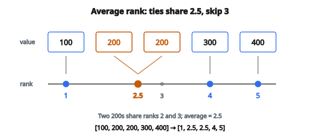

# Rank Transform

## Rank transform là gì

**Rank transform** (còn gọi là ranking hoặc ordinal transform) thay mỗi giá trị bằng vị trí của nó khi mọi giá trị đã được sắp. Giá trị nhỏ nhất nhận rank 1, nhỏ thứ hai nhận rank 2, và tiếp tục.

Biến đổi này chuyển dữ liệu số thành dữ liệu thứ tự, chỉ giữ thứ tự tương đối và bỏ thông tin về độ lớn thực.

## Vì sao dùng rank transform

**1. Chịu outlier cực đoan:**

Outlier chỉ còn là một rank, hết ảnh hưởng quá lớn.

**2. Xử lý mọi phân phối:**

Hoạt động bất kể hình dạng phân phối gốc.

**3. Làm dữ liệu so sánh được:**

Các feature khác scale trở nên so sánh được khi đã rank.

**4. Phân tích phi tham số:**

Cho phép phương pháp thống kê không giả định phân phối chuẩn.

**5. Giảm độ lệch:**

Biến mọi phân phối thành xấp xỉ đều.

## Quy trình ranking cơ bản

**Bước 1:** Sắp mọi giá trị tăng dần

**Bước 2:** Gán rank bắt đầu từ 1

**Bước 3:** Thay mỗi giá trị gốc bằng rank của nó

**Dữ liệu gốc:** $[50, 30, 90, 10, 70]$

**Đã sắp:** $[10, 30, 50, 70, 90]$

**Rank:** $[1, 2, 3, 4, 5]$

**Ánh xạ ngược:**

* $50$ (nhỏ thứ 3) nhận rank $3$
* $30$ (nhỏ thứ 2) nhận rank $2$
* $90$ (nhỏ thứ 5) nhận rank $5$
* $10$ (nhỏ nhất) nhận rank $1$
* $70$ (nhỏ thứ 4) nhận rank $4$

**Kết quả:** $[3, 2, 5, 1, 4]$

## Xử lý ties

Khi giá trị bằng nhau, rank được gán thế nào?

**Dữ liệu gốc có ties:** $[30, 20, 30, 10, 30]$

**Các cách xử lý ties:**

**1. Average rank:**

Giá trị trùng nhận trung bình các rank của chúng.

* $10$ nhận rank $1$
* $20$ nhận rank $2$
* Ba số $30$ sẽ nhận rank $3$, $4$, $5$. Trung bình $= 4$
* Mọi $30$ nhận rank $4$

Kết quả: $[4, 2, 4, 1, 4]$

**2. Minimum rank:**

Giá trị trùng nhận rank thấp nhất.

* Ba số $30$ đều nhận rank $3$

Kết quả: $[3, 2, 3, 1, 3]$

**3. Maximum rank:**

Giá trị trùng nhận rank cao nhất.

* Ba số $30$ đều nhận rank $5$

Kết quả: $[5, 2, 5, 1, 5]$

**4. Dense rank:**

Không có khoảng trống rank; ties cùng rank, giá trị tiếp theo nhận số nguyên kế.

* $10$ nhận rank $1$
* $20$ nhận rank $2$
* Mọi $30$ nhận rank $3$

Kết quả: $[3, 2, 3, 1, 3]$

**5. Ordinal (lần xuất hiện đầu):**

Ties được phá bằng vị trí trong dữ liệu gốc.

* $30$ thứ nhất nhận rank $3$, $30$ thứ hai nhận rank $4$, $30$ thứ ba nhận rank $5$

Kết quả: $[3, 2, 4, 1, 5]$

## Ví dụ average rank chi tiết

**Dữ liệu:** $[100, 200, 200, 300, 400]$

**Nếu không có ties, rank sẽ là:** $1$, $2$, $3$, $4$, $5$

**Có ties (phương pháp average):**

* $100$: rank $1$
* $200$ thứ nhất sẽ là rank $2$, $200$ thứ hai sẽ là rank $3$
* Trung bình của $2$ và $3$ là $2.5$
* Cả hai $200$ nhận rank $2.5$
* $300$: rank $4$
* $400$: rank $5$

**Kết quả:** $[1, 2.5, 2.5, 4, 5]$

::: {#fig-198-average-ranks fig-cap="Average rank: $[100, 200, 200, 300, 400] \to [1, 2.5, 2.5, 4, 5]$. Hai giá trị $200$ chia rank $2.5$; rank nguyên $3$ bị bỏ." fig-alt="Gia tri [100, 200, 200, 300, 400] anh xa sang average rank [1, 2.5, 2.5, 4, 5]; hai diem 200 chung rank 2.5."}
{fig-align="center"}
:::

## Percentile rank

Thay vì rank tuyệt đối, dùng percentile rank:

$$
\text{percentile rank} = \frac{\text{rank} - 1}{n - 1} \times 100
$$

Hoặc chuẩn hóa về $[0, 1]$:

$$
\text{normalized rank} = \frac{\text{rank} - 1}{n - 1}
$$

**Ví dụ:** Dữ liệu 5 giá trị, rank $[1, 2, 3, 4, 5]$

* Rank $1$: $(1-1)/(5-1) = 0$
* Rank $2$: $(2-1)/(5-1) = 0.25$
* Rank $3$: $(3-1)/(5-1) = 0.5$
* Rank $4$: $(4-1)/(5-1) = 0.75$
* Rank $5$: $(5-1)/(5-1) = 1.0$

**Kết quả:** $[0, 0.25, 0.5, 0.75, 1.0]$

## Quantile transform (liên quan)

Quantile transform ánh xạ dữ liệu sang một phân phối cho trước:

**Sang phân phối đều:**

$$
x_{\text{transformed}} = F(x)
$$

với $F$ là hàm phân phối tích lũy (ước lượng từ dữ liệu).

**Sang phân phối chuẩn:**

$$
x_{\text{transformed}} = \Phi^{-1}(F(x))
$$

với $\Phi^{-1}$ là CDF chuẩn nghịch đảo.

Rank transform về bản chất là quantile transform sang phân phối đều.

## Ảnh hưởng lên outlier

**Dữ liệu gốc:** $[10, 20, 30, 40, 10000]$

**Với scaling thường (min-max):**

Giá trị sẽ xấp xỉ $[0, 0.001, 0.002, 0.003, 1.0]$

Outlier chiếm trội.

**Với rank transform:**

Rank: $[1, 2, 3, 4, 5]$

Outlier chỉ là rank $5$, hơn $40$ đúng một bước.

**Chịu outlier cực đoan:** Rank transform coi khoảng cách giữa $40$ và $10000$ giống khoảng cách giữa $10$ và $20$.

## Ảnh hưởng lên phân phối

**Trước rank transform:**

Bất kỳ phân phối nào (chuẩn, lệch, hai đỉnh, v.v.)

**Sau rank transform:**

Phân phối xấp xỉ đều.

**Percentile rank:** Đều hoàn toàn trên $[0, 1]$

**Quantile transform sang chuẩn:** Phân phối chuẩn

## Rank transform để scale feature

Dùng rank thay vì giá trị gốc:

**Lợi ích:**

* Mọi feature trở nên so sánh được
* Không feature nào chiếm trội vì scale
* Bền với outlier ở mọi feature

**Khi nào dùng:**

* Feature có phân phối rất khác nhau
* Feature có đuôi nặng hoặc outlier
* Cần so sánh không phụ thuộc phân phối

## Rank trong thống kê phi tham số

Rank transform là nền của nhiều kiểm định thống kê:

**Tương quan Spearman:**

Tương quan Pearson tính trên rank.

$$
\rho_s = \text{correlation of ranks}(X, Y)
$$

**Mann–Whitney U test:**

Kiểm tra hai nhóm có khác nhau không, dựa trên rank.

**Kruskal–Wallis test:**

ANOVA phi tham số dùng rank.

## Rank transform trong machine learning

**Với mô hình cây:**

Cây chỉ quan tâm thứ tự, nên rank transform không đổi các lần tách. Tuy nhiên nó có thể giúp:

* Ổn định số
* Huấn luyện nhanh hơn (giá trị nhỏ hơn)

**Với mô hình tuyến tính:**

Rank transform có thể giúp khi:

* Quan hệ đơn điệu nhưng không tuyến tính
* Outlier nếu không sẽ chiếm trội

**Với neural network:**

Rank transform cho phân phối đầu vào đều, có thể giúp huấn luyện.

## Thông tin được giữ

**Được giữ:**

* Thứ tự tương đối của giá trị
* Quan hệ đơn điệu

**Bị mất:**

* Độ lớn thực
* Thông tin khoảng cách ($100$ vs $200$ trở thành giống $200$ vs $10000$)
* Pattern không đơn điệu

**Trade-off:** Được độ bền, mất thông tin.

## Áp dụng lên dữ liệu mới

**Thách thức:** Dữ liệu mới có thể có giá trị ngoài dải huấn luyện.

**Lựa chọn:**

**1. Dùng quantile huấn luyện:**

Ánh xạ giá trị mới tới quantile gần nhất từ dữ liệu huấn luyện.

**2. Ngoại suy:**

Giá trị dưới min huấn luyện nhận rank $0$, trên max nhận rank $n+1$.

**3. Refit:**

Nếu phân phối dịch mạnh, cân nhắc fit lại.

## Rank transform so với standardization

**Standardization (z-score):**

$$
x_{\mathrm{std}} = \frac{x - \mu}{\sigma}
$$

* Giả định phân phối gần chuẩn
* Nhạy với outlier (ảnh hưởng mean và std)
* Giữ khoảng cách tương đối

**Rank transform:**

$$
x_{\mathrm{rank}} = \mathrm{rank}(x)
$$

* Làm việc với mọi phân phối
* Bền với outlier
* Chỉ giữ thứ tự

## Rank transform so với min-max scaling

**Min-max:**

$$
x_{\mathrm{scaled}} = \frac{x - x_{\min}}{x_{\max} - x_{\min}}
$$

* Một outlier có thể nén mọi giá trị còn lại
* Giữ khoảng cách tương đối

**Rank transform:**

* Outlier nhận rank cực đoan nhưng không nén các giá trị khác
* Chỉ giữ thứ tự, không giữ khoảng cách

## Ví dụ số: quy trình đầy đủ

**Dữ liệu gốc:** $[15, 8, 42, 23, 8, 100, 31]$

**Bước 1: Sắp và xác định rank**

Đã sắp: $[8, 8, 15, 23, 31, 42, 100]$

Với average rank cho ties:

* $8$ xuất hiện hai lần, sẽ là rank $1$ và $2$, trung bình $= 1.5$
* $15$: rank $3$
* $23$: rank $4$
* $31$: rank $5$
* $42$: rank $6$
* $100$: rank $7$

**Bước 2: Ánh xạ về vị trí gốc**

* $15$: rank $3$
* $8$: rank $1.5$
* $42$: rank $6$
* $23$: rank $4$
* $8$: rank $1.5$
* $100$: rank $7$
* $31$: rank $5$

**Kết quả:** $[3, 1.5, 6, 4, 1.5, 7, 5]$

## Tính thuận nghịch

Rank transform **không thuận nghịch**.

**Thông tin mất:**

* Không khôi phục được giá trị gốc từ rank
* Nhiều tập dữ liệu gốc có thể cho cùng rank

**Ví dụ:**

$[1, 2, 3]$ và $[10, 20, 30]$ và $[1, 1000, 1000000]$

Tất cả cho rank $[1, 2, 3]$

## Ranking theo feature

Với nhiều feature, rank từng cột độc lập:

**Feature A:** $[100, 200, 300]$ trở thành $[1, 2, 3]$

**Feature B:** $[5, 3, 8]$ trở thành $[2, 1, 3]$

Mỗi feature được rank trong cột của chính nó.

## Ranking theo sample

Hoặc rank giá trị trong từng mẫu (hàng):

**Sample 1:** Feature $[100, 5, 50]$ trở thành $[3, 1, 2]$

**Tình huống dùng:** Khi quan tâm tầm quan trọng tương đối của các feature trong từng mẫu.

## Rank transform và quan hệ đơn điệu

Nếu quan hệ thật là đơn điệu, rank transform giữ nó:

**Hàm đơn điệu tăng $f$:**

$$
x_1 < x_2 \implies f(x_1) < f(x_2)
$$

**Sau rank transform:**

$$
\mathrm{rank}(x_1) < \mathrm{rank}(x_2)
$$

Quan hệ đơn điệu được giữ.

**Quan hệ không đơn điệu bị méo** vì rank chỉ bắt thứ tự.

## Cân nhắc thực tế

**1. Xử lý ties nhất quán:**

Chọn một phương pháp (average, min, max) và giữ nguyên.

**2. Bộ nhớ với dữ liệu lớn:**

Sắp xếp cần thời gian $O(n \log n)$ và có thể tốn bộ nhớ.

**3. Dữ liệu streaming:**

Ranking cần thấy toàn bộ dữ liệu, nên khó với ứng dụng streaming.

**4. Tái lập được:**

Ghi lại phương pháp phá ties đã dùng.

## Các lỗi thường gặp

**1. Bỏ qua ties:**

Không chỉ rõ cách xử lý giá trị bằng nhau.

**2. Rank trên cả dataset thay vì từng feature:**

Thường muốn rank trong từng cột feature.

**3. Kỳ vọng thuận nghịch:**

Không khôi phục được giá trị gốc từ rank.

**4. Dùng cho pattern không đơn điệu:**

Rank transform phá quan hệ không đơn điệu.

## Thực hành tốt

**1. Trực quan hóa trước và sau:**

Xác nhận biến đổi đạt hiệu ứng mong muốn.

**2. Chọn phương pháp ties phù hợp:**

Average phổ biến nhất với dữ liệu liên tục.

**3. Ghi chép biến đổi:**

Ghi phương pháp đã dùng để tái lập.

**4. Cân nhắc quantile transform:**

Để ánh xạ sang phân phối cụ thể, quantile transform có thể phù hợp hơn.

**5. Kiểm chứng trên dữ liệu holdout:**

Đảm bảo rank transform cải thiện hiệu năng mô hình.

## Code
```python
def rank_transform(values):
    """
    Replace each value with its average rank.
    """
    n = len(values)
    indexed = sorted(range(n), key=lambda i: values[i])
    ranks = [0.0] * n
    i = 0
    while i < n:
        j = i
        while j < n and values[indexed[j]] == values[indexed[i]]:
            j += 1
        avg_rank = sum(range(i + 1, j + 1)) / (j - i)
        for k in range(i, j):
            ranks[indexed[k]] = avg_rank
        i = j
    return ranks

```

<!-- auto-self-check -->

::: {.callout-note}
## Kiểm tra nhanh
<details>
<summary>Ý chính của bài «Rank Transform» là gì?</summary>
**Rank transform** (còn gọi là ranking hoặc ordinal transform) thay mỗi giá trị bằng vị trí của nó khi mọi giá trị đã được sắp.
</details>
<details>
<summary>Công thức / quan hệ cốt lõi trong bài là gì?</summary>
$$\text{percentile rank} = \frac{\text{rank} - 1}{n - 1} \times 100$$
</details>
:::
