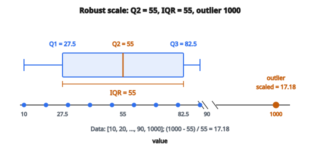

# Robust Scaling

## Robust scaling là gì

**Robust scaling** biến đổi đặc trưng bằng các thống kê bền với outlier: median và interquartile range (IQR). Khác standard scaling (dùng mean và độ lệch chuẩn), robust scaling không bị kéo mạnh bởi giá trị cực trị, nên phù hợp tập dữ liệu có outlier.

## Vì sao dùng robust scaling

* **Chống outlier:** Mean và độ lệch chuẩn bị outlier ảnh hưởng mạnh. Median và IQR thì không.
* **Bảo toàn hình dạng phân phối:** Phần lớn dữ liệu vẫn được scale nhất quán dù có giá trị cực trị.
* **Không cần loại outlier trước:** Có thể áp trực tiếp, không cần tiền xử lý loại điểm cực trị.
* **Tốt hơn với dữ liệu thực:** Nhiều tập thực chứa lỗi đo, lỗi nhập, hoặc giá trị cực trị hợp lệ.

## Công thức robust scaling

Với cột đặc trưng $X$ có median $Q_2$ và interquartile range $IQR = Q_3 - Q_1$:

$$
x_{\text{scaled}} = \frac{x - Q_2}{IQR}
$$

Trong đó:

* $Q_1$ = percentile thứ 25 (quartile thứ nhất)
* $Q_2$ = percentile thứ 50 (median)
* $Q_3$ = percentile thứ 75 (quartile thứ ba)
* $IQR = Q_3 - Q_1$ = interquartile range

## Hiểu quartile

Quartile chia tập đã sắp thành bốn phần bằng nhau:

**Q1 (percentile thứ 25):** 25% giá trị nằm dưới mốc này

**Q2 (percentile thứ 50):** Median; 50% giá trị nằm dưới

**Q3 (percentile thứ 75):** 75% giá trị nằm dưới mốc này

**IQR:** Khoảng chứa 50% dữ liệu ở giữa

## So sánh với standard scaling

**Standard (z-score) scaling:**

$$
x_{\text{scaled}} = \frac{x - \mu}{\sigma}
$$

Dùng mean $\mu$ và độ lệch chuẩn $\sigma$, cả hai đều nhạy với outlier.

**Robust scaling:** Dùng median và IQR, bền với outlier.

**Ảnh hưởng của outlier, ví dụ:**

Dữ liệu: $[1, 2, 3, 4, 5, 100]$

Thống kê standard scaling:

* Mean $= 19.17$ (bị outlier kéo lên)
* Std $= 38.28$ (bị outlier thổi phồng)

Thống kê robust scaling:

* Median $= 3.5$ (không đổi)
* IQR $= 4 - 2 = 2$ (không đổi)

## Ví dụ số

**Dữ liệu:** $[10, 20, 30, 40, 50, 60, 70, 80, 90, 1000]$

Lưu ý: 1000 là outlier rõ.

**Bước 1 — Tính quartile:**

* Q1 (percentile thứ 25): $27.5$
* Q2 (median): $55$
* Q3 (percentile thứ 75): $82.5$

**Bước 2 — Tính IQR:**

$$
IQR = Q_3 - Q_1 = 82.5 - 27.5 = 55
$$

**Bước 3 — Áp robust scaling:**

Với giá trị 10:

$$
x_{\text{scaled}} = \frac{10 - 55}{55} = \frac{-45}{55} = -0.82
$$

Với giá trị 50:

$$
x_{\text{scaled}} = \frac{50 - 55}{55} = \frac{-5}{55} = -0.09
$$

Với giá trị 1000 (outlier):

$$
x_{\text{scaled}} = \frac{1000 - 55}{55} = \frac{945}{55} = 17.18
$$

**Nhận xét:** Outlier (1000) nhận giá trị đã scale $17.18$, đánh dấu rõ là cực trị. Phần lớn dữ liệu nằm trong khoảng hợp lý quanh 0.

::: {#fig-197-robust-iqr fig-cap="Với $[10,\ldots,90,1000]$, median $Q_2=55$ và $IQR=55$; outlier 1000 bị đẩy ra $x_{\text{scaled}}=17.18$ trong khi khối giữa vẫn quanh 0." fig-alt="Box plot Q1=27.5, Q2=55, Q3=82.5, IQR=55 trên dữ liệu 10–90; outlier 1000 được scale thành 17.18."}
{fig-align="center"}
:::

## Tính chất dữ liệu sau robust scaling

**Căn giữa tại median:** Giá trị median ánh xạ thành 0

**Scale theo IQR:** Giá trị đúng tại Q3 ánh xạ thành $0.5$; đúng tại Q1 ánh xạ thành $-0.5$

**Không bị chặn:** Khác min-max scaling, giá trị không bị gò vào một khoảng cố định

**Outlier vẫn là outlier:** Giá trị cực trị vẫn nhận diện được vì nằm xa 0

## Xử lý IQR bằng không

Khi $Q_1 = Q_3$ (toàn bộ 50% giữa giống nhau):

$$
IQR = 0 \Rightarrow \frac{x - Q_2}{0} = \text{undefined}
$$

**Cách xử lý:**

* Trả về 0 cho mọi giá trị (vì chúng gần median)
* Dùng epsilon nhỏ: $IQR + \epsilon$
* Chuyển sang standard scaling cho đặc trưng đó

## Tính percentile

Hai phương pháp nội suy chính cho percentile:

**Nội suy tuyến tính:** Nội suy giữa hai giá trị kề khi percentile rơi giữa các điểm dữ liệu

**Nearest rank:** Làm tròn về điểm dữ liệu gần nhất

Các phương pháp khác nhau có thể cho kết quả hơi khác, nhất là với tập nhỏ.

## Tùy chọn centering

Công thức có thể sửa:

**Có centering** (mặc định):

$$
x_{\text{scaled}} = \frac{x - Q_2}{IQR}
$$

**Không centering:**

$$
x_{\text{scaled}} = \frac{x}{IQR}
$$

Bản có centering phổ biến hơn vì đặt median tại 0.

## Khi nào dùng robust scaling

**Phù hợp khi:**

* Dữ liệu có outlier đã biết hoặc nghi ngờ
* Phân phối đuôi nặng
* Đo thực tế dễ lỗi
* Việc loại outlier không mong muốn hoặc không khả thi

**Ít phù hợp khi:**

* Dữ liệu sạch, không outlier (standard scaling đơn giản hơn)
* Cần đúng khoảng $[0, 1]$ (dùng min-max)
* Tập rất nhỏ, ước lượng percentile không tin cậy

## Áp dụng theo cột

Giống các phương pháp scale khác, robust scaling được áp độc lập từng đặc trưng:

**Các bước với dữ liệu 2D:**

1. Với mỗi cột, tính Q1, Q2 (median), Q3
2. Tính IQR từng cột
3. Áp công thức cho từng phần tử bằng thống kê của cột đó

**Kết quả:** Mỗi đặc trưng được căn giữa tại median và scale theo IQR của nó

## Cân nhắc train-test split

**Quan trọng:** Tính Q1, Q2, Q3 chỉ từ dữ liệu huấn luyện

**Áp lên dữ liệu test** bằng thống kê tập huấn luyện:

$$
x_{\text{test,scaled}} = \frac{x_{\text{test}} - Q_{2,\text{train}}}{IQR_{\text{train}}}
$$

**Lý do:** Tránh data leakage từ tập test

## Robust scaling so với winsorization

**Robust scaling:** Biến đổi mọi giá trị; outlier vẫn còn nhưng rõ là cực trị

**Winsorization:** Cắt trần outlier tại percentile chỉ định, rồi mới scale

**Kết hợp:** Winsorize trước để cắt giá trị cực trị, rồi áp robust scaling

## Robust scaling xuất hiện ở đâu

* **Dữ liệu tài chính:** Giá cổ phiếu và lợi suất thường có biến động cực trị
* **Dữ liệu cảm biến:** Lỗi đo và hỏng thiết bị tạo outlier
* **Dữ liệu y tế:** Đo bệnh nhân có thể có lỗi ghi
* **Web analytics:** Đột biến lưu lượng và bot tạo outlier
* **Dữ liệu khảo sát:** Phản hồi cực trị có thể là lỗi hoặc outlier thật
* **Xử lý ảnh:** Outlier cường độ pixel do nhiễu
* **Đo khoa học:** Dữ liệu thí nghiệm với dị thường thưa
* **Tiền xử lý ML:** Khi chất lượng dữ liệu chưa chắc

## Code
```python
def robust_scaling(values):
    """
    Scale values using median and interquartile range.
    """
    n = len(values)
    s = sorted(values)
    if n % 2 == 1:
        median = s[n // 2]
    else:
        median = (s[n // 2 - 1] + s[n // 2]) / 2.0
    lower = s[:n // 2]
    upper = s[(n + 1) // 2:]
    def med(arr):
        m = len(arr)
        if m == 0:
            return 0.0
        if m % 2 == 1:
            return arr[m // 2]
        return (arr[m // 2 - 1] + arr[m // 2]) / 2.0
    q1 = med(lower)
    q3 = med(upper)
    iqr = q3 - q1
    if iqr == 0:
        return [(v - median) for v in values]
    return [(v - median) / iqr for v in values]

```
