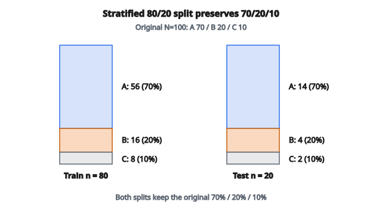

# Stratified Train/Test Split

## Stratified splitting là gì

**Stratified splitting** chia tập dữ liệu thành các tập con trong khi giữ nguyên tỷ lệ mỗi lớp. Nếu tập gốc có 70% lớp A và 30% lớp B, cả tập huấn luyện và tập test đều giữ xấp xỉ các tỷ lệ này. Điều này then chốt với các bài toán phân loại mất cân bằng.

## Vì sao cần stratify

**Giữ phân phối lớp**: Random splitting có thể vô tình đẩy hầu hết mẫu lớp thiểu số vào một phía, khiến phía còn lại không đại diện.

**Đánh giá đáng tin cậy**: Hiệu năng trên tập test phản ánh phân phối thực tế khi tỷ lệ lớp được giữ.

**Tín hiệu huấn luyện nhất quán**: Tập huấn luyện chứa đủ ví dụ của mọi lớp.

**Thiết yếu với dữ liệu mất cân bằng**: Khi một lớp hiếm (ví dụ 1% trường hợp gian lận), random splitting có thể cho tập test không có trường hợp gian lận nào.

## Vấn đề của random splitting

**Tình huống ví dụ**:

* 1000 mẫu: 950 lớp A, 50 lớp B (5% thiểu số)
* Random split 80/20

**Kết quả ngẫu nhiên có thể xảy ra**:

* Huấn luyện: 760 lớp A, 40 lớp B (5.0%)
* Test: 190 lớp A, 10 lớp B (5.0%)

Đây là trường hợp may. Nhưng random split cũng có thể cho:

* Huấn luyện: 770 lớp A, 30 lớp B (3.7%)
* Test: 180 lớp A, 20 lớp B (10.0%)

Tập test có tỷ lệ lớp thiểu số gấp đôi — đánh giá sẽ lệch.

## Quy trình stratified splitting

**Bước 1**: Nhóm mẫu theo nhãn lớp

**Bước 2**: Với mỗi lớp, chia ngẫu nhiên thành train/test theo tỷ lệ đã chọn

**Bước 3**: Gộp mọi mẫu train theo lớp thành tập huấn luyện cuối

**Bước 4**: Gộp mọi mẫu test theo lớp thành tập test cuối

**Kết quả**: Cả hai tập có cùng tỷ lệ lớp như dữ liệu gốc.

## Công thức chính

Với tập dữ liệu $N$ mẫu và phân phối lớp:

* Lớp 0: $n_0$ mẫu (tỷ lệ $p_0 = n_0/N$)
* Lớp 1: $n_1$ mẫu (tỷ lệ $p_1 = n_1/N$)
* ...

Với fraction huấn luyện $f$ (ví dụ 0.8 cho 80% train):

**Tập huấn luyện**:

* Lớp 0: $\lfloor f \cdot n_0 \rfloor$ mẫu
* Lớp 1: $\lfloor f \cdot n_1 \rfloor$ mẫu
* ...

**Tập test**:

* Lớp 0: $n_0 - \lfloor f \cdot n_0 \rfloor$ mẫu
* Lớp 1: $n_1 - \lfloor f \cdot n_1 \rfloor$ mẫu
* ...

## Ví dụ số

**Tập dữ liệu**: 100 mẫu

* Lớp A: 70 mẫu (70%)
* Lớp B: 20 mẫu (20%)
* Lớp C: 10 mẫu (10%)

**Tỷ lệ split**: 80% train, 20% test

**Tính stratified split**:

Lớp A:

* Train: $\lfloor 0.8 \times 70 \rfloor = 56$ mẫu
* Test: $70 - 56 = 14$ mẫu

Lớp B:

* Train: $\lfloor 0.8 \times 20 \rfloor = 16$ mẫu
* Test: $20 - 16 = 4$ mẫu

Lớp C:

* Train: $\lfloor 0.8 \times 10 \rfloor = 8$ mẫu
* Test: $10 - 8 = 2$ mẫu

**Tập huấn luyện**: $56 + 16 + 8 = 80$ mẫu

* Lớp A: $56/80 = 70\%$
* Lớp B: $16/80 = 20\%$
* Lớp C: $8/80 = 10\%$

**Tập test**: $14 + 4 + 2 = 20$ mẫu

* Lớp A: $14/20 = 70\%$
* Lớp B: $4/20 = 20\%$
* Lớp C: $2/20 = 10\%$

**Cả hai tập giữ nguyên phân phối gốc 70/20/10.**

::: {#fig-68-stratified-split fig-cap="Split 80/20 trên 100 mẫu (A 70, B 20, C 10) cho train 56+16+8 và test 14+4+2; cả hai phía đều 70%/20%/10%." fig-alt="Hai cột stacked bar cùng chiều cao: Train n=80 gồm A 56, B 16, C 8 và Test n=20 gồm A 14, B 4, C 2; mỗi cột đều 70/20/10."}
{fig-align="center"}
:::

## Xử lý lớp nhỏ

Khi một lớp có rất ít mẫu, stratified splitting gặp khó:

**Ví dụ**: Lớp với 3 mẫu, split 80/20

* Train: $\lfloor 0.8 \times 3 \rfloor = 2$ mẫu
* Test: 1 mẫu

Cách này chạy được, nhưng với chỉ 2 mẫu, một phía có thể nhận 2 hoặc 0.

**Cách xử lý**:

* Đảm bảo số mẫu tối thiểu mỗi lớp trước khi chia
* Dùng leave-one-out cho lớp cực nhỏ
* Cân nhắc gộp các lớp hiếm

## Stratified K-Fold Cross-Validation

Mở rộng stratification sang K-Fold:

**Quy trình**:

1. Nhóm mẫu theo lớp
2. Trong mỗi lớp, chia thành $K$ fold
3. Mỗi fold chứa đại diện tỷ lệ của mọi lớp
4. Lặp: dùng lần lượt mỗi fold làm validation, các fold còn lại làm huấn luyện

**Lợi ích**: Mọi fold có phân phối lớp đại diện, nên ước lượng cross-validation đáng tin cậy hơn.

## Stratification đa nhãn

Khi mỗi mẫu có thể mang nhiều nhãn (phân loại multi-label):

**Thách thức**: Stratification đơn giản theo từng nhãn không đủ

**Thuật toán iterative stratification**:

1. Sắp nhãn theo tần suất (hiếm nhất trước)
2. Với mỗi mẫu mang nhãn hiếm nhất, gán vào fold có tỷ lệ nhãn đó nhỏ nhất
3. Lặp với nhãn hiếm kế tiếp

**Mục tiêu**: Xấp xỉ giữ phân phối của mọi tổ hợp nhãn

## Cân nhắc khi cài đặt

**Shuffle trong từng lớp**: Xáo ngẫu nhiên mẫu trong mỗi lớp trước khi chia để tránh bias thứ tự

**Reproducibility**: Đặt random seed để split nhất quán giữa các lần chạy

**Làm tròn**: Hàm floor đảm bảo tập huấn luyện nhận số nguyên; phần còn lại sang test

**Lớp cực hiếm**: Có thể cần xử lý riêng hoặc yêu cầu số mẫu tối thiểu

## Stratification so với random split

**Dùng stratified split khi**:

* Phân phối lớp mất cân bằng
* Metric đánh giá phụ thuộc tỷ lệ lớp
* Huấn luyện cần ví dụ của mọi lớp
* Tập dữ liệu nhỏ (biến thiên ngẫu nhiên cao hơn)

**Random split chấp nhận được khi**:

* Các lớp xấp xỉ cân bằng
* Tập rất lớn (biến thiên ngẫu nhiên nhỏ)
* Tác vụ là hồi quy (không có lớp để stratify)

## Stratification cho hồi quy

Với hồi quy, stratify theo giá trị target đã bin:

**Quy trình**:

1. Bin target liên tục thành các khoảng rời rạc
2. Coi các bin như pseudo-class
3. Áp stratified splitting trên các bin
4. Đảm bảo cả hai phía có phân phối target tương tự

**Ví dụ**: Dự đoán thu nhập

* Bin thu nhập thành [0-30k], [30k-60k], [60k-100k], [100k+]
* Stratify theo các bin này

## Stratified splitting xuất hiện ở đâu

* **Chẩn đoán y khoa**: Bệnh hiếm cần stratification để tập test vẫn chứa ca dương tính
* **Phát hiện gian lận**: Ca gian lận hiếm; stratification đảm bảo cả hai phía đều thấy ví dụ gian lận
* **Phân tích cảm xúc**: Khi positive/negative/neutral mất cân bằng
* **Object detection**: Một số lớp đối tượng xuất hiện thường xuyên hơn lớp khác
* **Customer churn**: Khách rời đi thường chỉ là một phần nhỏ
* **Chấm điểm tín dụng**: Vỡ nợ là sự kiện hiếm, cần chia cẩn thận
* **Phân tích A/B testing**: Stratify theo phân khúc người dùng để kết quả đại diện
* **Model selection**: Cross-validation cần stratification để tinh chỉnh hyperparameter đáng tin cậy

## Code
```python
import numpy as np

def stratified_split(X, y, test_size, rng=None):
    """
    Split features X and labels y into train/test while preserving class proportions.
    """
    X = np.asarray(X)
    y = np.asarray(y)
    classes = sorted(set(y.tolist()))
    train_indices, test_indices = [], []
    for c in classes:
        c_idx = np.where(y == c)[0].copy()
        if rng is not None:
            c_idx = rng.permutation(c_idx)
        n_test = int(round(len(c_idx) * test_size))
        if n_test >= len(c_idx) and len(c_idx) > 1:
            n_test = len(c_idx) - 1
        test_indices.extend(c_idx[:n_test].tolist())
        train_indices.extend(c_idx[n_test:].tolist())
    train_idx = np.array(sorted(train_indices), dtype=int)
    test_idx = np.array(sorted(test_indices), dtype=int)
    return X[train_idx], X[test_idx], y[train_idx], y[test_idx]

```

<!-- auto-self-check -->

::: {.callout-note}
## Kiểm tra nhanh
<details>
<summary>Ý chính của bài «Stratified Train/Test Split» là gì?</summary>
**Stratified splitting** chia tập dữ liệu thành các tập con trong khi giữ nguyên tỷ lệ mỗi lớp.
</details>
<details>
<summary>Khi nào nên nhớ / áp dụng «Stratified Train/Test Split»?</summary>
Stratified splitting chia tập dữ liệu thành các tập con trong khi giữ nguyên tỷ lệ mỗi lớp.
</details>
:::
