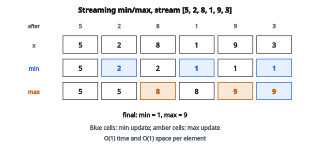

# Streaming Min-Max Normalization

## Streaming min-max là gì

**Streaming min-max** tính minimum và maximum của một data stream mà không lưu mọi phần tử. Mỗi khi một giá trị mới tới, min và max đang chạy được cập nhật với độ phức tạp thời gian $O(1)$ và không gian $O(1)$. Điều này thiết yếu khi xử lý dữ liệu quá lớn để nằm gọn trong bộ nhớ, hoặc dữ liệu tới liên tục.

## Vì sao cần thuật toán streaming

* **Ràng buộc bộ nhớ:** Không thể lưu mọi điểm khi xử lý hàng terabyte dữ liệu
* **Xử lý thời gian thực:** Dữ liệu tới liên tục; cần thống kê tức thì
* **Stream vô hạn:** Log, cảm biến và hoạt động người dùng không có điểm kết xác định
* **Hệ phân tán:** Gộp thống kê giữa các shard mà không tập trung toàn bộ dữ liệu

## Thuật toán streaming min-max

**Trạng thái:** Giữ hai biến

* current_min: giá trị nhỏ nhất đã thấy
* current_max: giá trị lớn nhất đã thấy

**Quy tắc cập nhật** cho mỗi giá trị mới $x$:

$$
\text{current\_min} = \min(\text{current\_min}, x)
$$

$$
\text{current\_max} = \max(\text{current\_max}, x)
$$

**Khởi tạo:**

* Phần tử đầu: min = max = giá trị đầu
* Cách khác: min $= +\infty$, max $= -\infty$

## Ví dụ số

**Stream:** $[5, 2, 8, 1, 9, 3]$

**Xử lý:**

Sau phần tử 5:

* min $= 5$, max $= 5$

Sau phần tử 2:

* min $= \min(5, 2) = 2$, max $= \max(5, 2) = 5$

Sau phần tử 8:

* min $= \min(2, 8) = 2$, max $= \max(5, 8) = 8$

Sau phần tử 1:

* min $= \min(2, 1) = 1$, max $= \max(8, 1) = 8$

Sau phần tử 9:

* min $= \min(1, 9) = 1$, max $= \max(8, 9) = 9$

Sau phần tử 3:

* min $= \min(1, 3) = 1$, max $= \max(9, 3) = 9$

**Kết quả cuối:** min $= 1$, max $= 9$

**Lưu ý:** Mỗi bước chỉ cần phần tử hiện tại và min/max trước đó.

::: {#fig-72-streaming-minmax fig-cap="Trên stream $[5, 2, 8, 1, 9, 3]$, running min/max cập nhật $O(1)$ mỗi bước và kết thúc tại min $=1$, max $=9$." fig-alt="Bảng cập nhật streaming trên [5, 2, 8, 1, 9, 3]: running min lần lượt 5,2,2,1,1,1 và running max 5,5,8,8,9,9; kết thúc min=1, max=9."}
{fig-align="center"}
:::

## Phân tích độ phức tạp

**Độ phức tạp thời gian:** $O(1)$ mỗi phần tử (hai phép so sánh)

**Độ phức tạp không gian:** $O(1)$ tổng (hai giá trị, không phụ thuộc độ dài stream)

**Tổng thời gian cho $N$ phần tử:** $O(N)$

**So với cách batch:**

* Batch: thời gian $O(N)$, không gian $O(N)$ để lưu mọi phần tử
* Streaming: thời gian $O(N)$, không gian $O(1)$

## Stream đa chiều

Với stream các vector $D$ chiều:

**Trạng thái:** Giữ $D$ giá trị min và $D$ giá trị max

**Cập nhật:** Áp cập nhật vô hướng độc lập từng chiều

$$
\min_d = \min(\min_d, x_d) \quad \text{với } d = 1, \ldots, D
$$

$$
\max_d = \max(\max_d, x_d) \quad \text{với } d = 1, \ldots, D
$$

**Không gian:** $O(D)$ — hằng số theo độ dài stream

## Chiến lược khởi tạo

**Dùng phần tử đầu:**

* Chờ phần tử đầu
* Đặt min = max = phần tử đầu
* Đơn giản nhưng cần xử lý riêng stream rỗng

**Dùng vô cực:**

* Khởi tạo min $= +\infty$, max $= -\infty$
* Phần tử đầu tự trở thành cả min lẫn max
* Vẫn chạy được với stream rỗng (trả về giá trị vô cực)

**Biểu diễn số:**

* Dùng giá trị vô cực của ngôn ngữ
* Hoặc dùng số lớn nhất / nhỏ nhất biểu diễn được

## Xử lý stream rỗng

**Cách 1:** Trả về None hoặc ném ngoại lệ

**Cách 2:** Trả về $(-\infty, +\infty)$ để báo không có range hợp lệ

**Cách 3:** Yêu cầu ít nhất một phần tử trước khi truy vấn

**Thực hành tốt:** Ghi rõ hành vi và xử lý nhất quán

## Streaming min-max cho normalization

Sau khi xử lý stream, dùng min/max để normalize:

$$
x_{\text{normalized}} = \frac{x - \min}{\max - \min}
$$

**Thách thức:** Normalization cần lượt thứ hai qua dữ liệu

**Cách xử lý:**

1. **Streaming hai lượt:** Lượt một tìm min/max, lượt hai normalize
2. **Cận xấp xỉ:** Dùng min/max ước lượng từ mẫu ban đầu
3. **Normalization tăng dần:** Cập nhật normalization khi bound đổi

## Sliding window min-max

Chỉ xét dữ liệu gần đây ( $W$ phần tử cuối):

**Thách thức:** Phần tử rời cửa sổ; min/max có thể cần tính lại

**Cách ngây thơ:** Lưu $W$ phần tử cuối, tính lại min/max mỗi lần cập nhật — thời gian $O(W)$

**Cách deque:** Giữ deque đơn điệu để cập nhật amortized $O(1)$

**Không gian:** $O(W)$ cho sliding window

## Min-max song song / phân tán

Khi xử lý song song trên nhiều worker:

**Tính cục bộ:** Mỗi worker tính min/max cục bộ trên phân hoạch của mình

**Gộp toàn cục:**

$$
\text{global\_min} = \min(\min_1, \min_2, \ldots, \min_k)
$$

$$
\text{global\_max} = \max(\max_1, \max_2, \ldots, \max_k)
$$

**Tính chất:**

* Kết hợp được: cách nhóm không đổi kết quả
* Giao hoán: thứ tự không đổi kết quả
* Cho phép xử lý kiểu MapReduce

## Min-max trọng số mũ

Với stream mà giá trị gần đây quan trọng hơn:

**Suy giảm mũ:** Giá trị cũ dần bị “quên”

**Không phải min/max đúng:** Xấp xỉ range của giá trị gần đây

**Khi dùng:** Thích nghi với concept drift khi phân phối đổi

## Ổn định số

**Integer overflow:** Tổng hai số nguyên lớn có thể tràn

* Dùng kiểu nguyên lớn hơn
* Hoặc dùng số thực

**Số thực:** So sánh nhìn chung an toàn

* Xử lý NaN: so sánh với NaN trả về false
* Xử lý vô cực: $+\infty$ giữ là max, $-\infty$ giữ là min

## Hệ sinh thái thống kê streaming

Min-max là một trong vài thống kê streaming:

**Tính streaming đúng:**

* Count (tầm thường)
* Min, Max (bài này)
* Sum

**Tính streaming xấp xỉ:**

* Mean (trung bình chạy)
* Phương sai (thuật toán Welford)
* Quantile (xấp xỉ bằng sketch)
* Distinct count (HyperLogLog)

## Streaming min-max xuất hiện ở đâu

* **Data pipeline:** Quy trình ETL tính thống kê trên tập lớn
* **Hệ giám sát:** Theo dõi min/max latency, bộ nhớ hoặc tỷ lệ lỗi
* **Mạng cảm biến:** Xử lý đọc cảm biến liên tục theo thời gian thực
* **Phân tích log:** Tìm giá trị cực trị trong log ứng dụng
* **Hệ tài chính:** Theo dõi khoảng giá, khối lượng giao dịch
* **Feature engineering:** Tính min/max để normalize trong học trực tuyến
* **Kiểm soát chất lượng:** Giám sát khoảng đo trong sản xuất
* **Lưu lượng mạng:** Phân tích kích thước gói, thời gian đáp ứng, băng thông
* **Thiết bị IoT:** Thiết bị hạn chế tài nguyên theo dõi cảm biến môi trường
* **Phân tích thời gian thực:** Metric dashboard cập nhật khi dữ liệu tới

## Code
```python
import numpy as np

def streaming_minmax_init(D):
    """
    Initialize state dict with min, max arrays of shape (D,).
    """
    return {'min': [float('inf')] * D, 'max': [float('-inf')] * D}

def streaming_minmax_update(state, X_batch, eps=1e-8):
    """
    Update state's min/max with X_batch, return normalized batch.
    """
    D = len(state['min'])
    for row in X_batch:
        for j in range(D):
            if row[j] < state['min'][j]:
                state['min'][j] = row[j]
            if row[j] > state['max'][j]:
                state['max'][j] = row[j]
    result = []
    for row in X_batch:
        norm_row = []
        for j in range(D):
            norm_row.append((row[j] - state['min'][j]) / (state['max'][j] - state['min'][j] + eps))
        result.append(norm_row)
    return result

```

<!-- auto-self-check -->

::: {.callout-note}
## Kiểm tra nhanh
<details>
<summary>Ý chính của bài «Streaming Min-Max Normalization» là gì?</summary>
**Streaming min-max** tính minimum và maximum của một data stream mà không lưu mọi phần tử.
</details>
<details>
<summary>Công thức / quan hệ cốt lõi trong bài là gì?</summary>
$$\text{current\_min} = \min(\text{current\_min}, x)$$
</details>
:::
