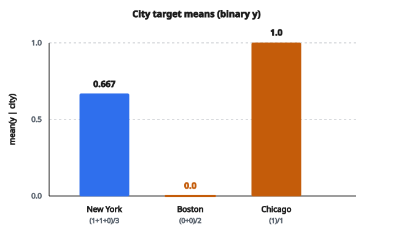

# Target Encoding

## Target encoding là gì

**Target encoding** (còn gọi là mean encoding hoặc likelihood encoding) là kỹ thuật đổi feature categorical thành giá trị số bằng cách thay mỗi category bằng một thống kê tính từ biến target. Phổ biến nhất, mỗi category được thay bằng mean của target trên các mẫu thuộc category đó.

Với category $c$:

$$
\mathrm{encoded}(c) = \mathrm{mean}(y \mid \text{category} = c)
$$

## Vì sao dùng target encoding

**1. Bắt thông tin dự đoán:**

Encoding phản ánh trực tiếp quan hệ giữa category và target.

**2. Giảm dimensionality:**

Đổi một feature categorical thành một cột số (so với $k$ cột nếu dùng one-hot).

**3. Xử lý cardinality cao:**

Làm việc tốt với feature có nhiều category phân biệt.

**4. Có thể cải thiện hiệu năng mô hình:**

Giá trị đã encode vốn mang tính dự đoán theo cách xây dựng.

## Quy trình target encoding cơ bản

**Bước 1:** Với mỗi category, xác định mọi mẫu mang category đó

**Bước 2:** Tính mean target trên các mẫu đó

**Bước 3:** Thay category bằng giá trị mean này

**Bước 4:** Áp dụng regularization để tránh overfitting

## Ví dụ số: phân loại nhị phân

**Dữ liệu:**

Mẫu 1: City = New York, Target = 1

Mẫu 2: City = New York, Target = 1

Mẫu 3: City = New York, Target = 0

Mẫu 4: City = Boston, Target = 0

Mẫu 5: City = Boston, Target = 0

Mẫu 6: City = Chicago, Target = 1

**Mean target theo thành phố:**

* New York: $(1 + 1 + 0) / 3 = 0.667$
* Boston: $(0 + 0) / 2 = 0.0$
* Chicago: $(1) / 1 = 1.0$

**Dữ liệu đã encode:**

* Mẫu 1: $0.667$
* Mẫu 2: $0.667$
* Mẫu 3: $0.667$
* Mẫu 4: $0.0$
* Mẫu 5: $0.0$
* Mẫu 6: $1.0$

::: {#fig-170-target-means fig-cap="Mean target theo city: New York = 0.667, Boston = 0.0, Chicago = 1.0. Mỗi mẫu được thay bằng mean của category của nó." fig-alt="Ba cột mean target: New York 0.667, Boston 0.0, Chicago 1.0, tính từ sáu mẫu phân loại nhị phân."}
{fig-align="center"}
:::

## Ví dụ số: hồi quy

**Dữ liệu:**

Mẫu 1: Brand = A, Price = 100

Mẫu 2: Brand = A, Price = 120

Mẫu 3: Brand = A, Price = 110

Mẫu 4: Brand = B, Price = 200

Mẫu 5: Brand = B, Price = 220

**Mean target theo brand:**

* Brand A: $(100 + 120 + 110) / 3 = 110$
* Brand B: $(200 + 220) / 2 = 210$

**Dữ liệu đã encode:**

* Mẫu 1: $110$
* Mẫu 2: $110$
* Mẫu 3: $110$
* Mẫu 4: $210$
* Mẫu 5: $210$

## Vấn đề overfitting

Target encoding có rủi ro nghiêm trọng: **data leakage**.

**Vấn đề:**

Khi tính giá trị encode cho một mẫu, bạn đang dùng chính target của mẫu đó trong phép tính.

**Ví dụ:** Category X xuất hiện đúng một lần với target $= 1$.

Giá trị encode $= 1$ (dựa trên đúng mẫu đó).

Khi huấn luyện, mô hình thấy encoded $= 1$ và target $= 1$, học một tương quan hoàn hảo nhưng vô nghĩa.

**Hệ quả:**

* Overfitting trên dữ liệu huấn luyện
* Khả năng tổng quát kém trên dữ liệu mới
* Điểm cross-validation lạc quan quá mức

## Regularization: smoothing

Trộn mean của category với mean toàn cục bằng hệ số smoothing:

$$
\mathrm{encoded}(c) = \alpha \cdot \mathrm{mean}_c + (1 - \alpha) \cdot \mathrm{mean}_{\mathrm{global}}
$$

với $\alpha$ phụ thuộc số đếm của category:

$$
\alpha = \frac{n_c}{n_c + m}
$$

* $n_c$: số mẫu mang category $c$
* $m$: tham số smoothing (hyperparameter)

**Hiệu ứng:**

* Category có nhiều mẫu: $\alpha \approx 1$, dùng mean của category
* Category có ít mẫu: $\alpha \approx 0$, dùng mean toàn cục

## Ví dụ smoothing

**Mean toàn cục:** $0.5$

**Category A:** $100$ mẫu, mean $= 0.8$

**Category B:** $2$ mẫu, mean $= 1.0$

**Với tham số smoothing $m = 10$:**

Category A:

$$
\alpha = \frac{100}{100 + 10} = 0.909
$$

$$
\mathrm{encoded} = 0.909 \times 0.8 + 0.091 \times 0.5 = 0.773
$$

Category B:

$$
\alpha = \frac{2}{2 + 10} = 0.167
$$

$$
\mathrm{encoded} = 0.167 \times 1.0 + 0.833 \times 0.5 = 0.583
$$

Category B bị kéo mạnh về mean toàn cục vì cỡ mẫu nhỏ.

## Target encoding leave-one-out

Tính mean sau khi loại mẫu hiện tại:

$$
\mathrm{encoded}_i = \frac{\sum_{j \neq i,\, c_j = c_i} y_j}{n_c - 1}
$$

**Lợi ích:**

* Giảm overfitting
* Không leakage từ chính mẫu đang encode

**Cách làm:**

Với mỗi mẫu, giá trị encode là mean target của mọi mẫu khác cùng category.

## Ví dụ leave-one-out

**Category A với 3 mẫu:**

* Mẫu 1: target $= 1$
* Mẫu 2: target $= 1$
* Mẫu 3: target $= 0$

**Encoding chuẩn:** mean $= (1 + 1 + 0) / 3 = 0.667$ cho mọi mẫu

**Encoding leave-one-out:**

* Mẫu 1: mean các mẫu còn lại $= (1 + 0) / 2 = 0.5$
* Mẫu 2: mean các mẫu còn lại $= (1 + 0) / 2 = 0.5$
* Mẫu 3: mean các mẫu còn lại $= (1 + 1) / 2 = 1.0$

Mỗi mẫu nhận một giá trị encode khác nhau.

## Target encoding K-fold

Dùng fold của cross-validation để tính encoding:

**Quy trình:**

1. Chia dữ liệu huấn luyện thành $k$ fold
2. Với mỗi fold, tính mean category từ $k-1$ fold còn lại
3. Áp mean đó để encode fold hiện tại
4. Với dữ liệu test, dùng mean từ toàn bộ dữ liệu huấn luyện

**Lợi ích:**

* Bền hơn leave-one-out
* Không data leakage
* Làm việc tốt trong thực tế

## Ví dụ K-fold

**5 fold:** Fold 1, Fold 2, Fold 3, Fold 4, Fold 5

**Với mẫu thuộc Fold 1:**

Tính mean category chỉ từ Fold 2, 3, 4, 5.

**Với mẫu thuộc Fold 2:**

Tính mean category chỉ từ Fold 1, 3, 4, 5.

Mỗi fold được encode bằng dữ liệu độc lập.

## Target encoding cho phân loại đa lớp

**Phương án 1: dùng xác suất lớp**

Với mỗi category, tính xác suất của từng lớp:

$$
\mathrm{encoded}(c, \mathrm{class}_k) = P(\mathrm{class}_k \mid \text{category} = c)
$$

Tạo $k-1$ feature mới (một mỗi lớp, trừ lớp tham chiếu).

**Phương án 2: one-vs-rest**

Tạo encoding nhị phân riêng cho từng lớp.

## So sánh với các encoding khác

**One-hot encoding:**

* Không dùng thông tin target
* Không rủi ro overfitting từ target
* Tạo nhiều feature khi cardinality cao

**Label encoding:**

* Số nguyên tùy ý
* Không thông tin target
* Một cột nhưng không mang nội dung dự đoán

**Frequency encoding:**

* Dùng tần suất category
* Không thông tin target
* Có thể có hoặc không có tính dự đoán

**Target encoding:**

* Dùng thông tin target
* Rất giàu tính dự đoán
* Có rủi ro overfitting

## Xử lý category mới

Khi một category xuất hiện ở test nhưng không có trong train:

**Phương án 1: dùng mean toàn cục**

$$
\mathrm{encoded}(c_{\mathrm{new}}) = \mathrm{mean}_{\mathrm{global}}
$$

**Phương án 2: dùng prior (nếu đã smoothing)**

Encoding đã làm mượt cho category có count $= 0$:

$$
\mathrm{encoded} = 0 \times \mathrm{mean}_c + 1 \times \mathrm{mean}_{\mathrm{global}} = \mathrm{mean}_{\mathrm{global}}
$$

## Xử lý missing value

**Phương án 1: coi như một category riêng**

Tính mean target trên các mẫu mà category bị thiếu.

**Phương án 2: dùng mean toàn cục**

Thay missing bằng mean toàn cục.

**Phương án 3: impute category trước**

Điền category còn thiếu, rồi mới encode.

## Target encoding Bayesian

Một cách tiếp cận có nguyên lý, dùng cập nhật Bayesian:

**Prior:** mean toàn cục với độ mạnh prior $m$

**Likelihood:** các quan sát riêng của category

**Posterior:**

$$
\mathrm{encoded}(c) = \frac{n_c \cdot \mathrm{mean}_c + m \cdot \mathrm{mean}_{\mathrm{global}}}{n_c + m}
$$

Công thức này tương đương smoothing, nhưng diễn giải theo Bayesian.

## Khi nào dùng target encoding

**Tình huống phù hợp:**

* Feature categorical cardinality cao
* Feature có quan hệ rõ với target
* Khi cần giảm dimensionality
* Mô hình cây, vốn ít overfitting hơn

**Dùng thận trọng:**

* Dataset nhỏ (rủi ro overfitting cao)
* Category có rất ít mẫu
* Khi interpretability quan trọng

## Target encoding trên các mô hình khác nhau

**Mô hình cây (Random Forest, XGBoost):**

* Ít overfitting hơn từ target encoding
* Hưởng lợi rõ khi xử lý cardinality cao
* Thường là use case tốt nhất

**Mô hình tuyến tính:**

* Dễ overfitting hơn
* Cần regularization mạnh (smoothing, K-fold)
* Cân nhắc thay bằng one-hot

**Neural network:**

* Embedding có thể là lựa chọn tốt hơn
* Target encoding vẫn hữu ích khi cardinality rất cao

## Mẹo thực hành

**1. Luôn dùng regularization:**

Không bao giờ dùng target encoding naive mà không smoothing hoặc K-fold.

**2. Chọn tham số smoothing cẩn thận:**

Cross-validate để tìm $m$ tối ưu. Khoảng thường gặp: $1$ đến $100$.

**3. Dùng K-fold cho production:**

Đáng tin hơn leave-one-out trong thực tế.

**4. Validate cẩn thận:**

Dùng split theo thời gian hoặc stratified đúng cách.

**5. Kết hợp encoding khác:**

Target encoding cộng one-hot có thể bắt tín hiệu khác nhau.

## Thống kê thay thế

Thay vì mean, có thể dùng thống kê khác:

**Median:**

$$
\mathrm{encoded}(c) = \mathrm{median}(y \mid c)
$$

Bền hơn với outlier trên target.

**Độ lệch chuẩn:**

$$
\mathrm{encoded}(c) = \mathrm{std}(y \mid c)
$$

Bắt độ biến thiên trong category.

**Percentile:**

Dùng nhiều quantile để encoding giàu hơn.

## Target encoding thứ tự

Với target thứ tự, giữ thứ tự:

**Mean có trọng số theo hạng:**

Gán trọng số target theo vị trí thứ tự.

**Median:**

Phù hợp hơn với target thứ tự.

## Target encoding theo thời gian

Với time series, tính mean chỉ từ dữ liệu quá khứ:

**Expanding mean:**

Tại thời điểm $t$, dùng mean của target từ các thời điểm $< t$.

**Rolling mean:**

Dùng mean trên cửa sổ trượt của các quan sát quá khứ.

**Ngăn leakage:**

Không bao giờ dùng thông tin tương lai.

## Các lỗi thường gặp

**1. Không regularization:**

Dùng mean encoding naive dẫn tới overfitting nặng.

**2. Dùng dữ liệu test:**

Tính encoding từ bất kỳ thông tin nào của test.

**3. Cross-validation sai:**

Không dùng K-fold đúng cho encoding trước khi CV chọn mô hình.

**4. Bỏ qua category hiếm:**

Không xử lý category có rất ít mẫu.

**5. Ước lượng một điểm:**

Không xét độ bất định cho category hiếm.

## Thực hành tốt

**1. Luôn smoothing:**

Dùng smoothing với độ mạnh prior hợp lý.

**2. Dùng encoding K-fold:**

Đặc biệt với dataset nhỏ.

**3. Validate đúng:**

Đảm bảo không leakage trong thiết lập cross-validation.

**4. So sánh phương án khác:**

Thử đối chiếu one-hot, frequency encoding.

**5. Ghi lại tham số:**

Lưu tham số smoothing và thiết lập K-fold để tái lập.

## Code
```python
```
