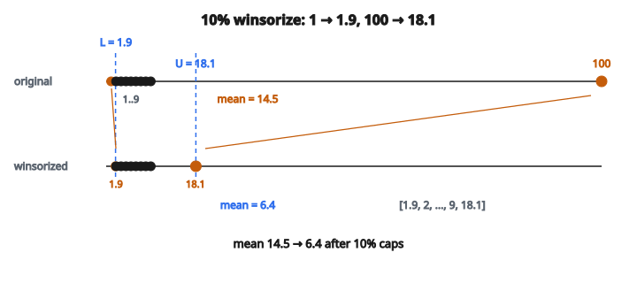

# Winsorization

## Winsorization là gì

**Winsorization** là kỹ thuật giới hạn giá trị cực đoan bằng cách cắt trần/sàn tại các percentile cho trước. Thay vì xóa outlier, winsorization thay chúng bằng giá trị không cực đoan gần nhất. Đặt theo tên nhà biostatistician Charles P. Winsor, cách này giữ nguyên cỡ mẫu đồng thời giảm ảnh hưởng của quan sát cực đoan.

## Vì sao winsorize

**Giữ cỡ mẫu:** Khác trimming (xóa dữ liệu), winsorization giữ mọi quan sát, duy trì lực thống kê.

**Giảm ảnh hưởng outlier:** Giá trị cực đoan bị cắt trần, không còn chiếm trội mean, phương sai, và tham số mô hình.

**Giữ cấu trúc dữ liệu:** Số điểm dữ liệu không đổi; chỉ giá trị cực đoan bị sửa.

**Thống kê bền vững:** Mean và phương sai đã winsorize chịu outlier tốt hơn thống kê chuẩn.

## Quy trình winsorization

Winsorization tại percentile thứ $p$ ở cả hai đuôi:

**Bước 1:** Tính cận dưới (percentile thứ $p$) và cận trên (percentile thứ $(100-p)$)

**Bước 2:** Thay giá trị dưới cận dưới bằng cận dưới

**Bước 3:** Thay giá trị trên cận trên bằng cận trên

**Công thức:**

$$
x_{\text{winsorized}} =
\begin{cases}
L & \text{nếu } x < L \\
x & \text{nếu } L \leq x \leq U \\
U & \text{nếu } x > U
\end{cases}
$$

với

* $L$ = cận dưới (percentile thứ $p$)
* $U$ = cận trên (percentile thứ $(100-p)$)

## Các mức winsorization thường dùng

**Winsorization 5%:**

* $5\%$ giá trị thấp nhất cắt tại percentile thứ 5
* $5\%$ trên cắt tại percentile thứ 95

**Winsorization 1%:**

* Chỉ $1\%$ cực đoan nhất mỗi đuôi bị cắt
* Ít mạnh tay hơn, giữ nhiều dữ liệu gốc hơn

**Winsorization 10%:**

* Xử lý outlier mạnh hơn
* Tổng cộng $20\%$ giá trị có thể bị sửa

## Ví dụ số

**Dữ liệu:** $[1, 2, 3, 4, 5, 6, 7, 8, 9, 100]$

Lưu ý: $100$ là outlier cực đoan.

**Winsorization 10%** (đuôi dưới $10\%$ và đuôi trên $10\%$):

**Bước 1 — Tính percentile:**

* Percentile thứ 10: xấp xỉ $1.9$
* Percentile thứ 90: xấp xỉ $18.1$

**Bước 2 — Áp dụng trần/sàn:**

* Giá trị $1$: Dưới $1.9$ → cắt tại $1.9$
* Giá trị $2$–$9$: Trong biên → giữ nguyên
* Giá trị $100$: Trên $18.1$ → cắt tại $18.1$

**Dữ liệu đã winsorize:** $[1.9, 2, 3, 4, 5, 6, 7, 8, 9, 18.1]$

**Ảnh hưởng lên mean:**

* Mean gốc: $14.5$ (bị thổi bởi outlier)
* Mean đã winsorize: $6.4$ (đại diện hơn)

::: {#fig-199-winsorize-caps fig-cap="Winsorize 10% trên $[1,\ldots,9,100]$ cắt $1 \to 1.9$ và $100 \to 18.1$. Mean giảm từ $14.5$ xuống $6.4$." fig-alt="Truc so [1..9, 100]; cap 10% tai 1.9 va 18.1; 1 thanh 1.9, 100 thanh 18.1; mean 14.5 xuong 6.4."}
{fig-align="center"}
:::

## Winsorization không đối xứng

Percentile khác nhau cho cận dưới và cận trên:

**Ví dụ:** $0\%$ dưới, $5\%$ trên

* Không cắt giá trị thấp
* Chỉ giá trị cao cực đoan cắt tại percentile thứ 95

**Tình huống dùng:** Khi outlier chỉ kỳ vọng một phía (ví dụ thời gian đáp ứng có thể rất cao nhưng không âm)

## Winsorization so với trimming

**Winsorization** (cắt trần):

* Thay giá trị cực đoan bằng giá trị biên
* Giữ cỡ mẫu
* Mọi điểm dữ liệu đều đóng góp vào thống kê

**Trimming** (cắt bỏ / truncation):

* Xóa hẳn giá trị cực đoan
* Giảm cỡ mẫu
* Điểm bị loại không đóng góp gì

**Ví dụ với $10\%$ mỗi đuôi, $n = 100$:**

* Winsorization: còn 100 giá trị (10 mỗi đuôi bị cắt trần)
* Trimming: còn 80 giá trị (10 mỗi đuôi bị xóa)

## Mean đã winsorize

Mean của dữ liệu đã winsorize:

$$
\bar{x}_w = \frac{1}{n} \sum_{i=1}^{n} x_{i,\text{winsorized}}
$$

**Tính chất:**

* Bền vững hơn arithmetic mean
* Điểm gãy (breakdown point) phụ thuộc mức winsorization
* Hội tụ về mean thường khi winsorization tiến tới $0\%$

## Độ lệch chuẩn đã winsorize

Áp dụng trên dữ liệu đã winsorize:

$$
s_w = \sqrt{\frac{1}{n-1} \sum_{i=1}^{n} (x_{i,\text{winsorized}} - \bar{x}_w)^2}
$$

**Lưu ý:** Một số công thức điều chỉnh bậc tự do vì winsorization. Công thức chuẩn coi giá trị đã winsorize như quan sát thật.

## Chọn mức winsorization

**Yếu tố cần xét:**

* Tỉ lệ outlier kỳ vọng trong dữ liệu
* Mức độ nhạy cần thiết của phân tích
* Domain knowledge về dải giá trị hợp lệ

**Lựa chọn thường gặp:**

* $1\%$: Winsorization nhẹ cho outlier vừa
* $5\%$: Lựa chọn chuẩn cho outlier trung bình
* $10\%$: Mạnh tay khi dữ liệu nhiễm nhiều

**Quá mạnh:** Có thể méo phân phối thật
**Quá thận trọng:** Có thể không xử lý đủ outlier

## Áp dụng theo cột

Với dữ liệu nhiều feature, winsorize từng cột độc lập:

**Quy trình:**

1. Với mỗi cột, tính biên percentile
2. Áp dụng winsorization với biên riêng của cột
3. Các cột khác nhau có thể có biên khác nhau

**Kết quả:** Mỗi feature được winsorize theo phân phối của chính nó

## Quan hệ với phương pháp dựa trên IQR

**Phát hiện outlier theo IQR:**

* Cận dưới: $Q_1 - 1.5 \times \mathrm{IQR}$
* Cận trên: $Q_3 + 1.5 \times \mathrm{IQR}$

**Winsorization theo percentile:**

* Linh hoạt hơn (chọn bất kỳ percentile)
* Không giả định hình dạng phân phối cụ thể

**Tương đương:** Với phân phối chuẩn, $1.5 \times \mathrm{IQR}$ xấp xỉ tương ứng một số percentile nhất định, nhưng hai phương pháp vẫn khác nhau.

## Góc nhìn order statistics

Winsorization thay các order statistic cực đoan:

Với dữ liệu đã sắp $x_{(1)} \leq x_{(2)} \leq \cdots \leq x_{(n)}$:

**$k$-winsorization** ($k$ giá trị mỗi đuôi):

* Thay $x_{(1)}, \ldots, x_{(k)}$ bằng $x_{(k+1)}$
* Thay $x_{(n-k+1)}, \ldots, x_{(n)}$ bằng $x_{(n-k)}$

Tương đương winsorization theo percentile với $p = 100k/n$.

## Cân nhắc số

**Tính percentile:** Có nhiều cách nội suy (linear, lower, higher, nearest). Lựa chọn ảnh hưởng nhẹ đến giá trị biên.

**Ties tại biên:** Nếu nhiều giá trị bằng biên, chúng giữ nguyên.

**Đuôi rỗng:** Nếu percentile rơi vào vùng giá trị lặp, trần/sàn có thể không đổi dữ liệu nào.

## Nơi winsorization xuất hiện

* **Phân tích tài chính:** Cắt trần lợi suất cực đoan trong phân tích danh mục
* **Kiểm soát chất lượng:** Xử lý lỗi đo trong dữ liệu sản xuất
* **Khảo sát:** Quản lý câu trả lời cực đoan có thể là lỗi
* **Bảo hiểm:** Giới hạn số tiền bồi thường cho tính toán actuarial
* **Thống kê y khoa:** Xử lý phép đo bệnh nhân outlier
* **Dữ liệu kinh tế:** GDP bình quân, thu nhập với giá trị cực đoan
* **Tiền xử lý ML:** Giảm ảnh hưởng outlier trước khi huấn luyện mô hình
* **Hồi quy bền vững:** Chuẩn bị dữ liệu cho mô hình nhạy với outlier
* **Xử lý ảnh:** Cắt trần cường độ pixel để chỉnh tương phản
* **Nghiên cứu khoa học:** Quản lý lỗi đo thực nghiệm

## Code
```python
def winsorize(values, lower_pct, upper_pct):
    """
    Clip values at the given percentile bounds.
    """
    s = sorted(values)
    n = len(s)
    def percentile(arr, p):
        if p <= 0:
            return arr[0]
        if p >= 100:
            return arr[-1]
        k = (len(arr) - 1) * p / 100.0
        f = int(k)
        c = f + 1
        if c >= len(arr):
            return arr[f]
        return arr[f] + (k - f) * (arr[c] - arr[f])
    lo = percentile(s, lower_pct)
    hi = percentile(s, upper_pct)
    return [max(lo, min(hi, v)) for v in values]

```
